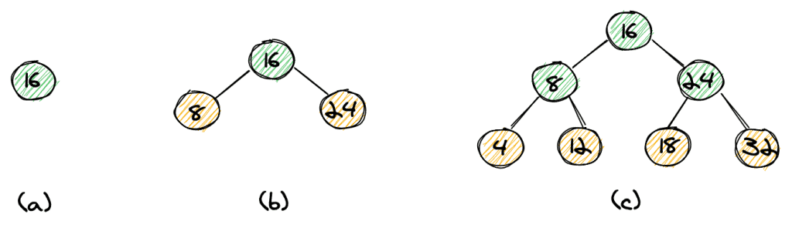

# 红黑树木简介

[数据结构](README-zh.md) [树](https://www.baeldung.com/cs/category/graph-theory/trees)

[红黑树](https://www.baeldung.com/cs/tag/red-black-trees)

1. 简介

    在本文中，我们将了解什么是红黑树，以及为什么它们是如此受欢迎的数据结构。

    我们将首先了解二叉搜索树和 2-3 树。从这里开始，我们将看到红黑树如何被视为平衡 2-3 树的一种不同表现形式。

    本文的目的是以简单的方式解释红黑树，因此我们不会深入研究代码示例或所有可能的插入和删除情况的详细示例。

2. 二叉搜索树

    二叉搜索树（BST）是指每个节点都有 0、1 或 2 个子节点的树。没有子节点的节点称为叶子。此外，节点左侧子节点的值必须小于节点的值，右侧子节点的值必须大于节点的值。

    让我们从一个简单的例子开始：

    

    我们有 4、8、12、16、18、24、32 个元素。我们可以先以元素 16 作为树根（a），然后插入 8 和 24（b），最后插入元素 4、12、18 和 32（c）。请注意，左边的子元素总是小于其父元素，而右边的子元素总是大于其父元素。我们不难看出，树的高度是 $log n$，n 是元素的个数。

    如果我们想搜索树中的某个元素，可以从树根开始。如果我们要找的元素等于树根，我们就完成了。如果较小，我们就继续向左搜索，如果较大，我们就继续向右搜索。直到找到元素或找到叶节点（黄色）为止。很简单，我们搜索的时间复杂度为 $O(log n)$。

    

    然而，树的结构在很大程度上取决于插入元素的顺序。如果我们按照 24、32、16、18、12、8、4 的顺序插入元素，得到的树就不再平衡了 (d)。如果我们按排序顺序插入元素，结果就是一棵每个节点只有一个子节点的树（e）。这实际上是一个列表，而不是一棵树。这意味着我们找到一个元素的最坏情况复杂度为 $O(n)$。

3. 平衡 2-3 树

    1. 2-3 树的定义

        现在我们来看看 2-3 树，它可以帮助我们保持一棵平衡的树，无论我们以何种顺序将元素插入树中。2-3 树是一种有两种节点的树。2 节点有一个值和两个子节点（同样，左侧子节点的值较小，右侧子节点的值较大），3 节点有两个值和三个子节点。

        3 节点的左侧子节点的值小于父节点的左侧值。中间子节点的值介于父节点的两个值之间，右边子节点的值大于父节点的右边值。

    2. 在 2-3 树中插入元素

        让我们看看如何在 2-3 树中插入 32、24、18、16、12、8、4 个元素，同时保持树的平衡。

        

        我们从 32 开始，这样就得到了一棵只有根节点（a）的树。然后我们插入 24，这样根节点处就有了一个 3 节点（b）。

        

        接下来，我们插入下一个元素 18，作为根节点的左子节点（因为 18 比 24 小）。这将导致一棵不平衡的树。我们可以将 24 从 3 节点中移出，使其成为根节点，从而得到一棵平衡树。

        结果将是一棵只有 2 个节点的平衡树 (b)。

        

        我们要插入的下一个元素是 16。结果还是一棵不平衡树（a）。这一次，我们只需将 16 向上移动一级，就能与 18 一起形成一棵 3 节点的树（b）。

        

        接下来，我们将 12 插入刚刚创建的 3 节点的左侧子节点（a）。为了平衡这棵树，我们首先将 12 向上移动一级，形成一个临时的 4 节点 (b)。

        现在，我们可以将中间的元素 16 移到根节点，从而拆分这个 4 节点，这样就又形成了一棵平衡的树 (c)。

        

        现在插入 8 就很简单了--我们先创建一个 12 的左子节点 (a)，然后将该元素上移一级，与 12 组成一个 3 节点 (b)。

        

        最后一个要插入的元素 4 的插入稍微复杂一些。首先，我们创建一个左节点 (a)，然后将其上移一级，这样就得到了一个临时的 4 节点 (b)。现在，我们可以将中间的元素 8 向上移动一级，从而在根节点处得到一个 4 节点 (c)。

        最后一步，我们将 4 节点拆分，提取 16 作为根节点 (d)。

    3. 插入的复杂性

        上述示例表明，我们可以通过插入元素的方式来保持树的平衡。然而，每次插入所要执行的操作用代码来表达是相当复杂的。因为我们需要三种不同类型的节点（2 节点、3 节点和 4 节点）。

        此外，我们还需要区分几种不同的情况，以便将元素向上移动并合并到 3 节点，或将 3 节点拆分为 2 节点。

        在下一节中，我们将看到红黑树如何帮助我们降低这种复杂性。

4. 红黑树

    1. 与 2-3 树的对应关系

        红黑树本质上是 2-3 树的另一种表现形式。让我们直接来看一个例子：

        

        (a) 中的树表示我们在上一节中看到的 2-3 树。我们用红色标记了 3 节点，这直接导致了红黑树的出现。我们将每个 3 节点拆分为两个 2 节点，并将两者之间的链接标为红色。

        这也直接引出了红黑树的两个主要特性：

        - 一个红色链接后面总是有两个黑色链接（因为我们拆分的 3 节点后面有三个黑色链接）。
        - 从根节点到叶节点的路径总是包含相同数量的黑色链接（这直接源于我们的 2-3 树是平衡的）。

        在此基础上，我们增加了以下两个条件：

        - 只有指向左侧子节点（较小的子节点）的链接才是红色的。这个条件进一步简化了实现过程。
        - 所有叶子的链接都为空（nil）。

    2. 为什么采用这种表示法？

        简而言之，它简化了树的实现和操作。我们可以使用与二叉树相同的操作（例如，查找值的方法与 "普通 "二叉树完全相同）。

    3. 插入

        要在红黑树上插入一个新值，我们需要添加一个新节点作为新的叶节点。这当然会导致树的不平衡。为了平衡这棵树，我们首先将新节点的链接染成红色。

        然后，我们只需要三种操作就能重新平衡我们的树。让我们来看看这些操作。

        

        第一个操作是向左旋转。在这里，我们通过移动两个链接将子树 (a) 转变为子树 (b)。

        

        第二个操作是右旋转，与左旋转正好相反。

        

        第三个操作是翻转颜色。我们可以将两个红色链接变为两个黑色链接，并将父链接变为红色链接。

        重要的是，这三种操作都是局部操作，即不会对整棵树产生影响。

        在本文中，我们将不查看插入的完整示例。这里需要强调的是，这三个简单的操作可以让我们轻松地重新平衡树。

    4. 插入示例

        让我们来看一个在红黑树上插入元素的例子。我们要插入的元素是 37（橙色背景），根显示为蓝色背景。

        

        首先，我们从树根开始向下走，直到找到要插入元素的叶节点。在我们的例子中，37 将是树中最大的元素，所以它在最右边。指向新节点的链接是红色的，我们就得到了如（a）所示的树。

        

        由于父元素 36 现在有两个红色链接，第二步是翻转颜色操作，得到如（b）所示的树。

        

        由于值为 28 的节点现在有两个红色链接，第三步再次进行翻转颜色操作，得到如图（c）所示的树。

        

        由于我们希望所有红色链接都向左倾斜，因此我们进行了左旋转操作，从而得到以 28 为根的 (d) 树。我们不难看出，这棵树是平衡的。

    5. 删除

        删除节点后，我们可以使用同样的三种操作来重新平衡树。在本文中，我们不会讨论完整的实现过程，而只会概述这一想法，并给出几个删除元素的示例。

        在所有示例中，我们将从以下（有效的）红黑树开始：

        

        最简单的情况是删除带有红色链接的叶节点。我们来看看两种可能的情况：删除 2 和 36。

        **删除 2**

        

        这是最简单的情况。元素 2 是红色链接的左节点，因此我们可以删除它，并直接得到一棵有效的红黑树，而无需重新平衡。

        **删除 36**

        

        如果要删除 36，我们同样要删除该节点，但是由于 36 是红色链接的右节点，我们需要将 28 到 36 的链接改为指向 32。同样，我们得到了一棵有效的红黑树。

        **删除 8**

        如果我们想删除一个非叶节点，可以先将它变成叶节点。为此，我们要找到左侧子树的最大元素或右侧子树的最小元素。这种交换不会改变红黑树的属性。因为我们可以将每个节点移动到树的底部，所以了解如何删除叶节点就足够了。

        让我们看看如何删除元素 8。左侧子树的最大值是 4 (a)。因此我们交换节点 8 和 4 并将其删除。由于 8 有一个红色链接，因此我们会遇到与删除元素 4 相同的琐碎情况（b）。

        

        同样，最终的树是一棵有效的红黑树（c）。

        

        **删除 24**

        如果我们要删除的叶节点不是红色链接的右节点或左节点，情况就会变得复杂一些。

        举例来说，我们来看看如何删除 24 (a)。首先，我们翻转 24 和 18（18 是左子树的最大元素）。

        现在我们需要删除树 (b) 中的 24，因为它没有红色链接。

        

        删除 24 的树（c）不是一棵有效的红黑树，因为 18 只有一个子树，所以这棵树并不平衡。

        

        我们可以通过旋转来平衡这棵树（d）。

5. 复杂性

    红黑树的插入、搜索和删除的平均和最坏情况时间复杂度均为对数。

    重新平衡的平均时间复杂度为 O(1)，最坏情况复杂度为 $O(log n)$。

    此外，红黑树在批量和并行操作方面也有有趣的特性。例如，从排序列表建立红黑树的时间复杂度为 $O(log(log n))$，处理器为 $(n/log(log n))$。

6. 红黑树的应用

    红黑树在现实世界中的应用包括 Java 集合库中的 TreeSet、TreeMap 和 Hashmap。此外，Linux 内核中的完全公平调度程序也使用了这种数据结构。Linux 还在用于文件/内存映射的 mmap 和 munmap 操作中使用了红黑树。

    此外，红黑树还用于几何范围搜索、k-means 聚类和文本挖掘。

    从上面的例子中，我们可以看出红黑树主要用于引擎内部，作为开发人员，我们并不经常接触它们，尽管我们每天都在使用它们。

7. 总结

    在本文中，我们了解了什么是红黑树，以及它们基本上是 2-3 种树的不同代表。

    我们还看到了一张总结树上操作复杂性的表格，最后，我们很快总结了红黑树在现实世界中的一些应用。

    不过，在为特定用例选择数据结构时，需要考虑很多因素。如果我们需要良好的插入和搜索平均成本，以及保证这两种操作的对数最坏情况成本，那么红黑树就特别有用。

    此外，如果我们需要频繁更新我们的树，红黑树也是一个不错的选择，因为它的重新平衡成本比其他平衡树（例如 AVL 树或 B 树）要低。
