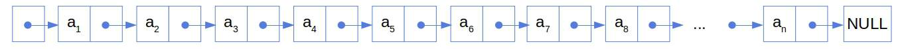
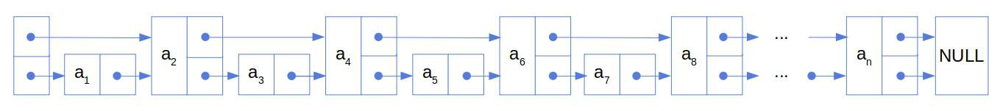
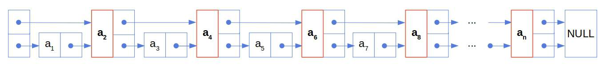
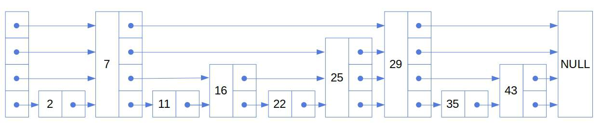
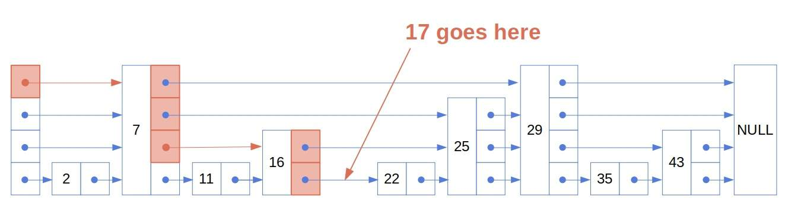
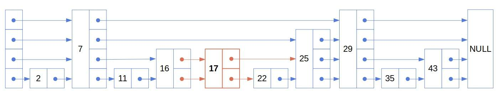
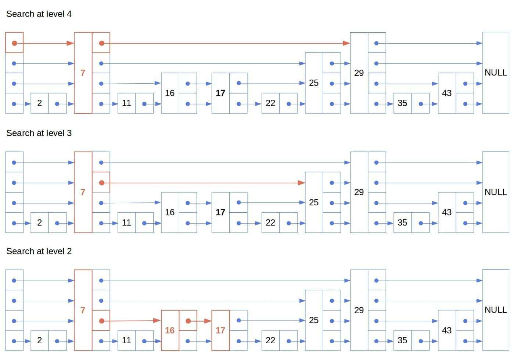

# [跳转列表数据结构](https://www.baeldung.com/cs/skip-lists)

1. 简介

    在本教程中，我们将讨论[跳转列表](https://dl.acm.org/doi/10.1145/78973.78977)。跳转列表是[平衡树](https://www.baeldung.com/cs/balanced-bst-from-sorted-list)的一种流行的概率替代方法。我们将解释跳转列表的工作原理，并展示如何在跳转列表上实现三种标准操作：插入、搜索和删除。

2. 动机

    让我们想象一个有 n 个数字的[排序链表](https://www.baeldung.com/cs/linked-list-data-structure)：

    

    如果我们在其中搜索一个数字，在最坏的情况下（当搜索值大于列表最大值时），我们将遍历所有 n 个元素。我们从第一个节点开始，沿着所有指针找到最后一个节点。

    现在，让我们在每一个节点的前面两个节点添加一个指针：

    

    从第一个节点开始，我们每次可以跳过两个节点，所以在最坏的情况下，我们访问的节点不会超过 $\approx n/2$ 节点，然后我们就会找到我们要找的数字，或者得出结论它不在列表中：

    

    如果我们给每第四个节点一个指针，指它前面的四个节点，会发生什么情况呢？一般来说，如果每一个节点都有一个指向它前面 $\boldsymbol{2^k}$ 个节点的指针，那么我们在最坏情况下需要检查的节点数量就会减少到 $\boldsymbol{O(\log n)}$。

    这就是跳转列表的主要思想。跳转列表包含多个前向指针的节点，因此可以快速查找。具有 k 个前向指针的节点称为 k 级节点。一半的节点是第 1 层，$25\%=1/(2^2)$ 个节点是第 2 层，$25\%=1/(2^3)$ 个节点是第 3 层，$1/(2^{k})$ 个节点是第 k 层，以此类推。

3. 作为概率结构的跳转列表

    然而，在上述跳转列表中，删除和插入是不切实际的。在删除或插入一个元素后，我们必须更新指针，使其继续指向适当位置的新节点。

    避免开销的一种方法是将更改保持在本地。如果我们不固定高层节点的位置，就可以做到这一点。例如，我们可以随机决定新节点的层级，这样高层节点之间就不一定相距 $2^k (k > 1)$ 个节点。相反，一个 k 级指针将指向列表中的下一个 k 级节点。这样，插入和删除节点都不会导致重新排列指针，而只会指向紧随插入节点之后的节点。类似的推理也适用于删除。

    为了保持搜索的对数复杂性，我们可以保持与上例相同的层级大小比例。我们可以这样做：在将一个级别为（k-1）的节点插入列表的同时，将它推进到级别 k 的概率设为 1/2。在这种情况下，我们将有大约 $1/(2^{k})$ 个节点位于 k 层，$ k \geq 1$。

    因此，[跳转列表](https://www.baeldung.com/java-concurrent-skip-list-map)是一个多级链表，其节点的级别是随机决定的。

    1. 如何设置层级

        如果我们不事先限制层级，那么它们将只取决于插入过程中节点前进的几率。我们不必像上面的例子那样使用 1/2。任何 $\boldsymbol{p \in (0, 1)}$ 都可以作为概率，搜索的时间复杂度仍然是 $\boldsymbol{O(\log n)}$。

        下面是选择新节点级别的伪代码：

        

    2. 预期级别

        一个节点如果没有成为一个级别-(k-1) 节点，就不可能处于级别 k > 1。因此，节点处于 $\boldsymbol{k>1}$ 层的概率是 $\boldsymbol{p^{k-1}(1-p)}$（我们减去 1，因为我们在决定第一层时不掷骰子）。从这里我们可以看出，节点的等级减 1 遵循以 1-p 为 “成功概率” 的[几何分布](https://en.wikipedia.org/wiki/Geometric_distribution)。因此，节点等级的期望值是：

        (1) $$1 + \frac{p}{1-p} = \frac{1-p+p}{1-p} = \frac{1}{1-p}$$

    3. 指针的数量

        在一个有 n 个节点的单链表中有 n 个指针。其中一个指向头部，其余的构成节点之间的链接。因为所有节点的级别都是 $\geq 1$，所以我们知道会有 n 个一级指针。

        在第二级，我们预计会有 p(1-p)n 个指针，与预计的第二级节点数相同。这同样适用于更高层次。所以，预期指针数是（如果 $maxLevel$ 是 $\infty$）：

        $$\begin{aligned} n + \sum_{k=2}^{\infty}p^{k-1}(1-p)n &= n \left(1 +\sum_{k=2}^{\infty}p^{k-1}(1-p) \right) \\ &= n \left( 1 + (1-p)\sum_{k-1}^{\infty}p^k \right) \\ &= n \left( 1 + (1-p)\frac{p}{1-p} \right) \\ &= n \left( 1 + p \right) \end{aligned}$$

        由于最大级设置为 $L<(infty)$，指针的数量从上而下受到 n（1+p）的约束。由于 p 与 n 无关，跳转列表的预期内存复杂度为 $\boldsymbol{O(n)}$，与链表的空间[复杂度](https://www.baeldung.com/cs/time-vs-space-complexity)相同。此外，我们可以看到，我们使用的指针永远不会超过单链表指针的两倍（因为 $p \leq 1$）。

    4. 基础结构

        我们将节点视为具有以下属性的数据结构：

        - value：包含的值
        - successors：指向各级后继者的指针数组

        同样，我们假设列表是一个具有两个属性的数据结构：

        - maxLevel - 当前列表的最大级别
        - heads - 指向级别 1、2、ldots、list.maxLevel 的 heads 的指针数组

4. 如何插入跳转列表

    要在跳过列表中插入一个值为 v 的节点，我们必须做三件事：

    - 找到放置节点的位置
    - 选择其级别
    - 更新指向新节点的指针

    我们已经看到了如何选择新节点 y 的层级 $\ell$ 。为了找到放置它的位置，我们从顶层的头节点开始，然后跟随指针，直到到达两个连续的节点 $\boldsymbol{x}$ 和 $\boldsymbol{z}$，使得 $\boldsymbol{x.value < v \leq z.value}$。如果存在这样的节点，且 $\ell$ 不大于当前层级（即顶层），我们就应该更新 x，使其指向 y，并将新节点设置为指向 z。

    如果新节点的层级高于当前整个列表的最大层级，我们就应该插入新的层级。为此，我们将新节点设为其首。

    1. 伪代码

        下面是插入的伪代码：

        

    2. 示例

        假设我们要在跳过列表中插入数字 17：

        

        我们可以根据这些指针找到要插入的位置：

        

        还假设我们选择将其设置为二级节点。这是插入后的列表（新节点和新指针为红色）：

        

    3. 复杂性

        插入和删除的复杂性主要取决于搜索的复杂性。要了解原因，我们可以先观察一下，在插入一个新元素之前，我们需要确定该元素的位置。删除节点也是如此。在删除之前，我们必须找到它。

5. 如何搜索跳转列表

    让我们来看看如何在跳转列表中搜索某个值 v。这与在列表中插入 v 相似，但我们不必更新任何指针。我们可以从顶层开始，跟随指针直到找到 $\boldsymbol{v}$ 或一个大于 v 的值。在后一种情况下，我们会向下移动一级并重复上述步骤。当我们找到 $\boldsymbol{v}$ 或者级联到大于 $\boldsymbol{v}$ 的底层节点时，搜索结束。如果值在列表中，那么它前面的节点必须包含 $\boldsymbol{v}$。否则，我们将返回失败。

    1. 伪代码

        下面是搜索的伪代码：

        

    2. 示例

        以下是我们在上述列表中搜索 17 的步骤：

        

    3. 预期复杂度

        我们用搜索路径的预期长度来表示搜索的预期复杂度。它开始于左上方的节点（它的级别是 $\ell = list.maxLevel$），结束于目标节点（$k \geq 0$ 级别低于 $\ell$）。

        反向分析路径更容易得出预期长度。我们把它分成两部分：

        - 通往顶层的路径
        - 连接左顶层节点（最高层头，$list.heads[list.maxLevel]$）和我们反向到达的第一个顶层节点的路径

        设 L(k) 为第一部分的预期长度。由于跳转列表是非确定的，因此我们取其可能结构的期望值。因此，从一个低于顶层 k 层的节点开始，我们可以以 p 的概率向上返回一层，或者以 1-p 的概率向左移动：

        \[\begin{aligned} L(k) &= 1 + p L(k-1) + (1-p)L(k) \\ p L(k) &= 1 + p L(k-1) \\ L(k) &= \frac{1}{p} + L(k-1) \end{aligned}\]

        由于L(0) = 0（如果我们已经到了顶层，就没有必要移动到顶层了），所以我们可以得到

        \[L(\ell) = \frac{\ell}{p}\]

        在分析不同层级的节点数时，我们已经解决了第二部分的问题。因此，我们希望顶层包含 $p^{\ell-1}(1-p)n \leq p^{\ell}n$ 个节点。因此，搜索的总预期复杂度为

        (2) $$\begin{equation*}  O\left( \frac{\ell}{p} + p^{\ell}n \right) \end{equation*}$$

    4. 如何得到跳转列表的对数期望复杂度

        我们的想法是这样选择 $\ell$，使 $p^{ell}n$ 成为一个常数 $c > 0$。因此，我们求解 $\ell$ 的相应方程：

        \[\begin{aligned} p^{\ell}n &= c \\ p^{\ell} &= c n^{-1} \\ \ell &= \log_{p}\left(c n^{-1}\right) \\ \ell &= \log_{p}c + \log_{p}n^{-1} \\ \ell &= \log_{p}c + \log_{1/p}n \in O(\log n) \end{aligned}\]

        因此，等式 (2) 的第一部分变成了 $O(\log n)$，第二部分减小为 $O(1)$。因此，如果我们将 $\boldsymbol{ell}$ 设为 $\boldsymbol{n}$ 的对数，那么总的预期复杂度将是对数。

        在本分析中，我们假设 $\ell$ 是列表的最高层，并且我们总是从最高层的头部开始搜索。

    5. 跳转列表的最坏情况复杂性

        在最坏的情况下，跳转列表会退化为单链路列表，而我们要寻找的是一个大于最大值的值。因此，最坏情况下的复杂度是 $\boldsymbol{O(n)}$，因为我们要遍历整个列表。

        尽管这是一个悲观的结果，但跳过列表仍然是有价值的。这个推理与随机中点选择(random pivot selection)的 [Quicksort](https://www.baeldung.com/cs/algorithm-quicksort) 的情况类似。理论上最差的性能可能很差，但这种情况很少发生。实际上，跳转列表非常高效。对数预期复杂度就说明了这一点。

6. 如何从跳过列表中删除元素

    删除与插入和搜索类似。我们首先要找到包含要删除值的节点。在这个过程中，我们会记住哪些节点指向它。如果找到了节点，我们就将其与前节点解除链接，并将它们指向该节点在适当层级的后继节点：

    

7. 结论

    本文介绍了跳转列表。我们展示了跳转列表的三种算法：插入、搜索和删除。此外，我们还将列表作为一种非确定性数据结构进行了分析，并展示了如何获得搜索的对数预期复杂度。

    由于搜索的复杂度比插入和删除的复杂度高，因此后两个操作也可以实现对数化。尽管最坏情况下的复杂度是线性的，但使用跳转列表仍然是有益的，因为最坏的情况在实际中并不常见。
