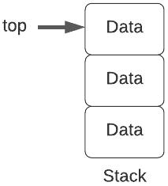
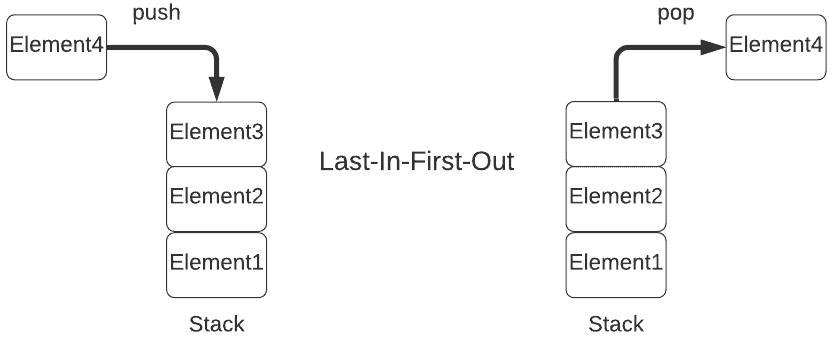
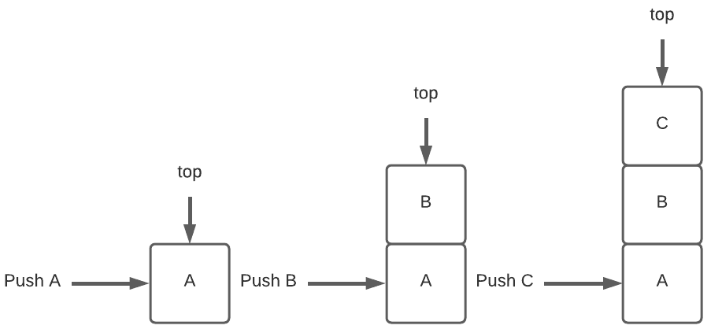
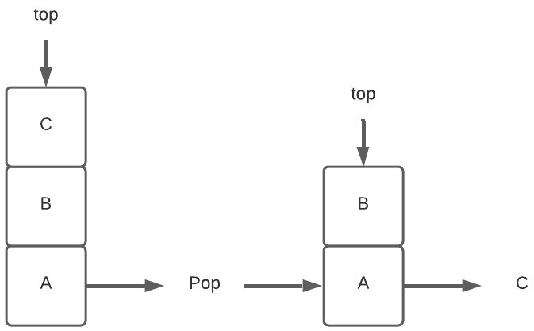

# [堆栈数据结构](https://www.baeldung.com/cs/stack-data-structure)

1. 堆栈简介

    在本教程中，我们将学习什么是[堆栈](https://www.baeldung.com/cs/common-data-structures#1-stacks)，并了解堆栈的工作原理。此外，我们还将介绍[堆栈数据结构](https://www.baeldung.com/cs/stack-two-queues)的一般描述及其基本操作。

2. 堆栈

    堆栈在日常生活中随处可见。例如，书堆、盘子堆、光盘架上的光盘堆。让我们以书堆为例。它可以让你只从书堆的一端执行插入一本书或取出一本书等操作。

    同样，堆栈也是一个列表，只允许在列表的一端插入和删除。这一端被称为栈顶。

    由于栈顶的元素是最近使用插入操作插入的元素，也是删除操作首先删除的元素，因此栈被称为后进先出（[LIFO](https://www.baeldung.com/java-lifo-thread-safe)）列表。

    换句话说，这意味着最先插入堆栈的元素也是最后从堆栈中删除的元素。因此，堆栈也被称为先进先出（FILO）列表。

    

    堆栈适用于任何需要后进先出存储的应用。例如，解析无上下文语言、评估算术表达式和函数调用管理。

3. 表示法

    下面我们来看看堆栈的表示法。

    下图描述了堆栈在内存中的表示。如前所述，栈遵循后进先出顺序，只能访问栈顶。

    

    接下来，让我们看看可以在栈上执行的基本操作。

4. 操作

    我们可以在栈上执行的常见操作包括插入、删除、偷看和检查栈是满还是空。

    让我们来看看所有这些操作的伪代码。

    1. push()

        首先，我们来看看插入操作。向栈顶插入一个新元素的操作称为 push 操作。

        下面的伪代码显示了 push 操作的细节：

        ```java
        function insertIntoStack(stack, data_element):
            // INPUT
            //   stack = the stack
            //   data_element = the element to be inserted
            // OUTPUT
            //   Inserts data_element if the stack isn't full; otherwise, returns an overflow condition

            if stack is full:
                return null
            else:
                top <- top + 1
                stack[top] <- data_element
        ```

        让我们来看一个在空堆栈中插入 A、B 和 C 的示例。首先，我们将 A 推入堆栈，顶部指向 A。接下来，我们将 B 推入堆栈，顶部更新为指向 B：

        

    2. pop()

        其次，我们来看看删除操作。从栈顶删除一个元素称为 pop 操作。

        下面的伪代码显示了 pop 操作的细节：

        ```java
        function removeFromStack(stack):
            // INPUT
            //   stack = the stack
            // OUTPUT
            //   Removes data_element from the top of the stack

            if stack is empty:
                return null
            else:
                data_element <- stack[top]
                top <- top - 1
                return data_element
        ```

        下面我们来看一个从包含 A、B 和 C 的堆栈中移除顶部元素的示例：

        

        我们可以看到，一旦顶部的元素（即 C）被移除，顶部就开始指向 B。

    3. peek()

        第三，peek 操作是在不从栈中移除栈顶元素的情况下检索栈顶元素。

        下面的伪代码展示了 peek 操作的细节：

        ```java
        function peekStack(stack):
            // INPUT
            //   stack = the stack
            // OUTPUT
            //   Retrieves data_element from the top of the stack

            if stack is empty:
                return null
            else:
                data_element <- stack[top]
                return data_element
        ```

    4. isFull()

        它用于检查堆栈是否完整。

        下面的伪代码显示了 isFull 操作的细节：

        ```java
        function isStackFull(stack):
            // INPUT
            //   stack = the stack
            // OUTPUT
            //   Returns true if the stack is full, and false otherwise

            if top = MAX_SIZE:
                return true
            else:
                return false
        ```

    5. isEmpty()

        最后，让我们来看看 isEmpty 操作。它检查堆栈是否为空。

        下面的伪代码显示了 isEmpty 操作的细节：

        ```java
        function isStackEmpty(stack):
            // INPUT
            //   stack = the stack
            // OUTPUT
            //   Returns true if the stack is empty; otherwise, returns false

            if top < 0:
                return true
            else:
                return false
        ```

5. 时间复杂性分析

    堆栈的所有操作都遵循后进先出顺序，这意味着顶部总是指向最顶部的元素。因此，所有常见操作的时间复杂度都是 O(1)。

6. 结论

    总之，我们讨论了名为堆栈的数据结构。我们已经了解了栈的基本定义。此外，我们还学习了堆栈的基本特征和常见操作。最后，我们还学习了实现这些常见操作的伪代码。
