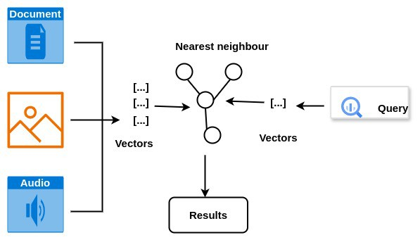
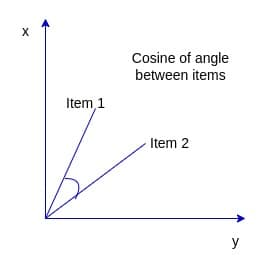

# [矢量数据库是什么？](https://www.baeldung.com/cs/vector-databases)

1. 介绍

    矢量数据库是专门为存储高维矢量而设计的存储系统。他们通常在机器学习（ML）系统中存储和查询数据。

    与将数据存储为标量的传统数据库不同，矢量数据库存储矢量。这允许在完全匹配无关的情况下快速检索数据。

    这些矢量可以存储不同的数据类型，如图像、文档和音频。我们可以使用几种技术，如特征提取，将非结构化数据转换为矢量数据。

    在本教程中，我们将了解矢量数据库的使用方式和位置。

2. 矢量数据库是如何工作的？

    矢量数据库专门研究高效索引和查询矢量数据。他们采用各种技术，如散列、量化或基于图形的方法来有效地组织和索引数据：

    

    在矢量数据库中，表示相似含义的矢量彼此附近存储。这种接近性通常以0到1的尺度来测量，其中接近1的值表示两个数据对象之间在含义上具有高度相似性。

    相反，接近零的值表明相似性较低。该组织促进了对类似数据对象的更快检索，实现了相似性搜索和基于内容的推荐等任务。

    1. 嵌入

        [嵌入](https://www.baeldung.com/cs/latent-vs-embedding-space)是表示一些非结构化数据的数值。机器学习模型在训练期间分配嵌入。这些值以n维向量表示，每个维度代表一个数据属性。

        密切相关的嵌入在矢量空间中彼此紧密地存储。

    2. 距离指标

        为了确定数据项之间的接近度，我们需要测量查询向量和嵌入之间的距离。我们可以使用距离函数来实现这一点。这只是一个测量两个向量之间距离的函数。

        距离度量用于确定数据之间的相似性。零的距离意味着元素是完全匹配的。

        有几个距离指标。它们各不相同，因为不同的数据需要不同的方法来测量数据点之间的相似性和不相似性。此外，在解释各种类型的数据时，接近的含义是不同的。

        让我们来看看一些最常见的，从闵可夫斯基距离开始。

        这是在规范向量空间上定义的距离。可以使用以下公式计算此空间的距离。

        \[D(x, y) = \left( \sum_{i=1}^{n} |x_i - y_i|^p \right)^{\frac{1}{p}}\]

        这个度量是一种测量多维空间中两点之间距离的通用方法。它包括一些其他常见指标作为特殊情况，取决于p的值：

        - 曼哈顿(Manhattan)距离（p=1）。这是沿着轴直角测量的两点之间的距离
        - 欧几里得(Euclidean)距离（p=2）。这是连接两点的直线的距离

        对于任何大于2的p值，我们称之为切比切夫(Chebychev)距离。

        我们可以使用的下一个是Cosine相似性。

        这是向量空间中两点之间的同弦角：

        

        它通常用于查找文档之间的相似之处。当两个向量之间的距离无关，而只是方向时，我们使用这种方法。

    3. 搜索方法

        前面讨论的距离度量用于搜索或查询矢量数据。以下是搜索/查询矢量数据库的一些方法。

        最受欢迎的是语义搜索。此搜索旨在在给定上下文中查询数据，以返回相关结果。例如，对“machine learning algorithms”的查询将检索包含确切短语的文档以及讨论深度学习或神经网络等相关主题的文档。

        另一个变体是全文搜索。这包括搜索整个文档，以找到查询的匹配项。例如，搜索“dental jobs”的全文将检索包含这些确切单词或变体的文件，如“dental positions”或“jobs in dental surgery”。

3. 矢量数据库的示例

    决定使用哪个矢量数据库取决于其设计/功能以及它如何适合项目。以下是一些更受欢迎的选项：

    1. Chroma

        这是一个开源项目，同时支持Python和Javascript客户端。它附带了开始构建人工智能应用程序所需的一切。值得注意的是，它为OpenAI、LangChain等LLM提供商提供了插件。我们可以通过以下设备安装Chroma：

        `pip install chroma`

        设置好后，我们现在可以看到如何创建我们的第一个集合：

        ```bash
        gitpod /workspace/Demo (master) $ python3
        Python 3.12.2 (main, Apr 3 2024,07:15:11) [GCC 11.4.0] on linux
        Type "help", "copyright", "credits" or "license" for more information.
        >>> import chromado
        >>> chroma_client = chromadb.Client()
        >>> collection = chroma_client.create_collection (name="my_collection")
        >>> collection.add( documents=["This is a document" "This is another document"], metadatas=[( "source": "my_source"}, {"source": "my_source"}],ids=["id1","id2"])
        /home/gitpod/.cache/chroma/onnx_models/all-MiniLM-L6-v2/onnx.tar.gz: 100%|•| 79.3M/79.3M [00:02<00:00, 27.9MiB/s]|
        >>> results = collection.query (
        ... query_texts=["This is a query document"],
        ... n results=2
        ...)
        >>> results
        {'ids': [['id1', 'id2']],'distances': [[0.7111214399337769，1.0109773874282837]]'metadatas': [[{source':'my source'},{'source':'my source'}]],"embeddings': None,'documents':[['This is a document','This is another document']],'uris': None, 'data': None}}
        ```

        集合是一个存储单元，我们可以在其中存储嵌入。此[入门页面](https://docs.trychroma.com/getting-started?lang=py)介绍了如何在Python或Javascript中创建和查询集合。

    2. Qdrant

        这是一个用Rust编写的开源数据库。它拥有超过八种编程语言的客户端，包括Go、Java和Javascript。与Chroma不同，Qdrant目前通过Qdrant Cloud提供完全托管的解决方案。截至本文撰写时，Chroma也在开发自己的基于云的解决方案。我们可以使用以下内容安装最新的Qdrant Docker映像：

        `docker pull qdrant/qdrant`

        为了启动服务，我们运行：

        ```bash
        docker run -p 6333:6333 -p 6334:6334 \
            -v $(pwd)/qdrant_storage:/qdrant/storage:z \
            qdrant/qdrant
        ```

        我们现在可以通过localhost:6333访问REST API。

        他们的[快速入门页面](https://qdrant.tech/documentation/quick-start/)提供了如何开始使用不同语言的客户的示例。

    3. 其他数据库

        我们还想在此列表中提及一些支持矢量数据的著名解决方案，如Redis和PostgreSQL数据库。

        这两个数据库值得在这个列表中特别关注，因为它们不是专门为处理矢量数据而构建的，而是具有存储和管理数据的能力。

4. 结论

    在本文中，我们看到矢量数据库是高维数据的专用存储系统。此外，它们可用于高效的相似性搜索。
