# 相关系数的实际含义

[算法](https://www.baeldung.com/cs/category/algorithms) [数学与逻辑](https://www.baeldung.com/cs/category/core-concepts/math-logic)

1. 概述

    在本教程中，我们将学习相关分析中相关系数的含义。

    首先，我们将讨论变量之间的一般相关性。这将有助于我们理解相关分析产生的初衷。

    然后，我们将学习相关分析的两种主要技术，即斯皮尔曼相关和皮尔逊相关。关于它们，我们将看到数学公式及其应用。

    最后，我们将总结根据相关系数的值可以推断出二元分布的哪些情况。

    在本教程结束时，我们将对相关系数所代表的含义有一个直观的了解。我们还将能够在斯皮尔曼相关和皮尔逊相关之间做出选择，以便解决我们面临的具体任务。

2. 一般相关性

    1. 相关性的概念

        相关分析是一种[统计分析](https://www.baeldung.com/apache-commons-math#1-statistics)方法，致力于研究随机变量之间的关系。它有时也被称为依赖性，因为它与一个变量的值可能依赖于另一个变量的想法有关。我们即将学习相关性的数学定义。不过，我们最好先从直观上大致了解相关性的含义。

        我们可以用一个小例子来说明。我们知道，一般来说，一个人的[体重和身高往往是成正比](https://academic.oup.com/ajcn/article-abstract/34/11/2521/4692823)的。也就是说，一个人的身高越高，体重往往也越高。

        由此我们可以假设，体重和身高之间的关系可能具有依赖性。不过，为了验证这一假设，我们需要某种衡量两个变量之间依赖程度的方法或指数。这种测量方法就是我们所说的相关性。

        事实上，我们可以想象，依赖关系可以很强，也可以很弱，或者干脆完全不存在。

        我们所需要的指数应该能让我们根据它所具有的值，一目了然地区分这些情况。

    2. 相关性而非因果性

        相关性是[探索性数据分析](https://www.baeldung.com/spark-mlib-machine-learning#3-exploratory-data-analysis)的一个重要工具，因为它可以初步识别我们怀疑并非[线性独立](https://www.baeldung.com/cs/ai-convolutional-neural-networks#3-linear-independence-of-features)的特征。它对[因果关系的识别](https://en.wikipedia.org/wiki/Granger_causality)也很重要，因为有一些已知的因果[关系检验方法](https://en.wikipedia.org/wiki/Convergent_cross_mapping)，其核心指标就是相关性。

        统计学家们常说的一句话是：[相关性并不意味着因果关系](https://en.wikipedia.org/wiki/Correlation_does_not_imply_causation)。这句话背后的意思是，对于两个相关的变量，不能想当然地认为它们之间存在因果关系。

        我们这里所说的蕴涵是[命题逻辑中所谓的物质蕴涵](https://www.baeldung.com/cs/propositional-logic#4-the-material-conditionial-if--then)。因此，我们可以使用处理蕴涵的规则来正式表达它。如果 r 表示相关性，而 c 表示因果关系，那么这个蕴涵正式地表示 $\neg(r \to c)$。

        我们在关于[布尔逻辑](https://www.baeldung.com/cs/boolean-algebra-basic-laws#3-secondary-operations)的文章中研究过，我们可以把 $p \to q$ 形式的表达式改写成 $\neg p \vee q$。这意味着我们可以把表达式 $\neg (r \to c)$ 转换成 $\neg (\neg r \vee c)$。如果我们对括号之间的项使用[德摩根定律](https://www.baeldung.com/cs/boolean-algebra-basic-laws#4-de-morgans-laws)，我们就会得到 $r \wedge \neg c$，如果存在相关性但不存在因果关系，那么它就是真的。

    3. 什么情况下相关性不意味着因果关系？

        有一些常见的逻辑错误可能会让我们认为两个变量之间存在因果关系，这是观察到的相关性的结果。这些错误被称为[谬误](https://en.wikipedia.org/wiki/Fallacy)，经常导致我们错误地理解相关性的实际含义。

        第一个论点是错误地确定了导致另一个变量的变量。

        如果 p 和 q 是我们要检验其因果关系的变量，而如果真正的因果关系的形式是 $p \to q$，同时意味着高相关性 $r_{p\to q}$，那么 $r_{q \to p}$ 也必然是高的。这意味着我们最终可能会错误地把 q 确定为因果关系的原因，而把 p 确定为结果，而不是相反。

        下面就是一个例子。我们注意到一种奇怪的行为。把食物放进碗里后，一只猫立刻跑过来，喵喵地叫着，然后把食物吃掉了。

        我们可能会推断，装满食物的碗会导致猫的出现，因为这些事件之间的相关性非常高。但在这种情况下，如果我们没有养猫，而在我们装满食物后猫却没有出现，我们就会感到惊讶。

        在这个例子中，我们把因果关系中的前因错误地归结为装满碗。相反，我们应该把它归结为猫的出现，因为猫的出现导致我们把碗装满。

    4. 第三个因素

        第二个论点涉及两个事件之间因果关系的错误推断，而这两个事件都是第三个不可见事件 s 的结果。这一论证的经典例子是火车站站台的乘客到达与火车到达之间的关系$(s \to p) \wedge (s \to q)$。

        如果我们对[时刻表及其运行一无所知](https://onlinelibrary.wiley.com/doi/pdf/10.1002/eej.21264)，我们可能会认为乘客的到来导致了火车的出现。但实际上，还有第三个因素，即旅客列车的调度，会导致旅客和列车都在指定时间到达。

    5. 因果关系而非相关关系

        一个较少讨论的问题是，自变量和因变量之间存在因果关系是否也意味着相关性。用正式的符号，我们可以用命题 $c \to r$ 来表达这个问题。

        当然，有些因果关系变量之间也存在相关性。例如，在[药理学领域](http://citeseerx.ist.psu.edu/viewdoc/download?doi=10.1.1.1043.473&rep=rep1&type=pdf)，对药物不良反应的研究开发了大量方法来评估相关变量之间的因果关系。在教学和教育领域，也有类似的方法来评估[家庭收入和学生成绩](https://www.sciencedirect.com/science/article/abs/pii/S027277570700088X)等相关变量之间的因果关系。

        不过，一般来说，因果关系并不意味着相关性。这是因为相关性，尤其是我们即将看到的皮尔逊相关性，只能测量一种函数关系：线性关系。虽然斯皮尔曼相关性稍好一些，但我们很快就会看到，它仍然无法识别变量之间的非单调关系：

        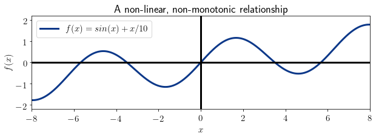

        这意味着，作为一般规则，我们只能从线性或单调关系中推断因果关系的相关性。

3. 皮尔逊相关系数

    1. 皮尔逊相关性简介

        现在我们可以开始研究计算变量间相关性的两种主要技术： 皮尔逊相关和斯皮尔曼相关。

        皮尔逊相关法是计算随机变量之间依赖关系的最古老方法，可以追溯到 19 世纪末。它基于这样一种想法，即[线性回归模型](https://www.baeldung.com/kotlin-supervised-learning#linear-regression)可以在不同程度上准确地拟合二元分布。因此，皮尔逊相关性提供了一种评估线性回归模型拟合程度的方法。

        它还具有缩放和平移不变性。这意味着，皮尔逊相关性特别适用于研究[层次或分形系统](http://ijarece.org/wp-content/uploads/2015/09/IJARECE-VOL-4-ISSUE-8-2289-2295.pdf)的特性，因为根据定义，这些系统是无标度(scale-free)的。

    2. 皮尔逊相关性的数学定义

        我们可以把具有 k 个分量的两个随机变量 x 和 y 之间的皮尔逊相关系数 $r_{xy}$ 定义为 x 和 y 的协方差除以各自标准偏差的乘积：

        \[r_{xy} = \frac{ \sum_{i=1}^{k} (x_i - \overline{x}) (y_i - \overline{y}) } { \sqrt { \sum_{i=1}^{k} (x_i - \overline{x})^2 } \sqrt { \sum_{i=1}^{k} (y_i - \overline{y})^2 } }\]

        这里，$\overline{x}$ 和 $\overline{y}$ 表示两个变量的平均值。相关系数 $r_{xy}$ 取值于封闭区间 [-1, 1]，其中 $r_{xy} = 1$ 表示最大正相关，$r_{xy} = 0$ 表示缺乏相关，$r_{xy} = -1$ 表示最大负相关。

        在关于[线性回归](linear-vs-logistic-regression-zh.md)的文章中，我们还研究了该公式与回归系数之间的关系，这为计算相同的相关系数提供了另一种方法。

    3. 可能的值

        现在我们来研究一下相关系数的可能取值，并观察与每个值相关的分布形状。

        对于 $r_{xy} \cong 0$ 时，两个变量互不相关。这意味着一个变量的取值通常不会影响另一个变量的取值：

        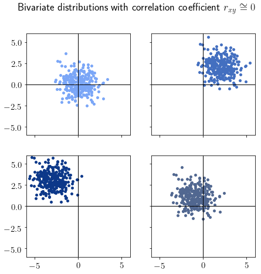

        不相关的双变量分布一般会呈现典型的"云"形，但并非必然。如果我们在绘制数据集时发现了这种形状，就应该立即怀疑该分布是不相关的。

        当 $r_{xy} = 1$ 时，变量呈强正相关。任何可以用斜率为正的线性回归模型完美拟合的二元分布，其相关系数总是为 1：

        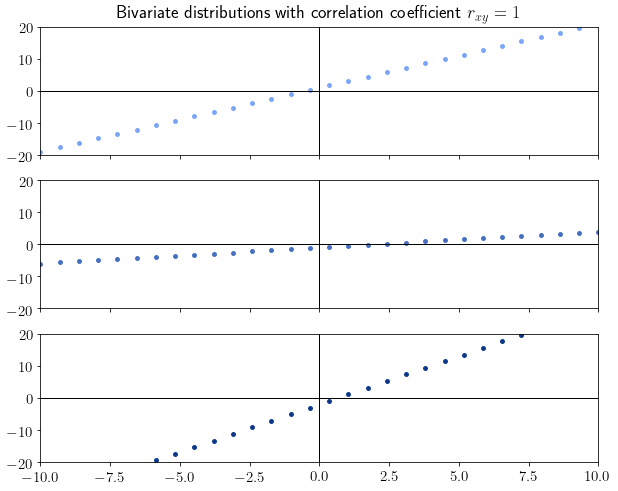

        直观地说，如果我们看到分布呈现出一条直线的形状，那么相关性的绝对值应该很高。因此，斜率的符号决定了相关性的符号。因此，$r_{xy} = -1$ 的相关值意味着负斜率的线性分布。

        然而，大多数分布并不具有 0 或 1 的完美相关值，而是分别趋向于云状或线状函数，因为相关性近似于它们。下面是一些其他的分布示例以及各自的相关系数：

        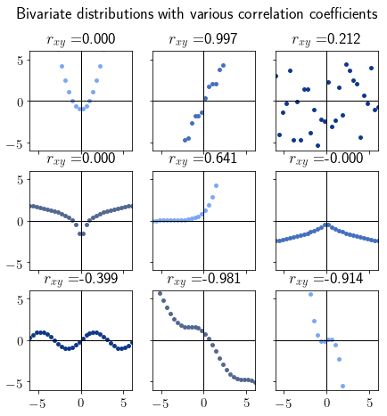

    4. 皮尔逊相关系数的解释

        很多人在解释皮尔逊相关系数时都会犯一个典型的错误。这种错误是将其理解为最适合分布的线性回归模型的斜率。上面的图片显示，对于完全跨越一条直线的变量，无论直线的斜率是多少，相关系数都是 1。这意味着相关系数并不是一条直线的斜率。

        不过，它可以很好地预测线性回归模型对分布的拟合程度。在 $r_{xy} = \pm 1$ 的极端情况下，线性回归模型可以完美地拟合数据，误差为 0；而在 $r_{xy} = 0$ 的极端情况下，任何线性回归模型都无法很好地拟合分布。

4. 斯皮尔曼等级相关性

    1. 斯皮尔曼简介

        确定相关性的一种更精细的测量方法是所谓的斯皮尔曼等级相关性。这种相关性通常用符号 $\rho_{xy}$ 表示，可以像皮尔逊相关性一样在区间 [-1,1] 内取任意值。

        开发这一相关系数是为了解决皮尔逊相关性所存在的一个问题。当考虑强单调分布时，皮尔逊系数并不一定对应于$\pm 1$：

        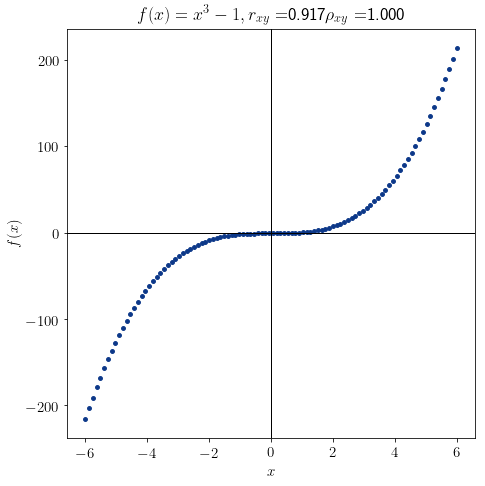

        斯皮尔曼系数解决了这一问题，可以识别一般的单调性，而不仅仅是二元分布中线性的特殊情况。

    2. 皮尔逊相关性的数学定义

        与皮尔逊系数不同，$\rho_{xy}$ 是非参数的，它是根据秩而不是变量本身来计算的。变量的秩由变量值与特定值在[排序变量](https://en.wikipedia.org/wiki/Ranking)中所占位置的替换组成。例如，如果我们要计算 $x = [5.3, 2.8, 4.2, 3, 1.4]$ 的秩 $rg_x$，我们应该先将 x 作为 [1.4, 2.8, 3, 4.2, 5.3]。然后将变量的每个原始值替换为其在排序值中的位置来计算秩，即 $rg_x = [5, 2, 4, 3, 1]$。

        然后计算 $\rho_{xy}$ 的斯皮尔曼相关系数为：

        \[\rho_{xy} = \frac {\text{cov}(rg_x, rg_y)} {\sigma(rg_x) \sigma(rg_y)}\]

        其中 $\text{cov}(rg_x, rg_y)$ 是 $rg_x, rg_y$ 的协方差，$\sigma(rg_x) \sigma(rg_y)$是两个标准差的乘积。

    3. 可能的值

        如前所述，Spearman 系数在-1 和 1 之间变化。 当 $\rho_xy = 1$ 时，二元分布是单调递增的：

        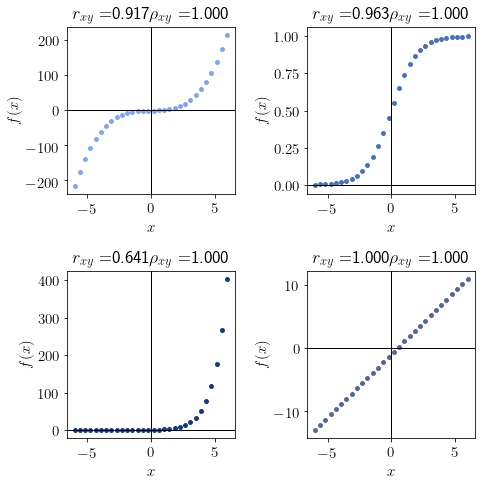

        同样，Spearman 系数 $\rho_{xy} = -1$ 的分布是单调递减的：

        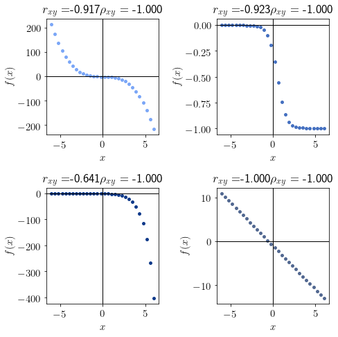

        最后，$rho_{xy} \cong 0$ 表示函数不是单调的：

        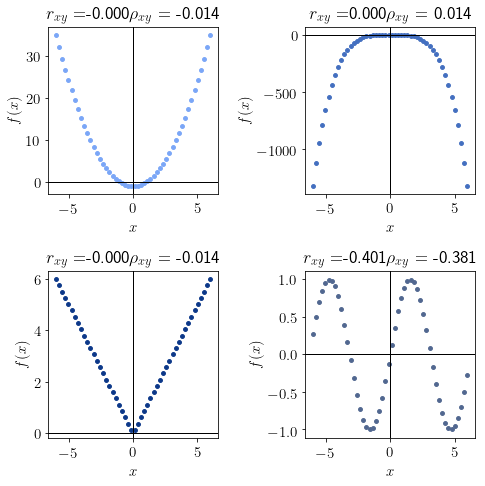

        请注意，从形式为 $f(x) = f(-x)$ 的偶函数中采样的所有分布都具有斯皮尔曼相关系数 $\rho_{x, f(x)} = 0$。

    4. 斯皮尔曼相关系数的解释

        最后，我们可以用一种更正式的方式来讨论斯皮尔曼相关系数假设值的解释。我们在前面看到，它与单调性有关。因此，如果我们有一个从 y = f(x) 形式的函数中采样的分布，那么 $\rho_{xy}$ 的符号一般指向该函数的单调性。

        然而，斯皮尔曼并不只适用于函数依赖变量，因为我们可以将它用于所有随机变量。因此，我们需要一个不依赖于连续函数分析概念的定义。

        相反，我们可以将其解释为两个变量趋于同方向变化的程度。也就是说，相关度高的变量会同时增加和减少，而绝对相关度低的变量很少会同时减少。换句话说，相关系数告诉我们，对于 x 的两个分量之间的任何差值 $\Delta{x} = x_i - x_j$，相应差值 $\Delta{y} = y_i - y_j$ 的符号。

        从这个意义上说，一个相关系数 $\rho_{xy}=1$ 告诉我们$(\Delta{x} \geq 0 \to \Delta{y} \geq 0) \wedge (\Delta{x} \leq 0 \to \Delta{y} \leq 0)$相联系。同样，系数 $\rho_{xy}=-1$ 意味着$(\Delta{x} \geq 0 \to \Delta{y} \leq 0) \wedge (\Delta{x} \leq 0 \to \Delta{y} \geq 0)$形成对边。最后，相关系数 $\rho_{xy}=-0$ 意味着前面的表达式都不成立。

5. 两个系数的解释

    1. 相关系数的值

        现在，我们可以总结上述考虑因素，并创建一个表格，其中包含我们可以根据相关系数的值对二元分布做出的理论预测：

        

    2. 猜测相关系数值

        现在，我们将利用此表进行反向处理。也就是说，根据分布的形状来猜测其相关值。这有助于我们对其相关值提出假设，然后进行计算检验。我们可以通过观察分布的形状，将其与上面草拟的表格进行比较，然后推断出相关系数的可能值。

        第一种分布是这样的

        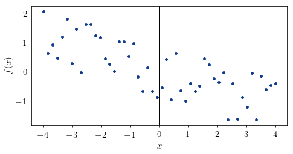

        我们可以注意到，它的形状隐约像是一个线性函数，而且总体上是递减的。因此，我们希望它的 $r_{xy}$ 和 $\rho_{xy}$ 值包含在$r_{xy}, \rho_{xy} \in (-1,0)$区间内。该分布的实际值为 $r_{xy} = -0.734$，$\rho_{xy} = -0.721$，这意味着我们的猜测是正确的。

        第二个变量的形状与 logistic 函数 $y =\sigma(x)$ 相似：

        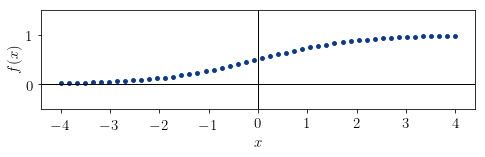

        因为它是单调递增的，所以它的$\rho_{xy}$值一定是+1。此外，它似乎并不完全适合一条直线，但一般可以用线性模型来近似。由此，我们推导出它的 $r_{xy}$ 值一定在区间（0，+1）内。这个分布的系数的真实值是 $r_{xy} = 0.982$ 和 $\rho_{xy} = 1$，这意味着我们的猜测是正确的。

        第三个分布的形状是正弦曲线：

        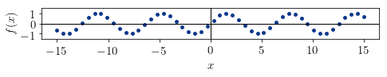

        这个函数不可能是单调的，它似乎不是递增或递减的。这意味着斯皮尔曼系数 $\rho_{xy}$ 近似为 0。它似乎也不能用线性模型来近似，这意味着它的皮尔逊系数也应该接近 0。该分布的实际值为 $r_{xy} = 0.152$ 和 $\rho_{xy} = 0.144$，确实如我们所料，足够接近 0。

6. 结论

    本文研究了二元分布的相关性概念。

    我们首先探讨了相关性与因果关系之间的关系。

    然后，我们研究了皮尔逊相关性及其解释，以及类似的斯皮尔曼相关性。

    在此过程中，我们了解到皮尔逊相关性与分布是否适合线性回归有关。斯皮尔曼系数则与近似分布的连续函数的单调性有关。

[What the Correlation Coefficient Actually Represents](https://www.baeldung.com/cs/correlation-coefficient)
