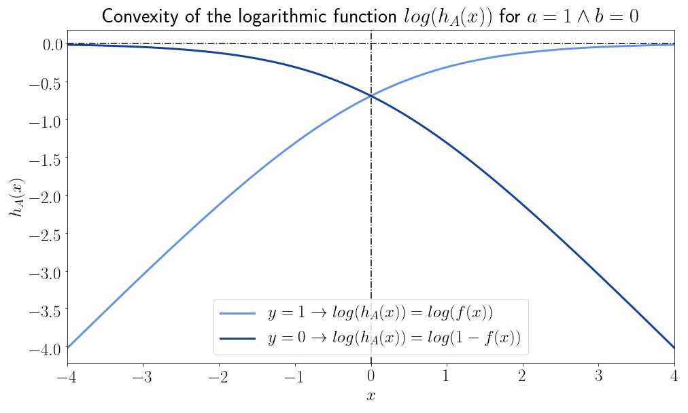

# 为什么逻辑回归的代价函数是对数表达式？

[机器学习](https://www.baeldung.com/cs/category/ai/ml) [数学与逻辑](https://www.baeldung.com/cs/category/core-concepts/math-logic)

[优化](https://www.baeldung.com/cs/tag/optimization) [回归](https://www.baeldung.com/cs/tag/regression) [训练](https://www.baeldung.com/cs/tag/training)

1. 概述

    在本教程中，我们将研究逻辑回归模型的误差函数使用对数表达式的原因。

    为此，我们首先要讨论算法学习的一般问题。这将让我们知道，保证通过梯度下降学习任何给定函数所需的条件是什么。

    随后，我们将定义逻辑回归模型的数学公式。与此相关，我们还将定义该模型的似然函数并研究其特性。这将让我们明白，为什么在一般情况下，我们不能保证总能学习到该模型的参数。

    最后，我们将研究似然函数的对数变化。在此过程中，我们将了解似然和对数似然在参数可学习性方面的区别。

    在本教程的最后，我们将从理论上深刻理解为什么要使用对数函数来学习逻辑回归模型的参数，以及函数的可学习性这一一般性问题。

2. 通过梯度下降学习参数

    1. 学习参数问题

        在讨论[逻辑回归](https://www.baeldung.com/java-logistic-regression)及其[相关误差函数](https://www.baeldung.com/cs/cs-entropy-definition#magicparlabel-8591https://www.baeldung.com/cs/cs-entropy-definition#magicparlabel-8591)的特殊性之前，我们有必要先谈谈一般模型[参数](https://www.baeldung.com/kotlin-supervised-learning#parameters)的算法学习问题。事实上，我们为什么选择[对数函数](https://www.baeldung.com/java-logarithms)作为[逻辑模型](https://www.baeldung.com/cs/ml-nonlinear-activation-functions#1-logistic)的误差函数，而不是简单的均方误差，这有一个简单的解释。

        不过，这种解释要求我们了解在机器学习模型中，我们希望误差函数具有哪些特征。

        学习模型参数的方法多种多样。其中最有名的是梯度下降法，这是一种学习任何连续可导(differentiable)函数参数的通用方法。梯度下降法最常见的应用是学习神经网络中的权重。这是因为权重可被视为该网络的[自成一类的参数](https://www.baeldung.com/cs/graph-theory-intro#8-the-weighted-graph)。

        梯度下降法也是我们学习逻辑回归模型参数的方法。那么，我们就可以在这种情况下研究这种算法。通过学习梯度下降算法的应用条件，我们也将学习到应用该算法的函数的预期特征。

    2. 梯度下降及其要求

        梯度下降法是一种在可微分函数中寻找最小点的算法，它不需要知道函数的形状，只需要知道函数的偏导数。这种算法可应用于任何函数 f(x)，只要满足其要求，就能[保证收敛](https://www.stat.cmu.edu/~ryantibs/convexopt-F13/scribes/lec6.pdf)。

        这意味着，如果一个函数存在满足某些条件的最小值，我们就可以对其进行任意精度的逼近。这些条件是：

        - f 在 x 中连续且可微分
        - f 也是凸函数
        - 最后，f 的梯度是[Lipschitz连续](https://en.wikipedia.org/wiki/Lipschitz_continuity)的。

        如果函数满足这些条件，我们就可以找到一个值 $x*$，使得 $f(x*) - f(x_0) < \epsilon$。这里，$x_0$ 是指 $f'(x_0) = 0 \wedge f''(x_0) \geq 0$ 的 f 值。表示近似程度的 $\epsilon$ 值可以任意选择。

        换句话说，这意味着如果目标函数及其梯度满足所列条件，我们总能通过梯度下降找到函数的一个点，这个点与函数的最小值相差无几。因此，我们可以将为逻辑回归选择代价函数的问题重新表述为选择一个可以应用梯度下降的代价函数的问题。

3. 逻辑回归

    1. 逻辑函数回顾

        在上一篇关于线性回归与逻辑回归区别的文章中，我们讨论了逻辑模型如何将形式为 f(x) = ax + b 的广义线性函数映射到开放区间（0,1）。因此，该模型是 $f:{R} \to (0,1)$ 形式的连续映射。这些映射中最典型的是 logistic 函数，可以写成

        \[y = f(x) = \frac {e^{(ax+b)}}{e^{(ax+b)} + 1} = \frac{1}{1+e^{-(ax+b)}}\]

        其中，广义线性模型已成为欧拉数 e 的指数。如果 a=1，b=0，这个函数就会变成著名的 S 形：

        

    2. 逻辑回归和广义线性模型

        然而，广义线性模型的参数 a 和 b 可能与上述两个参数不同。在这种情况下，即使仍然存在一般的 S 形，函数所假设的值也会有很大的不同。在这里，我们可以看到一些使用一维自变量的不同逻辑模型的示例：

        

        一般来说，我们可以肯定，对于任意一点$(x, y): x \in {R} \wedge y \in (0,1)$，都有形式为 $y = \sigma(ax+b)$的无限逻辑模型经过该点。每个模型都对应于一对参数 (a,b) 的给定组合值。

    3. 针对训练数据的逻辑回归

        这意味着，如果我们只从数据集中的观测值中抽取一个，我们并不能真正推断出最佳拟合 Logistic 模型的参数：

        

        不过，随着观测数据的增加，我们可以逐步缩小最适合这些数据的模型参数的范围。这样，我们就可以从众多可能的模型中找出一个最佳拟合模型：

        

        这就是逻辑回归的本质。然而，在现实世界的数据集中，没有任何一个模型能完美地拟合任何给定的自变量和因变量。这主要有两个原因：

        - 实际数据集中的变量值受随机误差的影响
        - 逻辑模型的输出是包含在域（0,1）中的连续变量，而我们用于训练的因变量是伯努利分布(Bernoulli-distributed)的 $y：y = 0 \vee y = 1$

        因此，我们预计即使是最佳拟合模型，预测误差也不会为零。因此，寻找最佳拟合逻辑模型参数的问题就可以转变为寻找能使某种误差指标最小化的模型参数的问题。关于各种可能的误差函数，我们很快就会明白其中的含义。

    4. 逻辑回归的数学定义

        现在，我们可以用更正式的方式总结一下逻辑回归的主要特征。在此基础上，我们将首先建立逻辑模型成本函数的正式定义，然后了解如何使其最小化。

        逻辑模型是一种形式为 $f: (-\infty, \infty) \to (0, 1)$ 的映射，我们用它来模拟伯努利分布因变量 $y: y = 0 \vee y =1$ 和由 n 个自变量 $\{x_1, x_2, ... , x_n\}$ 组成的向量 X 之间的关系，象这样$x \in X \to x_i \in \mathbb{R}$.

        我们还假定函数 f 指的是一个广义线性模型$g(X,A)=$。在这里，X 与之前的向量相同，而 A 表示 X 上线性模型的参数，这样 $A = \{a_0, a_1, ..., a_n\} \to y = a_0 + a_1 x_1 + a_2 x_2 + ... + a_n x_n$。在这种情况下，我们可以将 $y = f(X)$ 改写为 $y = f(g(X,A))$。

        请注意 $|A| = |X|+1$；也就是说，A 中的参数比 X 中的变量多一个。这是因为我们可以把线性模型的截距或常数项当作指数为零的变量的系数，因为 $a_0 = a_0 x^{0} | \forall x, a \in \mathbb{R} \wedge x \neq 0$。或者，等价地，我们可以强加 x = 1 并得到相同的结果。

    5. 参数形式的逻辑回归

        现在我们可以将 g(X,A) 以代数形式写成 $g(X,A) = A^{T} X$，并将 f 表示为 g(X,A) 上的 logistic 函数，即

        \[y = f(g(X,A)) = \frac{1}{1+e^{-g(X,A)}}\]

        将 g(X,A) 替换为其代数等价物，我们可以得到

        \[y = f(g(X,A)) = \frac{1}{1+e^{-A^{T}X}}\]

        这就是参数形式的逻辑回归。由于 y 是伯努利分布的，通常的解释是将 f 视为给定 X 和 A 的 y=1 的概率函数：

        \[P(y=1|X,A) = f(X,A)\]

        由于 y 只能取 0 或 1 这两个值，我们也可以计算 $P(y=0|X,A)$ 为 $P(y=0|X,A) =1- f(X,A)$。对于给定的观测值 k，我们可以将概率重写为

        \[P(y_k=0|X_k,A) \times P(y_k=1|X_k,A) = f(X_k,A)(1- f(X_k,A))\]

        最后，我们可以计算似然函数 $L(A | Y, X)$，即 $P(Y | X,A)$，将 Y 和 X 分布的所有观测值相乘：

        \[L(A|y,x) = P(Y|X,A) = \prod_{i}^{n}{P(y_i | x_i, A)}\]

        如果考虑到 y 只能取 0 和 1 的值，我们就可以将公式重写为

        \[L(A|y,x) = \prod_{i}^{n}{f_A(x_i)^{y_i}(1-f_A(x_i))^{(1-y_i)}}\]

4. 逻辑回归的成本函数

    1. 为什么不使用均方差？

        现在的问题是估计参数 A，使模型预测值与目标值之间的误差最小。换句话说，如果 $h_A(x_i)$是给定参数 A 后模型对 $x_i$ 的预测值，那么我们需要 $min(Err(h_A(x),y))$，其中 Err 是我们使用的误差指标。

        现在，让我们设想一下，在这个逻辑模型中应用与线性回归模型相同的误差函数。该函数通常包括模型预测值与目标变量值之间的均方误差（MSE）。我们可以将 $MSE(x,y|A)$ 写成

        \[MSE(x,y|A) =\frac{1}{n} \sum_{i=1}^{n} h_A(x_i) - y_i)^2\]

    2. 凸性问题

        对于线性模型，MSE 保证是凸的，因为它是一个预测函数的线性组合，而预测函数也是由线性组合构成的。对于逻辑回归的情况，MSE 不能保证是凸的，因为它是标量和一个函数（逻辑函数）的线性组合，而这个函数也不是凸的。

        举例来说，在 $a=1 \wedge b =0$ 的特定情况下，这是决策函数 $h_A(x)$ 的一般形状：

        

        这就是与 $h_A(x)$ 相关的凸性：

        

        我们可以看到，决策函数一般不是凸的，而只是在其域的特定子集中才是凸的。

    3. 预测函数的对数

        这意味着我们不能使用均方误差作为逻辑模型的误差指标。让我们考虑预测函数的对数，当 $y_i = 1$ 时为 $ln(h_A(x_i))$，当 $y_i=0$ 时为 $ln(1-h_A(x_i))$：

        

        然而，如果我们通过在水平轴上的垂直反射将它们翻转过来，那么这两个函数就会变成永远且唯一的凸函数：

        

    4. 误差函数与优化

        这意味着我们可以定义一个误差函数 $Err(h_A,y)$，其形式为 $-log(h_A,y)$。对于所有输入值，该函数都是凸函数。由于似然函数是我们用来学习模型参数的函数，因此它的对数似然就是我们用来作为误差函数的函数：

        \[Err(h_A, y) = -log(h_A(x))/ y - log(1-h_A(x))(1-y)\]

        我们可以把优化问题改写为：在所有观测样本中最小化这个函数：

        \[J(A) = \frac{1}{n}\sum_{i=1}^{n}[-log(h_A(x))\ y - log(1-h_A(x))(1-y)]\]

    5. 凸性、梯度下降和对数概率

        现在我们可以用一系列命题来总结本文的推理，这些命题代表了我们进行的理论推理：

        - 误差函数是我们优化机器学习模型参数的函数
        - 这种优化是通过算法学习方法进行的
        - 逻辑回归最常用的方法是梯度下降法
        - 梯度下降需要凸成本函数
        - 线性回归模型常用的均方误差对于逻辑回归来说不是凸函数
        - 这是因为 logistic 函数并不总是凸的
        - 然而，似然函数的对数总是凸的

        因此，我们选择使用对数似然函数作为逻辑回归的代价函数。事实上，我们可以利用梯度下降法来解决优化问题。

5. 结论

    在本文中，我们研究了我们倾向于使用对数函数（如 log-likelihood）作为逻辑回归成本函数的理由。

    我们首先从总体上研究了我们期望参数优化的代价函数具有哪些特征。然后，我们了解了最大似然函数的基本形式具有哪些特征。

    最后，我们研究了该函数对数版本的特征。由于最大似然函数保证了凸性，我们认为最好用它来代替均方误差。

[Why Does the Cost Function of Logistic Regression Have a Logarithmic Expression?](https://www.baeldung.com/cs/cost-function-logistic-regression-logarithmic-expr)
