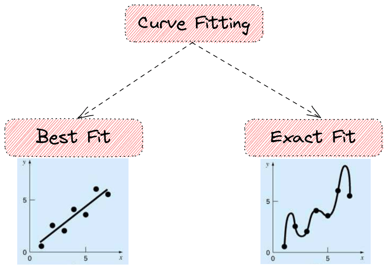
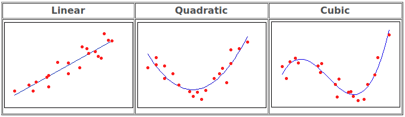
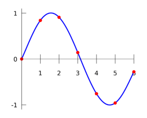
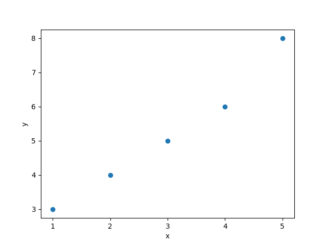
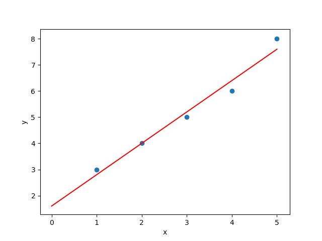

# 曲线拟合简介

[人工智能](https://www.baeldung.com/cs/category/ai) [数学与逻辑](https://www.baeldung.com/cs/category/core-concepts/math-logic)

[回归](https://www.baeldung.com/cs/tag/regression)

1. 概述

    在本教程中，我们将简要介绍曲线拟合。首先，我们将介绍曲线拟合的基本术语和主要类别，然后，我们将介绍曲线拟合的最小二乘法算法以及一个详细的示例。

2. 前言

    假设我们得到一组测量数据点。曲线拟合就是以解析形式找到最适合这组数据的数学函数的过程。第一个问题可能是我们为什么需要曲线拟合。在很多情况下，曲线拟合都是有用的：

    - 量化测量数据的总体趋势
    - 消除函数中的噪声
    - 从学习曲线中提取有意义的参数
    - 总结两个或多个变量之间的关系
3. 类别

    一般来说，根据我们处理观测数据的方式，曲线拟合可分为两大类：

    
    1. 最佳拟合

        在这里，我们假设测量的数据点是有噪声的。因此，我们不想拟合出一条截取每个数据点的曲线。我们的目标是学习一个函数，使给定数据点上的某些预定误差最小。

        最简单的最佳拟合方法是线性回归，即曲线是一条直线。更正式地说，我们有参数函数 y = a x + b，其中 a 是斜率，b 是截距，还有一组样本 $(x_1，y_1),(x_2，y_2),...,(x_n，y_n)$。我们的目标是学习 a 和 b 的值，使给定样本的误差准则最小。

        一般来说，多项式回归指的是我们想要拟合一个特定阶数 $\mathbf{d}$ 的多项式到我们的数据：

        - 当 d = 1 时为线性：$y = a x + b$
        - 当 d = 2 时为二次方：$y = a x^2 + b x + c$
        - 当 d = 3 时为三次方：$y = a x^3 + b x^2 + c x + d$

        在上述函数中，我们可以观察到，每次我们想要学习的参数都等于 $\mathbf{d+1}$。下面，我们可以看到一些使用不同函数进行曲线拟合的例子：

        

        此外，我们还可以对数据拟合任何其他函数，例如：

        - 三角函数
        - 高斯函数
        - 梯形函数

    2. 精确拟合

        在这种情况下，我们假设给定样本没有噪声，并希望学习一条经过每个点的曲线。在我们想要得出[有限差分近似值](https://en.wikipedia.org/wiki/Finite_difference)或找到函数的最小值、最大值和零交叉点时，这种方法非常有用。

        在下图中，我们可以看到一个使用[多项式插值法](https://en.wikipedia.org/wiki/Interpolation)进行精确拟合的示例。

        

4. 最小二乘算法

    曲线拟合的算法有很多。最著名的方法是最小二乘法，即寻找一条残差平方和最小的曲线。所谓残差，是指观测样本与拟合曲线估计值之间的差值。它既可用于线性关系，也可用于非线性关系。

    在 d=1 的线性情况下，我们要拟合的函数是 $y = a x + b$。因此，我们要找到参数 a、b，使 $T = \sum_i (y_i - (b + a x_i))^2$ （残差之和）最小化。

    为了使上述项最小化，有两个条件：

    \[\frac{\partial T}{\partial a} = 0 \to 2 \sum_i (y_i - (b + a x_i)) (-x_i) = 0 \to \sum_i x_i y_i = b \sum_i x_i + a \sum_i x_i^2\]

    \[\frac{\partial T}{\partial b} = 0 \to 2 \sum_i (y_i - (b + a x_i)) = 0 \to \sum_i y_i = nb + a \sum_i x_i\]

    在非线性最小二乘问题中，一种非常著名的算法是[高斯-牛顿法](https://en.wikipedia.org/wiki/Gauss–Newton_algorithm)。虽然我们没有理论证明该算法会收敛，但它能在实践中找到合适的解，而且易于实现。

5. 示例

    下面我们来看一个用最小二乘法拟合一组样本中直线的例子。假设我们有以下数据：

    $(1, 3), (2, 4), (3, 5), (4, 6), (5, 8)$

    在下图中，我们可以看到数据的散点图：

    

    我们想拟合线性函数 y = a x + b：

    - 26 = 5b + 15a
    - 90 = 15b + 55a

    求解上述由两个方程和两个变量组成的系统，我们发现 a=1.2 和 b=1.6。因此，我们得到函数 y = 1.2x + 1.6：

    

    在上图中，红线对应于输入数据的拟合曲线（蓝点）。正如我们所料，拟合曲线与输入点的距离最小。

6. 结论

    在本教程中，我们讨论了曲线拟合。首先，我们介绍了曲线拟合的基本术语和类别。然后，我们从理论和实例两方面介绍了最小二乘算法。

[Introduction to Curve Fitting](https://www.baeldung.com/cs/curve-fitting)
