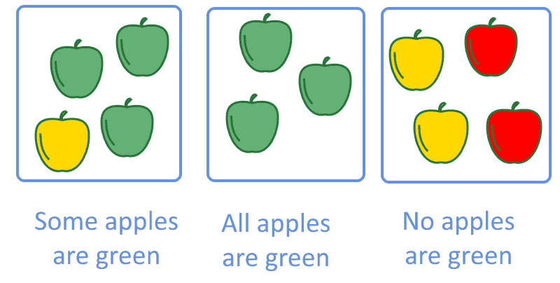
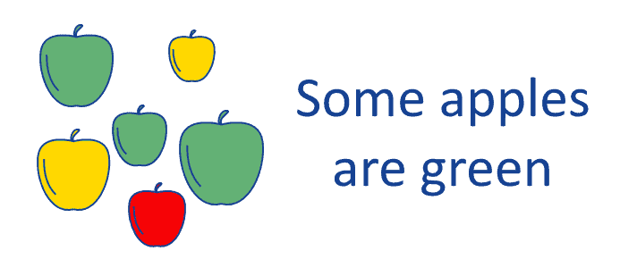
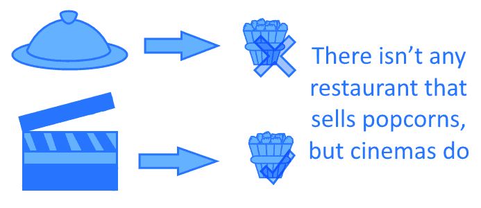
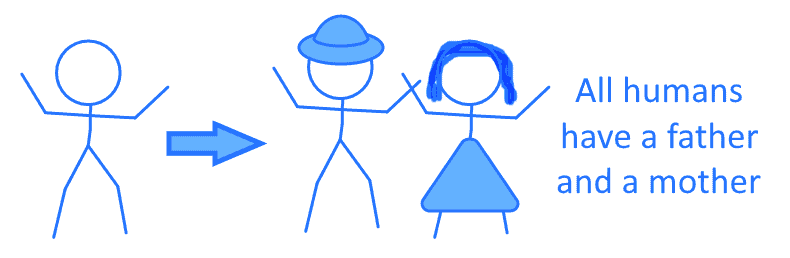

# [一阶逻辑](https://www.baeldung.com/cs/first-order-logic)

1. 概述

    在本教程中，我们将学习一阶逻辑的基础，并熟悉其理论和概念基础。

    首先，我们将研究自然语言和形式语言之间的关系。随后，我们将比较一阶逻辑和命题逻辑。在此过程中，我们将了解前者的具体特点，以及何时使用前者比后者更有利。

    最后，我们将学习一阶结构的符号和语法。这将使我们能够将自然语言的表达式转化为一阶逻辑的有效表达式。

    本教程结束时，我们将知道什么是一阶逻辑，它与命题逻辑有何不同。我们还将知道它的句法规则，并能将自然语言表达式翻译成一阶表达式。

2. 一阶逻辑与自然语言

    1. 自然语言与逻辑运算

        一阶逻辑与所有其他形式逻辑系统一样，是一种将[自然语言](https://www.baeldung.com/apache-open-nlp)形式化为可计算格式的方法。这反过来又使我们能够以形式化的方式处理通过[语言句子](https://www.baeldung.com/cs/constituency-vs-dependency-parsing)表达的问题。从自然语言的形式化中，我们获得了提出和证明定理的能力，这反过来又使得在数学、计算机科学和哲学等学科中进行推理成为可能。

        自然语言的形式化问题[与哲学本身一样古老](http://www.kybernetika.cz/content/1990/4/327/paper.pdf)。不过，在计算机科学领域，这个问题在 20 世纪 50 年代就有了基础，当时开发了第一批处理逻辑表达式的[系统](https://en.wikipedia.org/wiki/Logic_Theorist)。不过，第一批此类系统有严重的[局限性](https://www.aclweb.org/anthology/C69-2901.pdf)，尤其是它们只能处理命题逻辑，而不能处理谓词逻辑。

        命题逻辑不允许对具有一般和可变内容的变量和函数进行推理，这意味着它的抽象能力是有限的。这也意味着，最初的逻辑计算系统无法解决其解在向量空间中的问题，而命题空间是[向量空间](https://www.researchgate.net/publication/31374079_Logic_as_a_Vector_System)的一个子空间。这一问题的解决要归功于[形式逻辑系统](https://dl.acm.org/doi/abs/10.5555/38420.42233) - 一阶逻辑的发展，一阶逻辑包含变量，因此可以进行抽象。

    2. 自动推理和推论

        如今，一阶推理已成为机器学习系统符号推理的基本组成部分。现代专家系统都使用一阶或[高阶逻辑](https://en.wikipedia.org/wiki/Higher-order_logic)，可以[自动进行抽象推理](https://link.springer.com/chapter/10.1007/978-3-642-83397-7_5)和推论。

        一阶逻辑也有专门的编程语言。其中最有名的是 Prolog，其首字母缩写以一种相当混乱的方式代表 “命题逻辑”，但其语法在很大程度上与一阶逻辑相对应。Prolog 的特点是可以快速建立知识库，而且几乎不需要对人类分析师进行培训，他们就能对知识进行编码。

        其他使用一阶逻辑进行知识表示和推理的解决方案有 Drools 和 jBPM，我们可以在它们各自的教程中了解更多相关信息。

3. 命题逻辑与一阶逻辑的区别

    在上一篇关于[命题逻辑](https://www.baeldung.com/cs/propositional-logic)的教程中，我们讨论了这种逻辑系统所具有的特殊性。由于命题逻辑源于一阶逻辑，因此我们现在有必要确定命题逻辑与一阶逻辑之间存在哪些异同。这样，我们就能了解这两种语言逻辑形式化方法的优缺点。

    二者的第一个区别是，一阶逻辑包含命题逻辑，但事实并非如此。这意味着所有用命题逻辑表达的问题都可以用一阶逻辑来处理，但不是所有一阶逻辑中的问题都可以用命题逻辑来处理。这尤其涉及到那些只能用量词来表达的问题，如 “所有”、“任何”、“一些”、“没有”，我们稍后会详细介绍。

    第二个区别与构成这两种形式系统公式的基本单位的性质有关。命题逻辑使用命题和逻辑运算符来构成它的 “良好格式”（Well-Formed Formulas）。一阶逻辑除了这些，还使用变量、量词和关系。我们将在接下来的章节中了解这些新概念的含义。

    第三个不同点涉及两个系统表达的公式的抽象能力。在命题逻辑中，系统不允许处理涉及变异或不确定部分的问题。这意味着在命题逻辑中找到的公式解的有效性仅限于该公式。相比之下，在一阶逻辑中，可以创建具有更强概括能力的公式。

    下表总结了这两种系统的主要区别：

    |特征 |命题逻辑 |一阶逻辑|
    |-|-|-|
    |包括其他|否 |是|
    |使用变量 |否 |是|
    |分析单位 |命题和运算符 |谓词、对象、关系、量词|

4. 一阶逻辑的语法

    1. 逻辑符号

        一阶逻辑的语法由两类符号组成：逻辑符号和非逻辑符号。

        逻辑符号是与逻辑运算符或连接词相对应的符号。这类符号的例子包括逻辑运算符 $\wedge,\vee,\neg$，它们的功能与命题逻辑中的相应运算符相同。这类逻辑符号总是且只能在它们所代表的逻辑运算的意义上被解释，它们的意义从来不受我们使用一阶逻辑的讨论领域的限制。

        换句话说，无论我们讨论的是化学理论、物理学理论还是计算机科学理论，形式为 $x \wedge y$ 的公式在其 x 和 y 成分上的意义可能各不相同，但符号 $\wedge$ 总是表示和。这意味着逻辑符号的含义总是明确无误的。

    2. 非逻辑符号

        非逻辑符号包括谓词和关系，也包括常量和函数。与非逻辑符号相关的意义是特定领域的，将它们转换为自然语言中的句子需要转换规则和解释。

        现在让我们看看如何通过适当的转换规则在不同的语境中直观地解释这个公式：

        - 如果我们谈论水果，如果 x 表示苹果，P 表示绿色，那么 P(x) 表示苹果是绿色的
        - 在化学中，如果 x 表示氢，P 表示原子，那么 P(x) 表示氢是（一个）原子
        - 在物理学中，如果 x 表示电子，P 表示轻子，那么 P(x) 表示电子是（一个）轻子

        我们将在本文后面正式学习如何解释公式。

    3. 一阶逻辑中的有性

        谓词和函数也有 “义项”（arity），它表示谓词所包含的参数或参量的数量。最常见的弧度是空值、一元、二元和三元，我们可以参考下表了解它们的定义和示例：

        | N.arguments | Arity   | Examples |
        |-------------|---------|-|
        | 0           | Nullary | 5,False,constants      |
        | 1           | Unary   | P(x),$\neg{x}$  |
        | 2           | Binary  | $x \vee y,\;x \wedge y$|
        | 3           | Ternary | if p then q else r,$(p \rightarrow q) \wedge (\neg{p} \rightarrow r)$|

        函数的弧度与谓词的弧度含义完全相同，即变量的个数。

    4. 谓词

        [谓词](https://www.baeldung.com/cs/predicates)是公式的基本组成部分，表示对象之间的关系。这些关系可以是话语域中允许存在的任何关系。

        例如，在家庭关系领域，谓词可以是兄弟的、父亲的、母亲的。在商业关系中，谓词可以是雇员的、子公司的、控制的。还可以定义更复杂的谓词，例如此父之子和此母之子。

        一般来说，我们用一个谓词来表示有限变量集 $\{x_1, x_2, ... , x_n\}$ 之间的关系，用大写字母表示，在括号之间表示该集合的有序元素，如 $P(x_1, x_2, ... , x_n)$。这样，我们就可以说谓词 $P(x_1, x_2, ... , x_n)$ 的迭代数为 n，或者等价地说它是 n-ary 的，因为它指向 n 个项。

        谓词的词性可以高于一元谓词。谓词 P 不仅可以指一个项，也可以指两个或更多的项。在这种情况下，我们用额外的逗号分隔额外的变量，如 P(x,y) 或 P(x,y,z) 等等。

        如果我们给 x、y 和 z 分别赋值 $x = \text{John}, y= \text{Jack}, z = \text{Susan}$，那么我们就可以把谓词 $P(x, y, z)$翻译成：

        $$P(\text{John}, \text{Jack}, \text{Susan}) = \text{John is the son of Jack and Susan}$$

    5. 将谓词转换为自然语言

        按照许多[使用一阶逻辑的编程语言](https://www.baeldung.com/cs/predicates#predicates-in-programming)的惯例，谓词的第一个参数通常翻译成句子的主语，而第二个参数通常翻译成句子的[属格](https://en.wikipedia.org/wiki/Genitive_case)或所有格：

        - $\text{brother(Paul, Richard)}$ 可译为保罗是理查德的兄弟
        - $\text{employee(Mr. Smith, Mr. Doe)}$ 可译为史密斯先生是多伊先生的雇员
        - $\text{fruit(apple, tree)}$ 可以翻译成苹果是树的果实

        对于 arity 大于 1 的谓词，将第一个参数赋给主语的约定是为了使一阶公式的解释标准化。如果不遵守这一惯例，像上面例子中的第二个谓词就可能被含糊地翻译成史密斯先生是无名氏先生的雇员，或者无名氏先生是史密斯先生的雇员。

        不过，谓词也可以有等于 0 的义项，在这种情况下，我们只需用一个不带括号的大写字母来表示即可。例如，空谓词 P 可以代表一个逻辑命题，我们在给定公式的上下文中将其视为常数。如果我们不想把命题 $P = \text{Socrates is a mortal}$ 推广到苏格拉底以外的人，那么这个命题就可以被视为谓词性质为零的谓词。

        零谓词必须包含在一阶逻辑中，这样我们才能把它看作是对命题逻辑的概括。事实上，完全由空值谓词和逻辑运算符组成的一阶逻辑表达式，就是命题逻辑中的格式化公式。

        我们也可以把空谓词看作一阶逻辑中的项，这样我们就可以把它们看作一阶逻辑中的格式化公式。我们很快就会看到，术语实际上是一阶逻辑中格式完备的公式的基本元素。

    6. 术语、变量和函数

        我们研究过在命题逻辑中，形式严谨的公式的基本单位是原子命题。在一阶逻辑中，这些基本单位是由变量和函数组成的术语。

        变量是公式的可变部分，所有变量都被单独视为术语。例如，如果符号 x 表示小于 10 的奇数自然数，那么 x 就是一个变量，它的值可以是集合 $\{1, 3, 5, 7, 9\}$ 中的任意元素。我们就把符号 x 称为包含它的公式中的一个项。

        函数也是项，但与变量不同的是，它指向其他项，如变量或其他函数。例如，如果我们定义函数 $f(x, y) = x^{y}$，那么 f(x, y) 就是指两个变量 x 和 y 的项。

        与谓词一样，函数也有 “项”（arity）的特征，因此一个有 n 个项的函数被称为 nary 函数。在边缘情况下，一个函数的数项也可以为零，在这种情况下，它被称为常数。例如，函数 c = 5 是一个空值函数，可以用符号 5 代替它出现的任何地方。这反过来又允许我们将常量视为术语，以构造格式良好的公式。

    7. 自然语言中的量词

        量词是一阶逻辑的一个特殊组成部分，它允许定义将数字或数量与某些谓词相关联的公式。在英语中，它们也被称为不定形容词。这些形容词包括 any、some、all 或 none 等。

        包含量词的句子举例如下：

        - 有些苹果是绿色的
        - 所有苹果都是绿色的
        - 没有苹果是绿色的

        

        请注意，在命题逻辑中，这三个句子对应着许多不同的原子命题。但在一阶逻辑中，它们都对应着相同的谓词-宾语关系，只是量词不同而已。在看到它的正式定义之前，我们可以用一种非正式的方式初步表达这个想法，即

        - $(some \vee all \vee no) green(apples)$

    8. 逻辑中的量词

        通过使用两个符号，我们可以更正式地定义量词： $\forall$ 和 $\exists$。它们在英语中分别翻译为 all 和 there exists。它们都位于包含变量的表达式中变量的前面，我们可以把它们写成 $\forall{x}$ 和 $\exists{x}$。如果多个变量都使用量词，通常每个变量都要重复使用量词：$\forall{x}\forall{y}$, $\exists{x}\forall{y}$。

        如果变量指的是谓词 P(x)，那么量词一般会在谓词之前： $\forall{x}P(x)$, $\exists{x}P(x)$. 包含量词的简单表达式可以直接翻译：

        - $\forall{x}P(x)\ \text{and}\ (P(x) = \text{x is green}) \rightarrow \text{all x are green}$
        - $\exists{x}P(x)\ \text{and}\ (P(x) = \text{x is green}) \rightarrow \text{there is a x that's green}$

        如果自然语言中的句子包含一阶逻辑没有明确定义的量词，比如一些或没有，那么我们可以使用下表来实现转换：

        | English                  | First-Order          |
        |--------------------------|----------------------|
        | At least one x is P | $\exists{x}P(x)$       |
        | All x are P           | $\forall{x}P(x)$       |
        | Some x are P          | $\exists{x}P(x)$       |
        | Not all x are P      | $\exists{x}\neg{P(x)}$ |
        | No x are P            | $\forall{x}\neg{P(x)}$ |

5. 形式良好的公式

    最后，我们可以根据下面的规则把术语、谓词和量词复合起来，从而定义一阶逻辑的格式良好的公式。

    第一条规则指出，由术语组成的谓词本身就是有效的公式。也就是说，$P(x_1, x_2, ... , x_n)$形式的谓词本身就是一个有效公式。

    第二条规则说，项与项之间的等价关系是一个有效公式。这意味着 $x = y、c = 5、f(x) = x$ 和 $f(x,y) = g(a,b)$ 都是有效公式，因为它们只由项和等号组成。

    第三条规则说，应用于公式的一元逻辑运算符也构成公式。也就是说，如果 $\varphi$ 是一个公式，那么 $\neg{\varphi}$ 也是一个公式。例如，如果 $\varphi$ 对应于公式 P(x,y)，那么 $\neg{P(x,y)}$ 对应于 $\neg{P(x,y)}$ 也是一个公式。

    第四条规则涉及的逻辑算子的数大于 1。由这些逻辑算子连接起来的公式也是公式。如果 $\varphi$ 和 $\psi$ 是两个公式，那么 $\varphi \vee \psi$, $\varphi \wedge \psi$, $\varphi \rightarrow \psi$ 也都是有效的公式。

    最后一条规则与量词有关，它指出如果 $\varphi$ 是一个包含项 x 的公式，那么 $\forall{x}\varphi$ 和 $\exists{x}\varphi$ 也是公式。我们说，在给定的公式中，被赋予量词的变量 x 称为该公式的约束项，而在相反的情况下，我们称它为自由项。一个只包含约束项的公式是特殊的，因为它只能有一个真值，而这个真值并不取决于它的约束项的具体值。

6. 一阶公式举例

    1. 有些苹果是绿色的

        现在，我们可以看到一些一阶公式的例子及其在特定话语域中的解释。这将有助于我们理解如何从自然语言中提取一阶公式，以及如何将公式转换为一阶公式。

        第一个公式对应于我们之前学习过的句子 “有些苹果是绿色的”：

        

        要把它转换成一阶公式，我们需要定义

        - 一个变量 x
        - 对应于 “x 是一个苹果” 的一元谓词 A(x)，以及对应于 “x 是绿色的” 的一元谓词 G(x)

        然后我们就可以把这个句子转换成公式 $\exists{x}(A(x) \wedge G(x))$。

    2. 餐馆、电影院和爆米花

        我们要转换的第二个句子是 “没有一家餐馆卖爆米花，但电影院卖”：

        

        我们首先可以将这句话改写为 “如果 x 是一家餐馆，那么 x 就不卖爆米花，如果 x 是一家电影院，那么它就卖爆米花，如果 x 是一家餐馆，那么 x 它就不是一家电影院，如果 x 是一家电影院，那么它就不是一家餐馆”。那么我们可以定义如下：

        - 一个变量 x
        - 三个一元谓词 R(x)、C(x) 和 P(x)，分别指 “x 是一家餐馆”、“x 是一家电影院 ”和 “x 卖爆米花”。

        这样，我们就可以将自然语言中的句子转换为

        $$\forall{x}((R(x)\rightarrow \neg{P(x)}) \wedge (C(x) \rightarrow P(x)) \wedge (R(x) \rightarrow \neg{C(x)}) \wedge (C(x) \rightarrow \neg{R(x)}))$$

    3. 父子关系和母子关系

        第三个公式对应自然语言中的句子 “所有的人都有父亲和母亲”：

        

        要将这句话转换成一阶公式，我们需要定义以下内容：

        - 三个变量 x、y、z
        - 一个一元谓词 H(x) “x 是人”
        - 两个二元谓词 P(y, x) 和 Q(z, x) 分别对应 “是父亲 ”和 “是母亲 ”的关系

        这样，我们就可以把 “所有人类都有父亲和母亲” 这句话先转换成 “如果 x 是人类，那么就有 y 和 z，这样 y 是人类，z 是人类，y 是 x 的父亲，z 是 x 的母亲，x 不是 y，x 不是 z，y 不是 z”。然后我们可以把这个很长的句子翻译成更容易处理的句子：$$\exists{y}\exists{z}\forall{x}(H(x) \rightarrow (H(y) \wedge H(z) \wedge P(y,x) \wedge Q(z, x) \wedge x \neq y \wedge x \neq z \wedge y \neq z)$$

7. 结论

    在本教程中，我们学习了一阶逻辑的概念基础，并学会了如何从命题逻辑推导出一阶逻辑。我们还学习了格式良好的公式及其基本组成部分，以及将它们连接成有效公式的规则。
