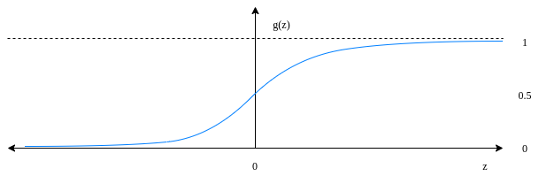
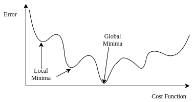
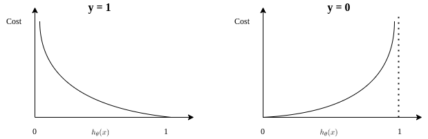

# 逻辑回归中的梯度下降方程

[机器学习](https://www.baeldung.com/cs/category/ai/ml) [数学与逻辑](https://www.baeldung.com/cs/category/core-concepts/math-logic)

[优化](https://www.baeldung.com/cs/tag/optimization) [回归](https://www.baeldung.com/cs/tag/regression) [训练](https://www.baeldung.com/cs/tag/training)

1. 简介

    在本教程中，我们将学习逻辑回归中的代价函数，以及如何利用梯度下降计算最小代价。

2. 逻辑回归

    我们使用逻辑回归来解决结果为离散变量的分类问题。通常，我们用它来解决[二元分类](https://www.baeldung.com/cs/classification-model-evaluation#binary-classification)问题。顾名思义，二元分类问题有两种可能的输出结果。

    我们利用 sigmoid 函数（或 logistic 函数）将输入值从较大范围映射到有限区间。在数学上，sigmoid 函数为

    \[y = g(z) = \frac{1}{1 + e^{-z}} = \frac{e^z}{1 + e^z}\]

    这个公式表示观察到输入值的概率。

    这个公式表示观察伯努利随机变量输出 y = 1 的概率。这个变量要么是 1，要么是 0 在 $(y \in {0,1})$ 区间。

    它将任何实数挤压到（0,1）开放区间。因此，它更适合用于分类。此外，与线性回归不同，它对异常值的敏感度较低：

    

    将 sigmoid 函数应用于 0，得到 0.5。当输入接近 $\inf$ 时，输出变为 1。反之，当输入接近$-\inf$时，sigmoid 变为 0。

    更正式地说，我们为二元分类问题定义了逻辑回归模型。我们选择假设函数为 sigmoid 函数：

    \[h_{\theta}(x) = \frac{1}{1+e^{-\theta^T x}}\]

    这里，$theta$ 表示参数向量。对于包含 n 个特征的模型，我们有 $\theta = [\theta_0, \theta_1, ..., \theta_n]$，包含 n + 1 个参数。假设函数近似于实际输出等于 1 的估计概率：

    \[P(y=1| \theta, x) = g(z) = \frac{1}{1+e^{-\theta^T x}}\]

    和

    \[P(y=0| \theta, x) = 1 - g(z) = 1 - \frac{1}{1+e^{-\theta^T x}} = \frac{1}{1 + e^{\theta^T x}}\]

    更简洁地说，这等同于

    \[P(y | \theta, x) = \left(\frac{1}{1 + e^{-\theta^T x}} \right)^y \times \left(1- \left(\frac{1}{1 + e^{\theta^T x}} \right) \right)^{1-y}\]

3. 成本函数

    成本函数概括了模型的运行情况。换句话说，我们用代价函数来衡量模型的预测与实际输出的接近程度。

    在线性回归中，我们使用均方误差（MSE）作为成本函数。但在[逻辑回归](https://www.baeldung.com/cs/cost-function-logistic-regression-logarithmic-expr#cost-function-of-the-logistic-regression)中，使用实际结果与预测结果的平方差的均值作为代价函数，可能会得到一个波浪形的非凸解法，其中包含许多局部最优值：

    

    在这种情况下，不可能用梯度下降法找到最优解。相反，我们使用对数函数来表示逻辑回归的成本。它保证对所有输入值都是凸函数，只包含一个最小值，从而允许我们运行梯度下降算法。

    在处理二元分类问题时，误差的对数代价取决于 y 的值：

    \[ cost(h_{\theta}(x),y) =  \left\{\begin{matrix} - log(h_{\theta}(x)) & \text{, if } y = 1 \\ - log(1-h_{\theta}(x)) & \text{, if } y = 0 \end{matrix}\right.\]

    结果如下

    

    因为当实际结果 y = 1 时，$h_{\theta}(x) = 1$ 的成本为 0，$h_{\theta}(x) = 0$ 的成本为最大值。同样，如果 $y = 0，h_{\theta}(x) = 0$ 的成本为 0。

    由于输出可以是0或1，我们可以将等式简化为

    \[cost(h_{\theta}(x),y) = - y^{(i)} \times log(h_{\theta}(x^{(i)})) - (1-y^{(i)}) \times log(h_{\theta}(x^{(i)}))\]

    对于 m 个观测值，我们可以计算成本为

    \[ J(\theta) = - \frac{1}{m} \sum_{i=1}^{m} \left[ y^{(i)} \times log(h_{\theta}(x^{(i)})) + (1-y^{(i)}) \times log(h_{\theta}(x^{(i)})) \right] \]

4. 用梯度下降法使成本最小化

    [梯度下降](https://www.baeldung.com/cs/gradient-descent-vs-newtons-gradient-descent#gradient-descent)是一种迭代优化算法，它可以找到可微分函数的最小值。在这个过程中，我们会尝试不同的值，并更新它们以达到最优值，从而使输出最小化。

    在本文中，我们可以将这种方法应用于逻辑回归的成本函数。这样，我们就可以找到一个最优解，使模型参数的成本最小化：

    \[\min_\theta J(\theta)\]

    如前所述，我们使用 sigmoid 函数作为逻辑回归的假设函数。

    假设我们一共有 n 个特征。在这种情况下，我们就有$\theta$ 向量的 n 个参数。为了最小化我们的成本函数，我们需要对每个参数 $\theta_j$ 进行梯度下降：

    \[\theta_j \gets \theta_j - \alpha \frac{\partial}{\partial \theta_j} J(\theta)\]

    此外，我们需要在每次迭代时同时更新每个参数。换句话说，我们需要循环更新向量 $\theta = [\theta_0, \theta_1, ..., \theta_n]$ 中的参数 $\theta_0, \theta_1, …, \theta_n$。

    为了完成算法，我们需要得到 $\frac{\partial}{\partial \theta_j} J(\theta)$ 的值，也就是：

    \[\frac{\partial}{\partial \theta_j} J(\theta) = \frac{1}{m} \sum_{i=1}^{m} \left( h_{\theta}(x^{(i)}) - y^{(i)} \right) x_j^{(i)}\]

    将此插入梯度下降函数，就得到了更新规则：

    \[\theta_j \gets \theta_j - \alpha \frac{1}{m} \sum_{i=1}^{m} \left( h_{\theta}(x^{(i)}) - y^{(i)} \right) x_j^{(i)}\]

    令人惊讶的是，更新规则与线性回归中使用平方误差之和得出的规则相同。因此，我们也可以在逻辑回归中使用相同的梯度下降公式。

    通过对训练样本进行迭代直到收敛，我们就可以得到最优参数，从而实现最小成本。

5. 结论

    在本文中，我们学习了逻辑回归，这是一种基本的分类方法。此外，我们还研究了如何利用梯度下降算法来计算最优参数。

[Gradient Descent Equation in Logistic Regression](https://www.baeldung.com/cs/gradient-descent-logistic-regression)
