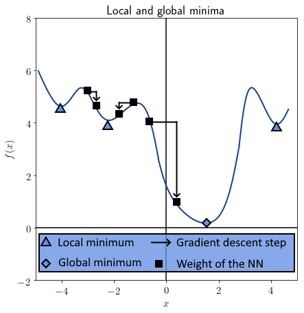
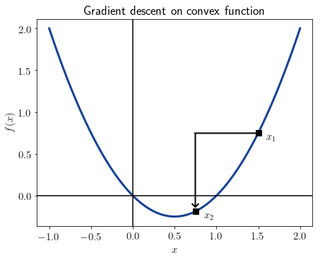
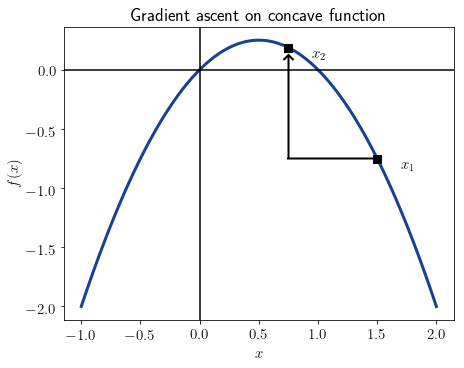

# 梯度下降和梯度上升有什么区别？

[深度学习](https://www.baeldung.com/cs/category/ai/deep-learning) [数学与逻辑](https://www.baeldung.com/cs/category/core-concepts/math-logic)

1. 概述

    在本教程中，我们将学习梯度下降和梯度上升的区别。

    在本文结束时，我们将熟悉这两种方法的区别，并知道如何将其中一种方法转换为另一种方法。

2. 一般梯度

    连续函数 f 的梯度定义为包含在点 p 上计算的偏导数 $\frac {\delta{f}}{\delta{x_i}}(p)$ 的向量。我们用正式符号表示梯度为

    \[\nabla f(x) = [\frac{\delta{f}}{\delta{x_1}}(p), \frac{\delta{f}}{\delta{x_2}}(p), ... , \frac{\delta{f}}{\delta{x_{|x|}}}(p)]^T\]

    在使用梯度进行优化时，我们可以进行梯度下降或梯度上升。现在让我们来看看两者的区别。

3. 梯度下降

    梯度下降是一个迭代过程，我们通过它来优化机器学习模型的参数。它主要用于[神经网络](https://www.baeldung.com/cs/neural-net-advantages-disadvantages)，也可用于逻辑回归和[支持向量机](https://www.baeldung.com/cs/ml-support-vector-machines)。

    它是[成本函数](https://www.baeldung.com/cs/learning-curve-ml#2-single-curves)迭代最小化的最典型方法。不过，它的主要局限在于只能保证收敛到局部最小值，而不一定是全局最小值：

    

    超参数 $\alpha$ 也称为[学习率](https://www.baeldung.com/spark-mlib-machine-learning#2-model-hyper-parameter-tuning)，可以对下降过程进行微调。特别是，通过适当地选择 α，我们可以摆脱向局部最小值的收敛，转而向全局最小值下降。

    在神经网络中，对权重矩阵进行梯度下降的过程被称为[误差反向传播](https://www.baeldung.com/cs/ml-nonlinear-activation-functions#magicparlabel-11835)。

    反向传播利用梯度的符号来决定权重是增加还是减少。通过梯度的符号，我们可以确定成本函数最接近最小值的方向。对于给定的参数 $\alpha$，我们通过计算对向量 w 进行迭代优化：

    \[w_{n+1} = w_n - \alpha \nabla_w f(w)\]

    这就是图形表示法：

    

    我们可以这样理解上面的公式 在第 n 步时，神经网络的权重都会被超参数 \alpha 与代价函数梯度的乘积所修正，而代价函数梯度是用这些权重计算出来的。如果梯度为正，则减少权重；反之，如果梯度为负，则增加权重。

4. 梯度上升

    梯度上升的工作方式与梯度下降相同，但有一点不同。它要完成的任务不是最小化，而是最大化某个函数。造成这种区别的原因是，有时我们可能想要达到某个函数的最大值，而不是最小值；例如，如果我们要[最大化分离超平面和观测值](https://www.baeldung.com/cs/ml-support-vector-machines#2-separation-hyperplane-and-support-vectors)之间的距离，就会出现这种情况。

    因此，描述梯度上升的公式与梯度下降的公式类似。只不过，符号是翻转的：

    \[w_{n+1} = w_n + \alpha \nabla_w f(w)\]

    如果说梯度下降表示向最近的最小值迭代，那么反过来，梯度上升则表示向最近的最大值迭代。从这个意义上说，对于任何函数 f，我们在其上应用梯度下降法，都有一个对称函数 -f，我们可以在其上应用梯度上升法。

    这也意味着，只要我们将问题反映在自变量的坐标轴上，通过梯度下降法解决的问题也可以通过梯度上升法找到解决方案。这幅图显示了与上一幅图相同的函数，但沿 x 轴进行了反映：

    

    在关于[逻辑回归成本函数](https://www.baeldung.com/cs/cost-function-logistic-regression-logarithmic-expr#cost-function-of-the-logistic-regression)的文章中，我们研究了对数似然的用法及其与凸性的关系。如果我们使用正对数似然，那么目标函数就是凹的，我们必须使用梯度上升法。反之，如果我们使用负的对数似然，就像通常的做法一样，我们应该使用梯度下降法。

    这是因为梯度下降法适用于凸目标函数，而梯度上升法需要凹目标函数。

5. 梯度下降还是梯度上升？

    现在，我们可以对上述考虑进行总结：

    - 梯度是包含函数在某一点上所有偏导数的向量。
    - 我们可以在凸函数上应用梯度下降法，在凹函数上应用梯度上升法
    - 梯度下降找到函数最近的最小值，梯度上升找到函数最近的最大值
    - 如果我们能翻转目标函数，我们可以在同一问题上使用两种优化方式

    因此，在实际应用中，梯度下降比梯度上升更常见。

6. 结论

    在本教程中，我们学习了梯度的概念，并了解了梯度下降和梯度上升的区别。

[What Is the Difference Between Gradient Descent and Gradient Ascent?](https://www.baeldung.com/cs/gradient-descent-vs-ascent)
