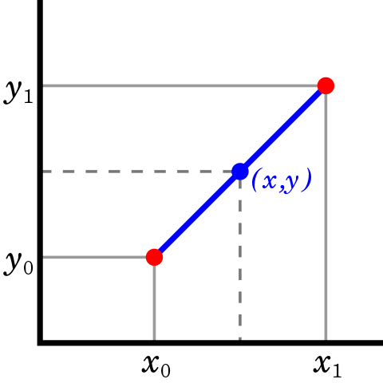
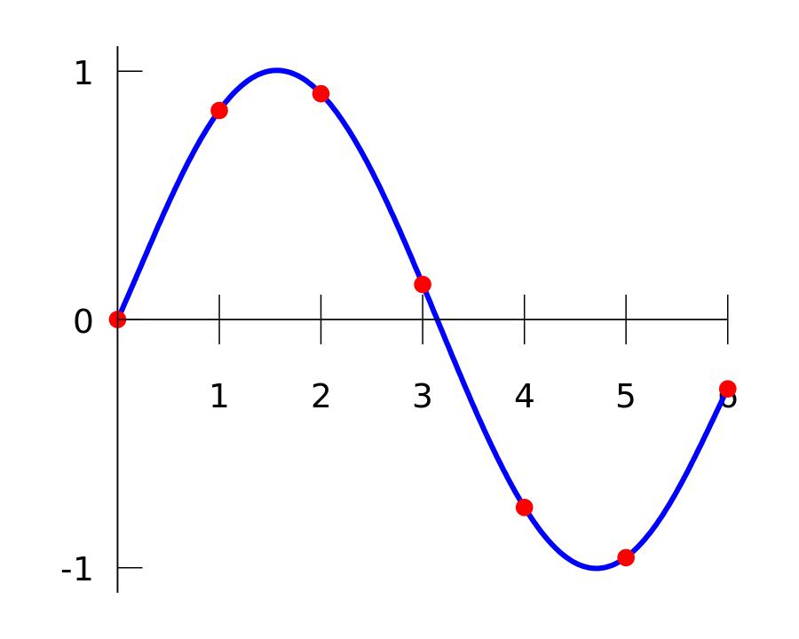
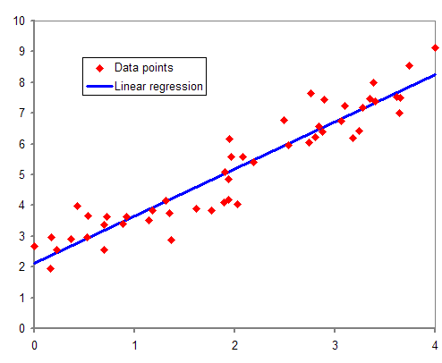

# 插值和回归：异同

[数学与逻辑](https://www.baeldung.com/cs/category/core-concepts/math-logic)

[回归](https://www.baeldung.com/cs/tag/regression)

1. 简介

    在本教程中，我们将解释插值和回归的概念及其异同。这两个词在银行、体育、文学和法律等领域经常使用，但有不同的解释。在这里，我们仅从数学的角度进行解释。

    首先，我们将详细介绍这两个概念。然后，我们将重点讨论它们的异同。

2. 插值法的概念

    [插值法](https://en.wikipedia.org/wiki/Interpolation#Spline_interpolation)是数学领域中的数值分析（NA）所研究的一系列方法。数值分析的目的是找到数学问题的近似解。这些解应尽可能精确。

    假设我们有一组与某个函数相对应的点。我们不知道函数的精确表达式，只知道这些点。而我们想要计算该函数在其他一些点上的值。插值法允许使用其他更简单的函数来逼近这个函数。近似函数应该经过之前已知集合中的所有点。然后，可以用它来估计未包含在集合中的其他点。

    1. 线性插值

        [线性插值](https://www.baeldung.com/cs/polynomial-interpolation)是一种在两点之间用直线进行插值的方法。假设有两点 $(x_0，y_0)$ 和 $(x_1，y_1)$。那么经过这两点的直线的方程为 y = a + bx，其中

        \[a = \frac{y_0.x_1 - y_1.x_0}{x_1 - x_0}\]

        \[b = \frac{y_1 - y_0}{x_1 - x_0}\]

        在下图中，蓝线代表两个红点之间的线性插值。

        

        假设我们用线性多项式 P 来逼近某个函数 f 的值，那么误差 R = f(x) - P(x) 的计算公式为

        \[|R| < \frac{(x_1 - x_0)^2}{8}.max(f''(x))\]

        为 $x_0$ 和 $x_1$ 之间的 x。

        我们也可以使用两点以上的线性插值，但误差会随着函数曲率的增加而增大。

    2. 多项式插值

        [多项式插值法](https://en.wikipedia.org/wiki/Polynomial_interpolation#:~:text=In)是在 N 个点之间用多项式进行插值的方法。假设一个集合有 N 个点。那么我们总能找到一条通过这 N 个点的多项式。而且这个多项式是唯一的。[多项式插值](https://www.baeldung.com/cs/polynomial-interpolation)的优势在于多项式更容易求值、微分和积分。

        计算插值多项式的系数有多种方法。其中一种是使用定义如下的[拉格朗日多项式](https://en.wikipedia.org/wiki/Lagrange_polynomial)：

        \[p(x) = \sum_{j=0}^{n}y_{j}.L_{n,j}(x)\]

        其中

        \[L_{n,j} = \prod_{k \ne j} \frac{x - x_k}{x_j - x_k}\]

        下面的蓝色曲线显示了根据红点调整后的多项式内插法。

        

    3. 样条插值

        [样条曲线](https://en.wikipedia.org/wiki/Spline_interpolation)是使用低度多项式片断定义的特殊函数。样条插值法之所以广受欢迎，是因为它易于评估、精确度高，而且能够拟合复杂的图形。用于样条曲线的多项式都是经过精选的，以便顺利地匹配在一起。自然三次样条曲线由三次多项式构成。它是两次连续可微的。此外，其二次导数在端点处为零。

        样条插值比拉格朗日多项式和其他多项式更平滑、更精确。[计算样条插值有不同的公式](https://www.baeldung.com/cs/spline-differences)。

3. 回归的概念

    [回归分析](https://en.wikipedia.org/wiki/Regression_analysis)是统计学中确定数据关系的一系列方法。这些方法可以评估一个变量对其他变量的依赖关系。它们用于发现分析数据中的趋势并将其量化。回归分析试图根据自变量的值精确预测因变量的值。它还可以测量每个自变量对结果的影响程度。

    因变量通常称为响应或结果。自变量被称为特征和预测因子等。这样，回归就提供了一个预测反应的方程。例如，因变量的值基于特征值的特定组合。

    1. 线性回归

        线性回归是通过线性函数来模拟某些因变量与其他自变量之间的关系。线性回归模型假设因变量 y 和自变量 x 之间存在线性关系，如等式 $y = a + b.x$，其中 y 是估计的因变量，a 是常数，b 是回归系数，x 是自变量。

        线性回归认为两个变量平均呈线性关系。因此，在 x 值固定的情况下，y 的实际值与预期值之间存在随机差异。因此，存在随机误差 ε，方程应表示为 $y = a + bx + ε$，其中 $ε$ 是随机变量。

        a 和 b 的实际值未知。因此，我们需要根据由 n 个观测对 $(x_1, y_1), ..., (x_n, y_n)$ 组成的样本数据来估计它们：

        接下来，蓝线代表与红点相对应的回归模型。

        

    2. 最小二乘法

        [最小二乘法](https://www.baeldung.com/cs/curve-fitting)可以估计方程 y = a + b.x 中 a 和 b 的值，同时使随机误差最小。假设 i = 1, ..., n 时，$ε_i = y_i - ŷ_i$，其中 $y_i$ 是观测值，$ŷ_i$ 是估计值，$ε_i$ 是两个值之间的残差。最小二乘法最小化观测值与估计值之间的残差平方和。

        斜率系数 b 的计算方法是

        \[b = \frac{S_{xy}}{S_{xx}}\]

        其中

        \[S_{xy} = \sum(x_i.y_i) - \frac{(\sum x_i)(\sum y_i)}{n}\]

        \[S_{xx} = \sum x_i^2 - \frac{(\sum x_i)^2}{n}\]

        截距 a 的计算方法是

        \[a = \frac{\sum y_i}{n} - b.\frac{\sum x_i}{n}\]

4. 插值法与回归法的异同

    让我们来看看插值法和回归法的异同。

    1. 插值法与回归法的相似之处

        插值法和回归法有相似之处，因为它们都是：

        - 源于数学
        - 以处理一组数据点为导向
        - 用于计算新的点
        - 计算出的新点应尽可能精确
        - 用函数建立数据集模型
        - 具有线性和非线性模型

    2. 插值法与回归法的区别

        让我们回顾一下插值法和回归法的主要区别：

        | 插值法                  | 回归                        |
        |----------------------|---------------------------|
        | 来自数值分析               | 来自统计学                     |
        | 假设数据集中的点能准确代表函数值     | 接受不精确的值                   |
        | 假设一个自变量的值与一个因变量的值相关联 | 接受自变量的同一值可能与因变量的多个值相关联的情况 |
        | 近似函数应与所有数据集点完全匹配     | 近似函数不必与数据集点完全匹配           |
        | 估计值的误差受某个特定表达式的约束    | 估计值的误差平均有界                |
        | 近似函数常用于数值积分和微分       | 近似函数常用于预测和预报              |

5. 结论

    在本教程中，我们解释了插值和回归的概念。我们描述了它们的目的和目标。还解释了每个领域中使用的一些方法。最后，对它们的异同进行了说明和描述。
