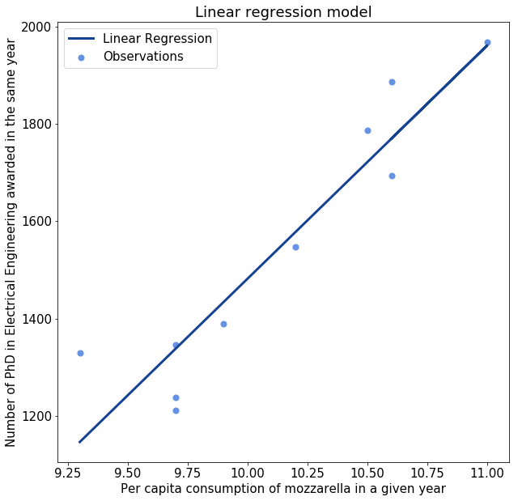
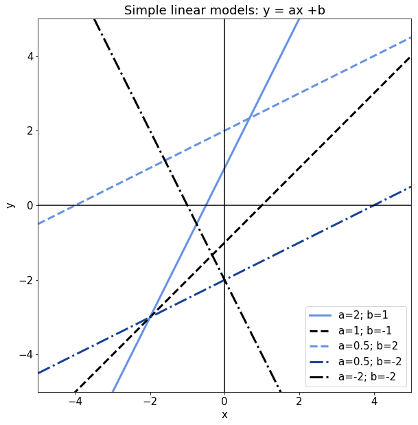
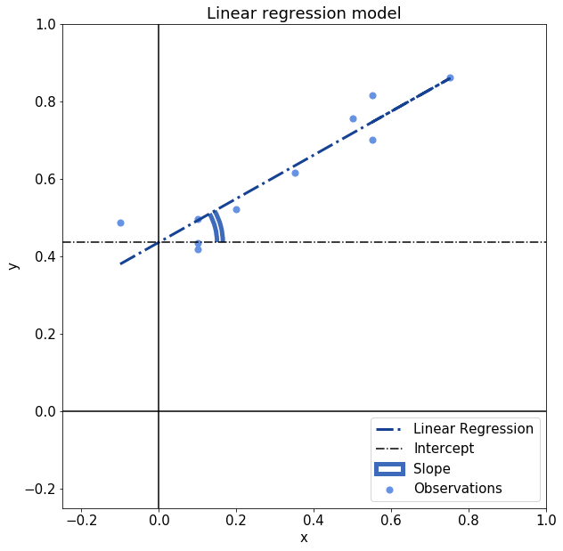
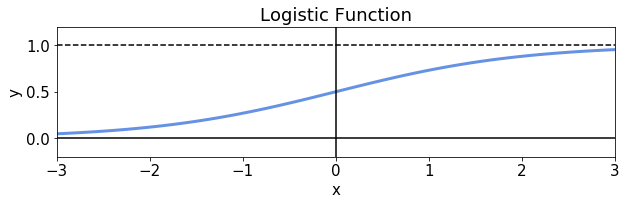
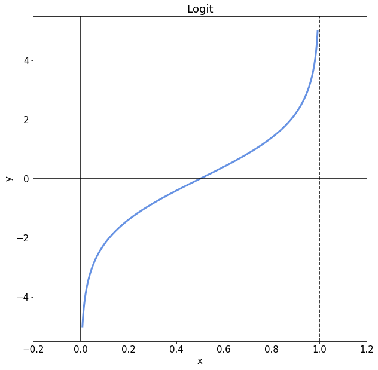

# 线性回归与Logistic回归

[数学与逻辑](https://www.baeldung.com/cs/category/core-concepts/math-logic) [机器学习](https://www.baeldung.com/cs/category/ai/ml)

[回归](https://www.baeldung.com/cs/tag/regression)

1. 概述

    在本教程中，我们将研究线性回归和逻辑回归的异同。

    我们将首先研究一般的回归概念。通过这种方式，我们将看到回归与科学中的还原论方法的关系。

    然后，我们将依次研究线性回归和逻辑回归。我们还将提出这两种回归方法在特征向量和目标变量方面的形式化。

    最后，我们将研究这两种方法在对观测变量进行回归时的主要区别。在本教程的最后，我们将了解在什么条件下我们更喜欢一种方法而不是另一种。

2. 统计学中的回归思想

    1. 还原主义和统计推断

        在科学哲学中，有一种观点认为，世界遵循的是精确和数学性质的规则。这种思想与哲学和科学一样古老，可以追溯到毕达哥拉斯，他试图将世界的复杂性简化为[数字之间的关系](http://tnt.phys.uniroma1.it/twiki/pub/TNTgroup/MyBooks/CVRPref2.pdf)。在现代，这种想法被命名为[还原论](https://en.wikipedia.org/wiki/Reductionism)，并表示试图提取规则和模式，将观察结果彼此联系起来。

        还原论下的隐含假设是，研究一个系统的子系统的行为有可能独立于整个更广泛系统的整体行为：

        
        与还原论相反的观点被称为[涌现论](https://en.wikipedia.org/wiki/Emergence)，它指出，我们只能从整体上研究一个特定的系统。这意味着，无论我们在总结和独立分析系统各组成部分的行为时有多准确，我们都永远无法理解这个系统的整体：

        
        还原论是一个强大的认识论工具，适合于[药物发现](https://www.ingentaconnect.com/content/ben/ctmc/2002/00000002/00000001/art00008)、[统计力学](https://www.sciencedirect.com/science/article/abs/pii/S0017931000003239)和[生物学的某些分支](https://link.springer.com/article/10.1007/BF00397062)的研究应用。还原论不适合研究复杂系统，如社会、[知识推理](http://www.actapress.com/Abstract.aspx?paperId=30932)的贝叶斯网络、[生物学的其他分支](https://link.springer.com/article/10.1007/s11084-005-5272-1)。

        我们可以在[回归分析](https://en.wikipedia.org/wiki/Regression_analysis)下处理任何我们可以在还原论下框架的问题，但是如果我们不能做后者，那么我们也不能做前者。

    2. 回归到底是什么？

        在讨论了回归分析的认识论前提条件之后，我们现在可以看看为什么我们要以这种方式来称呼它。回归这个词，在它的一般意义上，表示一个系统下降到一个比以前更简单的状态。由此，我们可以得到一个初步的直觉，即把回归看作是把一个系统的复杂性降低到一个更简单的形式。

        第二个直觉可以通过研究这个术语的起源，或者说是在统计分析中的首次使用来获得。在研究特别高的人的家庭的身高时，[高尔顿注意](https://projecteuclid.org/download/pdf_1/euclid.ss/1177012581)到这些人的侄子系统地倾向于平均身高，而不是更高。这导致了这样一个想法，即如果有足够的时间，变量，如身高，往往会向[平均水平倒退](https://www.ncbi.nlm.nih.gov/pmc/articles/PMC2540330/pdf/bmj00443-0055.pdf)。

        到今天为止，回归分析是统计分析的一个适当分支。这门学科关注的是对从一组分布中提取简化关系的模型的研究。线性回归和逻辑回归是本教程的两个主题，是回归分析的两个此类模型。

    3. 回归模型的组成部分

        我们可以对任何两组或更多的变量进行回归分析，无论这些变量的分布方式如何。用于回归分析的变量必须由相同数量的观测值组成，但除此之外可以有任何大小或内容。也就是说，我们不限于对标量进行回归分析，我们也可以使用序数或分类变量。

        我们选择使用的具体模型类型，正如我们将在后面看到的那样，受到我们正在研究的变量类型的影响。但不管怎样，如果我们有两个或更多的变量，回归分析总是可能的。

    4. 因果变量、独立变量和误差

        在这些变量中，其中一个变量被称为因变量。我们设想所有其他变量都采用 "自变量" 的名称，并且自变量和因变量之间存在着因果关系。或者，至少，我们怀疑这种关系存在，并且我们想检验我们的怀疑。

        换句话说，如果y描述了一个因变量，X是一个包含数据集特征的向量，我们假设这两者之间存在y=f(x)的关系。然后，回归分析让我们测试这个假设是否真实。

        我们也可以把这种关系想象成参数性的，即它也取决于X以外的项。在这种情况下，我们可以把这些项表示为alpha或A，并称它们为回归的 "参数"。在这种情况下，函数f的形式是$y=f(\alpha,X)$。

        最后，我们还可以设想，我们得出y和X值的测量结果具有测量误差的特点。我们在关于神经网络偏差的文章中讨论了测量中的系统误差问题；但在这里我们指的是随机的，而不是系统的误差类型。那么，我们可以把这种误差称为e，并把它当作与我们观察的变量无关的因果关系。

    5. 回归的一般模型

        我们最终可以为我们在回归分析中研究的变量之间的关系构建一个基本模型。因此，我们可以定义：

        - i，指的是数据集中的第i个观察点
        - y，指的是因变量
        - X，包含自变量
        - a，包含模型的一组参数
        - 最后，e表示与给定观察相关的随机误差。

        根据这些定义，回归分析确定了函数f，使$y_i=f(alpha,X_i)+e_i$。

    6. 回归的局限性

        回归分析可以告诉我们两个或多个变量是否在数字上相互关联。然而，它并不能说明我们假设的它们之间存在的因果关系的有效性。简单地说，在我们进行回归分析之前，我们假定了因果关系的假设。

        如果我们找到一个好的回归模型，这有时就是支持因果关系的[证据](https://en.wikipedia.org/wiki/Causality)。在这种情况下，我们就可以说，也许我们研究的变量是相互有因果关系的。

        如果我们没有找到一个合适的模型，我们通常会认为它们之间不存在因果关系。然而，科学文献中充满了这样的例子：一些变量被认为是有[因果关系](https://www.jstor.org/stable/687916)的，而事实上它们并没有，反之亦然。

        因此，牢记以下几点是极其重要的。在某些变量上有一个好的回归模型，并不一定能保证这两个变量有因果关系。如果我们不牢记这一点，那么我们就有可能把因果关系分配给[明显不相关](http://tylervigen.com/view_correlation?id=3994)的现象：

        
3. 线性回归

    1. 简单线性模型的公式

        让我们假设我们研究的两个变量x，y具有相等的维度，这样$|x|=|y|$。现在我们设想x和y之间存在一种线性关系，这意味着存在两个参数a,b，使得$y=ax+b$，如果对于变量x的任何元素$x_i$，那么$y_i=ax_i+b$，那么这种关系就是完全线性的。

        我们可以通过说一个模型是线性的来正式表述前面的陈述，如果：

        $\exists{a}\exists{b},\forall{x_i\in{x}},\forall{y_i\in{y}}:\ y_i = a x_i + b\ \wedge a \neq 0$

        请注意，如果a=0，这意味着y=b独立于x的任何值。那么y=b是真的还是假的问题，是独立于x的。

        因此，我们可以说，对于那个参数a=0，模型是未定义的，但是对于所有其他的$ a \in R - \{0\}$的值，模型是定义的。以下是所有线性模型的有效例子，其a和b的参数值不同：

        
    2. 从线性模型到线性回归

        现在让我们想象一下，模型并不完全适合。这意味着，如果我们为一个给定的$x_i$计算其相关的线性配对值$\hat{y_i} = a x_i + b$，那么至少有一个$x_i$使得$y_i \neq \hat{y_i}$。

        在这种情况下，我们可以计算出我们的线性模型的预测值$\hat{y_i}$和变量的观察值$y_i$之间的所谓误差。我们可以把这个误差称为$e_i = y_i - \hat{y_i}$。

        确定一个简单的线性回归模型的问题包括确定一个线性函数的两个参数a，b，使得$y_i = a x_i + b + e_i$。额外的约束是，根据某种[误差指标](https://www.baeldung.com/cs/ml-nonlinear-activation-functions#magicparlabel-11825-1)，我们希望这个误差项e尽可能的小。

        线性回归中使用的典型误差度量是平方误差之和，其计算方法是：：

        $E=sum_{i=1}^{|e|}{e_{i}^2}$。

        因此，识别两个变量x、y的线性回归模型的问题可以重新表述为寻找使平方误差之和最小的参数a、b。换句话说，这个问题变成了对以下问题解决方案的识别：

        $min(a,b)： E(a,b) = sum_{i=1}^{|x|}{e_{i}^2} = sum_{i=1}^{|x|}{(y_i - a x_i - b)^2}$。

    3. 计算线性回归的解

        这个问题的解很容易找到。我们可以首先计算参数a，如：

        $a = \frac{\sum_{i=1}^{|x|}{(y_i - \overline{y})(x_i - \overline{x})}}{\sum_{i=1}^{|x|}{(x_i - \overline{x})}}$

        其中$\overline{x}$和$\overline{y}$是变量x和y的平均值。在我们找到a之后，我们可以简单地确定$b = \overline{y} - a \overline{x}$。我们这样计算出来的两个参数a、b，对应于模型 $y_i = ax_i + b + e_i$ 的参数，使平方误差之和最小。

        还有一个直观的理解，我们可以赋予这两个参数a，b，考虑到它们是指一个线性模型。在线性回归中，以及在其相关的线性模型中，a和b分别指直线的斜率和其截距：

        
        最后，在回归分析的特定背景下，我们也可以把参数a想象成与分布x和y的相关系数r有关，根据公式$a = r\frac {S_y}{S_x}$。在这个公式中，$S_y$和$S_x$分别指的是y和x的[未校正标准差](https://en.wikipedia.org/wiki/Standard_deviation#Uncorrected_sample_standard_deviation)。事实上，相关性是指线性回归模型对两个标准化分布的斜率的另一种方式。

4. Logistic回归

    1. Logistic函数的公式

        我们现在可以像之前对线性函数那样，说出Logistic函数的公式，然后看看如何扩展它，以便进行回归分析。与线性回归的情况一样，[逻辑回归](https://www.baeldung.com/java-logistic-regression)实际上构成了为一个模型寻找参数的尝试，该模型将两个变量之间的关系映射为一个逻辑函数。

        Logistic函数是一个形式为$y = \sigma(x) = \frac{e^{x}}{e^{x}+1}$的函数，其中e表示欧拉数，x和之前的线性模型一样是一个自变量。这个函数允许将任何连续分布的变量$x \in R$中映射到开放区间（0,1）。与logistic函数相关的图形是这样的：

        
        我们所展示的logistic函数是一种sigmoidal函数。后者在神经网络的[非线性激活函数](https://www.baeldung.com/cs/ml-nonlinear-activation-functions#sigmoid-activation-functions)方面特别重要。然而，它也是[Logit](https://en.wikipedia.org/wiki/Logit)模型定义的基础，这也是我们在进行逻辑回归时试图学习的模型，我们很快就会看到。

    2. Logistic函数的特点

        由于Logistic函数的码域是区间（0,1），这使得Logistic函数特别适合[表示概率](https://www.baeldung.com/apache-commons-math#2-probabilities-and-distributions)。虽然Logistic函数的其他用途也存在，但该函数通常被用来将实值映射到[伯努利分布](https://www.baeldung.com/cs/naive-bayes-classification#a-bernoulli-naive-bayesian-classifier)的变量。

        如果一个因变量是伯努利分布的，这意味着它可以承担两个值中的一个，通常是0和1.相反，Logistic函数的输入可以是任何实数。这使得logistic函数特别适用于我们需要将域为$(\infty, -\infty)$的变量压缩到一个有限区间的应用。

        因为我们可以假定Logistic模型中的因变量是伯努利分布的，这意味着该模型特别适用于[分类任务](https://www.baeldung.com/cs/machine-learning-intro#classification)。在这种情况下，1的值对应于一个积极的类别归属。对称的是，0的值对应于不正确的分类。这又使得逻辑模型适合于进行涉及[无序分类变量](https://www.baeldung.com/cs/feature-vs-label#6-categorical-features)的机器学习任务。

    3. Logit模型

        在定义了logistic函数之后，我们现在可以将我们通常用于机器学习中的分类任务的[Logit模型](https://en.wikipedia.org/wiki/Logit)定义为logistic函数的逆。换句话说，这意味着：

        $\text{logit}(x) = \sigma^{-1}(x) = (\frac{e^x}{e^{x}+1})^{-1} = - log(\frac{1}{\sigma(x)} - 1)$

        Logit模型是伯努利分布的变量与广义线性模型之间的联系模型。广义线性模型是一个形式为$y=A X+b$的模型，这与我们上面研究的线性模型基本对应。

        在该模型中，和这里一样，A是一个参数向量，X包含自变量。然后，像Logit这样的[链接函数](https://en.wikipedia.org/wiki/Link_function)将一个分布，在这种情况下，二项分布，与广义线性模型联系起来。

        在使用Logit模型时，我们收到一个实值，该实值在模型输入的某个阈值以上返回一个正输出。这反过来又触发了分类：

        
    4. Logistically的回归

        现在的问题是，我们如何学习广义线性模型的参数A？在逻辑回归的情况下，这通常是通过[最大似然估计](https://en.wikipedia.org/wiki/Maximum_likelihood_estimation)来完成的，我们通过[梯度下降](https://www.baeldung.com/java-gradient-descent)进行估计。

        我们通过扩展上述逻辑函数的公式来定义似然函数$L(A | y, x)$。如果A是包含该函数参数的向量，那么：

        $L(A | y, x) = \prod{(\sigma_A(x_i)^{y_i})(1-\sigma_A(x_i)^{(1-y_i)})}$

        然后我们可以通过最大化这个函数的对数来继续进行回归。其原因与对数函数的单调性有关。这种单调性，实际上意味着它的最大值位于该对数参数的同一数值上：

        $Max(ln(L(A | y, x) ) = Max(L(A | y, x))$

        函数$ln(L(A | y, x)$也采用了对数可能性的名称。现在我们可以通过一步步的[回溯过程](https://www.baeldung.com/java-gradient-descent#step-step-illustration)来确定这个最大值，达到一个任意的精确程度。这是因为，对应于对数似然的最大值，梯度为零。这意味着满足这一条件的参数值可以通过反复回溯找到，直到我们对近似值感到满意。

5. 线性回归和逻辑回归的区别

    现在我们可以总结一下本文中的考虑。这让我们确定这两种回归的主要区别。具体来说，这两种模型的主要区别是：

    - 公式不同，它们所回归的函数也不同。线性回归意味着一个函数$f:R\rightarrow R$，而逻辑回归则意味着$f: R\rightarrow (0,1)$
    - 类似地，因变量的分布也不同。线性回归的代码域是${R}$，而逻辑回归的代码域是（0,1）。
    - 误差的度量，因此回归的度量也不同。线性回归通常使用平方误差之和，而逻辑回归则使用最大（log）似然。
    - 这些函数的典型用途也是不同的。我们通常在假设检验和相关分析中使用线性回归。而逻辑回归则偏重于概率的表示和分类任务的进行。
    相似之处则是这两个回归模型与回归分析的一般模型有共同之处。我们在前面详细讨论了这些，我们可以根据我们的新知识来参考它们。

6. 结论

    在这篇文章中，我们研究了线性回归和逻辑回归的主要相似点和不同点。

    我们首先分析了所有回归模型的特点和一般的回归分析。

    然后，我们定义了线性模型和线性回归，以及学习与它们相关的参数的方法。我们通过最小化平方误差之和的方式来做到这一点。

    以类似的方式，我们还定义了Logistic函数、Logit模型和Logistic回归。我们还学习了最大似然法和通过梯度下降估计逻辑回归参数的方法。

    最后，我们以简短的形式确定了这两种模型之间的主要差异。这些差异与它们的特殊特征和不同用途有关。

## 相关文章

- [ ] [Linear Regression vs. Logistic Regression](https://www.baeldung.com/cs/linear-vs-logistic-regression)
