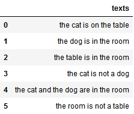
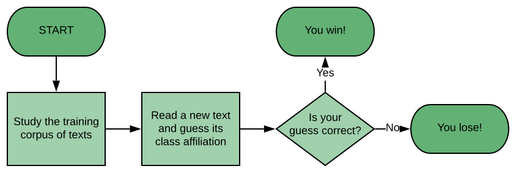
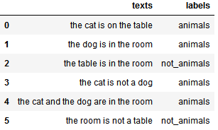
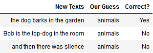
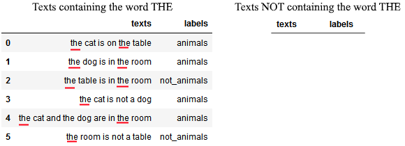
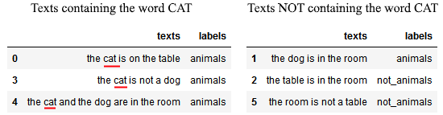
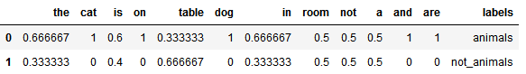
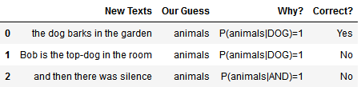
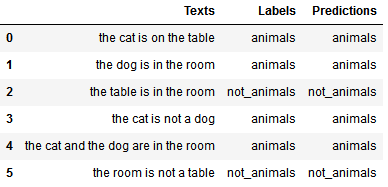

# [直觉贝叶斯分类法的简单解释](https://www.baeldung.com/cs/naive-bayes-classification)

[机器学习](https://www.baeldung.com/cs/category/ai/ml) [数学与逻辑](https://www.baeldung.com/cs/category/core-concepts/math-logic)
[奈维贝叶斯](https://www.baeldung.com/cs/tag/naive-bayes) [概率与统计](https://www.baeldung.com/cs/tag/probability-and-statistics)

1. 概述

    在本文中，我们将研究机器学习任务中的 "奈何贝叶斯分类法"（Naive Bayesian Classification）的简单解释。

    通过阅读本文，我们将了解为什么在进行任何科学预测时，了解我们自己的先验性是非常重要的。我们还将了解如何实现一个使用贝叶斯定理作为预测函数的简单伯努利分类器。

    在本文结束时，我们将对统计学中最基本的定理之一有一个直观的了解，并将看到其可能的算法实现之一。

2. 贝叶斯定理

    让我们从最基本的开始。这就是贝叶斯定理，它简单易记，是所有贝叶斯分类器的基础：

    \[P(A|B) = \frac{P(B|A) \cdot P(A)}{P(B)}\]

    在这里，A 和 B 是两个事件，P(A) 和 P(B) 是将 A 和 B 视为独立事件的两个概率，P(A|B) 和 P(B|A) 分别是给定 B 的 A 和给定 A 的 B 的复合概率。

    P(A) 和 P(B) 是这里的关键点，它们指的是 A 和 B 的所谓先验概率。

3. 什么是先验概率及其重要性？

    1. 先验概率的含义

        先验是一个拉丁语表达，意思是未经验证或未经检验，但也有假设或假定的意思。

        那么，一个事件的概率未经验证或推定意味着什么呢？让我们以下面的思想实验为例，在本文的其余部分我们将提到这个实验。我们根据下面的文本语料库玩一个猜谜游戏：

        
    2. 我们正在玩的游戏

        在这个游戏中，我们必须猜测一篇用我们不懂的语言（英语）写成的文章是否在谈论我们不懂的概念（动物）。上述语料库中的每篇文章都会谈论或不会谈论动物，在开始猜测之前，我们可以尽可能多地阅读所有文章。

        当我们开始游戏时，游戏主持人会向我们展示一篇以前从未见过的新文章，并要求我们正确猜测这篇文章是否谈到了动物：

        
        当然，任何会说英语的人都能立即辨别出哪些文本属于哪个类别，但让我们设想一下，如果我们不会说英语，因此无法依靠语义线索来完成任务。在这种情况下，我们仍然可以根据观察结果中类别和/或特征出现的频率进行简单的猜测。

        这种游戏在[自然语言处理](https://www.baeldung.com/apache-open-nlp)中被称为文本分类。我们的方法是先进行简单的猜测，然后随着对数据结构的深入了解，逐步提高猜测的复杂度。

4. 如何进行贝叶斯猜测

    1. 我们能在没有先验知识的情况下进行猜测吗？

        我们还不知道在我们阅读过的文本中，或者在我们研究的语言系统中，词类是如何分布的。记住，我们不会说英语。在这种情况下，我们缺乏与我们必须进行的预测相关的系统行为的先验知识。

        在这种情况下，没有任何先验知识，我们根本无法进行任何预测。

        这完全违背了直觉：事实上，我们可以说，一个好的猜测应该是把一半的文本归类为动物，一半的文本归类为非动物。然后，我们从均匀分布中随机抽取，并根据抽取结果以及抽取结果是高于还是低于该分布的中值来指定标签。

    2. 没有先验知识就无法预测

        不幸的是，我们不能随意这样做：否则，我们就会在系统行为上增加一个额外的假设，这相当于增加了先验知识，反过来又否定了本段的基本假设。

        这就使得为文本的类别归属分配先验概率成为进行任何猜测所需的额外假设。

        因此，没有先验知识的预测是不可能的。

        但是，由于游戏主持人明白我们的任务目前是不可能完成的，所以他们好心地为我们提供了一些额外的信息。具体来说，他们为我们提供了与我们所读文本相关的类别标签列表：

        

    3. 利用关于类别分布的先验知识进行猜测

        现在，我们可以根据刚刚获得的附加信息，对未见文本的类别归属进行基本预测：

        **猜测 1：任何新文本都属于观察到的语料库中出现频率最高的类别。**

        这个猜测很容易理解。鉴于六篇观察到的文本中有四篇谈论动物，我们推断未观察到的文本也有可能谈论动物。

        要进行这一猜测，我们不需要了解语料库的特征或它们与文本所属类别的关系，也不需要对语言有任何理解。事实上，我们可以删除上表中的文本内容，仍然可以进行预测：

        \[P(animals) = \frac{N. animals}{N. texts} = \frac{4}{6} = 0.66\]

        这个简单的预测规则是：如果你看到一个新文本，就把它归类为动物，因为这个类别出现的频率最高。因为有两个类别，而且动物类别是最可能出现的类别，所以我们总是会猜测新文本属于动物类别：

        
        预测结果并不令人满意，但我们还没有利用文本的特征，现在我们可以讨论一下这些特征。

    4. 利用关于类别和特征分布的先验知识进行猜测

        我们可以设想，并非所有的词都与同一概念相关，文本中的某些词比其他词更频繁地与目标类别（动物）相关联。

        需要注意的是，这一假设在很大程度上是任意的："这不是一篇关于动物的文章"这一文本顾名思义并没有谈论动物，但却包含了与类别标签本身相对应的单词。然而，这一假设允许我们猜测未见文本的类别，如下所示：

        **猜测 2：如果新文本中包含的单词以前在属于目标类别的文本中出现过，则新文本更有可能属于目标类别。**

        根据这一假设，我们可以继续阅读语料库中的所有文本，并根据每个单词在谈论动物的文本中出现的可能性进行评分。

        具体做法如下。首先，我们从第一篇文本的第一个词开始，即文章 THE。然后，我们将语料库分为两组，根据单词出现的情况进行分组：

        

        然后，我们可以问自己，如果一篇文章谈到动物，那么其中包含 THE 这个词的可能性有多大。方法是将贝叶斯定理中的事件 A 和 B 分别替换为事件 "文本标注为动物"和 "文本包含单词THE"：

        \[P(animals|THE) = \frac{P(THE|animals) \cdot P(animals)}{P(THE)} =\frac{1 \cdot 0.66}{1} = 0.66 = P(animals)\]

        从这里我们可以看出一些重要的信息。知道文本中出现了 "THE" 一词，并不能告诉我们任何我们不知道的关于文本的信息。更具体地说，它并没有给我们带来比用前面的猜测规则更好的猜测。

    5. 信息量更大的单词

        然后，我们继续猜第一个句子中的第二个单词，并重复同样的步骤：

        

        CAT 这个单词比 THE 这个单词信息量更大，这也是我们在了解英语的情况下可以预料到的。大多数标注为动物的文本，特别是 75% 的文本，似乎都包含了这个词。与此同时，标注为not_animals（非动物）的文本中却没有一个包含该词。

        这说明 CAT 这个词在预测文本的类别归属方面既敏感又具体：

        \[P(animals|CAT) = \frac{P(CAT|animals) \cdot P(animals)}{P(CAT)} =\frac{0.75 \cdot 0.66}{0.5} = 1\]

        这似乎是一个非常好的结果，而且比前一个结果的信息量要大得多。然后，我们可以对所有文本中的所有单词重复同样的过程。这样，我们就可以根据文本特征建立隶属类别的条件概率分布：

        

5. 对先验知识高度自信的危险

    我们可以就此打住，将上面得到的表格用作包含猜测规则的查找表。请注意，有些词隶属于动物类别的概率等于 1。

    因此，只要我们读到其中一个单词，就可以简单地将文本标记为属于该类：

    

    然而，这种对我们关于系统行为的先验知识抱有绝对信心的方法在进行预测时是极其危险的。事实上，它会导致我们忽略所有与我们拥有绝对或 100% 信心的假设相反的证据。

6. 贝叶斯定理的直观和理性解释

    1. 没有假设，就没有预测

        我们讨论的这个小型思想实验向我们展示了一些重要的东西。如果不掌握所研究系统的大量背景知识，就很难甚至不可能进行预测。

        这就引出了一个重要的问题，也是贝叶斯定理的理性主义解释的基础。除非我们对系统的一般行为有先验假设，否则我们根本无法进行任何预测。

        如果我们有了这些假设，即贝叶斯术语中的先验假设，我们就可以进行预测。这样，我们的预测就会变得与基本假设的有效性一样有效。

    2. 假设是好的，但使用要适度

        人类和机器分类器共同面临的一个微妙问题是与先验的高置信度有关的问题。通过增加先验假设的数量或可靠性，我们通常可以提高预测的准确性。然而，到了一定程度后，这就有问题了。

        更多的先验假设或对先验假设的更高信任度通常会阻碍新知识的获取。就机器学习而言，这会导致模型在训练数据集上的过度拟合，以及泛化能力的低下。

    3. 中庸之道是最佳途径

        我们可以得出以下结论。我们认识到，既要避免绝对信任我们的知识，也要避免绝对无知。我们的前进方向是对自己的知识有一定的信心，但在出现支持或反对我们知识的新证据时，仍愿意更新我们的知识。

        贝叶斯定理的这种理性主义解释非常适用于 "奈何贝叶斯分类器"。分类器在训练过程中要做的就是提出预测和假设。然后根据观察结果（训练数据集）对这些假设进行测试，并指出观察结果与预测之间的差异。

        然后，分类器会根据证据是支持还是拒绝这些假设，来增加或减少对这些假设的信心。

7. 伯努利自然贝叶斯分类器

    如果我们有兴趣在自己的模拟中试用这个语料库，下面的代码使用 Python 3+、Pandas 和 skLearn 来实现贝叶斯定理，以学习与本文文本样本语料库相关的标签：

    ```py
    import pandas as pd
    from sklearn.feature_extraction.text import CountVectorizer
    from sklearn.naive_bayes import BernoulliNB
    corpus = ['the cat is on the table','the dog is in the room','the table is in the room','the cat is not a dog','the cat and the dog are in the room','the room is not a table']
    labels = ['animals','animals','not_animals','animals','animals','not_animals']
    df = pd.DataFrame({'Texts':corpus,'Labels':labels})
    cv = CountVectorizer(token_pattern='\w+')
    BoW = cv.fit_transform(df['Texts'])
    classifier = BernoulliNB()
    classifier.fit(BoW,df['Labels'])
    predictions = classifier.predict(BoW)
    df['Predictions']=predictions
    print(df)
    ```

    

8. 结论

    贝叶斯定理指出，所有概率都是某个先验概率的条件概率。这意味着，除非有未经验证的假设作为预测的基础，否则无法进行预测。

    同时，这也意味着对先验知识的绝对自信会阻碍我们学习新知识。

    因此，前进的道路是中庸之道。在中庸之道中，我们会根据支持或反驳我们知识的新证据来更新我们的知识。
