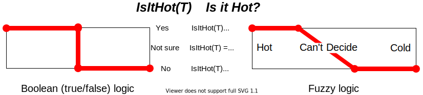

# 计算机科学中的谓词

[核心概念](https://www.baeldung.com/cs/category/core-concepts) [数据科学](https://www.baeldung.com/cs/category/ai/data-science)

1. 谓词简介

    谓词提出一个问题，答案是真或假，或者换一种说法，是或否。

    在计算机科学和数学中，这个问题以函数的形式出现。函数的结果是真或假（是或否）。同样，在数学和计算机科学中，答案的数据类型称为[布尔型](http://www.ee.surrey.ac.uk/Projects/Labview/boolalgebra/)。

    在本教程中，我们将通过一些示例更深入地讲解这些概念。

2. 简单定义

    谓词是一组参数的函数，它返回一个布尔值作为答案：

    `boolean predicate(set of parameters)`
    布尔值为 true 或 false（是或否）。函数的输入可以是我们想要的任何参数集。

    例如，如果我们有一个数字问题，如 "温度是否大于 25"，我们可以写成

    `temperature > 25`
    答案要么是 "true"（例如温度为 30），要么是 "false"（例如温度为 20）。

    如果我们把这个谓词写成 Java 中的函数，我们可以这样写

    ```java
    boolean checkTemperature(int temperature) {
        return temperature > 25;
    }
    ```

3. 布尔值和布尔表达式

    每种编程语言都有[布尔数据类型](https://en.wikipedia.org/wiki/Boolean_data_type)，每种类型都有表达 true、false 和布尔操作集的方法。

    我们可以从下表中看到一些示例：

    | Language        | data type      | TRUE   | FALSE   | Sample Expression     |
    |-----------------|----------------|--------|---------|-----------------------|
    | C, C++,C#       | bool           | TRUE   | FALSE   | x>2 && y==5           |
    | Java            | boolean        | TRUE   | FALSE   | x>2 && y==5           |
    | Java (as class) | Boolean        | TRUE   | FALSE   | x>2 && y==5           |
    | Python          | <class 'bool'> | TRUE   | FALSE   | (x>2) and (y==5)      |
    | Fortran         | logical        | .true. | .false. | (x.GT.2).AND.(y.EQ.5) |
    | Algol           | BOOLEAN        | TRUE   | FALSE   | X GTR 2 AND Y EQL 5   |

    1. 无显式布尔值

        有些语言，如 Perl、Tcl、LISP 和 SQL，没有明确的布尔数据类型。这些语言虽然没有明确说明，但使用整数、字节甚至位作为布尔数据类型的基础。从本质上讲，0 表示假，其他任何值都表示真。

        例如，在 C 语言中，布尔数据类型来自 _BOOL 数据类型。使用 bool 被认为对用户更友好。

        _BOOL 数据类型基于无符号 int。假设我们将 X 赋值为_BOOL 数据类型，如下代码所示：

        ```c
        _BOOL X;
        X = 0      /* X gets assigned 0 */
        X = 1      /* X gets assigned 1 */
        X = 5      /* X gets assigned 1 */
        X = "Hi"   /* X gets assigned 1 */
        ```

        在这里我们可以看到，当赋值不是 0 时，X 的值为 1。

4. 编程中的谓词

    1. 命令式程序中的流程控制

        在编程中，每当我们需要做出决定时，我们都需要一个谓词。

        在[命令式](https://www.ionos.com/digitalguide/websites/web-development/imperative-programming/)编程语言（如 C、Java、Python 和 Fortran 等常用编程语言）中，常见的决策语句是 IF 语句： 如果一组条件为真，则做某事；否则，做其他事。

        例如，在 Java 中，我们可以写

        ```java
        if (x > 25) {
            /* true: do something */
        } else {
            /* false: do something else */
        }
        ```

        x>25 是谓词。它是一个数字参数 x 的函数，给出的答案是布尔值，即 true 或 false。

        写成函数后，我们可以这样说（就像这个 Java 例子一样）：

        ```java
        boolean checkX(int x) {
            return x > 25;
        }
        ```

    2. 作为过滤器的谓词

        谓词可以看作是对象的过滤器。通过谓词，我们可以过滤掉一组不满足谓词的对象。

        例如，假设我们想要过滤一组名为"objects"的对象。我们的筛选条件就是函数 predicate(object) 的主体。如果 predicate(object) 为真，我们就将该对象放入过滤集；否则，我们就忽略它。

        伪代码可能如下所示：

        

        但谓词并不总是必须使用数字。例如，我们可以对一组动物进行筛选：

        `lion, elephant, parrot, whale, horse, eagle, cat, dog, human, robin, squirrel`
        如果我们想创建一组鸟类，那么我们可以使用谓词：

        `isABird(animal) := true if animal is a bird`
        最后得到的集合将是

        `parrot,eagle,robin`
        具体如何编程取决于我们对动物的表述。

        例如，我们可以将每种动物表示为矩阵 AnimalDescription 中的一组双数值。每一行代表一种不同的动物，每一列代表该动物的特定属性：

        - 0: IDOfAnimal
        - 1: TypicalHeight in meters
        - 2: TypicalWeight in grams
        - 3: TypicalSpeed in meters per second
        - 4: HasFeathers, 0.0 for no and 1.0 for yes
        - 5: CanFly, 0.0 for no and 1.0 for yes
        - 6: NumberOfLegs
        - 7: LaysEggs, 0.0 for no and 1.0 for yes
        那么，我们可以将识别鸟类的谓词表述为：

        `AnimalDescription(animal, 4) == 1`
        当然，我们要问问我们的生物学家朋友这样是否足够。

    3. 排序算法中的谓词

        排序算法的关键在于确定两个对象之间的关系。我们看到，无论采用哪种排序方法，所有算法都必须确定对象之间的关系。谓词的作用就是给出这种关系。

        通常，我们必须确定一个对象是否"greater-than"另一个对象：

        `isGreaterThan(object1,object2) := true if object1 is greater than object2`
        "greater-than"的定义取决于对象以及我们希望如何看待它们。

        例如，在前面关于动物的示例中，我们可以定义

        `isGreaterThan(animal1,animal2) := true if animal1 weighs more than animal2`
        这样我们就能得到一个从最大重量到最小重量的动物列表。

        但是，如果我们想把动物从小到大排列呢？我们可以通过

        `isGreaterThan(animal1,animal2) := true if animal weighs less than animal2`
        也就是说，即使算法需要一个"isGreaterThan"谓词，我们也可以以任何方式定义这个谓词，甚至可以用 "小于"代替 "大于"。在前面给出的示例中，我们的谓词是

        `isGreaterThan(animal1,animal2) := AnimalDescription(animal1, 2) < AnimalDescription(animal2, 2)`
    4. 排序和筛选中的面向对象谓词

        在面向对象编程中，谓词可以封装到一个定义所需函数的类中，例如 "isGreaterThan"。这样，排序或过滤算法就不仅有了要处理的对象集，而且有了包含谓词的类。

        在 Java 中，我们首先要定义一个带有该函数的抽象类：

        ```java
        class Predicate {
            abstract boolean isGreaterThan(Object x1, Object x2);
        }
        ```

        然后，排序或过滤算法将在其定义中使用该抽象类来执行其功能。它们会期待一个定义了 isGreaterThan 函数的类。

        例如，我们可以定义一个含有 addToFilteredSet 函数的 FilterObjects 类，该函数用于将过滤后的对象添加到过滤集中：

        ```java
        class FilterObjects {
            void addToFilteredSet(Set setOfObjects, 
            Set filteredSet, 
            Predicate predicate) {
                for(Object object: setOfObjects) {
                    if(predicate.isGreaterThan(object)) {
                        filteredSet.add(object);
                    }
                }
            }
        }
        ```

5. 模糊逻辑谓词

    有时，当我们问一个 "是/否"问题时，答案并不是真的 "是"或 "否"。

    也许我们无法确定，或者答案介于两者之间。例如，如果我们提出问题或设置一个谓词，用温度来回答问题：

    问题：Is the water hot?

    谓词：IsItHot(T)

    如果水是沸腾的，温度 T 为 100 摄氏度，那么答案肯定是 "是"。此外，如果水几乎结冰，例如 5 摄氏度，那么答案肯定是 "否"。

    但是，如果我们把水烧开，然后让它在室外的雪地里冷却，会发生什么情况呢？首先，水是热的，谓词的答案为真。但一小时后，水肯定是冷的，谓语的答案是假的。

    但在什么温度下，谓语的答案由真变假？是 40 度？30? 25? 例如，我们是否认为 31 度的水是热的，而突然到了 30 度水就变冷了？我们知道，水会变凉，一会儿变温，一会儿变冷。基本上，我们有一个 "不确定哪个" 的区域。

    更复杂的是，挪威的斯文（Sven）和意大利的乔瓦尼（Giovanni）对 "热" 的印象可能不同。

    这就是模糊逻辑发挥作用的地方。它提供了真假之间的渐进过渡。

    1. 模糊逻辑谓词示例

        在图中，我们定义了一个谓词 IsItHot(T)，用来回答 "它热吗？在这里，如果 IsItHot(T)=1.0 表示答案是 "是"，如果 PIsItHot(T)=0.0 表示答案是 "否"。

        在正常的布尔（真/假）逻辑中，我们看到冷热之间有一个急剧的过渡。这与我们的直觉不符。但是，模糊逻辑谓词在冷热之间有一个缓慢的过渡。答案越接近 1.0，水就越热，越接近 0.0，水就越冷。如果数值是 0.5，那么我们就真的不确定了。

        
6. 最后的话

    在本教程中，我们已经了解了谓词的定义，即结果返回布尔值的函数。

    此外，我们还看到了谓词概念在程序流程、过滤和排序中的几种用法。总之，只要有问题要问或有决定要做，谓词的概念就会发挥作用。

    我们还考虑将布尔概念扩展到模糊逻辑。我们认识到，有时我们无法做出非黑即白的决定。有时会存在灰色地带。

- [ ] [Predicates in Computer Science](https://www.baeldung.com/cs/predicates)
