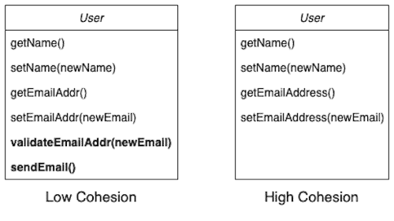
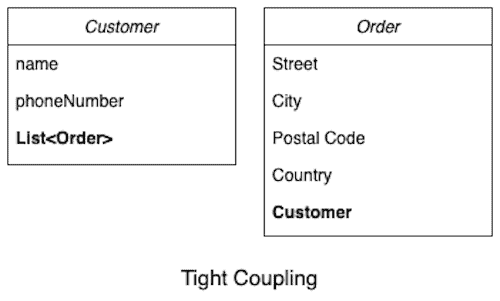
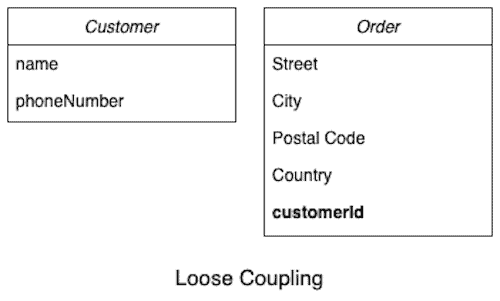

# [内聚与耦合的区别](https://www.baeldung.com/cs/cohesion-vs-coupling)

1. 简介

    内聚和耦合是设计模块化软件系统的常用概念。内聚和耦合是设计模块化软件系统的常用概念，由 [Larry Constantine](https://en.wikipedia.org/wiki/Larry_Constantine#Structured_design) 于 20 世纪 60 年代末提出，已被证明在从软件设计到软件度量等领域具有奠基性作用。它们随后成为了标准术语。

    在本教程中，我们将研究内聚和耦合以及它们之间的相互关系。

2. 内聚

    内聚性是指模块内部元素的归属程度。模块可以是一个类，也可以是一个包，甚至可以是一个微服务。简单地说，它意味着 "代码一起改变，就会保持在一起"。

    内聚度高的模块包含的元素彼此紧密相关，目的一致。例如，用户类中的所有方法都应代表用户行为。

    如果一个模块包含互不相关的元素，则称其内聚力低。例如，一个 User 类包含一个如何验证电子邮件地址的方法。User 类可以负责存储用户的电子邮件地址，但不负责验证或发送电子邮件：

    

    这应该属于其他类，如电子邮件。

    正如您所看到的，内聚的概念与单一责任原则（Single Responsibility Principle，SRP，SOLID 原则之一）密切相关，该原则规定一个类只能有一个责任。遵循 SRP 原则的模块可能具有较高的内聚性。

    1. 高内聚性的优点

        目的明确的单一模块易于理解，可读性更高。这类模块的名称明确宣布了其目的，而这类模块也正是如此。它可以帮助读者在不阅读模块每一行内容的情况下，对模块的作用建立直觉。此外，在阅读这类模块的代码时也不会出现意外。

        例如，如果 User 类包含验证电子邮件地址的代码，读者就会感到困惑。

        由于所有相关代码都在模块内，因此修改代码也更容易。例如，如果开发人员需要修改用户行为，他们可以跳转到 User 类，在一个类中完成所有修改。这将限制影响范围。相比之下，在设计中，用户行为分散在多个类中，必须对每个类进行更改才能实现所需的更改。

        测试代码更容易。由于此类模块不依赖于其他模块，因此很容易进行单元测试。此外，当修改仅限于单个模块时，构建和部署也很容易。

        对此类模块的修改不易出现错误。跨模块修改更容易出错。

        最后，它们可以重复使用。由于这类模块只承担单一职责，因此往往在有需要的地方使用。

        总之，高度内聚的模块反映了软件设计的质量。因此，在模块中寻找与主要目的没有直接关系的元素。将它们移到更符合目的的其他模块中，或创建一个新模块。

3. 耦合

    耦合是指软件模块之间相互依赖的程度。模块可以是一个类，也可以是一个包，甚至可以是一个微服务。实际上，耦合是指改变一件事需要改变另一件事。

    如果两个模块紧密相连，它们的耦合度就很高（或耦合很紧）。例如，两个具体类相互存储引用并调用对方的方法。如下图所示，客户 "和订单是紧密耦合的。客户存储的是客户下达的所有订单的列表，而订单存储的是对客户对象的引用。

    

    每次客户下新订单时，我们都需要将其添加到客户对象中的订单列表中。这似乎是不必要的依赖。此外，Order 只需要知道客户的标识符，而不需要客户对象的引用。我们可以通过这些更改使这两个类松散耦合：

    

    耦合度较低的模块之间大多是独立工作的。

    1. 低耦合的优点

        松耦合模块更易于开发和维护。由于模块之间相互独立，我们可以并行开发和测试它们。此外，它们可以在互不影响的情况下进行修改和更新。我们可以独立构建和部署这些模块，从而大大缩短部署时间。

        紧密耦合的模块很难更改。开发人员需要了解多个模块以及它们之间的关系。他们需要谨慎地对所有模块进行一致的更改。这就更容易出错。此外，我们还需要构建、测试和部署每个更改的模块，这进一步增加了开发工作量。

        紧密耦合的模块也很难测试。对单个模块进行单元测试非常困难，因为它严重依赖于其他模块。必须花费大量精力来模拟对其他模块的调用，以便对模块进行独立的单元测试。

        集成测试也很难设置。总体而言，测试是脆弱的，因为任何一个模块的变化都可能破坏测试。调试这类模块也很复杂，因为它需要运行所有依赖的模块。

        紧密耦合的模块不太可能被重用。这种模块本身不会执行任何有用的功能。因此，它很少能满足其他人重用的目的。此外，将其作为依赖模块也很困难，因为它会带来其他依赖模块。

        总体而言，松耦合反映了软件设计的高质量。因此，我们应将设计尽可能独立的模块作为目标。

4. 内聚与耦合

    内聚与耦合是相互关联的。两者都会影响对方的水平。

    高内聚与松耦合相关。一个模块的元素彼此紧密相关，只服务于一个目的，很少与其他模块交互和依赖。因此，它与其他模块的耦合度较松。

    同样，紧密耦合也可能是内聚力低的表现。由于元素分散在两个模块中，模块之间的依赖性可能很强。因此，内聚力较低。

    下面是内聚力和耦合度的快速比较表：

    |  |    内聚力                           |   耦合                   |
    |-----|--------------------------------------|-------------------------------------------------------|
    | 1   | 内聚力是指模块内部元素的归属程度。                    | 耦合是指模块之间相互依赖的程度。                                      |
    | 2   | 内聚度高的模块包含两个耦合度高的模块（或彼此紧密相关、目的一致的元素）。 | 如果模块之间联系紧密、相互依赖，则耦合度高，耦合度低；如果模块之间联系紧密、相互依赖，耦合度低，耦合度高。 |
    | 3   | 如果一个模块包含互不相关的元素，则称其内聚力低。             | 耦合度低的模块在工作时大多相互独立。                                    |
    | 4   | 高内聚性模块反映了软件设计的高质量                    | 松耦合反映了软件设计的较高质量。                                      |

5. 结论

    在本教程中，我们学习了内聚力和耦合度以及它们之间的相互关系。
