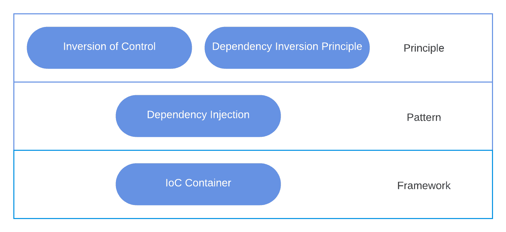

# [反转控制](https://www.baeldung.com/cs/ioc)

1. 简介

    在软件开发中，控制反转（IoC）是改变控制流管理的一个重要概念。IoC 是指颠倒传统的程序控制结构，以提高灵活性和应用程序的可测试性。

    在本教程中，我们将研究 IoC、其基础知识及其对现代软件开发的影响。

2. 基础知识

    在软件开发中，控制反转（Inversion of Control）是一种修改应用程序控制流的基本思想。此外，IoC 通过控制反转将控制责任从应用程序转移到外部框架或容器。因此，这种控制权的转换能让程序员编写出更模块化、更灵活、更易于测试的代码。

    通常情况下，软件应用程序总是具有分层控制流，由主应用程序代码定义执行顺序。然而，有了 IoC，这种控制流就发生了逆转。应用程序不再控制执行过程，而是将权力交给外部人员，外部人员通常被称为 IoC 容器。

    IoC 原则要求使用 IoC 容器来实现。IoC 容器处理应用程序中的对象实例化和[生命周期](https://www.baeldung.com/cs/process-lifecycle)以及[依赖注入](https://www.baeldung.com/cs/dependency-injection-vs-service-locator)。通过使用此类容器，开发人员可以实现控制反转，而无需进行任何手动布线：

    

3. 关键概念

    在影响软件开发的各种原则中，控制反转是改变应用程序制作和设计方式的重要原则。让我们探讨 IoC 的一些关键概念，并评估它们如何有助于构建稳健、[可维护](https://www.baeldung.com/cs/maintainability-killers)的软件解决方案。

    1. 组件解耦

        在应用程序中，IoC 的目标之一是解耦组件，以尽量减少依赖性并增强模块性。传统的软件系统将组件紧密耦合，这意味着它们严重依赖彼此的具体实现。因此，这会导致系统变得脆弱，无法轻易更改或扩展。

        然而，通过 IoC，我们的目标是用松散耦合取代紧密耦合，允许组件通过定义明确的[接口](https://www.baeldung.com/cs/program-to-interface)而不是具体实现进行接口。

        通过解耦其组成组件，IoC 可确保软件系统变得更加灵活、可扩展，并在未来更易于维护。

    2. 依赖性管理

        依赖性管理是控制权反转的另一个基本因素。在传统的软件开发中，组件通常是通过其依赖关系来创建和管理的，从而导致代码紧密耦合在一起。

        与此相反，IoC 依赖性管理则通过 IoC 容器或其倡导的框架实现外部化。此外，IoC 容器承担对象的创建和生命周期，并在必要时解析和注入其依赖关系。

        因此，通过集中化的依赖关系管理，IoC 可以更容易地构建和配置复杂的软件系统，同时鼓励可重用性和可测试性。

    3. 框架和容器

        利用专门的 IoC 框架和容器，软件应用程序可以轻松实现控制反转。它们充满了预定义的模式、约定和机制，可管理依赖性、协调组件生命周期并实现组件间通信。

        一些例子包括 Java 中的 Spring Framework、.Net 中的 ASP.net Core 和 TypeScript 中的 Angular Dependency Injection。通过使用 IoC 容器或框架，开发人员可以加快开发时间，提高代码质量，同时构建健壮、可扩展的应用程序。

4. IoC 与传统流程

    比较反转控制与传统控制流，需要了解这两种方法如何管理软件设计中的控制流和依赖关系。在 IoC 中，框架或容器控制应用程序的流程，调用开发人员编写的代码。

    这种方法通常被比作 "好莱坞原则(Hollywood Principle)"--"不要呼叫我们，我们会呼叫你"。另一方面，传统流程需要应用程序代码控制流程，明确创建和管理对象及其生命周期。

    1. 依赖关系管理

        在依赖关系管理方面，IoC 通常是在运行时由外部控制器或容器向类注入依赖关系。这就使类与其依赖关系脱钩，从而实现了更灵活的模块化设计。

        相反，在传统流程中，类通常会直接实例化其依赖关系，从而导致组件之间的紧密耦合。这可能会降低系统的灵活性和维护难度，尤其是当系统的规模和复杂性增大时。

    2. 可测试性

        IoC 还具有[可测试性](https://www.baeldung.com/cs/software-quality#7-testability)方面的优势，因为它便于用[模拟或存根](https://www.baeldung.com/cs/faking-mocking-stubbing)替换真实的依赖关系。这是因为依赖关系是外部提供的，因此可以更简单地隔离代码单元以进行测试。

        另一方面，在传统流程中，由于组件之间的紧密耦合，测试可能更具挑战性，这使得隔离单元进行测试变得更加困难。

    3. 模块化和可维护性

        在模块化和可维护性方面，IoC 通过解耦组件促进了更模块化的设计，使系统更灵活、更易于长期维护。不过，引入 IoC 容器或框架会增加项目的复杂性，对于不熟悉这一概念的人来说，学习曲线会很明显。

        相比之下，在传统的控制流系统中，模块化指的是将代码组织成独立的功能单元。然而，组件之间的紧密耦合会给维护工作带来挑战。修改一个部分往往需要修改多个模块，这增加了出错的风险，也使更新变得复杂。

    4. 配置开销

        IoC 和传统控制流都有各自的配置和开销。管理 IoC 容器可能会引入配置开销，这取决于采用的方法（如注解、XML 配置）。

        相反，传统控制流需要的外部配置较少，因为依赖关系和控制流是直接在代码中管理的。最终，在 IoC 和传统流程之间做出选择取决于项目的具体需求和限制，以及团队对这些概念的熟悉程度。

5. 优点和缺点

    反转控制是一种设计原则，它翻转了软件架构中的控制流，从而提供了一种细致入微的管理依赖关系的方法。下文将讨论其优缺点：

    | 优点                       | 缺点                                  |
    |--------------------------|-------------------------------------|
    | 可在运行时动态绑定依赖关系，提高配置灵活性。   | 利用 IoC 可能需要学习新的框架或库，从而使较小的项目或团队复杂化。 |
    | 代码管理和更新更容易，所需的系统变更更少。    | IoC 可能会模糊执行流程，使系统操作难以掌握。            |
    | 注入依赖关系可简化测试，让模拟对象取代真实实现。 | 有些 IoC 框架提供动态配置更改，但限制直接更改依赖关系。      |
    | 促进类之间的松耦合，使系统更模块化。       | 有些框架使用反射进行动态实例化，这可能会导致性能损失。         |

6. 结论

    在本文中，我们讨论了控制反转的概念，揭示了它如何增强软件开发。值得注意的是，IoC 不仅有助于构建更具模块化和可测试性的代码，还能通过依赖关系管理实现更好的灵活性。

    尽管 IoC 有其复杂性和初始学习曲线，但它因倡导去耦合组件而备受关注，从而简化了开发工作流程。尽管如此，我们仍应考虑其优势与劣势，如项目复杂性增加、直接控制减少等。通过关注项目的需求和目标，实施 IoC 可能会改变游戏规则。
