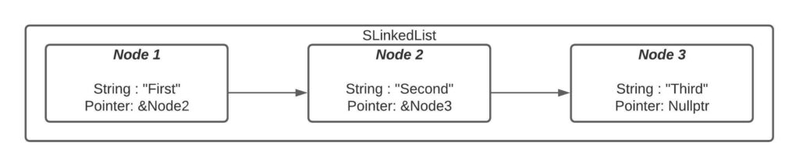
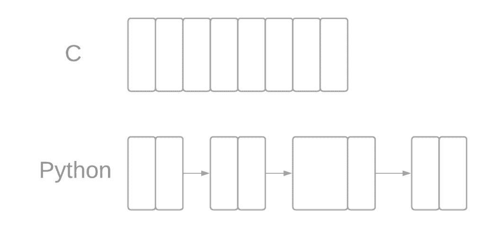

# [数据结构语言](https://www.baeldung.com/cs/languages-learn-data-structures)

编程

链接列表

1. 简介

    计算机科学中的数据结构和算法至关重要，因为这些概念在编程中发挥着关键作用。大多数软件程序都会使用这些概念来处理数据，因此，学习这些方法对于正确理解代码至关重要。

    为了学习和实现这些概念，我们可以选择多种不同的编程语言，每种语言都能完成必要的任务。为了选择最适合我们需要的工具，本教程将讨论数据结构背后的主要思想，以及这些思想在当今最流行的编程语言中的应用。

2. 概述

    数据结构是一种以数学方式组织计算机内存空间的方法，可以高效地访问其中的值。因此，数据结构和算法经常被放在一起讨论，因为结构的创建和删除是通过算法精心指导的。大多数情况下，我们会使用一些方法来实现数据结构最基本的任务。这些任务可分为以下几类：

    - 插入
    - 删除
    - 搜索元素

    为了完成这些任务，我们使用指针和动态内存分配来管理内存。在面向对象编程中，内存管理通常是通过构造函数和析构函数在类级别上完成的。这种在不需要时释放已使用空间的一般想法被称为垃圾回收。在理想情况下，我们会努力形成高效的算法，只更改完成任务所需的内容。

    最后，可以通过时间和空间复杂性分析来计算这些操作的效率。

3. 简单链接表

    需要注意的是，不同的编程语言各有优缺点。我们将通过用最常见的编程语言实现一个简单的 3 个项目的简单链表来证明这一点，并详细说明它们之间的差异。该链表是一种由数据节点组成的基本数据结构。每个节点都包含一些信息和指向下一个节点的指针。

    我们将只介绍结构的构造，而不涉及完整实现所需的许多其他功能，如插入、删除、检查列表大小等。

    我们的结构如下

    

    1. C

        我们将从一种要求明确指定所有变量和对象类型的强类型语言开始。它常用于嵌入式系统、数据库和驱动程序开发。

        首先，我们可以构建主函数。因为 C 语言不是面向对象的，所以我们可以使用结构来代替定义类。下面是我们的 Node 和 LinkedList 结构的示例：

        ```c
        typedef struct node_t {
            char * data;
            struct node_t * next;
        } node;
        typedef struct SLinkedList {
            node* head;
        } linkedList;
        ```

        然后，我们可以将这些节点连接起来：

        `node1->next = node2;`

        通过这些指令，我们可以创建一个 LinkedList 结构，并让其头部指向第一个节点。

        C 语言要求我们在编码时要明确，这使它成为想要从头开始学习如何实现的人的理想语言。不过，C 语言不是面向对象的，它要求我们在后面的代码中手动取消分配我们用掉的内存；这里没有垃圾回收。还要注意的是，我们必须加入处理字符串的库。

    2. C++

        这种语言被广泛应用于许多操作系统，以及高效视频游戏和机器学习工具的制作中。这意味着 C++ 支持抽象、多态、封装和继承。

        因此，我们可以用类来取代结构。这样做的好处是，我们可以将分配和取消分配内存空间的函数放在构造函数和析构函数中。这些函数用于生成和销毁我们的对象，并且会被自动调用。

        此外，由于 C++ 支持封装，我们还可以定义公共和私有规范器。这就为我们的变量增加了访问控制。我们的节点类可以如下所示

        ```c++
        class Node {
        public:
            char * data;
            Node* next;

            Node() {
                data = NULL;
                next = NULL;
            }
        
        };
        ```

        还有 LinkedList

        ```c++
        class SLinkedList {
        public:
            SLinkedList(Node* firstnode) {
                head = firstnode;
            }
        private:
            Node* head;
        };
        ```

        请注意，头部指针只能通过 SLinkedList 类的构造函数访问，因为它被置于私有状态。相反，由于我们的实现并没有封装 Node 的下一个变量，因此可以通过为其赋值来破坏链表。

        我们可以看到，C++ 的语法与 C 比较相似，但也有一些例外。C++ 仍然是强类型的，但比 C 语言更简洁。

    3. Java

        Java 是一种基于 C++ 的高级语言。它与 C++ 用于相同的领域，我们也可以看到其语法非常相似。需要注意的是，这种语言从一开始就包含了更多的函数，而不需要包含任何外部库。

        在这种语言中，我们也无需包含任何库来处理字符串。我们可以像在 C++ 中一样，通过定义一个类来开始我们的代码。这一次，我们可以将 Node 类嵌套在 LinkedList 中：

        ```java
        class SLinkedList {
            class Node {
                string data;
                Node next;
                Node(string d) {
                    data = d; 
                }
            }
            SLinkedList (Node start) {
            head = start;
            }
        }
        ```

        我们可以直接在类中实现构造函数。如果我们为节点创建类，并在其构造函数中包含文本，就可以使用 new 关键字定义它们。然后，在实现链接列表时，我们可以再次使用这个关键字：

        `SLinkedList mylist = new SLinkedList(new Node ("First"));`

        最重要的是，所讨论的基于 C 的语言（C、C++、Java）非常适合软件的跨平台实施，因为大多数机器的操作系统中已经包含了所需的运行时。

    4. Python

        Python 是另一种高级语言，被广泛应用于从机器学习到网络应用的各个领域。由于 Python 是一种松散类型的语言，因此我们不需要指定这个使用指针，那个使用字符串。

        就像使用 Java 一样，我们不需要导入任何东西就能使用字符串。

        首先，我们可以定义一个类：

        ```python
        class Node:
            def __init__(self, dataval = None):
                self.dataval = dataval
                self.nextval = None
        ```

        值得注意的是，这里的缩进非常重要，它定义了函数的顺序。

        我们还可以在构造函数中直接定义默认值。然后，我们只需调用构造函数就能创建 Nodes 和 SLinkedList：

        ```python
        Node1 = Node("First")
        List1 = SLinkedList(Node1)
        ```

        最后，我们可以通过将下一个节点赋值给对象来链接节点：

        Node1.nextval = Node2

        这样的语法简单明了，易于理解。值得注意的是，每条指令后面不需要分号，代码的缩进也很重要，因为它们定义了函数和循环的结构。我们也不需要使用任何命令来管理内存空间，因为构造函数和析构函数会分配和释放内存。Python 会为我们做大部分的垃圾回收工作。

        这意味着，Python 是一种能简化我们很多工作的语言，它有利也有弊。

        例如，Python 中的数组会自动被视为链表。因此，我们可以在同一个数组中添加任何不同的数据类型；它只是保存一个指向不同内存空间的指针。而在 C 语言中情况并非如此，因为数组只能在连续的内存空间中保存相同类型的元素。在 C 语言中，访问内存的速度要快得多，但代价是不能插入不同的数据类型：

        

        这就意味着，如果我们不想定义任何类，或者不想从头开始实现这个链表，那么完全等价的内容可以归纳为一行：

        Positions = ["First","Second","Third"]

        此外，我们还可以使用各种不同的预定义方法来获取数组的长度、追加、计数、移除或插入。

    5. Javascript

        Javascript 是一种编程语言，主要用于网络开发。这种语言比 Python 更注重细节。

        我们可以先声明我们的类：

        ```js
        class Node {
            constructor(text) {
                this.position = text;
                this.next = null;
            }
        }
        class LinkedList {
            constructor(head = null) {
                this.head = head
            }
        }
        ```

        我们可以从上面的代码片段中看到，我们必须使用括号来定义函数，并使用分号来结束机器的每一条指令。与其他语言相比，构造函数的定义相当明确。我们也不必在构造函数之前定义 position 或 next。

        与 Java 一样，创建节点的语法也与 C++ 类似：

        `let node1 = new Node("First");`

        最后，我们还可以看到，我们使用 new 关键字管理内存空间，就像在 C++ 中一样，而在 Python 中并非如此。

4. 总结

    如前所述，所有这些语言都能执行基本的数据结构任务。为了挑选出最佳语言，讨论一下我们计划编程的具体内容和方式是很有帮助的。现在，我们对每种语言都有了更广泛的了解，可以更准确地做出决定。

    如果我们关心的是

    - 对每个基本过程有非常精确的、低层次的理解，或者我们想使用嵌入式系统： C
    - 机器学习： C++ 或 Python
    - 网络： Javascript 或 Python
    - 游戏开发： C++、Java 或 Python
    - 易于编写、问题少、垃圾回收多的语言： Python

    总之，下面的表格对不同语言进行了比较：

    | 语言         | 简洁性  | 垃圾收集 | 问题 | 内存控制 | 了解基本流程 |
    |------------|------|------|----|------|--------|
    | C          | 完全没有 | 无    | 许多 | 全屏   | 完整     |
    | C++        | 完全没有 | 通过类  | 许多 | 满    | 彻底     |
    | Java       | 有点   | 通过类  | 一些 | 几乎满  | 全面     |
    | Python     | 非常   | 完全   | 极少 | 少量   | 部分     |
    | JavaScript | 有点   | 通过类  | 很少 | 几乎满  | 彻底     |

5. 总结

    还有很多其他语言我们没有在本文中提及，比如 Go 和 Swift。不过，其中许多语言在语法上与 C 或 C++ 相似。因此，了解上述语言可以为我们学习其他语言提供一个良好的开端。最重要的是，我们要有所起步！
