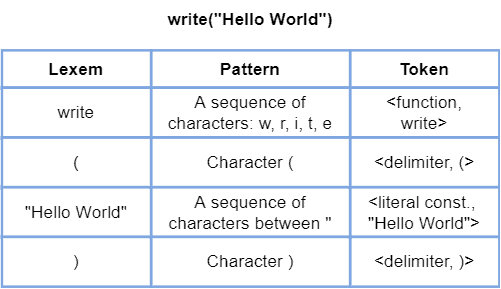
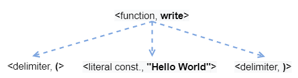

# [编程语言：词典与语法与语义](https://www.baeldung.com/cs/lexicon-vs-syntax-vs-semantics)

编程

编译器和链接器

1. 简介

    在本教程中，我们将学习编程语言的组织结构。与自然语言一样，编程语言使用一组被认为有效的单词。此外，编程语言还规定了如何在源代码中处理这些单词的规则。因此，编程语言必须能够判断所编写的代码是否代表有效的逻辑语句。

    因此，编程语言的词典、语法和语义为程序员提供了如何在源代码中表达和正确执行多种操作的信息。

    在下面的章节中，我们将首先从广义上理解什么是语言词典、语法和语义。然后，我们将了解这些概念如何实际映射到编程语言中。最后，我们将对所探讨的概念进行总结，并提出结束语。

2. 通用语言的组织

    也许，当我们用母语思考或交谈时，并没有注意到母语的正式程度。其实，这是正常的行为。自然学习一门语言的过程中，正式的学习和练习要少得多。

    然而，学习第二语言通常会使语言的形式结构更加清晰。在这种情况下，对语言的词汇、句法和语义的学习是非常明确的。

    但问题是：什么是语言词汇、句法和语义？

    简而言之，语言词典包括一整套可用术语。实际上，我们可以把词典看成一本字典。这本字典包含了语言使用者所使用和识别的每一个单词。

    反过来，语言的句法则代表了我们将词库中的单词组合在一起的可能方式。因此，谈论语法就是在谈论用特定语言造句的明确规则。

    然而，即使是公认的单词，在一个有效的句子中也不能保证它们在现实世界中是有意义的。反过来，语言的语义则表明句子对于听者或读者是否有具体的表述。

    程序设计语言特别关注其词汇、语法和语义。这是因为在表达计算机指令时必须准确无误（没有歧义）。

    因此，在接下来的章节中，我们将探讨这些概念在编程场景中的应用。

3. 编程语言的组织

    与自然语言类似，学习编程语言也包括了解其形式结构和组织。

    因此，概括地说，编程语言的词库列出了该语言所采用的单词保留列表。这些单词反过来又是我们用来编码命令和创建数据结构的。

    程序员编写的单词被称为词目。然而，词目要与预定义的模式相匹配，从而被识别为编程语言的标记（我们称之为词法分析）。让我们来看一个简单的伪代码示例：

    

    此外，我们还有一个与特定程序（源代码）相关的特定词典。因此，除了编程语言的标准保留词表外，程序词库还包括其他专门为其定义的词，如变量名和函数名。

    然而，执行命令、创建数据结构和使用通用编码资源通常需要的不仅仅是一个词，而是一堆词。这样，为实现编码目标而正确使用可用单词的规则就形成了我们所熟知的编程语言语法。

    如果一个编程语句在词法和语义上都是有效的，我们就可以编译/解释它。但是，如果语义无效，我们就可能在程序执行过程中出现意外或错误的行为。

    在实践中，语法分析会将词法分析中确定的标记处理成一棵派生树。让我们来看一个例子：

    

    编程语言中的语义是指在给定源代码的上下文中，哪些语义实际上是合理的，哪些是不合理的。

    例如，一些常见的语义错误包括在算术表达式中使用未初始化的变量，或在函数中的返回操作后立即添加操作。

    值得注意的是，不同编程语言的词库、语法和语义中的单词和规则的数量和格式可能各不相同。这取决于这些语言的几个技术方面，如语言是静态类型还是动态类型。

    除了语义学在编程中的传统含义外，这个词还用于其他计算环境，如网络应用。在这种情况下，语义的两种应用就是语义网和语义社交网络。让我们来探讨一下这些概念：

    - 语义网(Semantic Web)：语义网的主要目标是为万维网上的所有事物和所有地方添加有意义的元数据。这样，访问在线数据的机器就能根据这些元数据对不同来源的异质实体进行关联和分类。
    - 语义社交网络(Semantic Social Networks)：这一概念决定了语义网在在线社交网络中的应用。这些语义社交网络已被用于（实验性地）使分散组织之间的协作变得更加容易。

4. 系统总结

    与自然语言类似，编程语言也包含规则和形式结构。因此，要在源代码中编写正确的语句，我们需要考虑这些规则和结构，它们定义了源代码的词库、语法和语义。

    首先，词典决定了编程语言所能识别的单词（我们可以将词典视为一种字典）。编程语言的语法则说明如何组织词典中的单词来创建有效语句。最后，编程语言的语义负责检查语句在程序源代码的大背景下是否有意义。

    下表总结了编程语言词典、语法和语义的特点：

    |      | Lexicon（词典）                        | Syntax（语法）                    | Semantics（语义）                               |
    |------|------------------------------------|-------------------------------|---------------------------------------------|
    | 概要   | 可识别的语言词汇（字典）               | 创建有效语句的结构                     | 语句在特定语境中的逻辑使用                               |
    | 分析代理 | Lexer（词典）/Interpreter/（解释器）          | Compiler/Interpreter（编译器/解释器） | Compiler（编译器）/Interpreter (部分) |
    | 分析要素 | Lexems; Patterns; Tokens（词目；模式；标记） | Derivation tree（派生树）          | —                                           |

5. 结论

    在本文中，我们研究了词法、语法和语义在计算机，尤其是编程语言中的含义。首先，我们研究了词法、句法和语义的一般概念。然后，我们具体研究了这些概念在编程语言中的作用。最后，我们对所研究的概念进行了系统的总结比较。

    我们可以得出这样的结论：词法、句法和语义在编程语言中起着至关重要的作用。当然，编程语言还有许多其他方面没有在本教程中探讨。但是，词典、句法规则和语义是任何语言的核心资源，其他技术方面的内容都是通过它们来表达和执行的。
