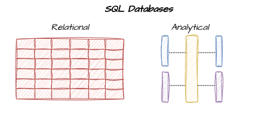
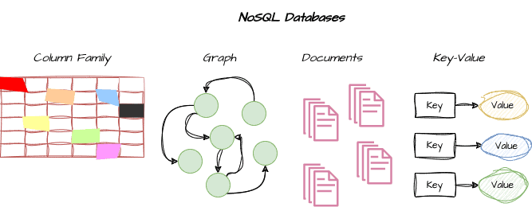

# [SQL 与 NoSQL 的区别](https://www.baeldung.com/cs/sql-vs-nosql)

1. 引言

    数据库是存储、组织、管理和检索海量数据的核心机制，因此在计算机科学中发挥着重要作用。

    数据库管理系统有两种基本类型： [SQL](https://www.baeldung.com/sql-joins) 和 [NoSQL](https://www.baeldung.com/spring-boot-nosql-database)。

    在本教程中，我们将研究 SQL 和 NoSQL 数据库的属性，并提供一份指南，帮助大家在两者之间做出选择。

2. SQL 数据库

    SQL（结构化查询语言）数据库通过保持强大的数据一致性和支持复杂事务来提供准确的信息。它们非常适合需要有组织数据和高度数据完整性的操作，因为它们采用统一的方法，可以与各种框架和平台配合使用：

    

    SQL 数据库也是一种关系模型，它将信息划分为具有行和列的表格。这种数据库类型会创建一个默认模式，解释数据结构和关系。SQL 数据库使用强大的 SQL 语言查询、更改和管理数据。[MySQL](https://www.baeldung.com/java-connect-mysql)、[PostgreSQL](https://www.baeldung.com/spring-boot-postgresql-docker) 和 [Oracle](https://www.baeldung.com/spring-oracle-connection-pooling) 是最流行的 SQL 数据库。

    1. SQL 数据库的特点

        采用模式(schema)是 SQL 数据库的最初特征。模式描述了数据库的结构，包括表、列、数据类型和表间关系。这一关键特性可确保数据的一致性，并实现快速搜索和索引。

        此外，SQL 数据库还得益于 SQL 语言的广泛采用和支持。SQL 允许开发人员使用单一的语法来构建查询、执行复杂的[连接](https://www.baeldung.com/sql-joins)和修改数据，同时还有大量的工具、库和框架来促进数据管理、报表和分析。

        此外，SQL 数据库还提供 [ACID](https://www.baeldung.com/cs/transactions-intro) 属性（原子性、一致性、隔离性和持久性），可确保数据完整性和事务可信性。原子性确保事务作为一个单一的单元处理，要么完全完成，要么在发生故障时完全逆转。数据库的一致性保证了在事务处理之前和之后，数据库都处于合法状态。隔离性确保同时进行的操作不会相互冲突。最后，耐久性确保事务一旦被记录，即使系统发生故障，它也会继续存在。

3. NoSQL 数据库

    NoSQL 数据库的意思是 "不仅仅是 SQL"，表明这些数据库并不局限于传统的关系模型。在数据结构可以多种多样的情况下，这类数据库表现出色，处理动态、非结构化或半结构化数据的能力至关重要：

    

    NoSQL 数据库的一个主要优点是具有横向扩展能力，可以有效处理海量数据和高流量负载。它们通过将数据分散到众多集群节点上实现这种可扩展性，从而可以同时进行处理。

    NoSQL 数据库支持高于稳健一致性的可用性，提供所谓的 "最终一致性"。这意味着数据库修改可能需要一段时间才能在所有节点上传播，从而提高了可用性、可靠性和容错性。

    开发人员可以轻松管理和分析各种数据类型，并通过选择适当的 NoSQL 数据库类型来扩展应用程序，以应对不断扩大的数据量。

    1. 典型的 NoSQL 数据库

        [面向文档的数据库](https://www.baeldung.com/java-orientdb)将数据存储在灵活、自编码的文档（如 JSON 或 XML）中，可以快速修改而不会影响整个数据库。它们通常擅长处理分层数据结构。

        另一方面，键值存储将数据存储为简单的键值对，为高性能应用提供可观的性能，主要用于高流量网络应用。

        此外，另一种常见的 NoSQL 数据库是列式数据库，它以列而不是行的形式存储数据，因此适用于涉及在大型数据集中搜索特定属性的分析工作负载。

        此外，图数据库侧重于实体间关联的存储和搜索，因此适用于复杂网络或社交网络、推荐引擎或欺诈检测。

        NoSQL 数据库的典型例子包括 [MongoDB](https://www.baeldung.com/spring-data-mongodb-tutorial)、[Cassandra](https://www.baeldung.com/cassandra-with-java)、[Redis](https://www.baeldung.com/spring-data-redis-tutorial) 和 [Neo4j](https://www.baeldung.com/spring-data-neo4j-intro)。

        3.2. NoSQL 数据库的特点

        NoSQL 数据库的显著特点是灵活的模式，可实现灵活、动态的数据结构。NoSQL 数据库提供多种结构，适合数据模型不断发展或处理非结构化或半结构化数据时使用。这种灵活性消除了代价高昂的模式转换，实现了快速原型设计和重复使用。

        可扩展性是 NoSQL 数据库的另一个重要特点。这些数据库旨在处理大量的

        可扩展性是 NoSQL 数据库的另一个重要特点。这些数据库旨在处理大量数据和高流量负载，因此具有高度的横向扩展性。NoSQL 数据库将数据分布在集群中的多个[节点](https://www.baeldung.com/cs/computer-clusters-types)上，因此，它们可以适应数据和用户需求的增加以及并行处理。

        此外，NoSQL 数据库的另一个特点是 "最终一致性"，这意味着与严格的数据一致性相比，更倾向于可用性和分区容差。这种权衡可以实现高可用性和容错性，因为即使出现网络分区或节点故障，系统也能继续运行。

        最后，NoSQL 数据库在设计时通常会考虑到特定的用例。

4. SQL 与 NoSQL 数据库

    了解 SQL 和 NoSQL 数据库的优缺点至关重要，因为它们都能满足特定的应用需求。

    需要稳健的数据完整性、有组织的数据模型和复杂事务的应用程序最适合使用 SQL 数据库。在涉及金融系统、电子商务平台和传统企业应用的情况下，SQL 数据库的表现尤为出色，因为在这些应用中，数据完整性和可靠性至关重要。

    另一方面，对于需要高扩展性和适应性数据模型的程序来说，NoSQL 数据库是更好的选择。它们在内容管理系统、实时分析和社交媒体平台等应用中表现出色，在这些应用中，动态数据结构包括大量非结构化或半结构化数据。

    下表重点介绍了它们的主要区别：

    | SQL Databases     | NoSQL Databases         |                               |
    |-------------------|-------------------------|-------------------------------|
    | 数据模型(Data Model)  | 关系型（表格、行、列）             | 文档、键值等                        |
    | 模式(Schema)        | 默认固定格式                  | 灵活、无模式                        |
    | 语言                | 标准 SQL                  | 根据数据库类型而异                     |
    | 可扩展性(Scalability) | 纵向扩展                    | 横向扩展                          |
    | 使用案例(Use Cases)   | 复杂事务、结构化数据              | 非结构化和半结构化数据                   |
    | 实例                | MySQL、PostgreSQL、Oracle | MongoDB、Cassandra、Redis、Neo4j |

5. 结论

    本文讨论了 SQL 和 NoSQL 数据库。

    是选择 SQL 数据库和 NoSQL 数据库，还是选择结合两者优势的混合方法，最终取决于应用程序的具体要求和数据。必须考虑数据一致性、可扩展性需求、开发速度、灵活性和生态系统支持。
