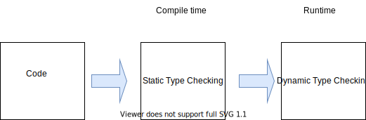

# [静态类型语言与动态类型语言](https://www.baeldung.com/cs/statically-vs-dynamically-typed-languages)

编程

编译器和链接器

1. 简介

    在本教程中，我们将探讨静态类型语言和动态类型语言。我们将介绍它们是什么，以及它们的用途。我们还将讨论它们之间的异同。

    这两个术语指的是编程语言的一些基本属性，它们定义了编程语言如何处理不同数据类型的变量。

2. 定义

    在进一步讨论之前，我们先来定义一些关键字。编程语言中的数据类型是指定义数据元素值性质的特征。一些常见的例子包括字符串、整数、字符和布尔。

    每种编程语言都有一套系统来检查值是否被分配了正确的类型，这就是所谓的类型检查。类型检查在编程中是必不可少的，它可以最大限度地减少程序执行过程中的错误。这通常发生在运行时或编译时。在大多数编程语言中，类型检查分为静态和动态两类：

    

3. 静态类型语言

    在静态类型编程语言中，类型检查在[编译时](https://www.baeldung.com/cs/compile-load-execution-time#compile-time)进行。在编译时，特定编程语言的源代码会被转换成机器可读的格式。这意味着在编译源代码之前，必须知道与每个变量相关的类型。

    属于这类编程语言的一些常见例子有：Java、Haskell、C、C++、C#、Scala、Kotlin、Fortran、Go、Pascal 和 Swift。

    1. 特点

        这些语言中的大多数都要求程序员在声明变量时明确说明每个变量的数据类型。相比之下，其中一些语言没有这一要求，而是实现了类型推断，即由语言系统确定与特定变量相关的具体数据类型。

        这类编程语言的另一个显著特点是，一旦发现变量与数据类型关联中的错误，编译过程就会停止，直到错误被纠正为止。例如，请看下面的变量赋值。假设我们要声明 varA 和 varB 这两个变量，前者是整数，后者是字符串：

        ```txt
        Integer varA = "hello"
        String varB = "cat"
        ```

        在上面的赋值语句中，第一行会出错，因为我们试图将字符串 hello 赋值给一个整型变量。第二个变量赋值将通过，因为字符串 cat 被赋值给了一个字符串变量。

        此外，声明为特定数据类型的变量不能赋值给其他变量。例如，在上面的示例中，varB 是一个字符串变量，以后不能将其更改为整数值。

        此外，由于类型检查是在编译时进行的，因此能更快地发现程序中的类型错误并及早解决。因此，由于类型检查已经完成，此类程序在执行时的性能通常会更好。

4. 动态类型语言

    相反，在动态类型语言中，类型检查是在[运行时](https://www.baeldung.com/cs/runtime-vs-compile-time#runtime)或执行时进行的。这意味着只有在程序执行时才会对变量进行类型检查。属于这一类的编程语言有 Python、JavaScript、Lisp、PHP、Ruby、Perl、Lua 和 Tcl。

    1. 特点

        这类编程语言不要求在变量声明时明确说明数据类型。语言系统能够在运行时检测变量的类型。例如，这类语言的变量声明和赋值如下：

        `varC = 5`

        现在，在我们的例子中，varC 被赋值为 52。与上例相比，我们不必指定与变量相关的数据类型。此外，还允许更改以前声明的变量的数据类型。

        例如，如果我们想把 varC 的值从整数改为字符串，就不会出现任何错误。此外，由于变量类型可以是动态的，程序员在编写程序时就有了更大的灵活性。尽管如此，由于每个变量的类型信息都必须在运行时进行检索，因此执行速度有减慢的趋势。

5. 差异

    主要区别如下：

    |静态类型语言        |动态类型语言                |
    |---------------|-----------------------|
    | 类型检查在编译时完成    | 类型检查在运行时完成            |
    | 通常需要明确的类型声明   | 无需明确声明                |
    | 更早地发现错误       | 类型错误可在执行过程中检测到        |
    | 变量赋值是静态的，不能更改 | 变量赋值是动态的，可以更改~       |
    | 产生更优化的代码      | 产生的代码优化程度较低，运行时可能出现错误 |

    决定使用哪种语言通常取决于程序员和程序的目的。很难断定一种语言比另一种语言更好，因为它们都有各自的优点和缺点。

    例如，如果程序员想更轻松地编写和执行代码，那么动态类型语言就是很好的选择。不过，程序员有责任进行良好的类型管理。如果希望代码更加严谨，那么静态类型语言是更好的选择。

6. 结论

    在本文中，我们回顾了数据类型、类型检查和编程中类型检查的两种主要技术。动态类型语言具有更大的灵活性，但代码优化程度较低；而静态类型语言代码优化程度更高，但灵活性较低。
