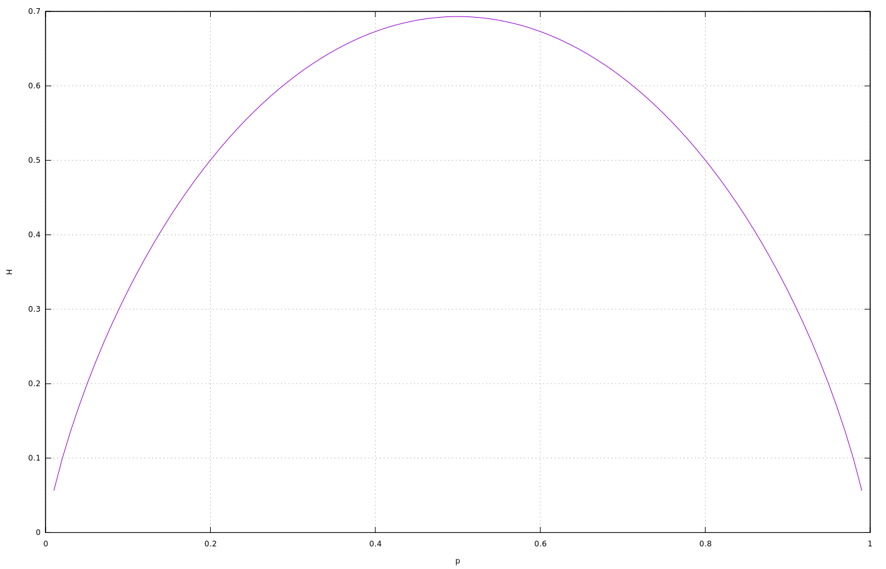

# 熵的计算机科学定义

1. 简介

    在本教程中，我们将了解熵的概念及其在计算机科学不同分支中的应用。

    熵与香农提出的[信息论](https://en.wikipedia.org/wiki/Information_theory)有关，它产生于与通信相关的问题中。

2. 通信

    我们可以将通信定义为一个机制主动与另一个机制建立联系的所有过程。

    通信系统包含三个基本要素：信源、通信信道和接收者。

    信息论是要回答有关信息的测量及其传输（无论有无噪声）的问题。

3. 组合熵

    通过信息熵表达式的推导，我们可以理解其含义。

    考虑三个不同符号的可能固定长度序列：A、B 和 C： 假设有两个符号 A、五个符号 B 和三个符号 C：

    B C B B C C A B A B

    b a c b a c b b c b

    这些组合中的每一种都称为排列。考虑到同一类型的符号是不可区分的，排列组合的次数由多项式系数给出。在我们的例子中，排列次数为：

    \[P=\left(\begin{array}{c} 10\\ 2,5,3 \end{array}\right)=\frac{10!}{2!5!3!}=2520\]

    一般来说，对于一个长度为 N 的序列，它由 L 个不同的符号组成，符号的乘数为 $n_{i}$，我们有：

    \[P=\left(\begin{array}{c} N\\ n_{1},n_{2},\ldots,n_{L} \end{array}\right)=\frac{N!}{\prod_{i=1}^{L}n_{i}!}\]

    假设我们想用二进制字符串对 P 种可能的排列进行唯一编码。长度为 b 位的字符串可以编码 $2^{b}$ 种不同的可能性。

    为了编码 P 种排列组合，必须有 $2^{b}=P$。取2进制对数，我们可以得到二进制字符串的长度必须是

    \[b=\log_{2}P\]

    组成序列的 N 个符号的二进制字符串的平均长度是

    \[H_{c}=\frac{1}{N}\log_{2}P=\frac{1}{N}\log_{2}\frac{N!}{\prod_{i=1}^{L}n_{i}!}\]

    $H_{c}$ 是组合熵，单位是比特/符号。它表示对原始序列的每个符号进行编码所需的二进制字符串的平均长度。

4. 信息论中的熵

    信息论中的熵又称信息熵或香农熵，用 H 表示，可以从组合熵中推导出来。

    对 $H_{c}$ 的表达式进行对数运算，我们可以写出：

    \[H_{c}=\frac{1}{N}\left(\log_{2}N!-\sum_{i=1}^{L}\log_{2}n_{i}!\right)\]

    在 N 足够大的情况下，我们可以用斯特林公式来近似求阶乘的对数：

    \[\log_{2}N!=\frac{1}{\ln2}\ln N!=\frac{1}{\ln2}\left(N\ln N-N+\mathcal{O}(\ln N)\right)\]

    考虑到 $N=\sum_{i=1}^{L}n_{i}$ ，我们有：

    \[H\simeq\frac{1}{\ln2}\frac{1}{N}\left(N\ln N-N-\sum_{i=1}^{L}n_{i}\ln n_{i}+\sum_{i=1}^{L}n_{i}\right)\\=\frac{1}{\ln2}\frac{1}{N}\left(\left(\sum_{i=1}^{L}n_{i}\right)\ln N-\sum_{i=1}^{L}n_{i}\ln n_{i}\right)\\=\frac{1}{\ln2}\frac{1}{N}\sum_{i=1}^{L}n_{i}\left(\ln N-\ln n_{i}\right)\\=-\sum_{i=1}^{L}\frac{n_{i}}{N}\log_{2}\frac{n_{i}}{N}\]

    考虑到比率 $\frac{n_{i}}{N}$ 只不过是长度为 N 的序列中第 i 个符号出现的概率，我们得到了熵的最终一般表达式：

    \[H=-\sum_{i}p_{i}\log_{2}p_{i}\]

    考虑到我们引入的近似值，信息熵是组合熵的上限，即 $H>H_{c}$。

    H 通常被用作自然对数的函数：

    \[H=-\sum_{i}p_{i}\ln p_{i}\]

    在这种情况下，单位是纳特/符号。比特和纳特都是无量纲单位。

5. 连续情况下的熵

    从离散情况到连续情况，香农只是用积分代替了求和：

    \[h(x)=-\int p(x)\ln p(x)\,dx\]

    这个量一般用符号 h 表示，称为微分熵。积分意味着使用概率密度函数而不是概率分布。

    这里有一个问题。考虑 $p(x)$ 是由均值为 $\mu$、方差为 $\sigma^{2}$ 的正态概率密度给出的：

    \[p(x)=\mathcal{N}(\mu;\sigma^{2})=\frac{1}{\sqrt{2\pi\sigma^{2}}}\exp\left\{ -\frac{(x-\mu)^{2}}{2\sigma^{2}}\right\}\]

    然后，计算积分，微分熵为

    \[h_{\mathcal{N}}=\ln(\sqrt{2\pi e}\sigma)\]

    注意，当 $\sigma<\sqrt{\frac{1}{2\pi e}}$ 时，上述表达式小于零。因此，微分熵与离散熵不同，可以是负值。此外，在变量变化的情况下，h 通常也不是不变的。

    因此，在应用微分熵时应小心谨慎。如果不加批判地将其作为离散熵的简单概括，可能会产生意想不到的结果。

    杰恩斯提出了一个修正版的微分熵，即[相对熵](https://arxiv.org/pdf/0708.2879.pdf)，来解决这些问题：

    \[h(x)=-\int p(x)\ln\frac{p(x)}{m(x)}\,dx\]

    只要我们在同一区间内测量 p( x ) 和 m( x ) ，上面的表达式就是尺度不变的。我们可以将 m( x ) 视为先验概率，通常采用均匀概率密度的形式。

    微分熵的问题源于这样一个事实，即对连续体中的熵进行绝对度量在数学上是不合理的。相对熵测量的是关于任意水平的差分熵，由 m( x ) 给出。

6. 熵与信息

    正如冯-诺依曼（他也为香农提议了这个名字）所指出的，香农的工作源于玻尔兹曼在其统计物理学工作中的观察，即熵是 "缺失的信息"，认为它与物理系统可能的替代方案的数量有关。

    信息论中的信息与意义无关。[香农写道](https://www.amazon.com/Mathematical-Theory-Communication-Claude-Shannon/dp/0252725484)：

    > "通信的语义方面与技术方面无关"。

    信息是衡量我们在选择信息时的自由度。因此，它与正在传播的信息无关，而是与可以传播的信息有关。它与单个信息无关。

    如果我们有可能在两个信息中做出选择，我们可以任意地把选择其中一个作为一个单位的信息量（\log_{2}2 或 bit，一个由约翰-W-图基（John W. Tukey）提出的术语）。正如我们所看到的，当信息被编码为二进制字符串时，就会产生比特。

    1. 遍历过程

        一般来说，信息的符号序列具有不同的概率。我们在字母表中选择可能的符号来组成信息。在实际过程中，选择一个符号的概率与之前的选择无关。

        想一想用英语书写的信息，我们用常用字母表中的符号组成单词。例如，在 j 后面出现元音的概率要比出现 x 的概率高得多。

        当我们通过一组概率来选择符号时，我们所处理的就是随机过程。当随机过程的符号选择取决于先前选择的符号或事件时，我们就有了一个马尔可夫过程。如果马尔可夫过程导致的统计量在事件数量较多时与样本无关，那么我们就有了一个遍历过程。

        因此，当我们考虑遍历过程时，熵是与在一定数量的可能性中做出选择相关的不确定性、惊喜或信息的度量。

7. 最大熵

    如果涉及的可能性相同，则 H 为最大值。对于两个选项，我们有

    \[H=-p\ln p-(1-p)\ln(1-p)\]

    这导致了下面的图形表示，显示了 p=0.5 时的最大值：

    

    我们可以把这个结果推广到涉及两个以上概率的情况。我们可以证明这个最大值是唯一的。

    如果我们使用概率密度的具体函数形式，我们可以得到：

    - 我们之前看到的正态密度的熵 $h_{\mathcal{\mathcal{N}}}$ 在所有方差相同的密度中是最大的。换句话说，在均值和方差的约束下，最大熵分布就是高斯分布。
    - 在所有可能的概率密度中，均匀密度的熵最大。由于不是渐近的，均匀密度的熵无法在全域内计算，因为它在所有点上都是恒定值（积分 $\int_{-\infty}^{\infty}\ldots\,dx$不存在），但它可以在有限范围 [a:b] 内计算。在这种情况下，连续情况的概率为 $p=\frac{1}{b-a}$，微分熵成立：
    \[h_{\max}=h_{U}=-\int_{a}^{b}\frac{1}{b-a}\ln\frac{1}{b-a}\,dx=\ln(b-a)\]

    这取决于所选范围的大小。在离散情况下，对于 N 个事件和以 nats 表示的熵，最大熵为：

    \[H_{\max}=H_{U}=H\left(\frac{1}{N},\ldots,\frac{1}{N}\right)=\ln(N)\]

8. 不可避免的物理类比

    我们在前面的章节中强调了热力学在信息论发展早期阶段的影响。然而，信息熵在物理学的其他领域也具有极其重要的意义。

    1. 热力学熵

        理想气体的热力学熵由波尔兹曼-普朗克方程给出：

        \[S=k_{B}\ln W\]

        其中，k_{B} 是玻耳兹曼常数，W 是与气体宏观状态相对应的实际微观状态的数目。玻尔兹曼公式显示了熵与热力学系统中原子或分子的排列方式数量之间的关系。

        请注意波尔兹曼方程的含义与我们从排列概念出发赋予组合熵的含义的相似性。

    2. 有序、概率和熵

        我们知道，在一个孤立的系统中，无序度或熵会随着每个物理不可逆过程而增加，直至达到最大值。这一结果同样适用于绝热系统中的不可逆过程，因为在绝热系统中不存在与外界的热传递。这一事实具有重要的宏观影响。

        如果我们向一个充满空气的容器中注入气体并等待足够的时间，我们可以观察到气体会自发地扩散到空气中，直到在所有点达到相同的浓度。

        另一个例子是温度不同的两个物体之间的接触。在这种情况下，两个物体之间会产生热流，使它们的温度相等，我们可以将热流视为能量浓度或密度的一种度量。如果两个物体的质量不同，它们在过程结束时的能量也会不同，但单位体积的能量是相同的。

        第二个原理通常表现为建立物理过程，试图使系统中的某些属性相等。其结果是某些物理观测值的梯度归零。在孤立的系统中，导致熵增加的过程是自发的。最大熵与热力学平衡相对应。

        宇宙是一个绝热的孤立系统。当达到最大熵时，将不再有任何允许自发过程的能量梯度。这一猜想被称为宇宙的热死或熵死。

        请注意最大热力学熵与系统各点物理属性相等之间的相似性，以及最大信息熵源于概率相等。

    3. 不确定性与量子力学

        不确定性原理是一个基本的自然极限。它涉及以任意精度或确定性测量一对物理观测变量（共轭变量）的可能性。

        由于熵是不确定性的度量，我们可以用信息熵（熵公式）来表述不确定性原理，这绝非巧合。

        从布尔特（[Bourret](https://core.ac.uk/download/pdf/82677681.pdf)）、埃弗雷特（[Everett](https://cqi.inf.usi.ch/qic/everett_phd.pdf)）、赫希曼（[Hirschman](https://www.scirp.org/(S(vtj3fa45qm1ean45vvffcz55))/reference/ReferencesPapers.aspx?ReferenceID=1120201)）和莱普尼克（[Leipnik](https://www.sciencedirect.com/science/article/pii/S0019995860902278?ref=pdf_download&fr=RR-2&rr=7ef6637dcd35ced5)）独立提出的不等式开始，每个函数 $\psi$ 及其傅里叶变换 $\widetilde{\psi}$ 都满足这个不等式，它分别连接坐标空间和动量空间：

        \[-\int\left|\psi(x)\right|^{2}\ln\left|\psi(x)\right|^{2}\,dx-\int\left|\widetilde{\psi}(p_{x})\right|^{2}\ln\left|\widetilde{\psi}(p_{x})\right|^{2}\,dp_{x}=h(x)+h(p_{x})\geq1+\ln\pi\]

        [Beckner](https://www1.cmc.edu/pages/faculty/MONeill/Math%20138/papers138/Beckner.pdf) 以及 [Bialinicki-Birula](http://www.cft.edu.pl/~birula/publ/Uncertainty.pdf) 和 Micielski 证明：

        \[h(x)+h(p_{x})\geq\ln(\pi e\hbar)\]

        其中 $\hbar$ 与普朗克常数有关。

        如上所述，正态概率密度的微分熵在方差相同的所有分布中是最大的，因此对于一般概率密度 p(z)，我们可以写出不等式

        \[h(z)\leq\ln(\sqrt{2\pi e}\Delta z)\]

        将最后一个等式代入前一个等式，我们得到

        \[\Delta x\Delta p\geq\frac{1}{2\pi e}\exp\left\{ h(x)+h(p_{x})\right\} \geq\frac{\hbar}{2}\]

        这就是不确定性原理的表述。

9. 熵的性质

    熵的一些基本性质是

    - 连续性：以最小的量改变概率值，熵的变化量应该很小。
    - 对称性：在对结果重新排序的情况下，熵值是不变的。
    - 可加性：熵的大小应与我们如何考虑过程以及如何将过程分成几个部分无关。
10. 熵的其他形式

    给定两个随机变量 ( x,y ) ，我们可以定义它们的边际概率 ( p( x ) ,p( y ) ) 联合概率 p( x,y ) 和条件概率 ( p( x|y ) ,p( y|x ) ) 。之间的关系

    \[p(x,y)=p(x|y)p(y)=p(y|x)p(x)\]

    由于熵是分布或概率密度的函数，我们可以定义类似的变量。

    联合熵是与一组变量相关的不确定性的度量。在离散和连续的情况下，其形式为

    \[H(x,y)=-\sum_{x}\sum_{y}p(x,y)\ln p(x,y)\]

    \[h(x,y)=-\iint p(x,y)\ln p(x,y)\,dxdy\]

    其中：

    \[H(x,y)\leq H(x)+H(y)\]

    \[h(x,y)\leq h(x)+h(y)\]

    只有当 x 和 y 在统计上独立时，等价才有效。

    条件熵或等价性量化了在给定另一个随机变量 x 的值的情况下，描述一个随机变量 y 的结果所需的信息量：

    \[H(x|y)=-\sum_{x}\sum_{y}p(x,y)\ln\frac{p(x,y)}{p(y)},\,H(y|x)=-\sum_{x}\sum_{y}p(x,y)\ln\frac{p(x,y)}{p(x)}\]

    \[h(x|y)=-\iint p(x,y)\ln p(x|y)\,dxdy,\,h(y|x)=-\iint p(x,y)\ln p(y|x)\,dxdy\]

    一些重要的属性是

    \[h(y|x)=h(x,y)-h(x)\]

    \[h(x|y)=h(x,y)-h(y)\]

    在离散情况下具有相同的性质。

    互信息（MI）是信息论中一个非常重要的量，它量化了通过观察另一个随机变量而获得的关于一个随机变量的信息量。它是两个变量之间相互依赖关系的度量：

    \[I(x,y)=\sum_{x}\sum_{y}p(x,y)\ln\frac{p(x,y)}{p(x)p(y)}\]

    \[I(x,y)=\iint p(x,y)\ln\frac{p(x,y)}{p(x)p(y)}\,dxdy\]

    MI 是正对称的，$I(x,y)=I(y,x)$，并通过以下关系与不同形式的熵相关联：

    \[I(x,y)=h(x)-h(x|y)=h(y)-h(y|x)\]

11. 信息的交流与传输

    有效熵与最大熵之间的关系是信息源的相对熵。相对熵减一即为冗余。

    对于容量为 C bits/s 的通信信道和熵为 H bits/symbol 的信源来说，在不受干扰的信道中，平均传输速度受到以比特/符号为单位的 $\frac{C}{H}$ 的限制。越接近这个极限，编码过程就越长。

    一个矛盾的事实是，在通信信道中存在噪声的情况下，接收到的信息熵大于信源传输的信息熵。因此，接收到的信息比发送的信息包含更多的信息，因为干扰在纯信号源的基础上又增加了一个熵。额外的信息是不需要的（噪音），但从形式上看，它有助于增加接收信息的总熵。

12. 数据压缩

    数据压缩是应用熵和信息论概念的一个显著例子。

    要将信息从信息源传输到接收器，我们需要使用通信信道。在传输过程中，首先要对信息进行编码。我们可以尝试通过算法来缩小原始大小（压缩）。

    压缩可以是有损压缩，也可以是无损压缩。以音频文件压缩为例，mp3 是有损压缩，而 FLAC 则是无损压缩。

    我们不会研究任何具体算法，但会了解数据压缩机制的一般规律。

    1. 熵与编码

        在编码中，信息的每个符号都由代码或码字标识，代码或码字的长度可以是固定的，也可以是可变的。例如，我们可以用 A = 00、B = 01、C = 10、D = 11 对字母表的前 4 个字母进行编码。

        如果每个符号的识别概率为 $p_{i}$，码字长度为 $l_{i}$，则平均码字长度为

        \[L=\sum_{i=0}^{N-1}p_{i}l_{i}\]

        源编码定理或香农第一定理证明，不可能用平均长度小于源熵的源码来表示信息源 S 的输出：

        \[H(S)+1>L\geq H(S)\]

        平均码字长度受信息源熵的限制。H( S ) 越低，理论上我们能达到的 L 值就越低。因此，熵越小的信息越容易压缩。

    2. 数据压缩

        编码效率为：

        \[\eta=\frac{H(S)}{L}\]

        在开发压缩算法时，H( S ) 的值是要达到的极限。

        一个直观的结果是，如果任何编码字符串只有一个可能的源字符串，那么我们就有唯一的可解码性。前缀码就是这类编码的一个例子。

        前缀码是一种没有任何码元是其他任何码元的前缀的编码。例如，如果我们使用变长编码 A = 110，B = 11，我们就没有前缀码，因为 B 的码元是 A 的码元（子串 11）的前缀码。

        在这种情况下，一个重要的结果就是 Kraft-McMillan 不等式：

        \[\sum_{i=0}^{N-1}2^{-l_{i}}\leq1\]

        如果码元长度满足 Kraft-McMillan 不等式，那么我们就可以用这些码元长度构造前缀码。这就确保了解码的唯一性。

        如果对于每个符号 i，可以验证 $p_{i}=2^{-l_{i}}$ ，那么我们就可以证明 $L=H( S )$ 和 $\eta =1$ 。当这一条件不存在时，我们可以使用二进制香农-法诺编码来扩展源码，从而提高效率。

        n 个符号块的香农-法诺码的预期码元长度 $L_{n}$ 将小于 $1+H(Sn) =1+nH(S)$，后一个等式源于熵的定义。原始源符号的预期码字长度将小于：

        \[\frac{L_{n}}{n}=\frac{1+H(S^{n})}{n}=\frac{1+nH(S)}{n}=\frac{1}{n}+H(S)\]

        通过选择足够大的 n，我们可以使其尽可能接近熵 H( S )，从而得到 $\eta = 1$。代价是解码过程的复杂度增加。

    3. 压缩方案

        作为本节的结论，我们报告一个经典的压缩方案。

        假设有一个由 $\Sigma$ 符号组成的向量，每个符号都有一个概率 $p_{i}$，考虑用二进制字母 $\Gamma\equiv\{0,1\}$ 进行编码的问题。对于整数 n>0 和实数 $\alpha >0$ 和 $\delta \in ( 0,1 )$，编码方案 f 和解码 g 可以形式化如下：

        \[f:\Sigma^{n}\rightarrow\Gamma^{m}\]

        \[g:\Gamma^{m}\rightarrow\Sigma^{n}\]

        如果满足以下条件，该模式将为 $p_{i}$ 形成一个 $(n,\alpha,\delta)$ 压缩模式：

        \[m=\alpha n\]

        \[\left\{ Pr[g(f(p_{1},p_{2},\ldots,p_{\Sigma}))]=p_{1},p_{2},\ldots,p_{\Sigma}\right\} > 1 - \delta\]

        在实践中，根据最后一个条件，按照概率 p_{i} 对符号进行编码必须允许解码过程以所需的精度逼近原始概率。

13. 熵与机器学习

    1. 交叉熵误差函数

        在神经网络等分类器中，我们可以使用替代二次误差的误差函数。

        通常的做法是，从给定输入 $p( t | x )$ 的目标的独立条件概率出发，最小化由似然函数的负对数构建的误差函数 E：

        \[p(\mathbf{t}|\mathbf{x})=\prod_{k=1}^{C}p(t_{k}|\mathbf{x})\]

        \[E=-\sum_{n}\sum_{k=1}^{C}\ln p(t_{k}|\mathbf{x})\]

        其中，$\mathbf{x},\mathbf{t}$ 是数据集 n 条记录的向量，C 是类（网络输出单元）的数量。

        如果我们认为目标只属于两个互斥类 $C_{1}$ 和 $C_{2}$，则条件概率为

        \[p(\mathbf{t}|\mathbf{x})=\prod_{k=1}^{2}y_{k}^{t_{k}}(1-y_{k})^{1-t_{k}}\]

        其中，$y_{k}$ 是单元 k 的网络输出，仅是输入 $\mathbf{x}$ 的函数；如果输入属于 $C_{1}$ 类，则 $t_{k}=1$ ；如果输入属于 $C_{2}$ 类，则 $t_{k}=0$ 。误差函数变为：

        \[E=-\sum_{n}\sum_{k=1}^{2}\left[t_{k}\ln y_{k}+(1-t_{k})\ln(1-t_{k})\right]\]

        E 是交叉熵误差函数，其形式我们在讨论熵的最大值时已经见过。

        通过分析连续情况，我们可以证明这个误差函数的最小值与二次误差的最小值相同。

    2. 最大熵原理

        杰恩斯提出的最大熵原理（Maximum Entropy 或 MaxEnt）认为，最能代表问题中知识的概率分布就是具有最大熵的概率分布。由于神经网络的输出在一定条件下是输入条件下目标概率的近似值，因此最大熵原理有可能成为一种优化标准。

        MaxEnt 原理并非没有受到批评。因此，有人提出了两个类似的原则：

        - 最大互信息原则（MaxMI），即网络输出和目标之间具有最大互信息的概率密度为最优概率密度。
        - 最小互信息原则（MinMI），即网络输出和输入之间的最小互信息为最优概率密度。
        在后一种情况下，如果我们知道输入和目标的边际概率（合理条件），则 MinMI 等同于 MaxEnt 原则。

    3. 估计器的误差

        考虑到一个目标 t 和一个估计器，例如由神经网络的输出 y 给出的估计器（取决于输入 x），可以得到一个预期二次误差的下限，它取决于条件微分熵：

        \[\left\langle (t-y(x))^{2}\right\rangle \geq\frac{1}{2\pi e}\exp\left\{ 2h(y|x)\right\}\]

        这个表达式在量子力学中非常重要，它再次强调了物理学与信息论之间联系的重要性。

14. 结论

    在本教程中，我们概述了熵的概念及其在计算机科学不同分支中使用的意义。鉴于信息论的历史发展，对熵的分析不能忽略热力学熵的含义。

    本专题涉及面广，当然无法在一篇文章中详尽论述。不过，文中涉及的主题可以为进一步深入探讨提供思路。

## 相关文章

- [ ] [Computer Science Definition of Entropy](https://www.baeldung.com/cs/cs-entropy-definition#magicparlabel-8508)
