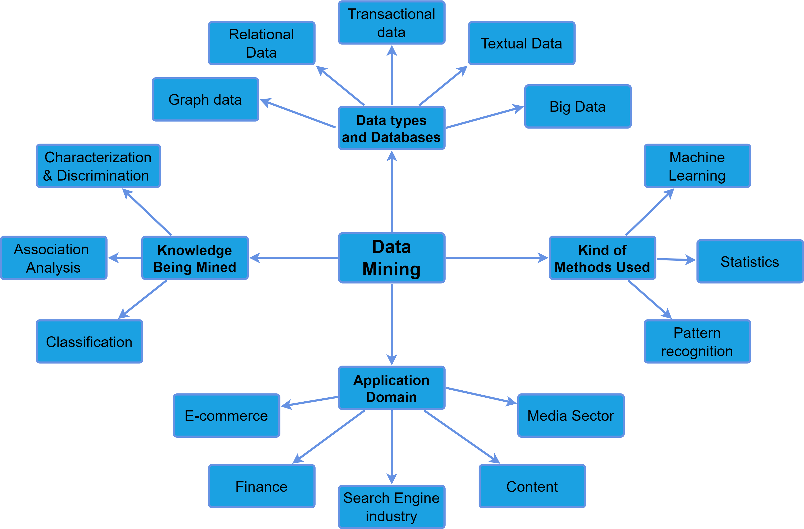

# 数据挖掘系统的分类

[Classification of Data Mining Systems](https://www.baeldung.com/cs/data-mining-systems)

1. 概述

    在本教程中，我们将探讨数据挖掘 (DM) 系统的分类。要优化数据挖掘过程，我们必须首先了解数据挖掘系统的分类。了解这些系统后，我们就可以为特定任务选择合适的系统。要想在数据挖掘过程中取得最佳效果，选择合适的系统至关重要。

2. 数据挖掘系统分类

    数据挖掘从大型数据集中发现模式并提取有用信息。随着数据的快速增长，企业需要使用数据挖掘系统分析和解释数据。随着数据呈指数级增长，有必要进行积极的数据分析，以便理解所有数据。数据挖掘（DM）系统可根据各种因素进行分类。

    为了给文章的其余部分提供路线图，让我们来介绍一下 DM 分类的可视化。它从中心开始，也就是 DM；这个层次结构的下一级代表类的类型，而最后一级的叶子则是分类法的类：

    

    1. 挖掘的数据类型和数据库

        关系数据通常存在于关系数据库中，其中结构化和有组织的信息存储在具有列和行的表中。数据挖掘从业人员经常使用 SQL 等工具来处理这类数据。同时，事务性数据侧重于随着时间推移而发生的事件或事务，如客户购买。从业人员使用模式识别和趋势分析等方法从这类数据中获得有价值的见解。

        另一方面，文本数据包括非结构化或半结构化文本。它们来自电子邮件、新闻文章和产品描述等来源。情感分析和主题建模等数据挖掘方法可应用于这类数据。

        图数据结构是另一个重要类别，它将网络和图表示为具有强大解释能力的数据结构。社群检测和链接预测是用于这类数据的典型数据挖掘方法。

        最后，大数据是指处理传统数据挖掘方法无法处理的超大数据量。各行业利用 Hadoop 和 Spark 等大数据技术来管理和分析这些海量数据集。通过这样做，他们确保仍能从中提取有价值的见解。

        数据类型和数据库系统对数据挖掘系统的形成起着重要作用。因此，它们直接影响着从海量信息中提取有价值见解的效率和效果。总之，各种数据类型和结构需要使用不同的算法和技术才能成功进行数据挖掘。

    2. 知识挖掘

        确定数据挖掘系统要挖掘的知识的具体类型至关重要。这使这些系统能够专注于提取相关信息和模式，最终帮助它们实现预期目标。

        各种数据挖掘方法旨在总结输入数据集的一般特征，如计算和可视化分布、出现频率和其他高级统计数据。

        另一方面，识别将一组数据与另一组数据区分开来的特征是判别的重点。

        数据科学家使用关联规则挖掘和相关性分析来识别数据集中变量之间的关系，例如揭示经常一起购买的物品。

        为新观察结果指定标签或类别是数据挖掘的另一项重要任务。主要方法是利用与现有标签观察结果的相似性。数据科学家可以使用决策树、神经网络和支持向量机等工具进行分类。

        最后，识别数据集随时间发生的变化是演化分析的重点。这可能包括客户行为或股票价格的变化。

    3. 使用的方法种类

        同样，DM 系统使用各种技术，包括机器学习、数学技术和模式识别。

        [机器学习](https://www.baeldung.com/cs/ml-fundamentals)算法不需要明确的编程就能学习数据中的模式和关系，并能对数据进行有监督或无监督的分类。统计学家通过使用数学技术检查数据样本来分析数据并对群体做出推断。

        模式识别是一种常见的技术，通过算法识别数据中的模式，如手写或面部识别。数据分析师采用决策树、神经网络和支持向量机等方法来实现这一目标。因此，用户可以通过研究这些方法来确定满足其特定数据分析要求的最佳方法。通过研究这些方法，用户可以获得更准确、更可行的见解。

    4. 应用领域

        数据挖掘专家根据应用领域对数据挖掘系统进行分类，各行各业都在使用这些系统。例如，电子商务在很大程度上依赖数据挖掘来研究客户行为、偏好和购买模式，帮助企业更好地服务客户。

        同样，金融公司也利用数据挖掘来研究股票价格和经济指标等金融数据，预测市场趋势，找出有利可图的投资机会。搜索引擎行业也利用数据挖掘分析用户查询和搜索历史，提高搜索结果的相关性。

        在医疗领域，研究人员利用数据挖掘分析大量患者信息数据集，以确定风险因素并创建疾病预测模型。媒体行业也利用数据挖掘来分析用户参与度、偏好和消费模式，从而调整内容以更好地吸引受众。

        通过对 DM 的分类，我们可以确保所选的数据挖掘技术适合相关领域的不同挑战和目标。因此，专家们可以通过这种分类过程简化工作、优化资源分配，并最大限度地提高从挖掘的数据中获得的见解的价值。

3. 结论

    本文讨论了基于不同标准的数据挖掘系统分类。各组织可通过了解这些分类，选择最适合其特定需求和目标的数据挖掘技术。
