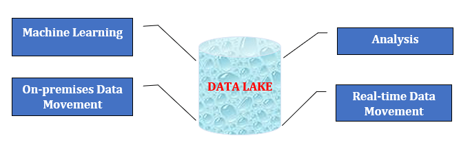
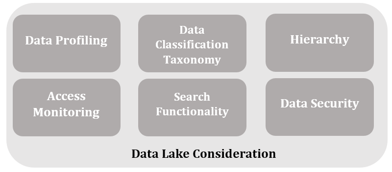
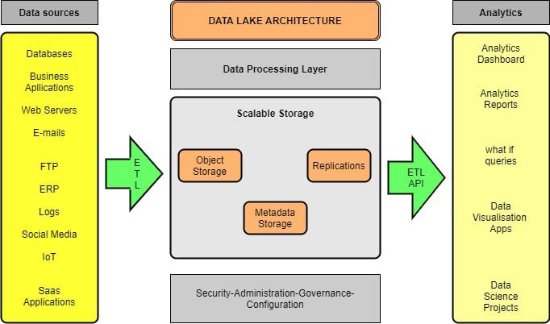

# 什么是数据湖？

1. 简介
    在本教程中，我们将讨论数据湖，这是一个相对较新的概念，它利用了大数据技术的优势，并将其与自助服务的灵活性相结合。我们将主要讨论其基本组成部分和架构、优点和缺点。我们还将介绍数据湖与数据仓库的主要区别。
2. 数据湖概述
    [数据湖](https://www.talend.com/resources/what-is-data-lake/)是一个主要存储库，允许您以任何规模存储所有[非结构化、半结构化和结构化数据](https://www.forbes.com/sites/bernardmarr/2019/10/18/whats-the-difference-between-structured-semi-structured-and-unstructured-data/)。

    在数据湖中，我们无需对数据进行结构化处理即可存储数据。数据湖可运行不同类型的分析，从仪表盘和可视化到大数据处理、实时分析和机器学习，以指导做出更好的决策。

    
    数据湖可降低长期运营成本，实现经济的文件存储。
3. 为什么是数据湖？

    数据湖是一个存储库，它以原始格式存储大量原始数据，直到分析应用程序需要时为止。数据湖采用扁平化设计来存储数据，通常采用文件或对象存储，而传统数据仓库则采用分层维度和表格来存储数据。用户有更多的选择来管理、存储和使用他们的数据。

    以下是构建数据湖的其他一些注意事项：

    - 数据湖中多样化的数据结构可为数据分析师提供更强大、更丰富的分析质量。
    - 无需使用数据湖以企业范围的模式为数据建模。
    - 数据湖提供了数据分析的灵活性，以及将结构化数据转化为数据仓库中没有的非结构化数据的能力。
    - 如今，机器学习和深度学习已被用于创建盈利预测。
    - 利用数据湖可为公司带来竞争优势。
4. 数据湖解决方案的架构和重要组成部分

    1. 数据湖的基本组成部分

        数据湖包含大量数据。因此，用元数据标记项目，使其将来可以被访问，这一点至关重要。数据湖的结构各不相同，但目标都是使数据易于发现和使用。

        数据湖架构包含以下特点，以确保其功能，避免成为数据沼泽：

        
        - 数据剖析： 揭示项目质量和分类信息。
        - 数据分类： 描述数据类型、用户群和用例。
        - 层次结构： 组织文件并应用命名约定。
        - 访问监控： 监控用户对数据湖的访问，并生成特定时间和地点的通知。
        - 搜索功能： 使人们能够定位数据。
        - 数据安全： 包括加密、访问控制和身份验证等安全措施，以防止未经授权的访问。
    2. 数据湖架构

        所有数据湖都由两部分组成：计算和存储。两者都可以在云中或内部部署。数据湖架构可容纳来自企业多个来源的非结构化数据和各种数据结构。以下是数据湖结构的概念图。

        

5. 数据湖与数据仓库

    由于数据湖和数据仓库的基本目标和功能相似，因此经常被混淆：

    - 两者的目的都是开发一个集中的数据存储库，为不同的应用程序提供信息。
    - 它们都是企业中不同数据存储的存储库。
    由于两者的基本区别，它们适用于不同的环境。

    |    |        数据湖               |       数据仓库                  |
    |--------|----------------------------------|------------------------|
    | 无障碍和修改 | 简单灵活；                            | 复杂而僵化；                 |
    | 无障碍和修改 | 非常容易访问，更新速度快；                    | 修改更复杂，成本更高；            |
    | 无障碍和修改 | 易于适应变化。                          | 需要大量资源，以便日后根据需求变化进行修改。 |
    | 模式     | 读取模式；                            | 写入模式--模式是结构化和有组织的。     |
    | 模式     | 数据湖没有预定义的结构。因此，它可以以原始格式存储数据。     |                        |
    | 数据结构   | 原始数据                             | 已处理                    |
    | 用户     | 数据科学家和工程师                        | 业务专业人员                 |
    | 分析     | 机器学习、深度学习、数据可视化、预测分析、大数据分析、商业智能。 | 商业智能、数据可视化、数据分析。       |
6. 数据湖的优点和缺点

    1. 数据湖的优点

        数据湖的运行原则是 "读取即模式"（schema-on-read）。它表示数据在存储前不需要符合指定的模式。这一特性节省了大量时间。不过，它也允许以任何格式存储数据。数据湖之所以复杂，是因为它们没有以清晰的结构组织数据。

        数据科学家和分析师利用数据湖可以更快、更准确地访问、分析和准备数据（灵活分析）。对于数据专业人员来说，这种以各种非传统格式提供数据的方式提供了为各种用例（如欺诈检测、情感分析、语音识别或定向广告）访问数据的能力。

    2. 数据湖的缺点

        数据湖的风险在于安全性和访问控制。有时，数据可以在没有监督的情况下被放入数据湖，因为有些数据可能有隐私和管理需求。

        过去对数据进行的分析没有历史记录。因此，存储和处理费用可能会增加。硬件、空间限制、数据中心配置、成本、存储可扩展性和资源预算是内部部署数据湖必须解决的问题。

7. 结论

    本文讨论了数据湖。数据湖是一个可以存储大量结构化、半结构化和非结构化数据的存储库。构建数据湖的主要目的是为数据科学家和分析师提供数据的复古视图。
