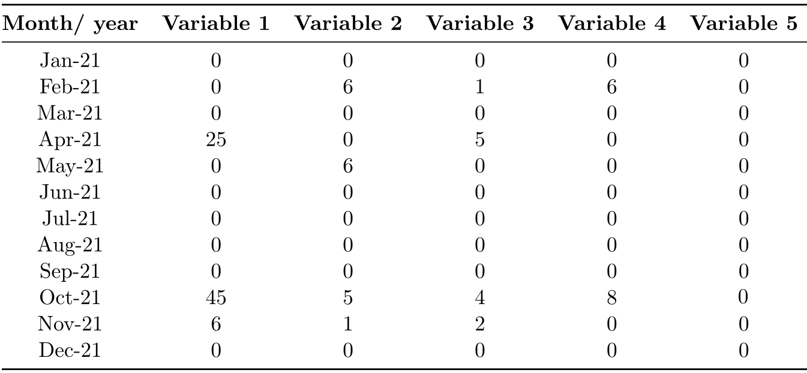

# 缺失数据与稀疏数据的区别

[Differences Between Missing Data and Sparse Data](https://www.baeldung.com/cs/missing-vs-sparse-data)

1. 简介

    在本教程中，我们将讨论缺失数据和稀疏数据：什么是缺失数据和稀疏数据，如何表示和处理缺失数据和稀疏数据，它们有哪些不同之处。

2. 缺失数据

    当我们谈论缺失数据时，我们指的是数据集中没有出现的数据，即使我们期望它们存在。例如，假设我们从一家公司的数据库中获得了 10 个人的人口统计数据，但其中没有关于某些员工年龄的信息。

    1. 类型

        缺失数据主要有三种类型。

        随机缺失（missing-at-random,[MAR](https://www-users.york.ac.uk/~mb55/intro/typemiss4.htm)）数据是指我们可以通过其他观测变量预测其缺失程度的数据。例如，如果我们错过了某些员工在某一天的到达时间，但看到表明他们正在出差的变量设置为 True，我们就会说这个时间是随机缺失的，因为我们可以从这些员工正在出差这一事实中推断出来。

        完全随机缺失（Missing Completely at Random,[MCAR](https://www-users.york.ac.uk/~mb55/intro/typemiss4.htm)）指的是独立随机缺失的数据。 数据缺失的事实与我们观察到的值无关。例如，假设我们有一个自动系统，每天记录三次温度。某一天，温度计出了故障，所以当天没有读数。数据丢失的原因与未记录的数值无关。因此，它们代表 MCAR 数据。

        最后，非随机缺失（Missing Not at Random,[MNAR](https://www-users.york.ac.uk/~mb55/intro/typemiss4.htm)）是指因与观察变量相关的原因而缺失的数据。例如，在一项成瘾研究中，一些参与者可能不愿意透露他们每天吸烟的次数，因为这个数字很高。

    2. 如何处理缺失数据

        缺失数据有时会使我们的数据集和分析产生[偏差](https://www.baeldung.com/cs/machine-learning-biases#what_is_bias_and_why_should_we_care)。例如，如果我们要分析上面的就业数据集，那么分析将只考虑有年龄的记录。这样做的危险在于，由于我们没有考虑到所有员工，因此得出的结论是错误的。因此，了解如何处理缺失数据非常重要。

        一种常用的方法是移除或删除缺失数据的特征或记录。例如，我们可以删除不知道年龄的员工。

        如果许多员工的年龄信息缺失，我们甚至可以删除整个特征。

        或者，我们可以对缺失数据进行估算。估算是指用替代值替换缺失值。有多种方法可以做到这一点。一种常用的方法是均值估算。它用相关变量的平均值替换缺失值。例如，由于上例中员工的平均年龄为 38.375 岁，我们可以用 38 岁来替换缺失值。

        同样，用中位数或模式估算是指用数据缺失变量的中位数或模式替代缺失值。

    3. 多重估算和插值法

        在[多重估算](https://stats.oarc.ucla.edu/stata/seminars/mi_in_stata_pt1_new/)（multiple imputation）中，我们根据观测数据的分布来估计缺失数据的值。这种分布可以是[均匀分布](https://www.baeldung.com/cs/uniform-to-normal-distribution)（uniform distribution），也可以是其他类型的数据分布。 第一步是创建 n 份数据集。然后，我们使用从这 n 份数据集的观测值分布中抽取的随机值来估算缺失值。最后，我们对数据集进行分析，并将结果汇总为缺失数据的单一估计值。

        我们还可以使用[插值法](https://www.baeldung.com/cs/interpolation-vs-regression#the-concept-of-interpolation)。这是一种试图推断缺失值的估算方式。插值函数计算已知值之间的关系，并在已知值范围内输出一个新值。例如，在雇员数据库中，我们可以利用雇员 2022002 和 2022003 的观察值插值计算雇员 2022001 的年龄。

3. 稀疏数据

    稀疏数据是指那些存在许多空白的数据。稀疏数据通常是指数据集中有用数据很少的变量。例如，假设我们有一个数据集，其中包含一段时间内六个雨量计的读数。有些月份没有降雨，因此记录的数值为零。这就形成了一个稀疏的数据集。

    需要注意的是，稀疏数据中的值通常是已知的，但出现的频率很低。因此，稀疏数据集中的零并不是缺失值。

    1. 数据类型

        数据稀疏主要有两种类型：受控稀疏和随机稀疏。[受控稀疏](https://docs.oracle.com/cd/A91202_01/901_doc/olap.901/a86720/esdatao6.htm)（Controlled sparsity）是指一个或多个变量的数值范围内没有数据。例如，在一个包含新员工的人力资源数据集中，可能没有 2022 年 2 月和 3 月的值，因为公司在这两个月没有招聘任何人。

        

        另一方面，[随机稀疏性](https://docs.oracle.com/cd/A91202_01/901_doc/olap.901/a86720/esdatao6.htm)（random sparsity）是指数据集中没有实际值的情况是随机分布的。

    2. 如何处理稀疏数据

        处理稀疏数据最常见的方法是删除没有实际值的特征，同时保留包含数据的特征。但是，我们必须谨慎操作，以确保重要特征不会被移除。例如，我们可以从上述稀疏数据集中移除变量 Variable 5，因为它包含所有的零。

        另外，我们还可以应用主成分分析（Principal Component Analysis,[PCA](https://www.baeldung.com/cs/principal-component-analysis)）等降维技术。这样，我们只存储有实际数据的特征，而且通常会将其数量减少到可控范围内。

4. 缺失数据与稀疏数据的区别

    缺失数据和稀疏数据的主要区别在于数据的表示方法和处理数据的技术。下表总结了这些差异。

    | 缺失数据        | 稀疏数据        |
    |-------------|-------------|
    | 数值通常未知      | 数值已知        |
    | 在数据集中用NA表示  | 在数据集中大多用0表示 |
    | 数据需要手动或计算填写 | 数据无需填写      |

5. 结论

    在本教程中，我们回顾了缺失数据和稀疏数据。缺失数据是数据集中不存在的未知数据，而稀疏数据通常是已知的，但很少存在。
