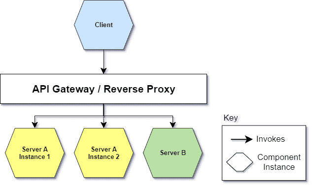

# [API网关与反向代理](https://www.baeldung.com/cs/api-gateway-vs-reverse-proxy)

1. 概述

    如今，我们知道 API 是任何成功数字产品的核心。因此，适当的 API 管理至关重要。

    在本快速教程中，我们将学习两个可以帮助我们实现这一目标的对象，即反向代理（Reverse Proxy）和 API 网关（API Gateway），以及它们之间的区别。

2. 架构

    正如我们在下文中看到的，这两种对象所能提供的功能有所不同，但拓扑结构和在基础架构中所处的位置是相同的。因此，我们可以用以下相同的方式来描述它们：

    

3. 反向代理

    使用反向代理的原因之一是将其用作[客户端](https://www.baeldung.com/cs/client-vs-server-terminology)与一个或多个后端服务器之间的中介。
    让我们想象一下[微服务架构](https://www.baeldung.com/cs/microservices-cross-cutting-concerns)，随着项目的发展，微服务的数量会越来越多。在某一时刻，API 表面的异构性所带来的复杂性可能会导致需要掩盖所有这些复杂性。为此，反向代理可以重写 URL。客户端不知道谁在反向代理之外。反向代理有责任将请求转发给能满足请求的后端。

    反向代理的典型用途包括

    - 负载平衡：它能将接收到的请求分配给多个后端服务器。这种负载平衡可防止单个系统超载，并对后端故障进行补偿。如果某个后端由于某些错误而无法访问，则其负载平衡模块会将接收到的请求重新分配给其余的后端。
    - 防止攻击：可安装防病毒或数据包过滤器等控制系统，这些系统位于互联网和专用网络之间，可进一步保护后端。
    - 缓存：对于重复性请求，它可以自主、部分或全部回答。内容通常保存在代理缓存中。这样，从后端检索的数据就会减少，客户获得响应的时间也会缩短
    - SSL 加密：可将其配置为对所有传入请求进行解密，对所有传出响应进行加密，从而释放后台的宝贵资源。

    在这一点上，如果所有这些功能还不够，我们很可能需要一个 API 网关。让我们深入了解 API Gateway 进一步提供的功能。

4. API 网关

    我们可以将网关 API 视为反向代理的超集。下面，我们将讨论它所提供的附加功能。

    首先，API Gateway 向客户端隐藏了后端在架构中的分区。它不仅可以转发请求，还可以执行协调/聚合。这简化了客户端代码，减少了 API 请求/往返次数。此外，客户端只需与应用程序接口网关对话，而无需调用多个后端。

    另一个与处理请求/响应相关的功能是协议转换。换句话说，API 网关可以执行协议与协议之间的转换（例如，XML 转换为 JSON，gRPC 转换为 JSON），以促进客户端与服务器之间的集成。

    API Gateway 是解决安全性、可靠性、可扩展性、可观察性和可追溯性等一些常见能力的绝佳驱动程序。让我们来看看它是如何做到的。

    首先是安全性，它提供

    - [身份验证和授权](https://www.baeldung.com/cs/authentication-vs-authorization)(Authentication and Authorization:)：在边缘集中管理谁可以请求什么
    - IP 白名单：只允许特定 IP 地址使用应用程序接口。

    接下来是与性能有关的功能：

    - [速率限制](https://www.baeldung.com/spring-bucket4j#api-rate-limiting)、节流和配额(Rate Limiting, Throttling, and Quota)：我们可以根据服务器在一定时间内可以处理的请求/数据量来设置限制。此外，从商业角度看，它还可以根据 API 用户购买的计划来控制其使用的流量
    - 重试策略和[断路器](https://martinfowler.com/bliki/CircuitBreaker.html)(Retry Policy and Circuit Breaker:)：通过管理后端暂时的不可用性（例如，代表客户重新执行请求或保护服务器不被大量请求淹没）来提高后端的弹性和可靠性。

    最后是可观察性和可追踪性：

    - 日志、跟踪、关联(Logging, Tracing, Correlation)：收集每个特定请求的所有日志，了解该请求涉及哪些后端以及相关指标

5. 差异

    总而言之，既然我们已经分别了解了这两种方法，下面就让我们来总结一下反向代理和 API 网关之间的主要区别：

    |                    |   | Reverse Proxy  | API Gateway  |
    |----------------------------------|---------------|---|---|
    | URL Rewrite                      | URL 重写        | T | T |
    | Load Balance                     | 负载平衡          | T | T |
    | Prevention from Attack           | 防止攻击          | T | T |
    | Caching                          | 缓存            | T | T |
    | SSL Encryption                   | SSL 加密        | T | T |
    | Orchestration / Aggregation      | 协调/聚合         |   | T |
    | Protocol Translation             | 协议转换          |   | T |
    | AuthN / AuthZ                    | AuthN / AuthZ |   | T |
    | IP Whitelisting                  | IP 白名单        |   | T |
    | Rate Limiting, Throttling, Quota | 速率限制、节流、配额    |   | T |
    | Retry Policy, Circuit Breaker    | 重试策略、断路器      |   | T |
    | Logging, Tracing, Correlation    | 日志、跟踪、关联      |   | T |

6. 结论

    在本文中，我们明确了 API Gateway 和反向代理的职责后，就可以根据所要求的简便性、需求和要解决的问题做出适当的选择。

    API 网关实现方案主要有以下 5 种：

    - Spring Cloud Gateway
    - Spring Cloud Netflix Zuul
    - Kong
    - Nginx+Lua
    - Traefik
