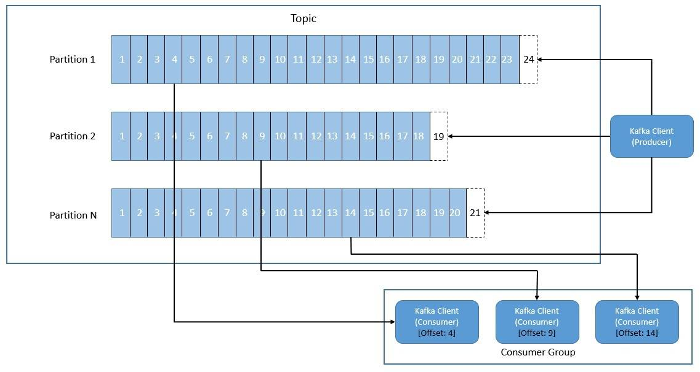

# [分布式系统基础](https://www.baeldung.com/cs/distributed-systems-guide)

1. 简介

    在本教程中，我们将了解分布式系统的基础知识。本文将介绍分布式系统的基本特征、面临的挑战以及常见的解决方案。

    我们还将简要介绍一些流行的跨类别分布式系统所采用的方法。

2. 基本概念

    在了解不同系统的分布式架构之前，我们首先要弄清楚一些基本概念。

    尽管动机在很大程度上影响着分布式架构，但有一些基本原则和挑战适用于所有分布式架构。

    1. 什么是分布式系统

        首先，让我们正式定义一下分布式系统。分布式系统由多个组件组成，这些组件可能跨越地理边界，通过消息传递进行通信并协调行动。对于系统外的参与者来说，它就像是一个单一的连贯系统：

        

        现在，我们可能经常听到分散系统，并将其与分布式系统混为一谈。因此，有必要做一些区分。去中心化系统是一种分布式系统，在这种系统中，没有任何特定的组件拥有决策权。虽然每个组件都拥有自己的那部分决策权，但没有一个组件拥有完整的信息。因此，任何决策的结果都取决于所有组件之间达成的某种共识。

        另一个与分布式系统密切相关的术语是并行系统。虽然这两个词都是指扩展计算能力，但它们实现的方式却有所不同。在并行计算中，我们使用一台机器上的多个处理器同时执行多个任务，并可能使用共享内存。而在分布式计算中，我们使用多台独立的机器，不共享内存，通过消息传递进行通信。

    2. 分布式系统的优势

        虽然分布式系统的设计和构建无疑更为复杂，但其带来的好处也是值得的。

        让我们快速浏览一下其中的一些主要优势：

        - 可扩展性： 纵向扩展通常受到硬件限制，例如，我们只能拥有这么多处理器内核。但理论上，我们可以利用相对便宜的商品机器实现无限的横向扩展。
        - 可靠性： 由于分布式系统由多台机器组成，数据在多个节点上进行复制，因此一般来说，如果系统的某个部分出现故障，系统的恢复能力会更强。因此，即使容量降低，整个系统也能继续运行。
        - 性能： 分布式计算的典型应用是将工作负载分解成可在多台机器上同时运行的较小部分。因此，这大大提高了许多复杂工作负载（如矩阵乘法）的性能。

    3. 分布式系统面临的挑战

        如果我们认为分布式系统能给我们带来所有好处，而不会带来任何挑战，那就离现实太远了！

        让我们来了解一下分布式系统给我们带来的一些主要挑战：

        - 一致性与可用性： 由于分布式系统顾名思义就是提供分区容差的系统，因此它必须在一致性和可用性之间做出选择，正如 CAP 定理所限制的那样。对于通用计算平台来说，这并不是一个容易权衡的问题。
        - 数据分布： 分布式系统中的数据或工作负载需要进行分区，以便将其发送到多个节点。这就需要复杂的算法来有效地分割和组合这些数据。
        - 协调： 由于分布式系统中的数据或工作负载也会在多个节点上复制，以实现容错，因此协调它们变得非常棘手。这需要复杂的协议才能让参与的节点就决策达成一致。
        在企业应用中，我们经常需要在一个事务中进行多个操作。例如，我们可能需要在一个工作单元中对数据进行多次更新。当数据位于同一地点时，这种情况变得微不足道，但当我们将数据分布到一个节点集群时，情况就变得相当复杂了。许多系统都使用 Paxos 和 Raft 等复杂协议在分布式环境中提供类似事务的语义。

3. 架构与类别

    虽然近来人们对分布式系统的兴趣有所回升，但其基本原理并不新鲜。相当长一段时间以来，分布式系统出现了许多架构模式，以解决与数据相关的通用和特定用例。

    在本节中，我们将讨论分布式系统的一些架构模式以及它们可以服务的不同类别的用例。

    1. 分布式系统架构

        分布式系统的系统架构取决于用例和我们对它的期望。不过，在大多数情况下，我们都能找到一些通用模式。

        事实上，这些就是该架构所采用的核心分布模型：

        

        - 主从模式：在这种模式下，分布式系统中的一个节点扮演主节点的角色。在这里，主节点掌握系统的全部信息并控制决策。其余节点充当从属节点，执行主节点分配给它们的任务。此外，为了容错，主节点可以有冗余的备用节点。
        - 点对点： 在这种模式下，分布式系统中的节点之间没有指定单一的主节点。所有节点平等分担主节点的责任。因此，我们也称之为多主或无主模式。这种模式以增加复杂性和通信开销为代价，提供了更好的系统弹性。

        虽然这两种架构各有利弊，但没有必要只选择一种。许多分布式系统实际上创建了一种结合两种模式元素的架构。

        点对点模式可提供数据分发，而主从模式可在同一架构中提供数据复制。

    2. 分布式系统的类别

        设计分布式系统可能有多种理由。例如，我们需要在机器学习模型中执行大规模矩阵乘法等计算。这些计算在单台机器上是无法完成的。

        同样，在单台机器上处理和存储庞大文件的系统也不可能实现，或者至少效率很低。

        因此，根据使用情况，我们可以将分布式系统大致分为以下几类。不过，这绝对不是分布式系统可能用例的详尽清单：

        - 数据存储
        - 消息传送
        - 计算
        - 分类账(Ledgers)
        - 文件系统
        - 应用程序

        传统上，关系数据库一直是数据存储的默认选择。然而，随着近年来数据量、种类和速度的增长，关系数据库开始无法满足人们的期望。这时，具有分布式架构的 NoSQL 数据库开始变得更加有用。

        同样，传统的消息传递系统也无法应对现代数据规模的挑战。因此，对能够提供性能、可扩展性和耐久性的分布式消息传递系统的需求开始上升。目前，这一领域有多种选择，可提供发布-订阅和点对点等多种语义。

        我们将在本教程中讨论一些流行的分布式数据库和消息系统。重点将主要放在一般架构上，以及它们如何解决分布式系统的一些关键挑战，如分区和协调。

4. Apache Cassandra

    [Cassandra](https://www.baeldung.com/cassandra-with-java) 是一个开源的分布式键值系统，采用分区宽列存储模型。它具有完全多主数据复制功能，可提供高可用性和低延迟。它可线性扩展，没有单点故障。

    Cassandra 偏重于高可用性和可扩展性，因此是一个最终一致的数据库。这基本上意味着数据的所有更新最终都会到达所有副本。但是，相同数据的不同版本可能暂时存在。不过，Cassandra 也提供了可调整的一致性，即在读取和写入操作中都有一系列一致性级别可供选择。

    1. 数据分布

        Cassandra 通过将所有数据平均分配到集群中的各个节点来实现水平扩展。在集群中分发数据的一种简单方法是使用分布式哈希表。但是，当集群中的节点数量发生变化时，它们通常会受到重新散列的影响。在这种情况下，一致散列被证明是更好的方法，因此 Cassandra 也采用了这种方法。

        一致散列是一种与集群中节点数量无关的分布式散列方案。它有一个抽象环的概念，代表哈希值的总范围，也称为令牌：

        

        Cassandra 将集群中的每个节点都映射到这个标记环上的一个或多个标记上，这样标记的总范围就会在集群中均匀分布。因此，每个节点都拥有该标记环中一定范围的标记，这取决于我们把它们放在标记环中的什么位置。

        要确定密钥的所有权，Cassandra 首先通过对密钥进行散列生成令牌。它使用一个分区器作为散列函数，默认的分区器是 Murmur3Partitioner。一旦在环上找到了密钥的令牌，它就会按顺时针方向在环上行走，找出拥有令牌和密钥的最近节点。

        现在，Cassandra 还会在多个物理节点上复制每个分区，以提供容错。Cassandra 支持可插拔的复制策略，如 Siple 策略和网络拓扑策略，以确定哪些节点充当给定标记范围的副本。对于简单策略，它只需不断走环，直到找到由复制因子（RF）定义的不同节点数。

    2. 协调

        由于 Cassandra 集群是多主机集群，集群中的每个节点都可以独立接受读写操作。接收请求的节点充当应用程序的代理。我们称代理节点为协调器，负责使用分区器识别拥有密钥的节点。

        因此，每个节点都需要知道集群中哪些节点存活或死亡，以便优化操作路由。Cassandra 使用流言协议在整个集群中传播基本的集群引导信息：

        

        Gossip 是一种点对点通信协议，每个节点都会定期与其他几个节点交换状态信息。它们交换关于自己和所知道的其他节点的信息。此外，它使用矢量时钟对信息进行版本控制，因此流言可以忽略旧版本的集群状态。

        多主架构的另一个问题是，多个副本可以同时接受相同的密钥突变请求。因此，必须有一种机制来协调整个副本集的并发更新。

        Cassandra 使用 "最后写赢"（Last-Write-Wins）模型来解决这个问题。为简化起见，这里的每次突变都有时间戳，而且总是最新版本获胜。

5. MongoDB

    [MongoDB](https://www.baeldung.com/java-mongodb) 是一种开源、通用、基于文档的分布式数据库，它以文档集合的形式存储数据。文档是一种由字段和值对组成的简单数据结构。此外，它还为复杂的数据建模提供嵌入式文档和数组。

    我们可以将 MongoDB 碎片部署为副本集。副本集的主要成员负责处理所有请求。在自动故障切换期间，分片通常无法处理请求。这使得 MongoDB 默认具有强一致性。不过，为了实现高可用性，客户端可以选择从辅助副本中读取数据，因为辅助副本中的数据最终才会保持一致。

    1. 数据分布

        MongoDB 使用分片键将集合中的文档分布到多个分片中。我们可以根据文档中的一个或多个字段创建分片键。显然，分片键的选择意味着分片集群的性能、效率和可扩展性。

        MongoDB 使用分片键将数据划分成块。它会尽量使数据块在集群中的所有分片间均匀分布：

        

        MongoDB 支持两种分片策略：散列分片和范围分片。使用散列分片时，它会计算分片键值的散列值，并为每个分块分配一个散列值范围。使用范围分片时，MongoDB 会根据分片键值将数据划分为不同范围，并为每个数据块分配一个范围。

        在分片之间平衡块的分布也很重要。MongoDB 的默认分块大小为 64 兆字节。当一个分块的大小超过指定限制或文档数量超过配置限制时，MongoDB 会根据分片键值拆分该分块。此外，MongoDB还会运行一个平衡器进程，在分片之间自动迁移数据块，以实现均匀分布。

        为了提高数据的本地性，MongoDB 提供了区域的概念。这在分片跨越多个数据中心时尤其有用。在分片集群中，我们可以根据分片密钥创建分区。此外，我们还可以将每个区域与集群中的一个或多个分片关联起来。因此，MongoDB 只会将区域所覆盖的块迁移到与该区域相关联的分块上。

    2. 协调

        MongoDB 使用分片作为在多台机器上分发数据的方法。因此，MongoDB 的分片集群是可水平扩展的。一个分片包含一个数据子集，每个分片可作为一个副本集部署。集群还包括用于存储元数据和配置设置的 mongos、查询路由器和配置服务器：

        

        副本集在 MongoDB 中提供自动故障转移和数据冗余。如上所述，副本集是一组维护相同数据集的 mongod 实例。主实例处理所有写操作，并将其记录在操作日志（称为 oplog）中。然后，次副本异步复制主副本的 oplog。

        当主节点在规定时间内未与次节点通信时，符合条件的次节点可以通过请求选举提名自己为新的主节点。除了主节点和次节点外，我们还可以有额外的 mongod 实例，即参与选举但不持有数据的仲裁器。集群会尝试完成新的主选举。

        这确实为 MongoDB 的数据丢失留下了空间，但我们可以通过选择适当的写关注度来尽量减少数据丢失。写关注度是我们请求 MongoDB 确认的级别。写关注 "多数" 意味着，我们请求确认写操作已传播到计算出的大多数有数据投票权的成员。

6. Redis

    [Redis](https://www.baeldung.com/spring-data-redis-tutorial) 是一种开源数据结构存储，我们可以将其用作数据库、缓存甚至消息代理。它支持不同类型的数据结构，如字符串、列表、地图等。它主要是一种内存中的键值存储，可选择耐久性。

    Redis 采用主从架构提供高可用性，其中从节点是主节点的精确副本。主节点接受客户端的写入请求。它还会将写入异步复制到从节点。不过，客户端可以使用 WAIT 命令请求同步复制。因此，与强一致性相比，Redis 更注重可用性和性能。

    1. 数据分布

        Redis 将数据划分为多个实例，以便从横向扩展中获益。它提供了多种数据分区机制，包括范围分区和哈希分区。现在，范围分区虽然简单，但使用效率不高。相反，散列分区的效率要高得多。

        哈希分区的基本前提很简单。我们可以获取密钥，并使用任何标准的哈希函数（如 CRC32）生成密钥的哈希值，它只是一个数字。然后，我们在哈希值上执行模运算，以获得该密钥可以映射的实例。显然，这种方法有一定的局限性，一致性散列的效果更好。

        现在，可以在 Redis 软件栈的不同部分进行分区。从客户端开始，一些 Redis 客户端实现了客户端分区。然后是基于代理的分区，由 Twemproxy 这样的代理来处理分区：

        

        在这里，Redis Sentinel 通过在实例或分片内提供自动故障切换来实现高可用性。最后，我们还可以使用查询路由，集群中的任何随机实例都可以通过将请求路由到正确的节点来处理请求。

        Redis Cluster 允许自动分区和高可用性，因此是实现同样功能的首选方式。它混合使用了查询路由和客户端分区。Redis 集群使用一种分片形式，其中每个键都是哈希槽的一部分。Redis 集群中有 16384 个哈希槽，每个节点负责其中的一个子集。

    2. 协调

        Redis Cluster 是 Redis 的分布式实现，具有高性能目标、线性可扩展性、高可用性和可接受的写安全性。它采用主动-被动架构，由多个主节点和从节点组成：

        

        Redis 集群中的节点负责保存数据、将密钥映射到正确的节点、检测集群中的其他节点，并在需要时将从节点提升为主节点。为了完成所有这些任务，Redis 集群中的每个节点都通过 TCP 总线和称为 Redis 集群总线的二进制协议连接起来。此外，节点还使用流言协议传播有关集群的信息。

        由于 Redis 群集使用异步复制，因此需要针对故障提供合理的写安全性。Redis 集群使用最后一次故障转移获胜的隐式合并功能。这意味着最后当选的主数据集最终会取代所有其他副本。这就留下了一小段时间，在分区过程中可能会丢失写入数据。不过，Redis 会尽最大努力保留客户端在连接到大多数主数据集时执行的写操作。

        Redis Cluster 不会将命令代理到正确的节点。相反，它们会将客户端重定向到为密钥空间特定部分提供服务的正确节点。客户端可自由向所有集群节点发送请求，必要时会被重定向。不过，客户端最终会收到有关集群的最新信息，并可直接联系正确的节点。

7. 阿帕奇卡夫卡

    Kafka 是一个开源平台，旨在提供一个统一、高吞吐量、低延迟的系统来处理实时数据源。它允许我们发布和订阅事件流，持久可靠地存储事件流，并在事件发生时或追溯时处理事件流。

    为了提高耐用性和可用性，Kafka 通过自动故障切换在多个节点上复制数据。只有当所有同步复制都消耗了事件时，该事件才被视为已提交。此外，只有已提交的消费者才能接收消息。因此，Kafka 被设计为高度一致和可用，并有多种配置可供选择。

    1. 数据分发

        Kafka 将事件组织并持久地存储在主题中。生产者是向主题发布事件的应用程序，消费者是订阅主题事件的应用程序。我们可以将每个主题划分为一个或多个分区，并将它们分布在不同的节点上，以提高可扩展性。这也允许多个消费者从一个主题中并行读取数据：

        

        这里的分区简单地说，就是从生产者的角度来看以追加模式工作的提交日志。分区内的每个事件都有一个标识符，称为偏移量（offset），唯一标识事件在提交日志中的位置。 此外，Kafka 会在主题中保留事件一段可配置的时间。

        生产者可以控制将事件发布到哪个分区。它可以在可用分区之间进行随机负载平衡，也可以使用某些语义分区函数。我们可以定义一个分区密钥，Kafka 可以用它将事件散列到一个固定的分区。这样，分区中的事件就有了位置性，这对消费者来说可能很重要。

        消费者可以选择从任意偏移点读取事件。Kafka 中的消费者组从逻辑上将多个消费者分组，以平衡主题分区的负载。Kafka 在一个消费者组内只为一个消费者分配一个主题分区。当一个组中的消费者数量发生变化时，Kafka 会自动尝试在消费者之间重新平衡分区分配。

    2. 协调

        Kafka 集群通常由多个服务器组成，这些服务器可以跨越多个数据中心或云区域。它们之间以及与客户端之间使用高性能 TCP 网络协议进行通信。我们将作为主题分区保存数据的服务器称为代理。每个代理持有多个分区。

        此外，Kafka 使用 ZooKeeper 来存储分区位置和主题配置等元数据：

        

        我们可以看到，Kafka 还会在可配置数量的代理中复制每个主题分区的日志。对主题的所有写入和读取都要经过分区的领导者。领导者负责协调，用新数据更新副本。如果领导者出现故障，其中一个副本会通过自动故障转移接替领导者的角色。

        如果一个副本能够保持与 ZooKeeper 的会话，并且不会落后于领导者太多，那么 Kafka 就会将其定义为同步副本（ISR）。写入 Kafka 的内容只有在所有同步副本都收到后才会被视为已提交。此外，只有同步复制集的成员才有资格当选领导者。因此，Kafka 可以容忍除一个同步副本外的所有同步副本发生故障，而不会丢失已提交的数据。

        根据我们配置和使用 Kafka 客户端的方式，我们可以实现不同的消息传递语义。例如，最多一次、至少一次或正好一次。在生产者端，我们可以通过配置生产者的 acks 属性和代理的 min.insync.replica 属性来实现不同的交付语义。同样，在消费者端，我们可以使用 enable.auto.commit 等配置来控制交付语义。

8. CAP 定理说明

    埃里克-布鲁尔（Eric Brewer）提出了 CAP 定理，根据分布式系统所能保证的属性来定义其约束条件。基本上，它意味着分布式系统不能同时提供以下三种保证中的两种以上：

    - 一致性： 每次读取都会收到最新的写入，否则就会出错
    - 可用性： 每次读取都会收到无错误响应，即使它可能不是最新写入的数据
    - 分区容错： 即使部分网络出现故障，系统仍能继续运行

    

    从上文中，我们可以看到 CAP 定理如何被用作分布式系统的分类指南！但这种分类往往过于简单，可能存在误导，而且在某种程度上也是不必要的。

    现在，要在分布式系统中完全消除网络分区的可能性几乎是不可能的。因此，从根本上说，CAP 定理的含义可以归结为在一致性或可用性之间做出权衡。因此，一个自称是分布式和 CA 的系统必须对其运行的网络抱有坚定的信心。

    但是，正如我们在前面讨论的几个分布式系统中看到的那样，这确实不是一个简单的选择。因此，大多数这些系统都提供了大量的配置控制，这样我们就可以按照自己的要求选择行为。因此，将这些系统简单地归类为 CP 或 AP 几乎是不公平的，甚至是不正确的。

9. 结论

    在本教程中，我们介绍了分布式系统的基础知识，并了解了其主要优势和挑战。此外，我们还对数据存储和消息系统中一些流行的分布式系统进行了广泛评估。

    我们强调了它们如何在分布式架构中实现数据分布和协调。
