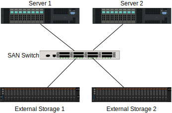
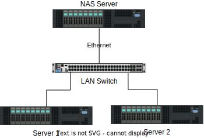

# 数据中心存储简介

[网络分布式系统和编程](https://www.baeldung.com/cs/tag/distributed-systems-and-programming)

[存储器](https://www.baeldung.com/cs/tag/memory)

1. 概述

    在本教程中，我们将讨论专业计算所使用的各类数据存储。在计算系统中，我们可以确定一些基本资源：处理数据的处理器单元（[CPU](https://www.baeldung.com/cs/cpu-guide)）、保存处理中数据的易失性内存（RAM）和持久性数据存储（以及其他数据输入/输出设备）。随着时间的推移，人们使用了许多技术和方法。我们将列举其中较为常见的技术和方法、它们之间的区别以及最佳使用场景。

2. 直接附加存储 - DAS

    我们首先想到的用于计算的海量存储设备是直连式存储（DAS）。在这种方法中，无论使用何种技术，磁盘都与安装在服务器上的 I/O 板相连。更先进的板卡具有磁盘热插拔、非易失缓存、集成镜像和纠错等功能。

    非易失性缓存可将断电时数据丢失的风险降至最低。镜像和纠错将使用一种称为低成本磁盘冗余阵列（[RAID](https://www.baeldung.com/cs/raid-intro)）的技术，可以是硬件辅助的，也可以是[基于软件](https://www.baeldung.com/linux/raid-intro)的。RAID 阵列分为不同级别，比较常见的有：

    - 0：多个磁盘堆叠在一起，形成一个较大的磁盘。为提高性能，数据会使用块对齐的方式分割并分配给所有磁盘。这样可以提高读写性能
    - 1：两个磁盘合并为一个磁盘，保存相同的数据。每个写入操作同时进入两个磁盘，而读取操作将进入较不繁忙的磁盘，从而提高读取性能
    - 1+0：上述安排的组合：创建一个更大的磁盘，具有完全冗余，并通过在多个磁盘之间分割数据来提高性能
    - 5 或 6：三个或更多磁盘组成一个结构，使用校验和进行数据冗余。这样，如果其中一个（RAID 5）或两个（RAID 6）磁盘出现故障，就可以根据剩余磁盘的冗余信息重建数据。由于需要计算校验和，写入性能没有那么好。
    RAID 级别 2、3 和 4 很少使用或从未使用过。对于传统的磁性硬盘驱动器来说，RAID 配置对提高性能更有意义。在这些情况下，磁头的机械运动会增加大量随机存取操作的延迟。不过，即使是现代固态硬盘（SSD）也能通过 RAID 阵列提高性能。

3. 存储区域网络 - SAN

    在较大的环境中，我们可以在外部机箱上安装磁盘，容纳数百甚至数千个单独的磁盘。在这种情况下，单台服务器很难有效地使用和管理过多的磁盘设备。此外，在这种情况下，让多台服务器看到相同的磁盘也很有用。一些分布式计算架构（如[集群](https://www.baeldung.com/cs/computer-clusters-types)）就需要这样做：

    

    尽管同一个磁盘柜可以为多个服务器提供服务，但它的扩展性并不好。例如，如果一台服务器在某一时刻没有交易，那么它的磁盘 I/O 通道就会处于空闲状态。因此，我们将失去使用大规模 RAID 配置所带来的部分性能提升。与之相反，我们可以使用存储网络交换机，在大量服务器之间复用对磁盘的访问。这就是我们所说的存储区域网络。它与标准局域网有很多相似之处，但使用的是存储感知特定接口和协议。它还可以添加一些存储虚拟化功能，向服务器隐藏每个存储机箱的分布和具体使用情况。另一个好处是，这些交换机可以将各种类型的存储（纯闪存存储、传统硬盘驱动器，甚至备份磁带驱动器）连接到多种类型的服务器，如 x86 或 RISC 服务器和大型机。当多台服务器需要访问大量磁盘，并要求高吞吐量和低延迟时，这种技术就非常有用。此外，服务器将 RAID 配置视为磁盘，这与直接连接存储的情况类似。这意味着服务器将使用其本地文件系统管理其中的数据。

4. 网络附加存储 - NAS

    虽然 SAN 可为服务器提供尽可能接近直接连接存储的访问，但有时最好还是在服务器之间共享文件。这正是我们长期以来一直使用 [Microsft SMB/CIFS 或 Posix NFS3/4](https://www.baeldung.com/cs/file-sharing-nfs-vs-smb-vs-cifs) 等分布式文件系统的原因。它们就是我们所说的网络区域存储的例子：

    

    在这种情况下，一台（或多台）服务器与其他服务器或客户端设备共享它们管理的文件（使用它们的存储、直接连接或通过存储区域网络）。其主要优点是文件系统由较少的服务器管理，从而简化了访问和管理。不过，由于增加了一些开销，其性能比前一种方法要低。例如，分布式文件系统必须处理多个客户端试图访问同一文件的情况。

5. 软件定义存储 - SDS

    我们必须了解的一个新趋势是软件定义存储。这种架构的前提是对所使用的存储硬件实现更高的抽象。在这种情况下，我们将存储虚拟化提升到一个更高的水平。它使用廉价的直接连接磁盘，不需要任何特殊用途的控制器（如 RAID 板），让软件定义存储来处理冗余、数据分布和访问。它还能以更低的成本添加更先进的虚拟化功能。例如，它可以进行重复数据删除、压缩、更多数据复制、更轻松地配置和停用存储节点。它甚至可以将存储集群分散到全球分布的数据中心，提供位置感知数据访问。也就是说，客户可以访问距离较近的存储节点上的数据。当然，这种抽象程度也会带来一些开销。不过，增加更多节点和优化数据分布可以缓解这一问题。大多数软件定义的存储都能优化数据分布，只需最少的用户干预。最后，虚拟存储可以有多种访问方法，如面向块、键/值存储或面向文件。这样，各种类型的客户端就可以使用同一个存储集群。这种架构正逐步成为大型分布式容器化部署的标准。存储节点甚至可以是容器本身。

6. 结论

    在本教程中，我们介绍了目前数据中心可用的主要存储架构。没有灵丹妙药，根据我们的需求，我们可能需要使用不同的架构。实际上，目前数据中心运行的所有架构都很常见。为每个系统部署选择合适的架构，可以极大地帮助实现所需的冗余、性能和功能。

## 相关文章

- [ ] [Introduction to Storage for Data Centers](https://www.baeldung.com/cs/storage-data-centers)