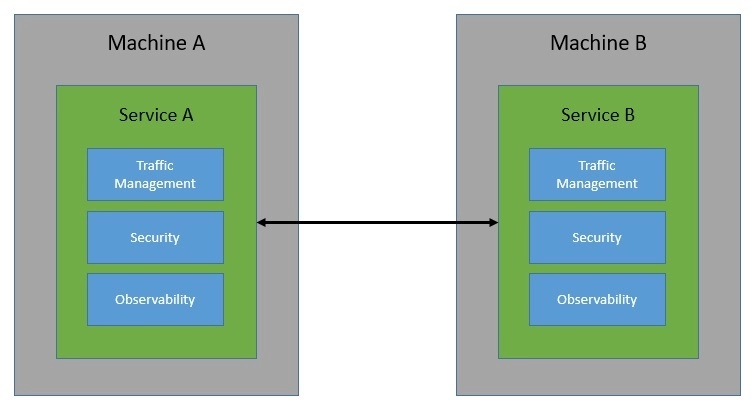
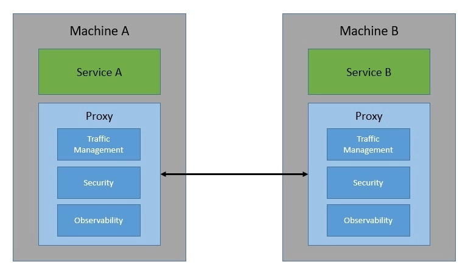
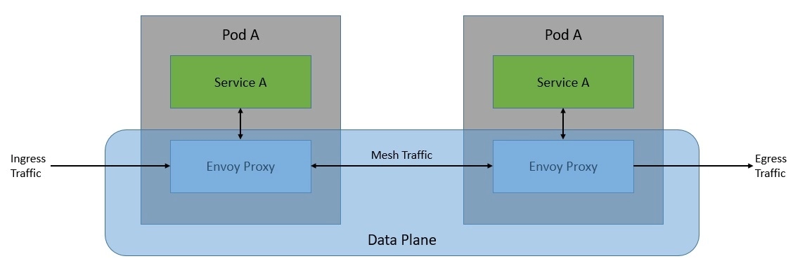
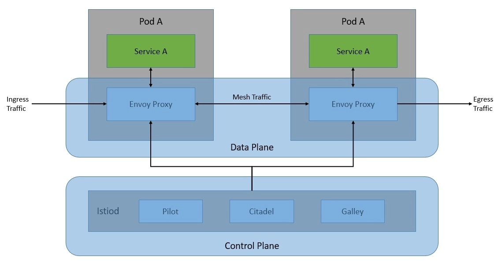
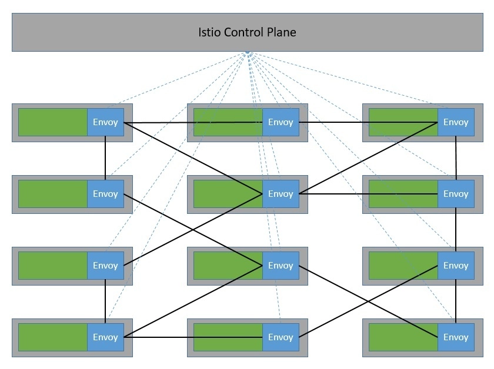
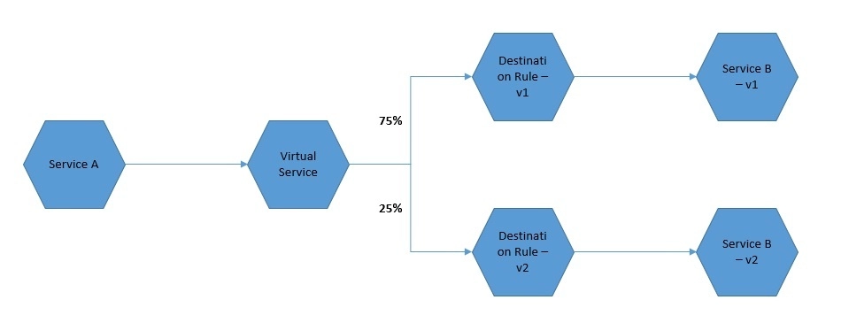
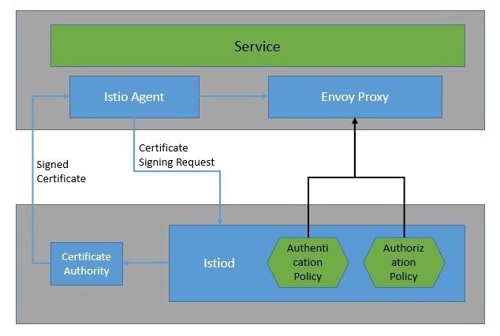
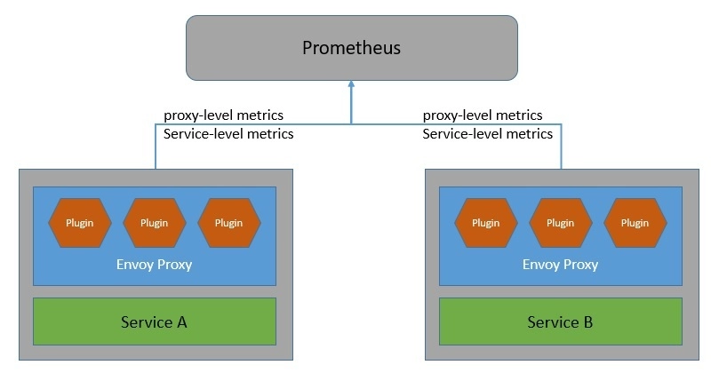
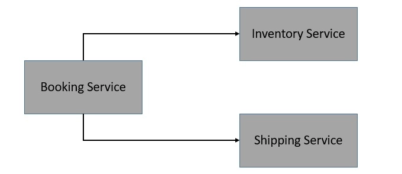

# [使用 Istio 的服务网格架构](https://www.baeldung.com/ops/istio-service-mesh)

1. 简介

    在本教程中，我们将介绍服务网格架构的基础知识，并了解它如何与分布式系统架构相辅相成。

    我们将主要关注 Istio，它是服务网格的一种实现。在此过程中，我们将介绍 Istio 的核心架构，并了解如何在 Kubernetes 上利用它。

2. 什么是服务网格？

    在过去的几十年里，我们已经看到单体应用程序是如何开始分解成更小的应用程序的。随着云原生计算和微服务架构的出现，它得到了前所未有的普及。此外，[Docker](https://www.docker.com/) 等容器化技术和 [Kubernetes](https://kubernetes.io/) 等编排系统也在这方面起到了推波助澜的作用。

    虽然在 Kubernetes 等分布式系统上采用微服务架构有很多优势，但它也有一定的复杂性。由于分布式服务必须相互通信，因此我们必须考虑发现、路由、重试和故障转移等问题。

    此外，我们还必须考虑其他一些问题，如安全性和可观察性：

    
 
    现在，在每个服务中构建这些通信功能可能会相当繁琐，当服务规模不断扩大、通信变得复杂时，情况更是如此。这正是服务网格可以帮助我们的地方。从根本上说，服务网格可以免除管理分布式软件系统中所有服务间通信的责任。

    服务网格实现这一功能的方式是通过一系列网络代理。从本质上讲，服务之间的请求通过代理进行路由，代理与服务并行运行，但位于基础设施层之外：

    

    这些代理基本上为服务创建了一个网状网络，因此被称为服务网！通过这些代理，服务网格能够控制服务间通信的方方面面。因此，我们可以用它来解决[分布式计算的八大谬误](https://en.wikipedia.org/wiki/Fallacies_of_distributed_computing)，这组断言描述了我们经常对分布式应用做出的错误假设。

3. 服务网格的特点

    现在让我们来了解一下服务网格可以为我们提供的一些功能。请注意，实际功能列表取决于服务网格的实现。但一般来说，我们应该期望所有实现方式都能具备其中的大部分功能。

    我们可以将这些功能大致分为三类：流量管理、安全性和可观测性。

    1. 流量管理

        流量管理是服务网格的基本功能之一。这包括动态服务发现和路由选择。它还支持一些有趣的用例，如流量阴影和流量分割。这些对于执行金丝雀(canary)发布和 A/B 测试非常有用。

        由于所有服务与服务之间的通信都由服务网格处理，因此它还能实现一些可靠性功能。例如，服务网格可以提供重试、超时、速率限制和断路器。这些开箱即用的故障恢复功能使通信更加可靠。

    2. 安全性

        服务网格通常还会处理服务间通信的安全问题。这包括通过相互 TLS（MTLS）执行流量加密，通过证书验证提供身份验证，以及通过访问策略确保授权。

        服务网格中还有一些有趣的安全用例。例如，我们可以实现网络分段，允许某些服务进行通信，同时禁止其他服务进行通信。此外，服务网格还能为审计要求提供精确的历史信息。

    3. 可观察性

        稳健的可观察性是处理分布式系统复杂性的基本要求。由于服务网格负责处理所有通信，因此它有能力提供可观察性功能。例如，它可以提供分布式跟踪信息。

        服务网格可以生成大量指标，如延迟、流量、错误和饱和度。此外，服务网格还能生成访问日志，提供每个请求的完整记录。这些记录对于了解单个服务和整个系统的行为非常有用。

4. Istio 简介

    [Istio](https://istio.io/latest/) 是服务网格的开源实现，最初由 IBM、Google 和 Lyft 开发。它可以在分布式应用程序上透明分层，并提供服务网格的所有优势，如流量管理、安全性和可观察性。

    它设计用于各种部署，如内部部署、云托管、Kubernetes 容器以及在虚拟机上运行的服务程序。虽然 Istio 是平台中立的，但它经常与部署在 Kubernetes 平台上的微服务一起使用。

    从根本上说，Istio 的工作原理是将 [Envoy 的扩展版本](https://www.envoyproxy.io/)作为代理部署到每个微服务中：

    

    代理网络构成了 Istio 架构的数据平面。这些代理的配置和管理由控制平面完成：

    

    控制平面基本上是服务网格的大脑。它在运行时为数据平面中的 Envoy 代理提供发现、配置和证书管理功能。

    当然，只有当我们拥有大量相互通信的微服务时，才能发挥 Istio 的优势。在这里，侧车代理在专用基础设施层中形成了一个复杂的服务网：

    

    Istio 在与外部库和平台集成方面非常灵活。例如，我们可以将 Istio 与外部日志平台、遥测或策略系统集成。

5. 了解 Istio 组件

    我们已经看到，Istio 架构由数据平面和控制平面组成。此外，还有几个核心组件使 Istio 能够发挥作用。

    在本节中，我们将详细介绍这些核心组件。

    1. 数据平面

        Istio 的数据平面主要包括 Envoy 代理的扩展版本。Envoy 是一种开源的边缘和服务代理，有助于将网络问题与底层应用程序分离。应用程序只需向本地主机发送和接收消息，而无需了解网络拓扑结构。

        Envoy 的核心是在 [OSI 模型](https://en.wikipedia.org/wiki/OSI_model)的 L3 和 L4 层运行的网络代理。它通过使用一连串可插拔的网络过滤器来执行连接处理。此外，Envoy 还支持额外的 L7 层过滤器，用于处理基于 HTTP 的流量。此外，Envoy 还对 HTTP/2 和 gRPC 传输提供一流的支持。

        Istio 作为服务网格提供的许多功能实际上是通过 Envoy 代理的底层内置功能实现的：

        - 流量控制： Envoy 可通过丰富的路由规则对 HTTP、gRPC、WebSocket 和 TCP 流量进行细粒度流量控制。
        - 网络弹性： Envoy 包括对自动重试、断路和故障注入的开箱即用支持
        - 安全性： Envoy还能执行安全策略，对底层服务之间的通信实施访问控制和速率限制

        Envoy 与 Istio 配合如此默契的另一个原因是它的可扩展性。Envoy 提供了基于 WebAssembly 的可插拔扩展模型。这在自定义策略执行和遥测生成方面非常有用。此外，我们还可以使用基于 Proxy-Wasm 沙箱 API 的 Istio 扩展来扩展 Istio 中的 Envoy 代理。

    2. 控制平面

        如前所述，控制平面负责管理和配置数据平面中的 Envoy 代理。控制平面中负责这一工作的组件是 istiod。在这里，istiod 负责将高级路由规则和流量控制行为转换为 Envoy 特定的配置，并在运行时将它们传播到侧车。

        如果我们回顾一下前段时间 Istio 控制平面的架构，就会发现它曾经是一组相互协作的独立组件。它由用于服务发现的 Pilot、用于配置的 Galley、用于证书生成的 Citadel 和用于扩展的 Mixer 等组件组成。由于其复杂性，这些独立组件被合并为一个名为 istiod 的组件。

        在核心部分，istiod 使用的代码和应用程序接口与之前的单个组件相同。例如，Pilot 负责抽象特定平台的服务发现机制，并将其合成为一种标准格式，供 sidecars 使用。因此，Istio 可以支持 Kubernetes 或虚拟机等多种环境的发现。

        此外，istiod 还能提供安全性，通过内置身份和凭证管理实现强大的服务对服务和终端用户身份验证。此外，有了 istiod，我们可以根据服务身份执行安全策略。istiod 进程还充当证书颁发机构（CA），并生成证书，以促进数据平面中的相互 TLS（MTLS）通信。

6. Istio 如何工作

    我们已经了解了服务网格的典型功能。此外，我们还了解了 Istio 架构及其核心组件的基础知识。现在，是时候了解 Istio 如何通过其架构中的核心组件提供这些功能了。

    我们将重点关注前面介绍过的几类功能。

    1. 流量管理

        我们可以使用 Istio 流量管理 API 对服务网格中的流量进行细粒度控制。我们可以使用这些 API 向 Istio 添加自己的流量配置。此外，我们还可以使用 Kubernetes 自定义资源定义（CRDs）来定义 API 资源。帮助我们控制流量路由的关键 API 资源是虚拟服务和目的地规则：

        

        基本上，虚拟服务可让我们配置如何将请求路由到 Istio 服务网格中的服务。因此，虚拟服务由一个或多个路由规则组成，这些规则会按顺序进行评估。在对虚拟服务的路由规则进行评估后，就会应用目的地规则。目的地规则可帮助我们控制通往目的地的流量，例如，按版本对服务实例进行分组。

    2. 安全性

        Istio 的安全性始于为每个服务提供强大的身份。与每个 Envoy 代理一起运行的 Istio 代理可与 istiod 协作，自动轮换密钥和证书：

        

        Istio 提供两种类型的身份验证--对等身份验证和请求身份验证。对等身份验证用于服务对服务身份验证，Istio 提供相互 TLS 作为全栈解决方案。请求身份验证用于最终用户身份验证，Istio 使用自定义身份验证提供商或 OpenID Connect (OIDC) 提供商提供 JSON Web 令牌（JWT）验证。

        Istio 还允许我们通过简单地将授权策略应用于服务来对服务实施访问控制。授权策略会对 Envoy 代理中的入站流量实施访问控制。有了它，我们可以在不同层次上应用访问控制：网状、命名空间和服务范围。

    3. 可观察性

        Istio 会生成详细的遥测(telemetry)数据，如网格内所有服务通信的指标、分布式跟踪和访问日志。Istio 会生成丰富的代理级指标、面向服务的指标和控制平面指标。

        早期，Istio 遥测架构包括作为中心组件的 Mixer。但从遥测 v2 开始，Mixer 提供的功能被 Envoy 代理插件取代：

        

        此外，Istio 还通过 Envoy 代理生成分布式跟踪。Istio 支持许多跟踪后端，如 [Zipkin](https://zipkin.io/)、[Jaeger](https://www.jaegertracing.io/)、[Lightstep](https://lightstep.com/) 和 [Datadog](https://www.datadoghq.com/)。我们还可以控制跟踪生成的采样率。此外，Istio 还能以一组可配置的格式生成服务流量的访问日志。

7. Istio 实践

    既然我们已经了解了足够多的背景知识，那么现在就可以看看 Istio 的实际操作了。首先，我们将在 Kubernetes 集群中安装 Istio。此外，我们将使用一个简单的基于微服务的应用程序来演示 Istio 在 Kubernetes 上的功能。

    1. 安装

        安装 Istio 有多种方法，但最简单的方法是下载并解压特定操作系统（如 Windows）的最新版本。解压缩后的软件包 bin 目录中包含 istioctl 客户端二进制文件。我们可以使用 istioctl 在目标 Kubernetes 集群上安装 Istio：

        `istioctl install --set profile=demo -y`

        这将使用演示配置文件在默认 Kubernetes 集群上安装 Istio 组件。我们也可以使用任何其他供应商特定的配置文件来代替演示配置文件。

        最后，我们需要指示 Istio 在该 Kubernetes 集群上部署任何应用程序时自动注入 Envoy sidecar 代理：

        `kubectl label namespace default istio-injection=enabled`

        我们在这里使用 kubectl 时，假设 [Minikube](https://kubernetes.io/docs/tutorials/hello-minikube/) 等 Kubernetes 集群和 Kubernetes CLI kubectl 已经在我们的机器上可用。

    2. 示例应用

        为了演示的目的，我们设想一个非常简单的在线下单应用程序。该应用程序由三个微服务组成，它们相互交互以满足最终用户的订单请求：

        

        我们不会详细介绍这些微服务，但使用 Spring Boot 和 REST API 创建这些微服务非常简单。最重要的是，我们要为这些微服务创建一个 Docker 镜像，以便将它们部署到 Kubernetes 上。

    3. 部署

        在 Kubernetes 集群（如 Minikube）上部署容器化工作负载相当简单。我们将使用部署和服务资源类型来声明和访问工作负载。通常，我们在 YAML 文件中定义它们：

        这是订单服务的部署和服务的一个非常简单的定义。同样，我们也可以为库存服务和发货服务定义 YAML 文件。

        ```yml
        apiVersion: apps/v1beta1
        kind: Deployment
        metadata:
        name: order-service
        namespace: default
        spec:
        replicas: 1
        template:
            metadata:
            labels:
                app: order-service
                version: v1
            spec:
            containers:
            - name: order-service
                image: kchandrakant/order-service:v1
                resources:
                requests:
                    cpu: 0.1
                    memory: 200
        ---
        apiVersion: v1
        kind: Service
        metadata:
        name: order-service
        spec:
        ports:
        - port: 80
            targetPort: 80
            protocol: TCP
            name: http
        selector:
            app: order-service
        ```

        使用 kubectl 部署这些资源也非常简单：

        `kubectl apply -f booking-service.yaml -f inventory-service.yaml -f shipping-service.yaml`

        由于我们已为默认命名空间启用了 Envoy sidecar 代理的自动注入功能，因此一切都将由我们来处理。或者，我们也可以使用 istioctl 的 kube-inject 命令手动注入 Envoy sidecar 代理。

    4. 访问应用程序

        现在，Istio 主要负责处理所有网格流量。因此，默认情况下不允许任何往来于网状网络外部的流量。Istio 使用网关来管理网状结构的入站和出站流量。这样，我们就能精确控制进出网格的流量。Istio 提供了一些预配置的网关代理部署：istio-ingressgateway 和 istio-egressgateway。

        我们将为应用程序创建一个网关和一个虚拟服务来实现这一点：

        ```yml
        apiVersion: networking.istio.io/v1alpha3
        kind: Gateway
        metadata:
        name: booking-gateway
        spec:
        selector:
            istio: ingressgateway
        servers:
        - port:
            number: 80
            name: http
            protocol: HTTP
            hosts:
            - "*"
        ---
        apiVersion: networking.istio.io/v1alpha3
        kind: VirtualService
        metadata:
        name: booking
        spec:
        hosts:
        - "*"
        gateways:
        - booking-gateway
        http:
        - match:
            - uri:
                prefix: /api/v1/booking
            route:
            - destination:
                host: booking-service
                port:
                number: 8080
        ```

        在这里，我们使用的是 Istio 提供的默认入口控制器。此外，我们还定义了一个虚拟服务，用于将我们的请求路由到预订服务。

        同样，我们也可以定义一个出口网关，用于处理来自网格的出站流量。

8. Istio 的常见用例

    现在，我们已经了解了如何使用 Istio 在 Kubernetes 上部署一个简单的应用程序。但是，我们仍然没有利用 Istio 为我们带来的任何有趣功能。在本节中，我们将介绍服务网格的一些常见用例，并了解如何使用 Istio 为我们的简单应用程序实现这些用例。

    1. 请求路由

        我们希望以特定方式处理请求路由有多种原因。例如，我们可能会部署多个版本的微服务（如 shipping-service），并希望只将一小部分请求路由到新版本。

        为此，我们可以使用虚拟服务的路由规则：

        ```yml
        apiVersion: networking.istio.io/v1alpha3
        kind: VirtualService
        metadata:
        name: shipping-service
        spec:
        hosts:
            - shipping-service
        http:
        - route:
            - destination:
                host: shipping-service
                subset: v1
            weight: 90
            - destination:
                host: shipping-service
                subset: v2
            weight: 10
        ---
        apiVersion: networking.istio.io/v1alpha3
        kind: DestinationRule
        metadata:
        name: shipping-service
        spec:
        host: shipping-service
        subsets:
        - name: v1
            labels:
            version: v1
        - name: v2
            labels:
            version: v2
        ```

        路由规则还允许我们根据头参数等属性定义匹配条件。此外，目的地字段指定了符合条件的流量的实际目的地。

    2. 断路器

        断路器基本上是一种软件设计模式，用于检测故障并封装防止故障进一步连锁的逻辑。这有助于创建弹性微服务应用程序，从而限制故障和延迟峰值的影响。

        在 Istio 中，我们可以使用 DestinationRule 中的 trafficPolicy 配置，在调用 inventory-service 等服务时应用断路：

        ```yml
        apiVersion: networking.istio.io/v1alpha3
        kind: DestinationRule
        metadata:
        name: inventory-service
        spec:
        host: inventory-service
        trafficPolicy:
            connectionPool:
            tcp:
                maxConnections: 1
            http:
                http1MaxPendingRequests: 1
                maxRequestsPerConnection: 1
            outlierDetection:
            consecutive5xxErrors: 1
            interval: 1s
            baseEjectionTime: 3m
            maxEjectionPercent: 100
        ```

        在这里，我们将 DestinationRule 的 maxConnections 配置为 1，httpMaxPendingRequests 配置为 1，maxRequestsPerConnection 配置为 1。 这实际上意味着，如果并发请求数超过 1，断路器就会开始捕获部分请求。

    3. 启用相互 TLS

        相互验证是指双方在 TLS 等验证协议中同时相互验证。默认情况下，在 Istio 中，有代理的服务之间的所有流量都使用相互 TLS。不过，没有代理的服务仍会继续接收纯文本流量。

        虽然 Istio 会自动将带代理服务之间的所有流量升级为互通 TLS，但这些服务仍可接收纯文本流量。我们有一个选项，可通过 PeerAuthentication 策略在全网范围内强制执行相互 TLS：

        ```yml
        apiVersion: "security.istio.io/v1beta1"
        kind: "PeerAuthentication"
        metadata:
        name: "default"
        namespace: "istio-system"
        spec:
        mtls:
            mode: STRICT
        ```

        我们还可以选择在每个命名空间或服务而不是全网状空间强制执行互用 TLS。不过，特定服务的 PeerAuthentication 策略优先于整个命名空间的策略。

    4. 使用 JWT 进行访问控制

        JSON 网络令牌（[JWT](https://jwt.io/)）是一种用于创建数据的标准，其有效载荷中的 JSON 申明了一些主张。这已被广泛接受，用于在身份提供商和服务提供商之间传递已验证用户的身份和标准或自定义声明。

        我们可以在 Istio 中启用授权策略，允许访问基于 JWT 的预订服务等服务：

        ```yml
        apiVersion: security.istio.io/v1beta1
        kind: AuthorizationPolicy
        metadata:
        name: require-jwt
        namespace: default
        spec:
        selector:
            matchLabels:
            app: booking-service
        action: ALLOW
        rules:
        - from:
            - source:
            requestPrincipals: ["testing@baeldung.com/testing@baeldung.io"]
        ```

        在这里，AuthorizationPolicy 会强制要求所有请求都必须具有有效的 JWT，并将 requestPrincipal 设置为特定值。Istio 结合 JWT 的 iss 和 sub 索赔创建了 requestPrincipal 属性。

9. 后记

    至此，我们已经看到 Istio 这样的服务网格是如何让我们更轻松地处理微服务等分布式架构中的一些常见问题的。但尽管如此，Istio 还是一个复杂的系统，增加了部署的复杂性。与其他技术一样，Istio 也不是万能的，在使用时必须充分考虑。

    1. 我们是否应该始终使用服务网格？

        虽然我们已经看到了足够多使用服务网格的理由，但还是要列举一些可能促使我们不使用服务网格的原因：

        - 服务网格处理所有服务与服务之间的通信，但需要支付部署和运行服务网格的额外费用。对于较简单的应用来说，这可能是不合理的
        - 由于我们已经习惯于在应用程序代码中处理断路等问题，这可能会导致在服务网格中重复处理这些问题
        - 增加对外部系统（如服务网格）的依赖可能不利于应用程序的可移植性，尤其是在服务网格没有行业标准的情况下。
        - 由于服务网格通常是通过代理拦截网格流量来工作的，因此可能会给请求增加不必要的延迟
        - 服务网格增加了许多需要精确处理的额外组件和配置；这需要专业知识，并增加了学习曲线
        - 最后，我们可能会将本应存在于服务网格中的操作逻辑与本不应存在于服务网格中的业务逻辑混为一谈。

        因此，正如我们所看到的，服务网格的故事并不全是好处，但这并不意味着这些好处不是真的。对我们来说，重要的是仔细评估我们的需求和应用程序的复杂性，然后权衡服务网格的好处和增加的复杂性。

    2. Istio 的替代方案有哪些？

        虽然 Istio 颇受欢迎，并得到了业界一些领导者的支持，但它肯定不是唯一的选择。虽然我们无法在此进行全面比较，但让我们来看看 Linkerd 和 Consul 这两个选项。

        [Linkerd](https://linkerd.io/) 是为 Kubernetes 平台创建的开源服务网格。它也相当受欢迎，目前是 [CNCF](https://www.cncf.io/) 的孵化项目。它的工作原理与 Istio 等其他服务网格类似。它还使用 TCP 代理来处理网格流量。Linkerd 使用用 Rust 编写的微型代理，称为 Linkerd-proxy。

        总的来说，考虑到 Linkerd 仅支持 Kubernetes，它没有 Istio 那么复杂。但除此之外，Linkerd 的可用功能列表与 Istio 非常相似。Linkerd 的核心架构也与 Istio 非常相似。基本上，Linkerd 包括三个主要组件：用户界面、数据平面和控制平面。

        [Consul](https://www.consul.io/) 是 [HashiCorp](https://www.hashicorp.com/) 服务网格的开源实现。它的优点是能与 HashiCorp 的其他基础设施管理产品套件很好地集成，从而提供更广泛的功能。Consul 的数据平面可灵活支持代理和本地集成模型。它内置了一个代理，但也可以与 Envoy 配合使用。

        除了 Kubernetes，Consul 还能与 [Nomad](https://www.nomadproject.io/) 等其他平台协同工作。Consul 通过在每个节点上运行 Consul 代理来执行健康检查。这些代理与一个或多个存储和复制数据的 Consul 服务器通信。虽然它提供了 Istio 等服务网格的所有标准功能，但部署和管理起来却更为复杂。

10. 总结

    总之，在本教程中，我们介绍了服务网格模式的基本概念及其提供的功能。特别是，我们了解了 Istio 的细节。这包括 Istio 的核心架构及其基本组件。此外，我们还详细介绍了如何在一些常见用例中安装和使用 Istio。
