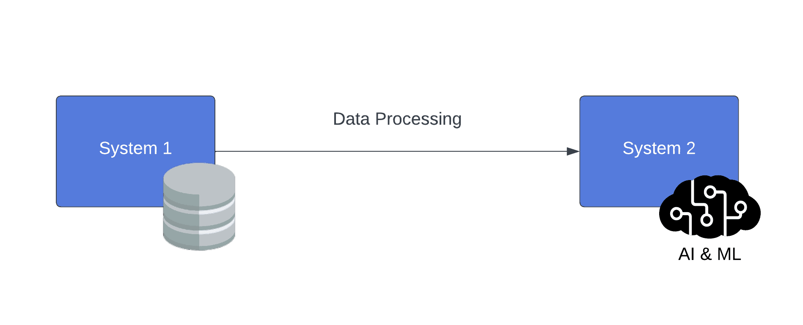
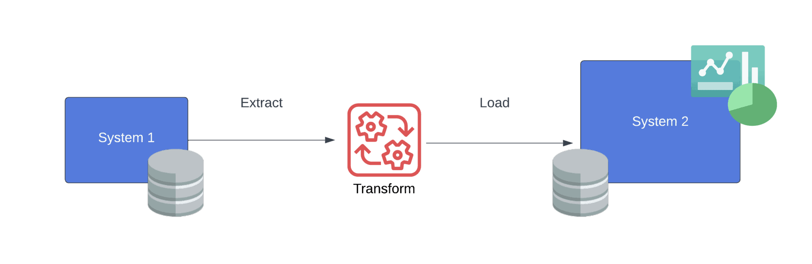
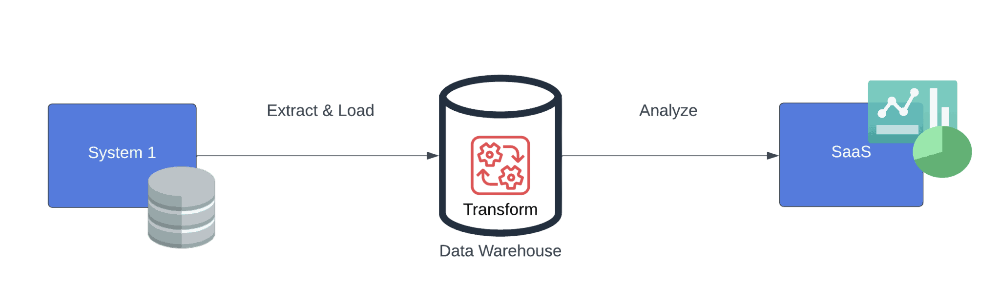
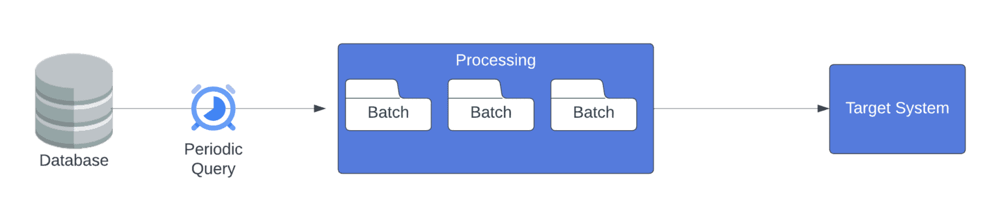
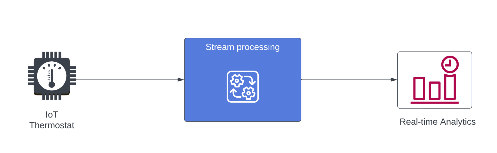

# [什么是数据管道？](https://www.baeldung.com/cs/data-pipelines)

1. 简介

    在本教程中，我们将了解数据管道--此类系统可将数据从一个数据源传输到一个目的地。

    大多数现代应用程序都要处理不断记录到系统中的数据交易。但是，需要简化数据传输过程，以便进一步深入了解和分析。例如，企业需要一个可靠的实施方案，为商业智能或其他用例传输大量数据。

    我们将介绍构成数据管道架构的所有组件以及一些常见的处理机制。最后，我们还将提及业内常见的实际用例。

2. 数据管道

    数据管道指的是一个过程，在这个过程中，数据有一个来源或源头，然后被传输到目的地，在目的地可以对数据进行不同的解释。它也被称为将数据从源系统传输到目标系统的系统。然而，数据管道处理数据的目的是将其转化为有意义的信息并存储起来，以便进一步深入了解。

    公司和组织出于商业智能目的处理大型数据集。它们获取或生成数据，以提高收入、分析客户或识别模式。然而，管理大数据的许多复杂问题之一是处理原始的非结构化信息。换句话说，要理解大量数据是很困难的，尤其是在数据没有经过过滤或格式化以进行特定分析的情况下。然而，数据管道提供了从消费原始数据、准备分析数据到将数据加载到专用数据存储的端到端流程。

    总体而言，大多数系统都是为理解特定数据格式而设计的。然而，这些数据的来源并不一定是按照能够运行业务分析的系统进行结构化的。因此，我们实施了数据管道，以协助将分析就绪的数据传送到适当的目的地：

    

    接下来，我们将定义数据管道的组成部分，并解释它们在流程中的用途。

3. 原点

    原点是数据管道的源组件。即数据存储系统，如数据库或其他生成实时数据的应用程序。该组件可为其他应用程序提供必要的信息，并纳入我们的管道。不过，设备或其他应用可能会生成表格数据或流式数据，这些数据可能需要先进行汇总，然后才能讲述有意义的故事。

    通常情况下，起源组件是任何根据请求提供数据或数据流的设备、存储或服务。例如，以提供数据为唯一目的的 API 端点或存储记录的 SQL 数据库都属于源组件。此外，原点决定了管道的下一层。例如，一个物联网管道有一个向 MQTT 消息代理发布数据点的传感器，它需要一个用户服务来处理数据流。另一方面，数据消化层可以定期从关系数据库中提取数据，复杂性较低。

    数据管道可以由多个数据源组成。在这种情况下，目标是将不同来源的数据整合到一个中心枢纽。不足为奇的是，源组件可能与目的组件不同。例如，数据湖和[数据仓库](https://www.baeldung.com/cs/data-warehouses)都是可用于管道两端的数据库系统。

4. 目的地

    数据管道将数据输送到最终组件，即目的地或目标系统。目的地的目的是以正确的方案呈现数据，供其他工具使用。同样，数据管道有目的地，数据也有最终状态，不同的应用程序希望这些信息处于不同的状态。因此，数据存储系统是保存这些数据的理想目标系统。有趣的是，目标系统很可能是另一个数据库，就像原点一样。

    目标系统希望数据处于正确的模式中，并可随时进行分析。由于该组件是管道中的最后一个端点，因此高度依赖于用例。例如，合并和提炼数据，然后将其保存在关系记录系统中，数据仓库就是这种情况下的合适目的地。另外，托管机器学习模型、商业智能平台和数据可视化工具的服务也是重要的数据输入应用。

    数据管道的目的地是数据在经过流程中的每个组件后的最终状态。数据可能已经过调整、过滤和汇总。不过，目标系统（如报告平台）代表了数据管道最初构建时的业务用例。

5. 处理

    将数据从源系统传输到目标系统时，数据管道会在交付数据前对其进行处理。通过这一步骤，目标系统可以接收到预期格式的数据。此外，如何进行数据处理也有多种实现方式。

    1. ETL

        ETL 是一种常见的管道架构，代表提取、转换和加载。管道中的每个层或组件负责对数据执行特定操作。顾名思义，操作顺序是先提取数据，将其转换为所需格式，然后加载到存储系统：

        

        这种架构常用于数据迁移以及连接多个来源的数据。此外，它还与结构化数据和关系数据有关，因此需要在数据仓库中存储信息。因此，为了更灵活地处理数据，人们发明了一种更现代的方法，即 ELT。

    2. ELT

        ELT 是提取、加载和转换的缩写，已成为企业简化数据流程的常用方法。主要有两个原因： 首先，大型企业正在将工作流程迁移到云端，同时需要以多种格式存储大量数据。其次，快速处理数据以获得业务洞察力的需求大幅增长，导致企业需要寻求更有效的数据集成流程：

        

        使用 ELT 方法，转换发生在数据存储处。这意味着 ELT 利用了云存储系统的先进技术。这些存储服务旨在以更好的处理能力和高效的大数据查询来处理大量数据。

    3. 批处理

        批处理管道按计划消耗一组固定的数据，并将其加载到数据存储中。换句话说，这些管道定期运行批处理作业来移动数据块。因此，我们为不具有时间敏感性的工作流实施批处理管道，这些工作流可能会连接多个数据源：

        

        此外，批处理管道在后台运行，无需承诺生成响应。我们称之为离线系统。换句话说，它们只是在特定时间间隔收集数据，并在用户不参与的情况下生成输出。我们通过计算吞吐量（处理输入数据集所需的时间）来衡量批处理作业的性能。

    4. 实时（流）处理

        实时系统接收数据流（随时间传递的无限制数据），并在数据流发生时对其进行处理。数据流的形式多种多样，包括但不限于信息、音频、视频和网络流量。如今，许多软件系统都要处理这些数据，以尽可能低的延迟产生输出：

        

        与批处理作业不同，[流式传输管道](https://www.baeldung.com/spring-cloud-data-flow-stream-processing)中的组件会收到数据事件通知，而不是从数据存储库轮询数据，从而使系统能够在必要时做出快速响应。针对每一个事件，都可以汇总指标和实时分析，以获得业务洞察力。此外，实时事件或媒体文件也是流式数据的常见用例。

6. 使用案例

    1. 惠普企业的实时处理管道

        惠普企业在全球拥有 200 多亿个传感器，为客户管理数据中心基础设施。他们的 InfoSight 产品是一种 PaaS，可提供几乎实时的分析和性能。为此，Hewlett Packard Enterprise 构建了一个强大的架构，以利用流处理管道来移动 PB 级数据、保持系统可用性，并在执行大量数据和转换的情况下保持低延迟。

    2. iHeartRadio 的 ETL 管线

        iHeartRadio 是一家提供音乐、播客和广播的全球性流媒体服务公司。尽管是流媒体服务，该公司也在内部运行数据流，将数据从源移动到目的地--这是一种典型的 ETL 方法。然而，并非所有数据流都符合 ETL 模式；有些数据流结合了 ETL 流程和 ELT。他们创建了一个混合版本，命名为 ETLT，在已处理数据的基础上运行转换。通过这个例子，iHeartRadio 展示了公司如何根据自身需要调整数据传输。

7. 结论

    在本文中，我们了解了数据管道 - 一种将数据从源头传输到目的地的技术。我们介绍了最基本的架构，其中包括三个组件：源、处理组件和目的地。此外，我们还解释了实现方式如何根据数据类型和用例而有所不同。

    我们了解了数据管道如何作为一种手段，将数据转换为分析就绪的状态，以获得业务洞察力。此外，我们还提到了两个大公司利用数据管道加强涉及大量数据的工作流程的真实案例。
