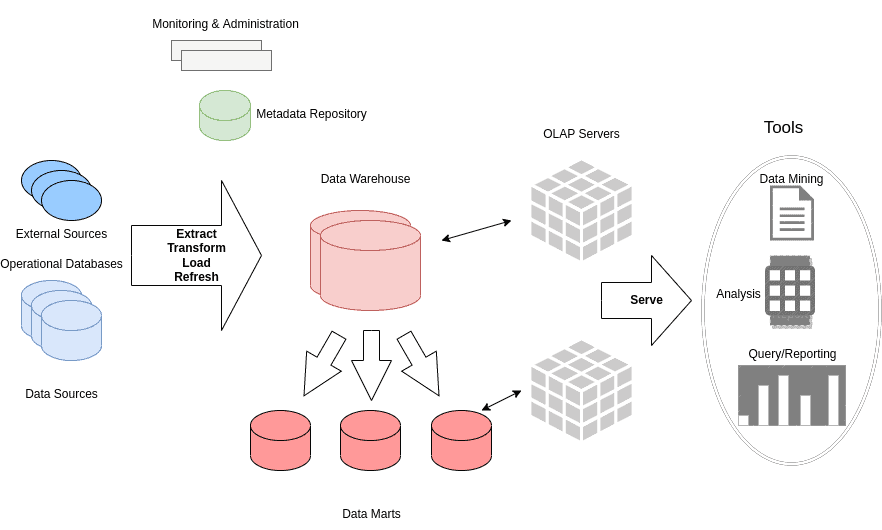

# [什么是数据仓库？](https://www.baeldung.com/cs/data-warehouses)

1. 简介

    [Allied Market Research](https://www.alliedmarketresearch.com/) 在 2021 年发布的一份研究报告中预计，到 2028 年，全球数据仓库市场规模将增至 511.8 亿美元。

    在本教程中，我们将讨论数据仓库（DW），这是一种用于分析的集中式管理技术。我们将主要介绍 DW 的架构，并介绍其关键因素和主要组件。我们将把典型的 DW 与[数据库](https://en.wikipedia.org/wiki/Database)和[数据湖](https://en.wikipedia.org/wiki/Data_lake)进行比较，并讨论 DW 最常见的应用和用法。

2. 数据仓库的设计

    数据仓库由 [Bill Inmon](https://en.wikipedia.org/wiki/Bill_Inmon) 于 1970 年左右首次提出，其最初目标是促进[数据管道](https://www.baeldung.com/iot-data-pipeline-mqtt-nifi)从原始的非结构化数据转化为有效的盈利决策。

    数据仓库主要被定义为有助于决策任务的数据收集的集中式组织档案库。数据仓库的目的是定期从不同类型的来源、事务系统或关系数据库中收集、存储和分析有用且有意义的信息，以提高组织或公司的绩效。

    1. 数据仓库的架构

        典型数据仓库系统的架构如下，主要基于四个不同的组件。负载、仓库和[查询](https://www.baeldung.com/jpa-queries)管理器，以及一些终端用户访问工具：

        

        我们可以看到，原始数据是从不同来源收集的。首先，对提取的数据进行清理，并转换成所需的形式，以便放入数据仓库。通常使用标准接口和网关（如探索性数据分析（[EDA](https://www.baeldung.com/spark-mlib-machine-learning)）和 [SQL](https://www.baeldung.com/sql-joins)）来实现数据提取。需要注意的是，尽管数据会定期更新，使数据仓库与时俱进，但历史数据不会被永久删除。

        此外，还有几种面向主题的数据集市，它们基本上是数据仓库的缩小版，专注于特定流程，可以很容易地为特殊目的进行定制。

        此外，还有元数据管理，即作为目录的数据仓库路线图，其任务是定位某些数据。管理元数据包括建立和运行仓库所需的所有数据。

        最后，数据存储库可以被访问并用于分析、查询和报告，以及另一端的[挖掘](https://www.baeldung.com/cs/big-data-vs-data-mining)，包括可视化和展示工具。

3. 数据仓库的特点

    根据 Bill Inmon 的定义，数据仓库是 "面向主题的、集成的、随时间变化的、非易失性的数据集合，主要用于组织决策"。这些是数据仓库区别于其他系统的主要特征。

    1. 面向主题

        数据仓库是以主题为导向的，因为它们可以专注于某项任务，并从特定的数据领域而不是组织的整体信息中生成分析和报告。这些主题可以是产品、客户、销售库存或公司的供应链。

    2. 综合

        大多数企业都希望使用集成的企业仓库，收集所有主题（如产品、销售和员工）的数据。数据仓库满足了这一需求，因为数据是以一致和标准化的方式保存在仓库中的，而且数据类型各不相同。

    3. 时间变化

        数据仓库中收集的信息包含时间戳，典型的数据仓库会根据定期计划考虑整个时间段的更新和变化。此外，数据仓库还存储历史数据。另一方面，事务系统通常只保存最新信息。

    4. 非易失性

        数据仓库的数据是非易失性的，即不可更改。当提供新数据时，历史数据不会被删除。这支持对何时发生的情况进行分析，并有助于生成有意义的模式或可视化信息以及得出结论。

4. 数据仓库的类型

    企业数据仓库（EDW）、业务数据存储（ODS）和数据集市是数据仓库的三种主要形式。

    1. 企业数据仓库

        企业数据仓库（EDW）也是一种集中式仓库，通常由多个数据库组成，这些数据库提供一种一致的方法，用于按特定主题、方法或变量对数据进行归类、排列和分类。

    2. 正式文件系统

        正式文件系统用于实际报告、记录、管理和决策，是 EDW 的辅助功能。由于不断更新，ODS 经常用于日常工作。

    3. 数据集市

        数据集市是数据仓库的一个组成部分，旨在管理某个部门、领域或业务线。ODS 定期从数据集市中存储数据。数据随后从 ODS 传输到 EDW，并在 EDW 中使用和存档。

5. 在线分析处理

    联机分析处理（OLAP）是一种将数据从外部加载和传输到数据仓库、从中生成有价值信息并支持查询的方法。大多数 OLAP 程序在很大程度上依赖于查询，并经常使用数据仓库中的数据。数据仓库中的联机分析处理利用指标进行建模、规划或预测，可以快速计算统计业务数据。

    出于数据挖掘、分析和其他目的，OLAP 对从 OLTP 数据库和其他来源收集的大量历史数据进行复杂的查询。

    1. OLAP 和 OLTP

        联机事务处理（OLTP）允许多个用户通常通过互联网实时进行大量数据库事务处理和安排。OLAP 和 OLTP 的主要区别在于，每个系统都是为处理不同类型的操作而设计的。

        OLAP 可以实现对数据的广泛分析，以便做出更好的决策。相反，OLTP 是为使用客户自助服务的应用程序处理大量事务而设计的。

6. 数据仓库、数据库和数据湖

    从根本上说，数据库、数据仓库和数据湖主要各有不同，其设计目的也不尽相同。

    运行单一应用程序所需的数据保存在数据库中。因此，单片式架构是数据库的理想选择，在这种架构中，所有数据都由单个应用程序生成。另一方面，DW 的设计目的是支持可能来自多个组织部门的海量信息。

    此外，数据湖还维护来自一个或多个系统的不同数据类型的原始（结构化或非结构化）数据，包括最新数据和旧数据。数据湖被广泛用于机器学习应用预测建模和统计分析。相反，由于其结构良好，数据湖适合战略决策和有计划地使用数据。最后，数据湖的数据利用方法是提取、加载和转换，而 DW 的数据利用方法是提取、转换和加载。

7. 数据仓库的优势和局限性

    数据仓库的主要优点是能够存储、分析大量不同的数据并从中获取价值，同时保留历史档案以提高单项任务的性能。此外，数据仓库还能快速检索数据，包括识别和纠正错误，并提供便捷的集成，因为它能将数据转换为更易读和简单的格式。

    相反，数据仓库需要耗费大量时间进行准备和设置，因为大部分工作都涉及将原始数据手动插入数据仓库。此外，由于需要不断更新数据仓库，可能存在兼容性问题和维护费用。最后，在需要管理机密信息的情况下，数据仓库提供的实用性受到限制。

8. 数据仓库的应用

    数据科学家和机器学习工程师可以在工作中简单地使用数据仓库中的信息，因为数据仓库具有高度组织化的结构。数据仓库在现实世界中的一个常见应用是银行和金融业，其中，数据仓库可用于获取有关客户存款、贷款和资金的信息。采用正确的方法，银行业可以检查消费者的成本，并制定更有效的计划来增加双方的收入。

    DW 的另一个经常应用领域是电子商务平台，它可以从广告方法和营销策略中提取重要的营销信息（如喜欢、浏览量和网站访问量），并利用这些信息更好地与目标群体和潜在客户互动。

    此外，数据仓库还广泛应用于医疗保健数据存储、农业技术、零售管理以及商品和日常产品的制造和分销。

    最广为人知的 DW 包括 Amazon Redshift、Google BigQuery、IBM Db2 Warehouse 和 Microsoft Azure Synapse。

9. 结论

    几乎每个现代组织都需要 DW 来提高绩效和利润。这凸显了数据仓库的持续重要性，以及投资适当和最合适的数据仓库技术的必要性。

    本文介绍了数据仓库。其中，我们主要介绍了数据仓库的架构和结构，讨论了数据仓库的主要特点以及数据仓库、数据库和数据湖之间的主要区别。我们还讨论了数据仓库的基本优势和局限性。最后，我们提到了 DW 在现实世界中的任务和应用。
