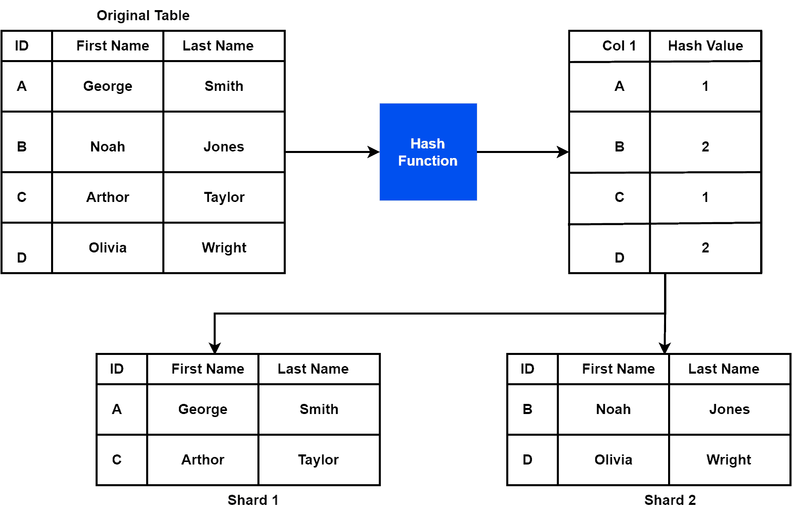
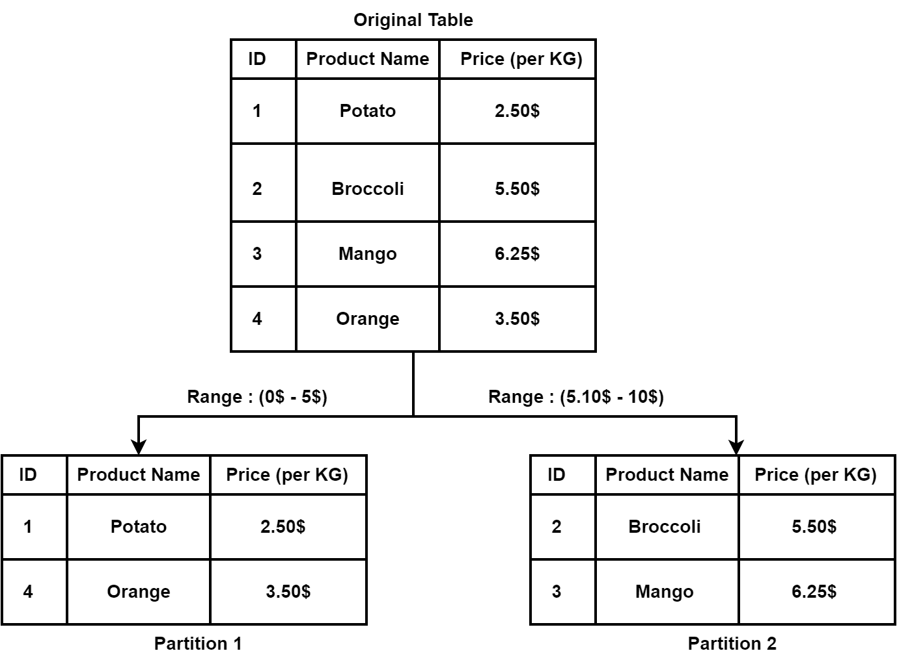

# [数据库分片与分区](https://www.baeldung.com/cs/database-sharding-vs-partitioning)

1. 概述

    在本教程中，我们将讨论两种将数据库分割成若干部分以便高效管理的方法：分片和分区。此外，我们还将通过一个示例探讨每种方法的基本概念。此外，我们还将列出每种方法的优缺点。

    最后，我们将强调这两种方法的核心区别。

2. 数据库分片

    1. 简介

        数据库分片是一种将大型数据库横向分割成更小、更易于管理的子集的技术。此外，每个子集称为一个分片。此外，我们还可以将它们分布在[集群](https://www.baeldung.com/cs/computer-clusters-types)中的多个服务器或节点上。我们可以把分片看作是一小块数据。此外，分片共同组成了完整的数据集。

        我们经常在大规模[分布式系统](https://www.baeldung.com/cs/distributed-systems-guide)中使用分片，在这种系统中，传统的扩展方法（如垂直扩展）可能不足以处理不断增加的数据量和流量。因此，通过将数据分布到多个服务器上，分片可以提高数据库的性能、可扩展性和可用性。

        我们可以使用不同的方法来实现分片。此外，分片中常用的策略有基于范围的分片、基于散列的分片和复合分片。

        在基于范围的分片中，我们根据值的范围（如日期范围或字母顺序）来划分数据。此外，基于散列的分片是指根据将数据映射到特定分片的[散列函数](https://www.baeldung.com/cs/hashing)来划分数据。最后，复合分片是将基于范围的分片技术和基于散列的分片技术结合起来。

        下面我们来看一个基于散列的分片示例：

        

    2. 优缺点

        让我们来看看分片的优缺点：

        | 优势                                      | 缺点                |
        |-----------------------------------------|-------------------|
        | 通过将数据分割成较小的子集并将其分配给多个服务器，分片可以提高数据库的可扩展性 | 可能会增加数据库架构的复杂性    |
        | 通过将工作量分散到多个服务器上，可提高性能                   | 在分片之间保持数据一致性具有挑战性 |
        | 降低单点故障风险                                | 与其他扩展方法相比灵活性较低    |
        | 比传统的扩展方法更具成本效益                          | 跨分片管理数据分布和同步具有挑战性 |

    3. 应用

        数据库分片通常用于大规模、高流量的网络应用程序和分布式系统。此外，当传统的扩展方法不足以处理大型数据库时，我们也会使用分片。下面我们来讨论数据库分片的一些常见应用。

        电子商务网站使用分片技术。具体来说，它将产品目录、订单和客户信息分布在多个服务器上。因此，它有助于提高电子商务平台的性能和可用性。

        此外，拥有数百万用户的[社交媒体](https://en.wikipedia.org/wiki/Social_media)平台也会产生需要处理和存储的海量数据。因此，我们可以使用分片将数据划分到多个服务器上，以提高性能和可扩展性。

        最后，我们可以在网络游戏中使用分片。拥有庞大玩家群体的在线游戏会产生大量需要实时存储和处理的数据。因此，我们可以利用分片技术将玩家资料、游戏状态和分数分布到多个服务器上，以提高性能和可用性。

3. 数据库分区

    1. 简介

        分区是一种将海量数据库分解成小子集的方法。此外，每个子集被称为一个分区或分段。此外，每个分区存储一个数据子集，它们共同构成整个数据集。

        分区可以将数据分布到多个服务器或节点上，从而提高数据库的性能、可扩展性和可用性。此外，它还可以减少为回答某个查询而必须处理的数据量。因此，它能改善查询响应时间。

        现在，让我们来讨论一下实现分区的一些技术。有几种不同的数据库分区技术，包括范围分区、列表分区和复合分区。

        此外，范围分区是根据指定分区键的特定值范围将数据划分为分区的过程。另一方面，列表分区是根据指定分区键的特定值列表将数据分割成分区的方法。最后，复合分区是使用范围分区和列表分区策略的组合将数据划分为多个分区。

        下面我们来看一个基于范围的数据库分区示例：

        

    2. 优缺点

        让我们来看看分区的一些优缺点：

        | 优势                           | 缺点                            |
        |------------------------------|-------------------------------|
        | 通过限制响应特定查询时搜索的数据量，帮助加快查询运行速度 | 会增加数据库设计和管理的复杂性，特别是当分区数量增加时   |
        | 通过将数据分布在多个服务器上，提高数据库的可扩展性    | 可能导致数据倾斜，即某些分区包含的数据量与其他分区不成比例 |
        | 允许独立备份或恢复各个分区，从而提高数据库的可用性    | 增加与管理数据库相关的开销                 |
        | 提高数据库性能和可扩展性的经济有效方法          | 可能无法为小型数据库带来明显的性能或可扩展性优势      |

    3. 应用

        数据库分区广泛应用于各种应用，尤其是大规模数据密集型应用。下面我们来讨论分区方法的一些主要应用。

        我们可以在多个金融服务中使用分区技术。此外，金融服务应用通常会处理大量交易数据，这些数据可以根据日期范围、账户类型或交易金额等交易属性进行分区。

        物联网设备和应用采用了分区技术。此外，物联网应用会产生大量传感器数据，这些数据可根据传感器类型、位置或时间范围进行分割。

        最后，医疗保健应用通常会存储大量患者数据。为了分析这些数据，我们可以根据患者的属性（如地理位置、病史或治疗计划）对其进行分割。

4. 差异

    现在我们来讨论一下分片和分区的核心区别：

    | 数据库分片                   | 数据库分区             |
    |-------------------------|-------------------|
    | 通常用于将数据分布到多个服务器或群集上     | 通常用于在单个数据库实例中划分数据 |
    | 每个分片可能包含某些数据的副本，以确保高可用性 | 分区内没有数据冗余         |
    | 需要更多管理开销                | 所需的管理开销较少         |
    | 灵活性低于数据库分区              | 比数据库分片提供更大的灵活性    |

5. 结论

    在本教程中，我们讨论了将数据库分割成若干部分以便高效管理的两种方法：分片和分区。此外，我们还探讨了每种方法的基本概念，并举例说明。此外，我们还列举了每种方法的一些优缺点。最后，我们强调了这两种方法的核心区别。
