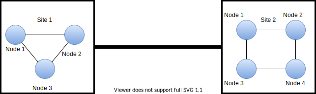

# [分布式系统与分布式计算？](https://www.baeldung.com/cs/distributed-system-vs-distributed-computing)

1. 简介

    在本教程中，我们将了解分布式系统和分布式计算。首先，我们将定义这两个术语，概述它们的属性和特点。我们还将回顾它们的用途和应用，并强调分布式系统和分布式计算之间的区别。

2. 分布式系统

    让我们从定义分布式系统开始，然后讨论它的一些基本原理和特性。

    1. 什么是分布式系统

        [分布式系统](https://www.baeldung.com/cs/distributed-systems-guide#1-what-is-a-distributed-system)是一个包含多个组件的系统，这些组件存在于不同的设备中，通常位于不同的地理位置。这些物理上分离的组件通常通过网络连接，并通过消息传递进行通信。这些组件可以是计算机系统、资源和进程，也被称为节点：

        

        虽然分布式系统中的不同组件位于不同的地方，但整个系统作为一个单元来处理任务和共享资源。此外，分布式系统有两大类：点对点系统和客户机/服务器系统。

        点对点系统，顾名思义，其所有组件都在平等地处理任务和共享资源。由于节点之间的点对点连接，网络中通常不需要集中控制。

        与点对点分布式系统不同，客户机/服务器系统中的节点分别扮演客户机和服务器的角色。客户设备或组件请求资源，而服务器则向客户提供资源。还有其他可供选择的分布式系统，如 n 层和三层分布式系统。

    2. 分布式系统的特性

        我们通过以下不同特征来描述分布式系统：

        - 容错性：分布式系统中一个节点的故障不会影响整个系统的整体性能。
        - 可扩展性：分布式系统在参与网络的节点数量方面具有灵活性。系统能够处理规模的增减。
        - 资源共享：分布式系统中节点的连接允许资源共享。例如，系统中的所有参与节点可以共享一台打印机，而不是每台计算机系统连接一台打印机。
        - 透明性：分布式系统将自身视为一个整体的能力，掩盖了其资源在物理上是独立的、位于多个组件中的事实。

    3. 分布式系统的优点和问题

        我们偏爱分布式系统，原因如下：

        - 分布式系统可靠性高，主要是因为有多个计算机系统。因此，如果一个组件出现故障，分布式系统仍可正常运行。
        - 分布式系统结合了多个节点的处理能力，可提供最高性能。
        - 由于分布式系统的灵活性，系统还可以添加其他组件。
        - 多个设备的连接可以实现资源共享。
        - 与单一的集中式系统相比，实施一个多设备连接共享资源的分布式系统实际上成本更低。

        分布式系统也面临一些挑战：

        - 由于多个节点的参与，响应时间可能会有变化。但是，为了确保系统进程的同步性，必须解决这个问题。
        - 确保分布式环境的安全性可能很复杂；单个节点的安全漏洞可能会影响整个分布式系统并使其瘫痪。
        - 与分布式系统相关的网络设置成本通常很高。

    4. 分布式系统的应用

        我们在[分布式数据库](https://www.freecodecamp.org/news/a-thorough-introduction-to-distributed-systems-3b91562c9b3c/)、分布式计算、分布式文件系统和分布式消息系统中使用分布式系统。互联网是最广为人知的分布式系统实例。互联网有助于将不同地理位置的许多不同计算机系统连接起来，共享信息和资源。

3. 分布式计算

    现在我们将深入探讨分布式计算的具体内容。

    分布式计算是指使用分布式系统来完成计算任务。它应用分布式系统的原理，在分布式系统中连接的不同计算机系统上执行程序。因此，在分布式计算中执行的程序的不同部分会被分割并分配给网络中存在的不同计算系统。

    使用不同的计算机系统可以增加可用的计算能力，执行更大、更复杂的任务。分布式计算和分布式系统具有相同的基本特性，即可扩展性、容错性、资源共享和透明度。

    分布式计算和分布式系统具有相同的优点，即可靠、比集中式系统更便宜、处理能力更强。不过，分布式计算面临的挑战略有不同。例如，将计算任务划分为不同的部分，以便在不同的计算机系统上并行执行，这就具有挑战性。

    此外，我们还需要协调分布式计算中的任务。

    1. 分布式计算的应用

        由于分布式计算的显著优势，我们将其用于移动系统、社交媒体网络、天气监测系统和电子商务系统。例如，Apache Hadoop 是一个著名的框架，可促进分布式处理和分布式存储。

4. 差异

    分布式计算和分布式系统之间虽然存在细微差别，但也有显著区别。例如，分布式计算是分布式系统的一个类别。其他区别概述如下：

    | 分布式系统                     | 分布式计算                      |
    |---------------------------|----------------------------|
    | 将不同的节点连接起来，使其看起来像一个整体     | 将任务划分为更小的任务，由分布式系统中的不同节点运行 |
    | 从信息技术角度处理如何连接不同地点的不同节点的问题 | 采用算法，处理如何在不同节点上执行程序的问题     |

5. 结论

    在本文中，我们定义了分布式系统和分布式计算。我们概述了它们的特性和应用，以及各自存在的优势和挑战。我们还解释了这两个术语之间的关系，因为分布式系统和分布式计算之间存在细微差别。
