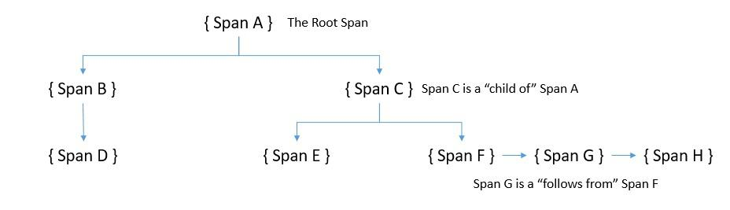

# [分布式系统中的可观测性](https://www.baeldung.com/distributed-systems-observability)

1. 简介

    在本教程中，我们将讨论可观察性及其在分布式系统中发挥重要作用的原因。我们将介绍构成可观察性的数据类型。这将有助于我们理解从分布式系统中收集、存储和分析遥测数据所面临的挑战。

    最后，我们将介绍可观测性领域的一些行业标准和流行工具。

2. 什么是可观测性？

    让我们开门见山，首先给出正式的定义！可观察性是指仅通过外部输出来衡量系统内部状态的能力。

    对于像微服务这样的[分布式系统](distributed-system-vs-distributed-computing_zh.md)，这些外部输出基本上被称为遥测数据。它包括机器的资源消耗、机器上运行的应用程序生成的日志等信息。

    1. 遥测数据的类型

        我们可以将遥测数据分为三类，并将其称为可观察性的三大支柱：日志(logs)、度量(metrics)和跟踪(traces)。让我们来详细了解它们。

        日志是应用程序在代码执行过程中的离散点生成的文本行。通常，这些日志是结构化的，并经常以不同的严重程度生成。这些日志很容易生成，但往往会带来性能代价。此外，我们可能还需要 Logstash 等其他工具来有效地收集、存储和分析日志。

        简单地说，度量是我们在一段时间内计算或汇总的计数或度量值。这些值表达了虚拟机等系统的某些数据，例如虚拟机每秒的内存消耗。这些数据可能来自主机、应用程序和云平台等不同来源。

        跟踪对于分布式系统非常重要，因为在分布式系统中，一个请求可能会流经多个应用程序。跟踪是请求流经分布式系统时分布式事件的表示。这些信息有助于定位分布式系统中的瓶颈、缺陷或其他问题。

    2. 可观察性的好处

        首先，我们需要了解为什么在系统中需要可观察性。我们中的大多数人可能都遇到过对生产系统中难以理解的行为进行故障排除的挑战。我们不难理解，破坏生产环境的选择是有限的。这几乎让我们只能分析系统生成的数据。

        可观察性对于调查系统开始偏离预期状态的情况非常有价值。此外，它还能有效防止这些情况的发生！根据系统产生的可观测数据精心设置警报，可以帮助我们在系统完全失效之前采取补救措施。此外，这些数据还能为我们提供重要的分析见解，从而调整系统以获得更好的体验。

        可观测性需求对任何系统都很重要，但对分布式系统来说却非常重要。此外，我们的系统可以跨越公共云、私有云和内部环境。此外，随着时间的推移，系统的规模和复杂性也在不断变化。这往往会带来以前从未预料到的问题。一个高度可观测的系统可以极大地帮助我们处理这种情况。

3. 可观察性与监控

    在[DevOps实践](https://www.baeldung.com/ops/devops-overview)中，我们经常听到监控与可观察性的关系。那么，这些术语之间有什么区别呢？嗯，它们都有类似的功能，都能让我们保持系统的可靠性。但它们之间又有微妙的区别，事实上，它们之间还存在着某种关系。只有在可观察的情况下，我们才能有效地监控系统！

    监控基本上是指通过一组预定义的指标和日志来观察系统状态的做法(watching a system’s state through a predefined set of metrics and logs)。这本质上意味着我们在观察一组已知的故障。然而，在分布式系统中，会不断发生大量的动态变化。这会导致我们从未注意到的问题。因此，我们的监控系统可能会错过这些问题。

    另一方面，可观察性可以帮助我们了解系统的内部状态。这可以让我们对系统的行为提出任意问题。例如，我们可以问一些复杂的问题，如在出现问题时，每个服务是如何处理请求的。随着时间的推移，它可以帮助我们建立有关系统动态行为的知识。

    要理解为什么会出现这种情况，我们需要了解 "万有引力"（cardinality）的概念。卡片性指的是一个集合中唯一项的数量(Cardinality refers to the number of unique items in a set)。例如，用户的社会安全号码集合比性别集合具有更高的卡片性。要回答有关系统行为的任意问题，我们需要高卡因度数据。然而，监控通常只处理低卡因度数据。

4. 分布式系统中的可观察性

    正如我们前面所看到的，可观测性对于复杂的分布式系统尤其有用。但是，究竟是什么让分布式系统变得复杂，可观测性在这样的系统中又面临哪些挑战？要想了解过去几年中围绕这一主题发展起来的工具和平台生态系统，了解这一问题非常重要。

    在分布式系统中，有很多移动组件会动态地改变系统格局。此外，动态可扩展性意味着在任何时间点都会有不确定数量的服务实例在运行。这就给收集、整理和存储系统输出（如日志和指标）的工作带来了困难：

    

    此外，仅仅了解系统应用中发生的情况是不够的。例如，问题可能出在网络层或负载平衡器上。此外，还有数据库、消息传递平台等等。重要的是，所有这些组件在任何时候都是可观测的。我们必须能够从系统的各个部分收集并集中有意义的数据。

    此外，由于多个组件在同步或异步地协同工作，要找出异常的源头并不容易。例如，很难说是系统中的哪个服务造成了性能下降的瓶颈。正如我们之前所见，跟踪对于调查此类问题非常有用。

5. 可观察性的演变

    可观察性起源于控制理论，它是应用数学的一个分支，主要研究如何利用反馈来影响系统的行为，从而实现预期目标。我们可以将这一原理应用于多个行业，从工业厂房到飞机运行。对于软件系统来说，自从一些社交网站（如 Twitter）开始[大规模运行](https://blog.twitter.com/engineering/en_us/a/2013/observability-at-twitter.html)以来，这一原理就开始流行起来。

    直到最近几年，大多数软件系统都是单体的，因此在发生事故时对其进行推理相当容易。监控在显示典型故障场景方面相当有效。此外，调试代码以发现问题也很直观。但是，随着微服务架构和云计算的出现，这很快就变成了一项艰巨的任务。

    随着这种演变的继续，软件系统不再是静态的--它们拥有众多动态变化的组件。这就产生了以前从未预料到的问题。这就催生了许多应用性能管理（APM）工具，如 [AppDynamics](https://www.appdynamics.com/) 和 [Dynatrace](https://www.dynatrace.com/)。这些工具承诺提供更好的方法来了解应用程序代码和系统行为。

    虽然这些工具在发展过程中取得了长足的进步，但它们在当时还是相当基于指标的。这使得它们无法提供我们所需的系统状态视角。不过，它们还是向前迈进了一大步。如今，我们已经拥有了解决可观测性三大支柱的工具组合。当然，底层组件也需要可观测！

6. 可观察性实践

    现在，我们已经学习了足够多的可观察性理论，让我们看看如何将其付诸实践。我们将使用一个简单的基于微服务的分布式系统，用 Spring Boot 开发 Java 中的各个服务。这些服务将使用 REST API 进行同步通信。

    让我们来看看我们的系统服务：

    

    这是一个相当简单的分布式系统，数学服务使用加法服务、乘法服务和其他服务提供的 API。此外，数学服务还提供了用于计算各种公式的 API。我们将跳过创建这些微服务的细节，因为这非常简单。

    本练习的重点是在可观察性的背景下认识当今最常见的标准和流行工具。具有可观察性的系统的目标架构如下图所示：

    

    云本地计算基金会（Cloud Native Computing Foundation，[CNCF](https://www.cncf.io/)）是一个促进容器技术发展的组织，其中许多标准和工具也处于不同的认可阶段。我们将看看如何在分布式系统中使用其中一些。

7. 使用 OpenTracing 跟踪

    我们已经看到跟踪如何提供宝贵的洞察力，以了解单个请求是如何在分布式系统中传播的。[OpenTracing](https://opentracing.io/) 是 CNCF 下的一个孵化项目。它为分布式[跟踪](https://www.baeldung.com/cs/trace-vs-log)提供了厂商中立的 API 和工具。这有助于我们在代码中添加不针对任何供应商的工具。

    符合 OpenTracing 标准的跟踪器正在快速增加。最受欢迎的跟踪器之一是 Jaeger，它也是 CNCF 下的一个毕业项目。

    让我们看看如何在应用程序中将 Jaeger 与 OpenTracing 结合使用：

    

    稍后我们将详细介绍。需要注意的是，还有其他一些选择，如 [LightStep](https://lightstep.com/observability/)、[Instana](https://www.instana.com/)、[SkyWalking](https://skywalking.apache.org/) 和 [Datadog](https://www.datadoghq.com/)。我们可以在这些跟踪器之间轻松切换，而无需改变在代码中添加仪器的方式。

    1. 概念和术语

        OpenTracing 中的跟踪由跨度组成。跨度是分布式系统中完成工作的单个单位。从根本上说，跟踪可以看作是一个由跨度组成的有向无环图（DAG）。我们将跨度之间的边称为引用。分布式系统中的每个组件都会向跟踪添加一个跨度。跨度包含对其他跨度的引用，这有助于跟踪重现请求的生命周期。

        我们可以用时间轴或图表来直观显示跟踪中跨度之间的因果关系：

        

        在这里，我们可以看到 OpenTracing 定义的两种引用类型："ChildOf" 和 "FollowsFrom"。它们建立了子跨度和父跨度之间的关系。

        OpenTracing 规范定义了跨度捕获的状态：

        - 操作名称
        - 开始时间戳和结束时间戳
        - 一组键值跨度标记
        - 一组键值跨度日志
        - 跨度上下文

        标签允许用户定义的注释成为我们用来查询和过滤跟踪数据的跨度的一部分。跨度标签适用于整个跨度。同样，日志允许跨度捕获应用程序的日志信息和其他调试或信息输出。跨度日志可应用于跨度中的特定时刻或事件。

        最后，SpanContext 将跨度联系在一起。它可以跨进程边界传输数据。让我们快速了解一下典型的 SpanContext：

        

        我们可以看到，它主要由以下部分组成：

        - 与实现相关的状态，如 spanId 和 traceId
        - 任何包袱项，即跨越流程边界的键值对

    2. 设置和仪器

        我们将首先安装 [Jaeger](https://www.jaegertracing.io/)，这是一款兼容 OpenTracing 的跟踪器。虽然它有多个组件，但我们只需使用一条简单的 Docker 命令就能安装所有组件：

        `docker run -d -p 5775:5775/udp -p 16686:16686 jaegertracing/all-in-one:latest`

        接下来，我们需要在应用程序中导入必要的依赖项。对于基于 Maven 的应用程序，这就像添加依赖关系一样简单：

        ```xml
        <dependency>
            <groupId>io.opentracing.contrib</groupId>
            <artifactId>opentracing-spring-jaeger-web-starter</artifactId>
            <version>3.3.1</version>
        </dependency>
        ```

        对于基于 Spring Boot 的应用程序，我们可以利用第三方提供的这个库。它包含了所有必要的依赖项，并提供了必要的默认配置来检测网络请求/响应，并将跟踪结果发送到 Jaeger。

        在应用程序方面，我们需要创建一个跟踪器：

        ```java
        @Bean
        public Tracer getTracer() {
            Configuration.SamplerConfiguration samplerConfig = Configuration
            .SamplerConfiguration.fromEnv()
            .withType("const").withParam(1);
            Configuration.ReporterConfiguration reporterConfig = Configuration
            .ReporterConfiguration.fromEnv()
            .withLogSpans(true);
            Configuration config = new Configuration("math-service")
            .withSampler(samplerConfig)
            .withReporter(reporterConfig);
            return config.getTracer();
        }
        ```

        这样就足以为请求经过的服务生成跨度。如有必要，我们还可以在服务中生成子跨度：

        ```java
        Span span = tracer.buildSpan("my-span").start();
        // Some code for which which the span needs to be reported
        span.finish();
        ```

        这非常简单直观，但当我们对复杂的分布式系统进行分析时，它就会变得非常强大。

    3. 跟踪分析

        Jaeger 自带一个用户界面，默认情况下可通过 16686 端口访问。它提供了查询、过滤和可视化分析跟踪数据的简单方法。

        Jaeger 跟踪用户界面，这是一个由跟踪标识（traceId）标识的特定跟踪的可视化示例。它清楚地显示了该跟踪中的所有跨度，以及它属于哪个服务和完成所需的时间等详细信息。这可以帮助我们了解非典型行为的问题所在。

8. 使用 OpenCensus 进行度量

    [OpenCensus](https://opencensus.io/) 为各种语言提供了库，允许我们从应用程序中收集度量指标和分布式跟踪。OpenCensus 起源于谷歌，但从那时起，它就作为一个开源项目被日益壮大的社区所开发。OpenCensus 的优势在于它可以将数据发送到任何后端进行分析。这使我们能够抽象出我们的仪器代码，而不是将其与特定的后端耦合在一起。

    尽管 OpenCensus 可以同时支持跟踪和度量，但在我们的示例应用程序中，我们将只使用它来进行度量。我们可以使用多种后端。最流行的度量工具之一是 Prometheus，它是一个开源监控解决方案，也是 CNCF 下的一个毕业项目。让我们看看带有 OpenCensus 的 Jaeger 如何与我们的应用程序集成：

    

    虽然 Prometheus 自带用户界面，但我们可以使用 Grafana 这样的可视化工具，它能与 Prometheus 很好地集成。

    1. 概念和术语

        在 OpenCensus 中，度量表示要记录的度量类型。例如，请求有效载荷的大小就是一个要收集的指标。度量是通过度量记录数量后产生的数据点。例如，80 kb 可以作为请求有效载荷大小的度量值。所有测量值都有名称、描述和单位。

        要分析统计数据，我们需要用视图来聚合数据。视图基本上是将聚合应用于衡量指标的耦合，也可以选择使用标签。OpenCensus 支持计数、分布、总和和最后值等聚合方法。一个视图由名称、描述、度量、标签键和聚合组成。多个视图可以使用不同聚合的相同测量值。

        标签是与记录的测量值相关联的键值对数据，用于提供上下文信息，并在分析过程中区分和分组测量值。当我们聚合测量值创建度量值时，可以使用标签作为标签来细分度量值。在分布式系统中，标签还可以作为请求头进行传播。

        最后，导出器可以将度量指标发送到任何能够消费这些指标的后端。输出器可根据后端情况进行更改，而不会对客户端代码产生任何影响。这使得 OpenCensus 在指标收集方面不受供应商的影响。对于大多数流行的后端，如 Prometheus，有相当多的多语言出口程序可用。

    2. 设置和仪器

        由于我们将使用 Prometheus 作为后端，因此首先要安装它。使用官方的 Docker 镜像安装非常简单快捷。Prometheus 通过抓取受监控目标上的指标端点来收集这些目标的指标。因此，我们需要在 Prometheus 配置 YAML 文件 prometheus.yml 中提供详细信息：

        ```yml
        scrape_configs:
        - job_name: 'spring_opencensus'
            scrape_interval: 10s
            static_configs:
            - targets: ['localhost:8887', 'localhost:8888', 'localhost:8889']
        ```

        这是一项基本配置，用于告诉 Prometheus 从哪些目标刮取指标。现在，我们可以用一条简单的命令启动 Prometheus：

        `docker run -d -p 9090:9090 -v ./prometheus.yml:/etc/prometheus/prometheus.yml prom/prometheus`
        定义自定义度量时，我们首先要定义一个度量：

        `MeasureDouble M_LATENCY_MS = MeasureDouble.create("math-service/latency", "The latency in milliseconds", "ms");`

        接下来，我们需要记录刚刚定义的测量值：

        ```java
        StatsRecorder STATS_RECORDER = Stats.getStatsRecorder();
        STATS_RECORDER.newMeasureMap()
        .put(M_LATENCY_MS, 17.0)
        .record();
        ```

        然后，我们需要为测量值定义聚合和视图，以便将其导出为度量值：

        ```java
        Aggregation latencyDistribution = Distribution.create(BucketBoundaries.create(
        Arrays.asList(0.0, 25.0, 100.0, 200.0, 400.0, 800.0, 10000.0)));
        View view = View.create(
        Name.create("math-service/latency"),
        "The distribution of the latencies",
        M_LATENCY_MS,
        latencyDistribution,
        Collections.singletonList(KEY_METHOD)),
        };
        ViewManager manager = Stats.getViewManager();
        manager.registerView(view);
        ```

        最后，为了将视图导出到 Prometheus，我们需要创建和注册收集器，并将 HTTP 服务器作为守护进程运行：

        ```java
        PrometheusStatsCollector.createAndRegister();
        HTTPServer server = new HTTPServer("localhost", 8887, true);
        ```

        这是一个简单明了的示例，说明了我们如何记录应用程序的延迟测量值，并将其作为视图导出到 Prometheus 进行存储和分析。

    3. 度量分析

        OpenCensus 提供名为 zPages 的进程内网页，用于显示从所连接的进程中收集的数据。此外，Prometheus 还提供了表达式浏览器，允许我们输入任何表达式并查看其结果。不过，像 [Grafana](https://grafana.com/) 这样的工具可以提供更优雅、更高效的可视化。

        使用官方 Docker 镜像安装 Grafana 非常简单：

        `docker run -d --name=grafana -p 3000:3000 grafana/grafana`

        Grafana 支持查询 Prometheus - 我们只需在 Grafana 中[将 Prometheus 添加为数据源](https://prometheus.io/docs/visualization/grafana/)。然后，我们就可以使用正则 Prometheus 指标查询表达式创建图表。

        我们可以使用几种图表设置来调整我们的图表。此外，Prometheus 还提供了几个预构建的 Grafana 面板，我们可能会发现它们很有用。

9. 使用 Elastic Stack 的日志

    日志可以为了解应用程序对事件的反应提供宝贵的信息。遗憾的是，在分布式系统中，日志会被分割到多个组件中。因此，从所有组件收集日志并将其存储在一个地方以便进行有效分析就变得非常重要。此外，我们还需要一个直观的用户界面来有效地查询、过滤和引用日志。

    Elastic Stack 基本上是一个日志管理平台，直到最近，它还是 Elasticsearch、Logstash 和 Kibana（ELK）三个产品的集合。

    不过，从那时起，这个堆栈中加入了 Beats，以实现高效的数据收集。

    让我们看看如何在应用程序中使用这些产品：

    

    正如我们所见，在 Java 中，我们可以使用 [SLF4J](https://www.baeldung.com/slf4j-with-log4j2-logback) 这样的简单抽象和 [Logback](https://www.baeldung.com/logback) 这样的日志记录器生成日志。这里我们将跳过这些细节。

    Elastic Stack 产品是开源的，由 Elastic 维护。这些产品共同为分布式系统中的日志分析提供了一个极具吸引力的平台。

    1. 概念和术语

        正如我们所见，Elastic Stack 是多个产品的集合。最早的产品是 Elasticseach，它是一个分布式、RESTful、基于 JSON 的搜索引擎。由于其灵活性和可扩展性，它颇受欢迎。正是这个产品奠定了 Elastic 的基础。它从根本上基于 Apache Lucene 搜索引擎。

        Elasticsearch 将索引存储为文档，文档是存储的基本单位。它们是简单的 JSON 对象。我们可以使用类型来细分文档中的同类数据。索引是文档的逻辑分区。通常，我们可以将索引横向分割成碎片，以提高可扩展性。此外，我们还可以复制分片以实现容错：

        

        [Logstash](https://www.elastic.co/logstash) 是一种日志聚合器，可从各种输入源收集数据，并执行不同的转换和增强，然后将其发送到输出目的地。由于 Logstash 占用空间较大，因此我们采用了 [Beats](https://www.elastic.co/beats/)，这是一种轻量级数据运输器，我们可以将其作为代理安装在服务器上。最后，[Kibana](https://www.elastic.co/kibana) 是在 Elasticsearch 基础上工作的可视化层。

        这些产品共同提供了一个完整的套件，用于执行日志数据的聚合、处理、存储和分析：

        

        有了这些产品，我们就可以为日志数据创建一个生产级数据管道。不过，我们完全有可能，而且在某些情况下也有必要扩展这一架构，以处理大量日志数据。我们可以在 Logstash 前面放置一个类似 Kafka 的缓冲器，以防止下游组件将其压垮。在这方面，Elastic Stack 非常灵活。

    2. 设置和仪器

        如前所述，Elastic Stack 包含多个产品。当然，我们可以单独安装它们。不过，这很费时间。幸运的是，Elastic 提供了官方的 Docker 镜像来简化安装过程。

        启动单节点 Elasticsearch 集群就像运行 Docker 命令一样简单：

        ```bash
        docker run -p 9200:9200 -p 9300:9300 \
        -e "discovery.type=single-node" \
        docker.elastic.co/elasticsearch/elasticsearch:7.13.0
        ```

        同样，安装 Kibana 并将其连接到 Elasticsearch 集群也很容易：

        ```bash
        docker run -p 5601:5601 \
        -e "ELASTICSEARCH_HOSTS=http://localhost:9200" \
        docker.elastic.co/kibana/kibana:7.13.0
        ```

        安装和配置 Logstash 的过程比较复杂，因为我们必须为数据处理提供必要的设置和管道。其中一个比较简单的方法是在官方镜像的基础上创建一个自定义镜像：

        ```bash
        FROM docker.elastic.co/logstash/logstash:7.13.0
        RUN rm -f /usr/share/logstash/pipeline/logstash.conf
        ADD pipeline/ /usr/share/logstash/pipeline/
        ADD config/ /usr/share/logstash/config/
        ```

        让我们来看看与 Elasticsearch 和 Beats 集成的 Logstash 的示例配置文件：

        ```config
        input {
        tcp {
        port => 4560
        codec => json_lines
        }
        beats {
            host => "127.0.0.1"
            port => "5044"
        }
        }
        output{
        elasticsearch {
        hosts => ["localhost:9200"]
        index => "app-%{+YYYY.MM.dd}"
        document_type => "%{[@metadata][type]}"
        }
        stdout { codec => rubydebug }
        }
        ```

        根据数据源的不同，有多种 Beats 类型可供选择。在我们的示例中，我们将使用 Filebeat。安装和配置 Beats 最好借助自定义镜像：

        ```bash
        FROM docker.elastic.co/beats/filebeat:7.13.0
        COPY filebeat.yml /usr/share/filebeat/filebeat.yml
        USER root
        RUN chown root:filebeat /usr/share/filebeat/filebeat.yml
        USER filebeat
        ```

        让我们来看看 Spring Boot 应用程序的 filebeat.yml 示例：

        ```yml
        filebeat.inputs:
        - type: log
        enabled: true
        paths:
        - /tmp/math-service.log
        output.logstash:
        hosts: ["localhost:5044"]
        ```

        这只是对 Elastic Stack 安装和配置的一个非常粗略但完整的解释。详细说明超出了本教程的范围。

    3. 日志分析

        Kibana 为我们的日志提供了一个非常直观且功能强大的可视化工具。我们可以通过 Kibana 的默认 URL <http://localhost:5601> 访问 Kibana 界面。我们可以选择一种可视化方式，并为我们的应用程序创建一个仪表盘。

        Kibana 提供了相当广泛的日志数据查询和过滤功能。这些功能超出了本教程的范围。

10. 可观察性的未来

    现在，我们已经了解了为什么可观察性是分布式系统的一个关键问题。我们还了解了一些处理不同类型遥测数据的常用选项，这些选项可以帮助我们实现可观察性。然而，事实上，将所有部件组装在一起仍然相当复杂和耗时。我们必须处理大量不同的产品。

    [OpenTelemetry](https://opentelemetry.io/) 是 CNCF 的一个沙盒项目，它是这一领域的关键进展之一。基本上，OpenTelemetry 是通过精心合并 OpenTracing 和 OpenCensus 项目而形成的。显然，这样做是有意义的，因为我们只需处理跟踪和度量的单一抽象。

    此外，OpenTelemetry 还计划支持日志，使其成为分布式系统的完整可观测性框架。此外，OpenTelemetry 还支持多种语言，并能与流行的框架和库很好地集成。此外，OpenTelemetry 还通过软件桥接与 OpenTracing 和 OpenCensus 向后兼容。

    OpenTelemetry 仍在开发中，我们可以期待它在未来的日子里日臻成熟。同时，为了减轻我们的痛苦，一些可观测性平台将前面讨论过的许多产品结合在一起，提供无缝体验。例如，Logz.io 结合了 ELK、Prometheus 和 Jaeger 的力量，提供了一个可扩展的平台即服务。

    可观测性领域正迅速走向成熟，市场上不断涌现出具有创新解决方案的新产品。例如，Micrometer 为多个监控系统的仪器客户端提供了一个供应商中立的界面。最近，OpenMetrics 发布了其规范，为大规模传输云原生指标创建了事实上的标准。

11. 总结

    在本教程中，我们介绍了可观察性的基础知识及其在分布式系统中的影响。我们还在一个简单的分布式系统中实现了一些当今流行的可观察性选项。

    这让我们了解了 OpenTracing、OpenCensus 和 ELK 如何帮助我们构建可观测的软件系统。最后，我们讨论了这一领域的一些新发展，以及我们可以如何期待可观测性在未来的发展和成熟。
