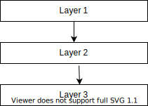
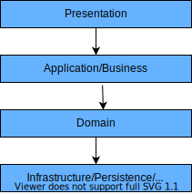

# [分层架构](https://www.baeldung.com/cs/layered-architecture)

1. 简介

    本文将介绍软件开发中的分层架构。我们将概述什么是分层架构、分层架构的组成部分以及分层架构的特点。接下来，我们还将介绍分层架构的优点和缺点，并举例说明在哪些情况下适合使用分层架构。

    在开始之前，我们先来定义一下软件架构。

2. 定义

    软件架构指的是任何软件系统的基本结构，包括使系统正常运行的任何方面。虽然架构一词通常是指物理设计，但在软件系统中，它包括组件的设计、组件之间的关系、用户交互以及用户对系统的需求。

    目前存在几种不同的软件架构，如微内核、微服务和客户服务器等。每种架构的结构和使用环境都不尽相同。不过，本文只讨论分层架构。

3. 什么是分层架构？

    据说，分层架构是软件开发中最常见、使用最广泛的架构框架。它也被称为 n 层架构，描述了一种由多个独立的水平层组成的架构模式，这些水平[层](https://www.baeldung.com/cs/layers-vs-tiers)共同作为一个软件单元发挥作用。层是组件或代码的逻辑分隔：

    

    在这些框架中，相关或相似的组件通常被放置在相同的层上。然而，每一层都是不同的，对整个系统的不同部分做出贡献。

    1. 特点

        该框架的一个主要特点是层与层之间只有直接的联系。在前面给出的插图中，层 1 只连接到层 2，层 2 连接到层 3，而层 1 只通过层 2 连接到层 3。

        另一个特点是层隔离概念。这意味着可以对各层进行修改，而修改不会影响其他层。简而言之，更改被隔离到被更改的特定层。

        关注点分离是另一个显著特点，它说明了单层上的模块如何共同执行单一功能。

4. 分层架构的组成部分

    现在，分层架构中的层数并不是一个特定的数字，通常取决于开发人员或软件架构师。值得注意的是，这种框架通常总会有一个用户交互层、一个处理层和一个数据处理层。具体描述如下

    - 表现层(Presentation Layer) - 负责用户与软件系统的交互
    - 应用/业务层(Application/Business Layer) - 处理与实现功能要求有关的方面
    - 领域层(Domain Layer) - 负责算法和编程组件
    - 基础设施/持久层/数据库层(Infrastructure/Persistence/Database Layer) - 负责处理数据、数据库

    

    此外，在某些应用程序中，某些层是组合在一起的。例如，常见的情况是业务层和持久层合并为一个层。这只是意味着这两层的功能和职责被组合到了一层。

5. 优缺点

    这种软件模式的优缺点如下：

    优点

    - 框架简单，易于学习和实施。
    - 减少了依赖性，因为每一层的功能都与其他层分开。
    - 由于组件分离，测试更容易，每个组件都可以单独测试。
    - 成本开销相当低。

    缺点

    - 可扩展性较差，因为框架结构不允许增长。
    - 维护困难。单个层的变化会影响整个系统，因为它是作为一个整体运行的。
    - 层与层之间相互依赖，因为一层依赖于上一层接收数据。
    - 无法进行并行处理。

6. 何时使用分层架构

    在开发简单的小型应用程序时，建议采用分层架构，因为这是最简单的框架。不过，有些开发人员认为，由于分层架构难以维护，因此最好在大型项目中使用。

    尽管如此，该框架仍可用于需要快速构建的应用程序，因为它易于学习和实施。当开发人员对软件架构没有太多了解，或者不确定使用哪种架构时，也可以使用这种架构。

    这种架构在现实生活中的一些应用包括网络应用和 [OSI 模型](https://www.baeldung.com/cs/osi-model)。[J2EE 编程模型](https://www.baeldung.com/java-enterprise-evolution)也实现了分层架构。

7. 结论

    在本文中，我们定义了分层架构。我们还讨论了它们的特点和现有的基本组件。我们探讨了分层架构的优点和缺点，并详细介绍了适合使用分层架构的场景。
