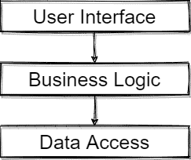
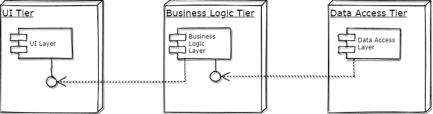
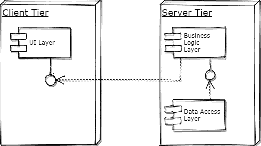

# [Layers与Tiers之间的区别](https://www.baeldung.com/cs/layers-vs-tiers)

1. 概述

    在本文中，我们将了解计算机科学中两个常用术语之间的区别，这两个术语经常被错误地互换： 层（Layers）和层（Tiers）。

2. Layers

    层是指代码的逻辑分隔。换句话说，它是一组连贯的相关功能。

    将应用程序分层是更好地组织代码库的一种方法。因此，可移植性和可维护性是推动我们使用这种结构的动力。

    事实上，我们可以在各种类型的架构中发现这一概念的应用，如分层架构和[六边形架构](https://www.baeldung.com/hexagonal-architecture-ddd-spring#hexagonal)。

    下面举例说明分层架构：

    

    在这里，用户界面层、业务逻辑层和数据访问层各司其职，在逻辑上是分开的。

    层与它们的物理分隔无关。当我们谈论层时，我们并不指定在哪里部署它们。

3. Tiers

    另一方面，层指的是物理结构。层定义了部署层的位置，但不一定是一对一的映射。因此，当我们谈论应用程序的层时，我们指的是它的拓扑结构。

    举例来说，让我们看看如何对上一段中的分层应用程序进行物理划分：

    

    在上图中，我们看到的是 n 层架构的表示法，其中每一层都有一个物理托管层。这就是经典的三层架构。

    层的定义要考虑到软件运行的计算环境。通过将应用程序划分为多个层，可以实现更高的可扩展性。

    我们还可以用不同的层结构部署应用程序的相同层：

    

    在这种 2 层或客户端-服务器架构中，用户界面层位于一个专用层上，而业务逻辑层和数据访问层位于另一个专用层上。

4. 结论

    在本文中，我们定义了层和层的概念，以及它们如何映射到逻辑和物理架构。
