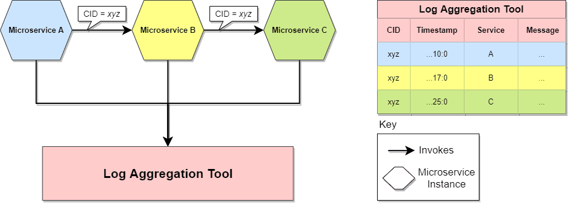
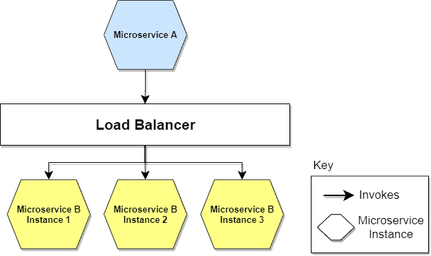
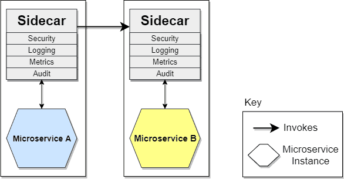

# [微服务与交叉关注点](https://www.baeldung.com/cs/microservices-cross-cutting-concerns)

1. 概述

    虽然我们通常认为微服务是完全独立、自成一体的单元，但事实并非总是如此。有时，从系统层面考虑问题会更方便，也会失去一些自主性。

    让我们深入了解这些交叉问题，并找出它们是什么。

2. 安全性

    首先要考虑的是这种架构风格如何涉及安全问题。就其本质而言，[微服务架构](https://www.baeldung.com/spring-microservices-guide)比其他模式更具分布性。组件之间的调用更大，我们必须特别注意旨在保护静态、传输和使用中数据安全的策略。

    鉴于这种性质，最容易受到攻击的部分就是 API。建立 [API 网关](https://www.baeldung.com/spring-cloud-gateway)非常有利，因为它可以作为来自外部调用的单一入口点。这样，就可以通过适当的白名单减少攻击面，从而防止恶意行为者的潜在攻击。

    确保端点安全至关重要。因此，我们还必须探讨授权和验证的主题。如今，管理授权的事实标准是 [OAuth / OAuth2](https://www.baeldung.com/spring-security-oauth) 流量。另一方面，双因素身份验证有助于防止和检测身份验证部分的意外和恶意访问。

3. 配置管理

    微服务配置管理涉及微服务本身以及使用微服务的应用程序的变更跟踪过程。在微服务架构中，单个微服务的变更可能会影响整个架构。这意味着它可能会影响到每个消费者。

    因此，我们必须跟踪所有微服务的部署及其配置。这样，通过添加所有周边元素（如 [Kubernetes](https://www.baeldung.com/ops/kubernetes) 集群、与托管它们的基础设施相关的信息），我们就能在游戏中掌握全局。

    想象一下，我们的集群中运行着成百上千个微服务：我们需要一个集中的地方，让所有微服务都能根据运行环境进行特定配置。

4. 日志聚合和分布式跟踪

    日志是软件应用程序的重要组成部分，它能让我们知道代码在运行时做了什么。它能让我们看到事情是否按预期执行，更重要的是，它能帮助我们诊断出问题所在。

    采用微服务架构会导致基础设施上运行多个微服务。我们还可能拥有同一个微服务的多个实例。每个微服务都会以标准格式写入自己的日志，其中包含信息、警告、错误和调试信息。

    由于与生俱来的关注点分离，我们经常需要在这类系统中使用多个微服务来满足单个请求。
    这就需要收集和汇总所有微服务的日志，其次，还需要建立一种机制，以便关联所有必要的内部调用，从而观察整个旅程的请求：

    

    这些日志聚合工具利用了相关 ID（CID），我们为一组相关的服务调用使用一个 ID。例如，客户请求可能触发的一连串调用。将此 ID 记录为每个日志条目的一部分，有助于隔离与给定调用流相关的所有日志，从而使故障排除变得更加简单。

5. 服务发现和负载平衡

    弹性和可靠性是微服务最能支持的两项功能。

    基于微服务的应用程序通常在虚拟化或容器化环境中运行。服务实例的数量及其位置会动态变化。这就是服务发现和负载平衡等策略发挥作用的地方。我们需要知道这些实例的位置和名称，以便分配来自外部的来电。

    我们可以将 "[服务发现](https://www.baeldung.com/spring-cloud-consul)" 想象成一个 "服务注册表"，它记录着每个实例的位置和名称。简而言之，当一个新实例得到服务并准备好接受请求时，它就会向指定节点通报其准备情况。后者则通过 ping/echo 或心跳策略等方式监控所有实例的情况。

    另一方面，负载平衡是指我们需要根据一种算法将负载分配给多个实例中的一个，当实例不再健康时将其移除，当它们恢复运行时再将其接上。其他有用的功能还包括 SSL 终止，用于管理传入呼叫流量传输过程中以及微服务之间的数据安全：

    

    服务发现和负载平衡均由服务网格（Service Mesh）等工具或 Kubernetes 等编排系统提供。

6. 共享库

    DRY（Don't Repeat Yourself）是引导我们创建可重复使用代码的方法。总的来说，这是有道理的。谈到微服务，一个常青话题就是是否使用共享库。当然，可以这样做并不意味着这样做就是正确的。

    第一点是，如果我们谈论共享代码，就会降低拥有异构技术的自由度。Java 共享库会影响我们构建其他基于 Java 的微服务。这不一定是缺点，但应该强调一下。

    基本上，实施微服务意味着分担责任和减少耦合。引入共享库违背了这种架构风格的主要理念。重要的是要理解我们为什么要引入共享库。如果我们正确应用了 [DDD](https://www.baeldung.com/java-modules-ddd-bounded-contexts) 等技术，我们将拥有一个内聚性很强、耦合度很低的架构。我们希望保留这些概念。

    当我们在微服务中使用共享库时，我们必须承认，对其代码的更改会迫使我们重新分配这些微服务，从而破坏微服务的基本特性之一：独立部署性。
    如果我们不想增加部署的复杂性，或者在极端情况下发现自己在处理分布式单体，那么最好保留这一特性。

    在微服务中共享代码并不一定总是错误的，但一定要三思而后行。

7. 侧卡(Sidecar)

    Sidecar 模式可能是所有模式中最值得关注的一种。当我们谈论微服务架构时，我们也会谈论多语言系统的可能性。换句话说，我们可以根据需要解决的任务自由选择语言、技术或框架。

    这可能会导致微服务使用不同的语言，从而增加维护跨领域相关库的难度。
    解决这一问题的方法之一就是侧车模式。跨领域关注点的逻辑被放置在自己的处理器容器（称为挎斗容器）中，然后链接到主应用程序。类似于摩托车副驾与摩托车的连接方式，副驾应用程序与主应用程序连接，并在主应用程序旁边运行：

    

    挎斗应用程序可以处理日志记录、监控、授权和身份验证等问题以及其他交叉问题。通过这种方式，每个微服务都将拥有与其他微服务等同的 Sidecar 实例，从而提高了跨领域问题的可维护性和可管理性。

8. 结论

    本文介绍了与微服务架构相关的一些更有趣、更有用的交叉关注点。正如我们所看到的，我们可以决定创建可重用的实现，以便在许多微服务中使用，或者在每个微服务中实现这些关注点。如果是前者，我们会在微服务之间建立耦合，而后者则需要额外的努力。根据系统的具体情况，我们有必要做出正确的权衡。
