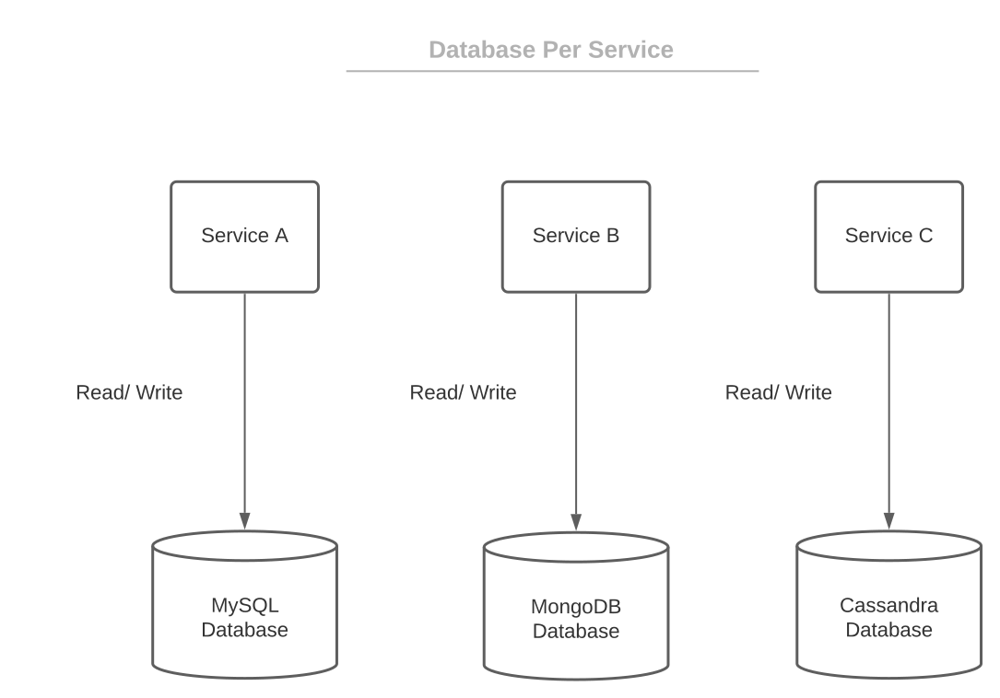
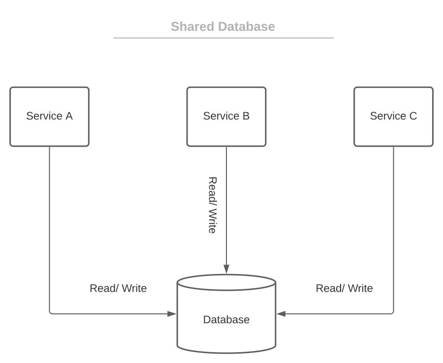

# [微服务架构中的数据库设计](https://www.baeldung.com/cs/microservices-db-design)

1. 简介

    [微服务](https://spring.io/blog/2015/07/14/microservices-with-spring)架构在不断发展。它带来了很多好处，尤其是与过时的单体架构相比。另一方面，在使用微服务开发项目时也面临着多重挑战。其中最重要的问题之一就是数据库设计。数据设计有两个关键问题。如何组织数据以及在哪里存储数据？

    在本教程中，我们将尝试回答这两个问题。

2. 每个服务的数据库

    使用微服务架构时，有两种主要的数据库组织方式：

    - 每个服务的数据库
    - 共享数据库

    本节将介绍第一种。

    1. 基本原理

        根据定义，微服务在开发和部署方面应该是松散耦合、可扩展和独立的。因此，每个服务数据库是一种首选方法，因为它完全满足这些要求。让我们来看看它的外观：

        

        想法很简单。每个微服务都有自己的数据存储（整个模式或一个表）。其他服务无法访问它们不拥有的数据存储。这种解决方案有很多好处。

        首先，对单个数据库的更改不会影响其他服务。因此，应用程序中不会出现单点故障。可以说，应用程序更具[弹性](https://www.baeldung.com/resilience4j)。

        其次，单个数据存储更容易扩展。此外，域的数据被封装在微服务中。因此，从整体上更容易理解服务及其数据。这对开发团队的新成员尤为重要。他们可以花费更少的时间和精力来全面了解自己负责的领域。

        最后，有了每个服务的数据库，我们就可以使用多语言持久性。这意味着我们可以为不同的微服务使用不同的数据库技术。因此，一个服务可能使用 SQL 数据库，而另一个服务可能使用 NoSQL 数据库。这一特性允许根据服务要求和功能使用最有效的数据库。

    2. 缺点

        尽管有这些优点，但按服务划分数据库的方法也存在一些严重的缺点和挑战。如前所述，每个微服务只能直接访问自己的数据存储。因此，服务需要一种通信方法来交换数据。因此，每个服务都必须提供明确的应用程序接口。

        因此，我们需要一种故障保护机制，以防通信失败。假设我们从服务 A 向服务 B 发送支付请求，服务 A 等待响应，并根据响应结果执行适当的操作。在此期间，服务 B 离线。我们需要处理这种情况，并在 B 重新上线后将结果通知服务 A。[断路器机制](https://www.baeldung.com/introduction-to-hystrix)可以在这方面提供帮助。

        下一个重要问题是[事务](https://www.baeldung.com/transactions-across-microservices)。跨微服务的事务会对一致性和原子性产生负面影响。复杂查询也存在类似的问题。没有一种简单的方法可以在多个数据存储上执行连接查询。

        最后，如果出现任何问题，跨微服务的数据相关操作可能难以调试。

3. 共享数据库

    共享数据库被认为是一种反模式。尽管这一点值得商榷。问题在于，使用共享数据库时，微服务会失去其核心属性：可扩展性、弹性和独立性。因此，共享数据库很少用于微服务。

    当共享数据库似乎是微服务项目的最佳选择时，我们应该重新思考我们是否真的需要微服务。也许单体才是更好的选择。让我们看看共享数据库方法是怎样的：

    

    在微服务中使用共享数据库的用例并不常见。一个例子可能是将单体迁移到微服务时的临时状态。共享数据库相对于单个服务的主要优势在于事务管理。没有必要将事务跨越到各个服务上。

    此外，数据是完全受限的，并保留了适当的辐射(radiations)。这样，冗余就会减少。我们可以通过连接轻松执行复杂的查询。

    另一件重要的事是，微服务之间无需交换存储数据。这样，应用程序接口就简化了，即使通信失败，数据和状态的一致性也不会有问题。不过也有一些严重的缺点。

    使用共享数据库的微服务不容易扩展。更重要的是，数据库将成为单点故障。与数据库相关的更改可能会影响多个服务。此外，微服务在开发和部署方面并不独立，因为它们连接到同一个数据库并在其上运行。

    在以下情况下可以考虑使用这种模式

    - 应保留现有数据存储
    - 不应更改现有的数据层代码库
    - 事务对应用程序至关重要

4. 数据相关模式

    微服务架构中有多种用于管理数据的模式。在本节中，我们将简要介绍其中的基本模式。

    1. 传奇模式

        我们在前面提到，在微服务间跨事务可能会有问题。简单地说，只有所有相关服务都成功执行了自己的部分，事务才能成功。如果一个服务失败，整个事务就会失败。此外，在这种情况下，已经完成自己部分工作的服务应该回滚更改。

        一般来说，这就是传奇(Saga)模式的作用。[Saga 模式](https://www.baeldung.com/cs/saga-pattern-microservices)是一个本地事务序列，代表一个分布式事务。每个服务都执行一个本地事务。如果本地事务成功结束，就会发布一个事件或消息，触发序列中的下一个本地事务。如果失败，saga 会提供补偿事务来回滚更改。

        saga 模式有两种实现方式：

        - 编制(Orchestration) - 中央控制器（编排器）管理微服务之间的所有互动
        - 编排(Choreography) - 分散式事件播报技术

    2. CQRS

        CQRS（命令查询责任隔离）有助于实现另一个重要功能：从多个数据存储区查询相关数据。此外，它还通过分离关注点来简化业务逻辑的复杂性。此外，它还有助于提高微服务的可扩展性。

        这个想法很简单。我们将数据层与业务逻辑层分开。此外，类只能向数据库写入（命令）或从数据库读取（查询）。因此，一个类不能同时完成这两种操作。这种方法有很多好处。代码更清晰，更易于维护或扩展。不同的组件可以单独优化、开发，尤其重要的是，还可以扩展。

        随后，各组件松散耦合，开发人员或团队之间可以有效分工。最后，分成组件的应用程序更易于测试。实现 CQRS 模式没有唯一正确的方法。实现方式可以基于领域、需求、框架、项目的实际状态等。CQRS 通常与[事件源](https://www.baeldung.com/cqrs-event-sourcing-java#1-event-sourcing)模式一起使用。让我们来介绍一下这个模式。

    3. 事件源

        许多现代应用程序都依赖事件来实现各种目的。例如，正如我们前面提到的，saga 序列中的服务会原子式地更新数据库并发布事件或消息。事件源利用了应用程序事件。

        事件源是一种通过持久化状态变化事件来表示状态的技术。每当业务实体发生变化时，事件就会被持久化到事件存储中。

        顾名思义，事件站点就是一个事件数据库。它可以是 SQL、NoSQL 或任何其他适合项目的方式。此外，事件存储还可以充当消息中介。所有感兴趣的组件都会订阅它。当事件被持久化时，事件存储会向所有订阅者发送信息。发布事件是一个单一的原子操作。因此，它提供了跨微服务数据库操作的可靠性和原子性。

        此外，它还能创建完整的审计日志。如果出现任何问题或错误，很容易研究状态变化并最终恢复有效状态。因此，调试也就不那么复杂了。此外，事件源还能避免面向对象数据和关系数据之间的阻抗失配。总之，事件源可以为微服务架构或任何[事件驱动](https://www.baeldung.com/spring-events)的应用程序提供极大的帮助。

5. 如何选择数据库？

    在微服务中规划数据库设计的第一步是选择模型。我们已经提到了每个服务数据库和共享数据库模型。此外，我们还考虑了它们的优缺点和常见用例。

    第二步是选择对项目或服务最有效的特定数据库技术（或技术）。为此，我们需要考虑一些特性。

    第一个重要参数是读取性能。读取性能可以是每秒操作次数，也可以是获取查询的速度。与电子商务、客户关系管理、银行软件相关的应用程序或服务通常会包含需要快速、频繁获取数据的功能。

    第二个重要属性是写入性能。这与前一个属性类似。只是，在这种情况下，我们是向数据库写入数据，而不是从数据库读取数据。如果服务需要持久化大量数据，甚至需要存储大块数据，这可能是一个核心参数。

    下一个参数是延迟。这是用户操作和服务器响应之间的延迟。这在与用户体验相关的组件中尤为重要。直播流应用或实时游戏就是很好的例子。

    另一个重要特性是资源效率。通常，消耗的资源越少越好。根据平台的不同，这可能会加快执行速度、降低主机负载和最终成本。

    最后但并非最不重要的一点是，我们应该考虑配置效率。一般来说，这就是数据库如何影响微服务的开发、部署和测试。正如我们前面提到的，微服务在这些方面的独立性非常重要。

    1. SQL 与 NoSQL

        项目或服务通常会考虑两种技术： SQL 和 NoSQL。基本上，这比较复杂，尤其是涉及到 NoSQL 时。NoSQL 数据库的实现有很多种，即。不过，在本文中，我们不会详细阐述数据库的底层实现。让我们来比较一下 SQL 和 NoSQL 的总体情况。

        | SQL              | NoSQL            |
        |------------------|------------------|
        | 关系型              | 非关系型             |
        | 存储数据的单一方式：表格     | 多种实现方式：列、文档、图、键值 |
        | 高度支持事务           | 不适合大量事务处理        |
        | 预先定义的模式。更改模式需要迁移 | 灵活的模式            |
        | 最适合纵向扩展          | 最适合横向扩展          |
        | 基于 ACID          | 基于 CAP 定理        |
        | 不适合大型数据集         | 适用于大型数据集         |
        | 同步执行插入和更新        | 异步执行插入和更新        |
        | 适合复杂查询           | 缺乏组成复杂查询的功能      |

6. 结论

    本文阐述了微服务架构中的数据库设计。正如我们所见，这是一项非常复杂的任务。所有元素都应仔细规划，并适合项目需求，以最大限度地提高效率。
