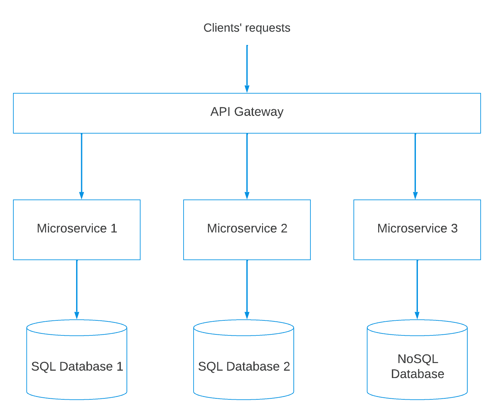
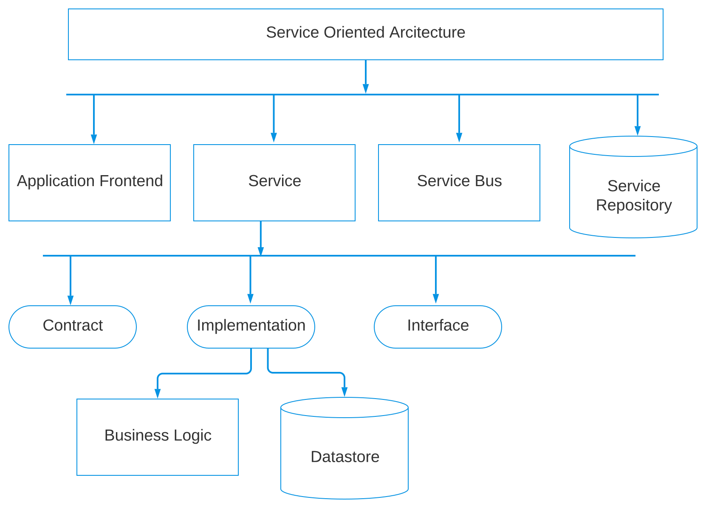

# [微服务与面向服务架构](https://www.baeldung.com/cs/microservices-soa-differences)

1. 导言

    微服务和面向服务架构（SOA）具有独特的优势，但在不同的模式下运行。

    在本教程中，我们将探讨这两种方法的原理和优势。

2. 微服务

    在现代软件开发中，"微服务" 一词已获得了极大的关注。它代表了一种架构方法，旨在提高复杂应用程序的敏捷性、可扩展性和可维护性。

    微服务架构将应用程序构建为松散耦合、可独立部署的服务集合。这些服务侧重于特定的业务功能，并通过定义明确的[应用程序接口](https://www.baeldung.com/cs/api-vs-sdk)进行通信：

    

    这种方法是将复杂的应用程序分解成较小的、可独立管理的服务，这些服务可以单独部署。此外，它与单体架构形成鲜明对比，在[单体架构](https://www.baeldung.com/cs/microservices-vs-monolithic-architectures)中，由于应用程序的紧密集成，一个组件的变化会对整个系统产生重大影响。

    作为外部请求的入口，应用程序接口网关有助于将传入的调用路由到相关的微服务。这种机制简化了客户端与不同服务之间的交互，简化了通信流程。

    此外，与每个微服务相关联的数据库反映了为每个服务使用单独数据库的做法，使它们能够更加自主地运行。

    1. 原则

        首先，微服务的基本原则之一是服务自治。每个服务都作为一个自治实体运行，拥有自己的[数据库](https://www.baeldung.com/cs/sql-vs-nosql)并独立实现其功能。因此，这种自主性可确保一个服务的变更不会影响其他服务，从而加快开发和部署速度。

        此外，微服务优先考虑分散的数据管理。每个服务都处理自己的数据存储，并使用针对服务特定需求进行优化的数据库。这种策略促进了数据所有权，减少了数据耦合，并有助于避免共享单体数据库可能出现的数据一致性问题。

        此外，微服务还支持技术异构。这种方法使每个服务都能使用最适合其特定任务的技术堆栈进行开发。因此，开发人员可以根据工作需要选择最佳工具，从而提高效率和创新能力。

    2. 挑战

        与其他架构范式一样，微服务也有自己的挑战。

        微服务面临的一个突出挑战是管理分布式系统的复杂性。在微服务架构中，应用程序由多个通过网络通信的服务组成。这种情况会带来服务发现、负载平衡和网络延迟等复杂问题。

        此外，微服务会使测试和调试变得更加复杂。它们需要对单个服务进行全面测试，并进行端到端的集成测试。因此，我们需要复杂的测试策略和工具来确保系统功能的一致性。

        此外，微服务还可能在保持各服务数据一致性方面带来挑战。由于每个服务可能都有自己的数据库，因此确保数据完整性和[一致性](https://www.baeldung.com/cs/eventual-consistency-vs-strong-eventual-consistency-vs-strong-consistency)可能会变得复杂。使用分布式事务来管理跨服务的数据会带来困难，并可能影响系统性能。

        此外，协调各种服务以执行一致的业务流程也是一项挑战。虽然微服务为单个服务提供了自主权，但它们可能需要精心设计和实施，以确保不同服务无缝协作。

        最后，监控和可观察性至关重要，但在微服务架构中要求更高。由于环境中分布着众多服务，因此监控和识别性能瓶颈、错误或异常情况需要先进的监控解决方案。

        虽然微服务具有众多优势，但也带来了管理分布式系统、测试、数据一致性、协调和监控方面的挑战。因此，采用微服务的企业必须做好应对这些挑战的战略准备。

3. 面向服务的架构

    在软件架构中，面向服务的架构已成为一种强调模块化和互操作性的基础方法。

    SOA 的核心是将软件组件组织为可相互[通信](https://www.baeldung.com/cs/inter-process-communication)的服务。这些服务旨在执行特定的业务功能，并通过标准化接口进行交互：

    

    面向服务架构（SOA）图由相互关联的组件组成，描述了系统的结构：

    - 服务代表特定的业务功能
    - 服务存储库是服务的中央目录，便于发现和使用。
    - 前端是用户界面层，通过合同与服务进行通信。
    - 服务总线可促进服务之间的通信，实现消息交换。

    合同定义服务交互，促进松散耦合。接口对外公开服务功能，而实现则包含服务的内部业务逻辑。最后，数据存储管理数据的存储和检索。

    这种架构促进了模块化、灵活性和可扩展性，符合面向服务的设计原则。

    1. 原则

        首先是服务的可重用性。服务的设计是模块化的，可在多个应用程序中重复使用。因此，企业可以通过组合现有服务来构建新的应用程序，从而减少开发工作并促进一致性。

        此外，SOA 还强调服务的可发现性。在服务注册中心注册服务可简化其他组件的定位和使用。这种做法增强了集成的便利性，促进了服务之间的协作。

        此外，还有服务可组合性。这一概念使企业能够以不同的方式组合各种服务，从而创建灵活的应用程序。

        最后，松散耦合在 SOA 中至关重要。服务的设计是[独立](https://www.baeldung.com/cs/statistical-independence)的，并通过标准化接口进行通信。因此，对一种服务的更改并不需要对其他服务进行更改，从而提高了灵活性并最大限度地减少了依赖性。

        总之，SOA 通过强调模块化、可重用性、可发现性、可组合性和松散耦合，提供了一种结构化的软件设计方法。因此，SOA 有助于创建灵活、可互操作的应用程序，使其能够随着不断变化的业务需求而发展。

    2. 挑战

        SOA 是构建模块化和可互操作系统的强大架构。然而，它也带来了一些挑战。

        首先，SOA 的主要挑战之一是管理服务版本和兼容性。在引入新功能的同时确保向后兼容性，会随着服务的发展而变得错综复杂。在这种情况下，需要精心策划和制定版本策略，以防止服务消费中断。

        此外，服务粒度也会给 SOA 带来挑战。设计既非粗粒度也非细粒度的服务需要良好的架构计划。过大的服务可能导致效率低下，而过小的服务则可能导致通信开销增加。

        此外，服务管理可能很复杂。企业必须制定明确的管理政策，以确保整个服务生态系统的一致性、安全性和对标准的遵守。这方面可能需要大量的努力和协调。

        此外，数据一致性和完整性也是 SOA 面临的关键挑战。服务可能会在整个系统中共享数据，因此确保服务间的数据一致性（和准确性）要求很高。适当的事务管理和数据同步策略是应对这一挑战的必要条件。

        最后，协调服务以提供复杂的业务流程也是一件难事。我们应确保各种服务无缝协作，以实现更大的目标，这需要精心设计和协调。

4. 比较

    让我们来看看它们的不同之处：

    | 属性   | SOA                | 微服务                     |
    |------|--------------------|-------------------------|
    | 依赖关系 | 业务单元相互依赖           | 每个微服务都是独立的，它们通常不共享数据层   |
    | 设计   | 旨在最大限度地提高应用服务的可重用性 | 注重解耦                    |
    | 连接   | 通信的基本形式是企业事件总线     | 服务通过消息协议，有时通过 REST 进行通信 |
    | 软件规模 | 通常比任何其他架构都要大       | 由小型独立服务组成               |
    | 架构   | 细粒度或集中式            | 粗粒度或分散                  |
    | 服务   | 业务、企业或基础设施        | 功能和基础设施                 |

5. 结论

    在本文中，我们比较了两种现代软件开发方法：微服务和面向服务架构。

    在 SOA 和微服务之间做出选择取决于组织的需求和应用程序的性质。因此，SOA 提供了一种结构化的互操作性方法，而微服务则提供了一种更细化、更灵活的架构，适合现代应用程序的需求。

    不过，这两种方法都有一个共同的目标：使企业能够构建敏捷、可扩展和可适应的软件系统，以满足不断发展的业务需求。企业可以通过了解 SOA 和微服务的细微差别，做出符合自身目标和战略的明智架构决策。
