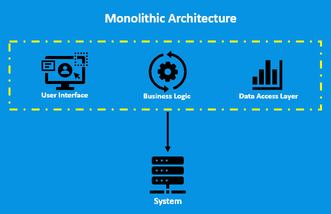
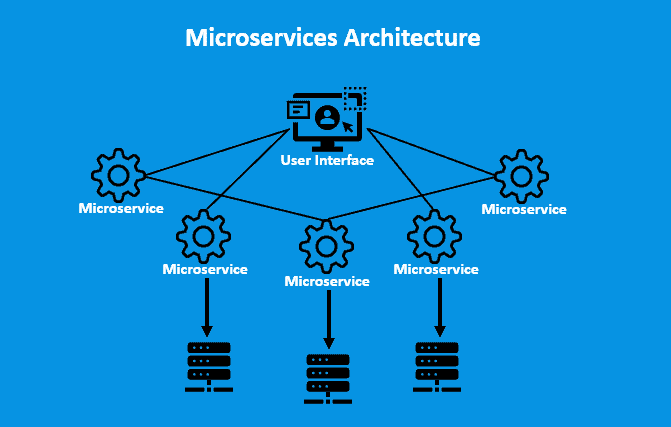

# [微服务与单体架构](https://www.baeldung.com/cs/microservices-vs-monolithic-architectures)

1. 导言

    技术的发展给[软件开发](https://www.baeldung.com/cs/deprecated-vs-obsolete)过程带来了变化。软件开发中信息量最大的变化之一就是从单片架构到微服务的转变。

    多年来，单体架构一直是构建应用程序的传统方式，而在过去几年中，微服务变得越来越流行。

    在本教程中，我们将深入探讨微服务和单体架构、每种方法的主要特点、在两者之间做出选择时需要考虑的因素，以及使用这些架构的一些用例。

2. 单体架构

    单体架构是我们在构建软件应用程序时可以使用的一种经典方法。多年来，它一直是软件开发的主流方法，至今仍在广泛使用。

    单片架构将应用程序的所有组件耦合为一个统一的系统运行。因此，对应用程序某个部分的任何修改都可能影响整个系统。

    下图显示了单体架构：

    

3. 微服务架构

    与传统方法相比，微服务架构提出了一种不同的软件应用程序开发方法。它解决了单体架构的局限性。

    在微服务架构中，应用程序被分解成独立的小服务，这些服务之间使用定义明确的应用程序接口进行通信。

    此外，每个微服务负责应用程序的特定特性或功能，每个服务都可以独立于其他服务进行开发、部署和扩展。因此，开发和维护应用程序的灵活性和敏捷性更高。

    下图显示了微服务架构：

    

4. 微服务与单体架构的比较

    在为任何软件选择架构时，为了做出明智的决定，下表对微服务和单体架构进行了比较，强调了每种方法的优缺点：

    | 微服务                        | 单体                                |
    |----------------------------|-----------------------------------|
    | 微服务可以实现服务的独立扩展，从而提高性能和可用性。 | 单体可直接作为一个单元进行开发、测试和部署。           |
    | 每个服务都可以使用不同的技术开发。          | 更易于管理和监控，因为所有组件都是紧密耦合的。           |
    | 隔离服务可防止单一故障影响整个系统。         | 由于所有组件都是单一系统的一部分，因此可提高内聚力。        |
    | 专为持续部署而设计，使团队能够快速发布新功能。    | 网络调用更少，组件间通信更快。                   |
    | 比单体方法更复杂，服务协调可能具有挑战性。      | 可扩展性不如微服务架构，因为所有组件都是同一系统的一部分。     |
    | 网络延迟会导致服务间通信延迟，影响性能。       | 灵活性不如微服务，因为所有组件都相互依赖，并使用相同的技术栈。   |
    | 需要额外的基础设施和开销来管理各种服务。       | 在单体架构中开发新功能需要更长的时间。               |
    | 随着服务数量的增加，测试所有服务变得更加复杂。    | 由于所有组件都必须使用相同的堆栈，因此采用新技术和框架具有挑战性。 |

5. 微服务和单体架构： 示例用例

    在本节中，我们将探讨公司和应用程序实施微服务或单体架构的真实案例。

    使用微服务架构的公司实例之一是[Netflix](https://www.netflix.com/)。它拥有一个庞大而复杂的应用程序，为全球数百万用户提供服务。

    此外，为了保持高可用性和可扩展性，他们采用了微服务架构，允许他们独立扩展各个服务。这使他们能够快速高效地添加新特性和功能。

    另一方面，[Shopify](https://www.shopify.com/)也是使用单体架构的公司的一个很好的例子。这是一个电子商务平台，为企业创建和管理网店提供工具。

    开发人员使用单体架构是因为他们的应用程序相对简单，不需要像 Netflix 这样的公司那样的可扩展性。此外，单体架构还能让他们更快、更有效地管理应用程序。

6. 在微服务和单体之间做出选择

    在决定架构方法时，考虑业务的具体要求至关重要。这包括评估各种因素，如应用程序的规模和复杂性、可用资源、IT 团队的专业知识和经验以及未来发展计划。

    一般来说，单体架构可能非常适合规模较小、不太复杂的应用程序，或者管理和维护 IT 系统资源有限的企业。

    相比之下，微服务架构可能更适合需要更高可扩展性和灵活性的大型、更复杂的应用程序。

7. 结论

    总之，决定使用单体架构还是微服务方法是一个需要仔细考虑的重要选择。

    两者各有利弊。正确的选择取决于我们企业的具体需求和目标。
