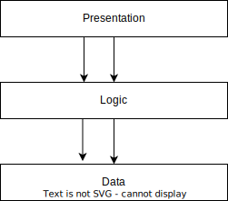

# N 层架构

1. 简介

    在本教程中，我们将介绍软件开发中的 N 层架构。首先，我们将给出一个定义，回顾其组成部分，并概述其特点。然后，我们还将介绍其优点和缺点，并举例说明在哪些情况下适合使用它们。

2. 什么是 N 层架构？

    在了解 N 层架构之前，[软件架构](https://www.baeldung.com/cs/layered-architecture#definitions)是任何软件系统的基本结构，它包含了使系统正常运行的任何方面。目前使用的软件架构多种多样，如[客户服务器](https://www.baeldung.com/cs/client-vs-server-terminology)、[微服务](https://www.baeldung.com/cs/microservices-db-design#intro)、微内核和[分层架构](https://www.baeldung.com/cs/layered-architecture#what-is-a-layered-architecture)。

    现在，N 层架构是一种多层客户服务器架构，其中的显示、处理和数据功能在逻辑上和物理上被划分为不同的层。物理上的分离也意味着每个功能都在不同的物理机器上执行。有时还位于不同的地理位置。

    让我们来看看一些主要特点。

    1. 特点

        N 层架构通常以线性叙事方式连接，也就是说，我们必须通过一层才能到达下一层。

        此外，尽管各组件在物理和逻辑上相互分离，但对于用户来说，N 层应用程序是作为一个整体出现和运行的。这就是[分布式联网](https://www.baeldung.com/cs/os-types#distributed-operating-system)的一个例子。不同的组件通常通过高速总线等通信链路进行通信。

        此外，N 层架构还采用客户-服务器模式。在[客户机-服务器](https://www.baeldung.com/cs/client-vs-server-terminology#client-server-model)模式中，多个客户机请求并接收来自中央服务器的服务。在这种情况下，客户端和服务器都是在不同层中运行的计算机程序。

        最后，N 层也意味着架构可以有任意数量的层，但最常见的是 3 层。例如，在 1 层架构中，所有组件都放在单层上，即一台机器上。

3. 分层架构的组件

    N 层架构将其主要组件划分为逻辑上和物理上独立的组件。它们分别是表现层、处理层或逻辑层以及数据层：

    

    呈现层负责以用户易于理解和操作的格式呈现信息。例如，在笔记本电脑上与网络应用程序交互的用户就是工作中的表现层。

    此外，逻辑层处理所有处理功能，包括执行命令、处理错误、计算和任何逻辑决定。以网络应用程序为例，逻辑层的底层程序是用 HTML 或 PHP 等编程语言编写的网页渲染程序。

    最后，数据层处理数据存储（通常是数据库）以及与数据库之间的任何通信。在网络应用程序的例子中，数据层就是运行 SQL 语句的数据库。

    现在让我们来看看 N 层架构的实际应用案例。

4. N 层架构示例

    让我们考虑一个医疗中心的基于网络的病人预约应用程序，它可以让病人与医生和专家预约：

    

    表现层包括用户与计算设备（如笔记本电脑或手机）上的网络浏览器进行交互。用户使用自己的登录信息登录系统，并选择想要预约的医生。

    值得注意的是，使用 n 层设计的好处之一是可以在不触及其他层的情况下轻松更改其中一层。在这种情况下，可以调整网络浏览器的图形界面，以便在笔记本电脑或手机等不同的计算设备上运行，而不会影响其他层。

    逻辑层与表现层相连，由用户授权流程组成。此外，在另一台机器上托管的网络服务器上还有调度和验证表单。

    最后，逻辑层连接到数据层，由另一台机器上的 MySQL 数据库组成。该数据库包含病人、医生和专家的详细信息。它还包含每个医生和专家的可用时间信息。用户预约的时间也保存在数据库中。

5. 优点

    采用 N 层架构后，可扩展性大大提高。由于架构中的各个组件是分离的，因此可以轻松升级一个组件，而不会影响其他组件的性能或运行。例如，如果数据层数据库的存储空间不足，可以很容易地增加存储空间，而这不会影响表现层和逻辑层。

    除了可扩展性之外，拥有独立的组件还能更容易地维护架构中的每个组件，而不会影响所有其他组件的性能。

    采用这种架构的另一个显著优势是可重用性。这是由于组件的逻辑分离使得架构可以在不同的应用程序或项目中重复使用。

    N 层架构的安全性也得到了提高，因为不同层可根据需要获得适当的安全权限。

6. 缺点

    由于组件的物理分离，延迟总是有可能增加。然而，快速通信链路可以在某种程度上解决这个问题。

    此外，层数的增加往往会增加架构的复杂性。层数越多，通常意味着需要维护和运行的组件越多。

7. 何时使用 N 层架构

    N 层架构适用于通信链路收发信息速度非常快的情况。这一点至关重要，因为通信链路是实现不同组件之间通信的关键。

    此外，这种架构主要适用于优先考虑可扩展性、安全性、易维护性和可重用性的应用程序。

8. 结论

    本文回顾了 N 层架构。首先，我们定义了软件架构和 N 层架构。其次，我们列出了该架构的一些特点和基本组件。我们还讨论了与这种架构相关的优点和缺点。最后，我们讨论了在哪些情况下可以使用 N 层架构。
