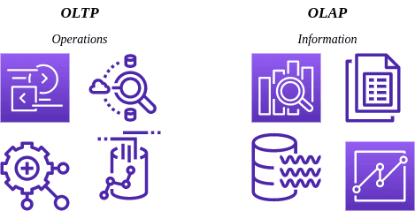

# [在线事务处理与在线分析处理](https://www.baeldung.com/cs/oltp-olap)

1. 简介

    OLTP 和 OLAP 是现代数据管理和分析中必不可少的处理系统。OLTP 专注于实时数据更新，而 OLAP 则擅长复杂数据分析和报表。

    在本教程中，我们将探讨它们的体系结构、数据模型和处理操作。我们还将介绍它们的性能特点以及实际应用和用例。

2. OLTP

    要掌握 OLTP 系统的精髓，了解其体系结构和基础架构至关重要。OLTP 系统旨在处理大量事务并确保数据的实时完整性。它们通常采用[客户端-服务器架构](https://www.baeldung.com/cs/client-vs-server-terminology)，即多个客户端与一个[集中式数据库服务](https://www.baeldung.com/cs/centralized-vs-distributed-computing)器交互。

    OLTP 系统的基础设施注重高可用性，确保系统即使在使用高峰期也能保持运行。为实现这一目标，通常会采用专用硬件、故障转移机制和备份系统。

    此外，OLTP 系统优先考虑快速响应时间，以支持快节奏的事务处理。基础架构经过优化，可实现高效的数据插入、修改和删除，使企业能够及时处理和记录事务，同时保持数据的完整性。

3. OLAP

    与 OLTP 系统不同，联机分析处理（OLAP）系统的架构和基础设施是为满足复杂数据分析和报告的需求而量身定制的。OLAP 系统通常采用[多层架构](https://www.baeldung.com/cs/n-tier-architecture)，包括数据源、[数据仓库](https://www.baeldung.com/cs/data-warehouses)和 OLAP 服务器。

    数据抽取、转换和加载（[ETL](https://www.baeldung.com/spring-cloud-data-flow-etl)）流程在 OLAP 系统中至关重要，可将来自不同来源的数据整合并组织到中央数据仓库中。数据仓库是历史数据和汇总数据的存储库，可优化用于[分析查询](https://www.baeldung.com/jpa-queries)。

    OLAP 服务器采用星形模式或雪花模式等多维数据模型，以促进高效、快速的数据分析。这些系统通常采用索引、预聚合和缓存等先进技术来提高查询性能。OLAP 系统的架构和基础设施优先考虑可扩展性和灵活性，以处理大量数据并支持复杂的分析操作，使企业能够在全面数据分析的基础上获得有意义的见解并做出明智的决策。

4. 主要区别

    OLTP 和 OLAP 的主要区别在于数据模型和结构，这导致了不同的性能和可扩展性：

    

    1. 数据模型

        OLTP 系统使用[关系数据模型](https://www.baeldung.com/r2dbc)将数据组织到具有预定义关系和约束的表中。规范化是 OLTP 数据模型的基本原则，旨在消除冗余并保持数据一致性。

        关系模型通过主键约束、外键关系和数据库规范化规则确保结构化存储和事务完整性。OLAP 系统使用多维数据模型（如星形和雪花模式）进行高效灵活的数据分析。

        这些模式允许在多个维度上进行高效的切片、切割、向下钻取和数据聚合。OLAP 系统利用层次、级别和度量来表示复杂的关系并执行高级分析操作。

    2. 数据存储和处理结构

        OLTP 系统采用基于行的存储结构和 B 树索引等索引技术，优先考虑高效的事务处理和数据存储。它们优先考虑快速插入、修改和删除数据，确保事务一致性和数据完整性。

        另一方面，OLAP 系统采用基于列或混合列的存储结构，侧重于大型数据集的分析处理和高效查询。先进的索引技术（如位图索引或压缩）可加速分析查询操作。OLAP 系统通常采用预聚合和物化视图来存储预计算结果并优化查询响应时间。

    3. 性能

        OLTP 系统优先考虑低延迟和高吞吐量，以高效处理大型并发事务。它们通常使用索引、查询优化和事务缓存等技术来尽量缩短响应时间和提高处理速度。OLTP 系统的性能在很大程度上取决于底层基础设施，包括硬件能力、数据库优化和网络延迟降低。强大的事务保证可确保数据的一致性和完整性，从而影响性能。

        OLAP 系统优先考虑复杂的分析计算和报告功能，通常涉及大量数据。它们采用索引、查询优化和预聚合等先进技术，以提高复杂查询的查询响应时间。为提高性能，通常使用内存处理和列式存储格式。

    4. 可扩展性

        OLTP 系统的可扩展性是指随着业务需求的增长，系统处理不断增加的事务负载的能力。通常采用水平扩展、负载平衡机制和数据分区技术来提高系统容量。确保高可用性和容错性对扩展 OLTP 系统至关重要，因为单个节点的故障不应中断事务处理或损害数据完整性。

        OLAP 系统的性能在很大程度上取决于多维数据模型的设计、ETL 流程的效率以及分析查询的优化。OLAP 系统的可扩展性考虑因素围绕着有效处理大量数据和适应不断增长的分析工作负载。纵向扩展、并行处理和分布式查询执行技术被用来分化和征服复杂的分析查询，充分利用多种计算资源。数据分区策略（如数据分片或分区视图）可用于将数据分布到多个服务器上，以提高可扩展性和性能。

5. 使用案例

    OLTP 和 OLAP 系统在不同行业和场景中都必不可少，可满足特定需求。OLTP 系统广泛应用于银行业和金融业的实时交易，而 OLAP 系统则在电子商务、预订系统、供应链管理和医疗保健领域至关重要。

    OLTP 系统处理电子商务平台中的实时预订、预定、库存管理和订单处理。相比之下，OLAP 系统对商业智能、数据仓库、销售和营销分析、财务分析和风险分析至关重要。

    OLAP 系统可帮助企业分析大量数据、识别潜在风险、检测异常情况并监控关键风险指标，从而为决策过程提供有价值的见解。了解这些系统在商业世界中的实际意义对于企业有效利用这些系统至关重要。

6. 总结

    在当今的数字化时代，企业必须区分 OLTP 和 OLAP 系统，以优化数据管理和分析能力。OLTP 系统侧重于实时事务处理，而 OLAP 系统则专门从事复杂数据分析。

    数据管理的未来在于整合 OLTP 和 OLAP 系统，混合事务/分析处理（HTAP）系统展示了这两个领域的融合。通过利用它们各自的优势并对其进行有效整合，企业可以释放数据能量，获得有价值的见解，并做出明智的决策，从而在当今数据驱动的环境中茁壮成长。
