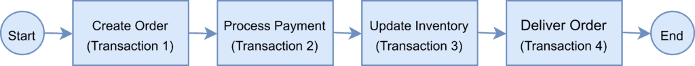
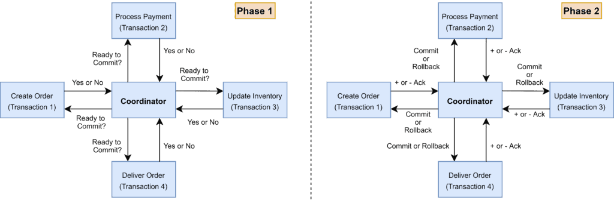
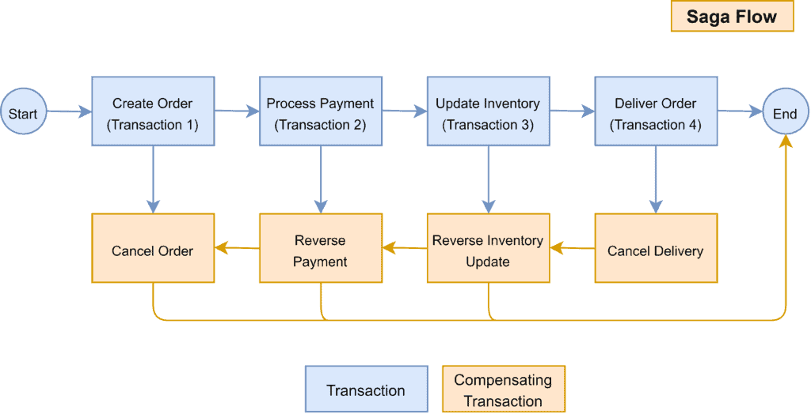
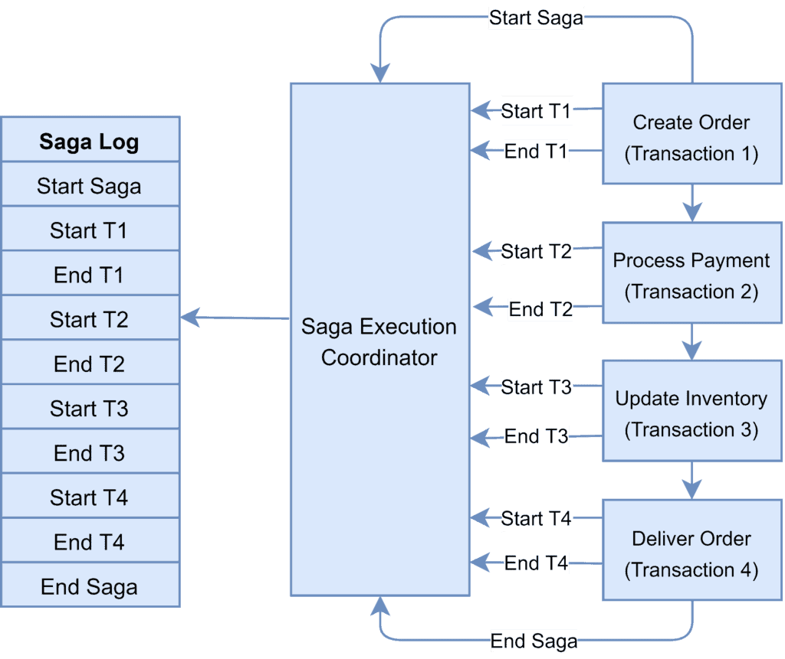
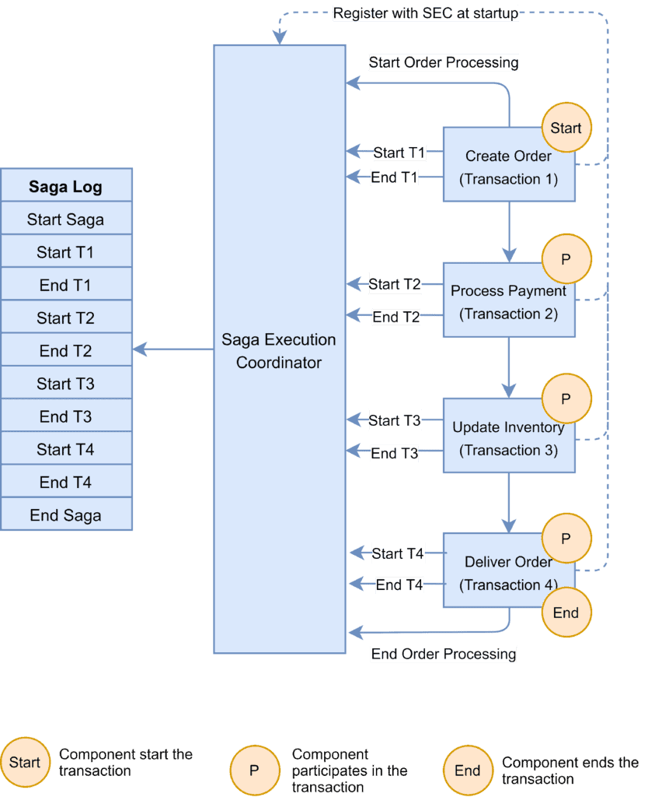
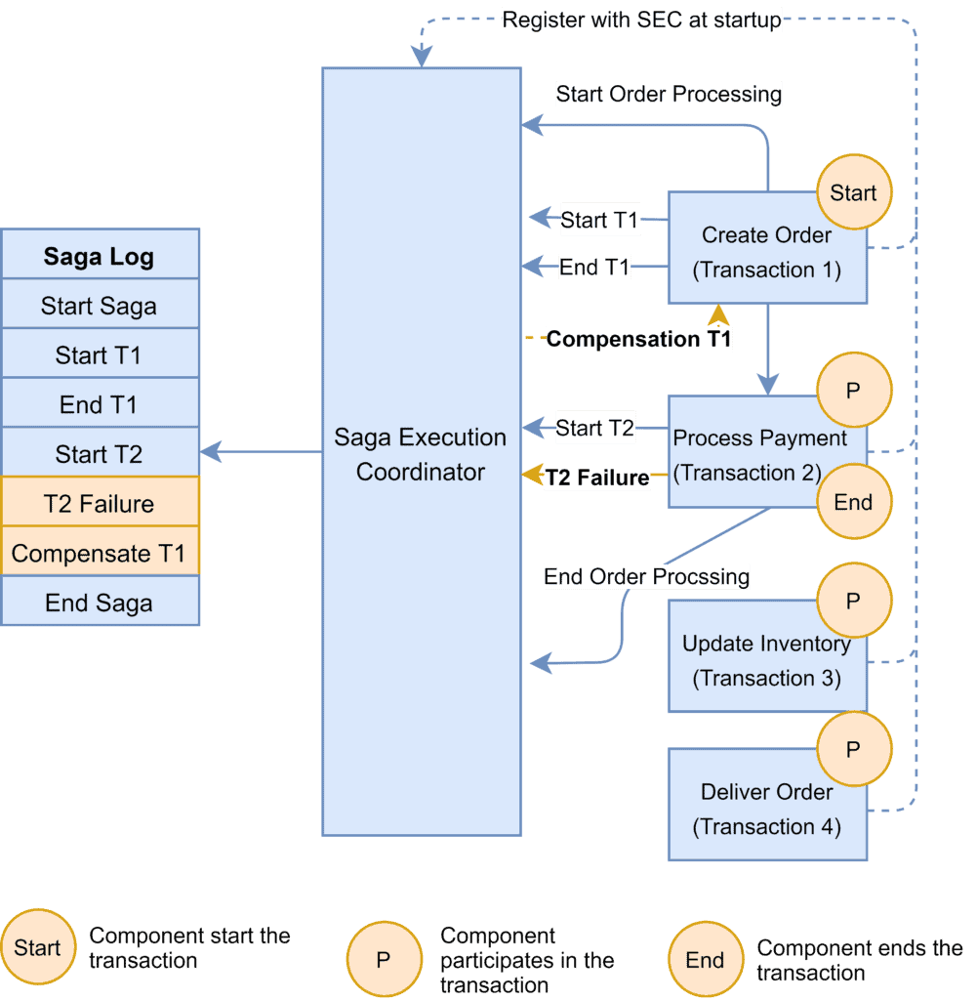
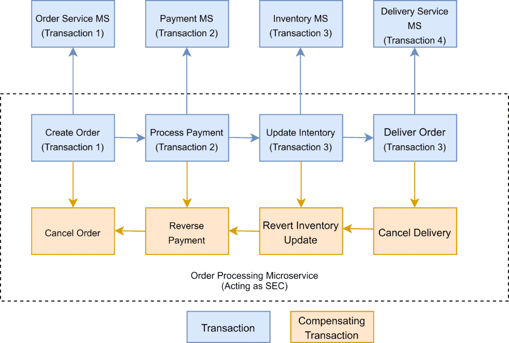

# [微服务中的传奇模式](https://www.baeldung.com/cs/saga-pattern-microservices)

1. 概述

    从其核心原理和真实背景来看，基于[微服务](https://www.baeldung.com/spring-microservices-guide)的应用程序是一个分布式系统。整个系统由多个较小的服务组成，这些服务共同提供整个应用程序的功能。

    虽然这种架构风格有很多优点，但也有一些局限性。微服务架构的主要问题之一是如何处理[跨越多个服务的事务](https://www.baeldung.com/transactions-across-microservices)。

    在本教程中，我们将探讨 Saga 架构模式，它可以让我们在微服务架构中管理分布式事务。

2. 每个服务的数据库模式

    微服务架构的好处之一是我们可以为每个服务选择技术栈。

    例如，我们可以决定为服务 A 使用关系数据库，为服务 B 使用 NoSQL 数据库。

    这种模式可以让服务在最适合其数据类型和模式的数据存储上独立管理域数据。此外，它还能让服务按需扩展其数据存储，并使其免受其他服务故障的影响。

    不过，有时一个[事务](https://www.baeldung.com/transactions-intro)会跨越多个服务，因此确保服务数据库中的数据一致性是一个挑战。在下一节中，我们将通过一个示例来进一步了解分布式事务管理所面临的挑战。

3. 分布式事务

    为了演示分布式事务的使用，我们将以一个处理在线订单并采用微服务架构实现的电子商务应用程序为例。

    其中一个微服务负责创建订单，一个负责处理付款，另一个负责更新库存，最后一个负责交付订单。

    每个微服务都执行一个本地事务来实现各自的功能：

    

    这是分布式事务的一个示例，因为事务边界跨越多个服务和数据库。

    为确保订单处理服务取得成功，所有四个微服务都必须完成各自的本地事务。如果任何一个微服务未能完成其本地事务，则前面所有已完成的事务都应回滚，以确保数据完整性。

4. 分布式事务的挑战

    在上一节中，我们提供了一个分布式事务的真实示例。微服务架构中的分布式事务有两个主要挑战。

    第一个挑战是维护 ACID。为确保事务的正确性，事务必须具有原子性、一致性、隔离性和持久性（ACID）。原子性确保事务的所有或所有步骤都应完成。一致性可将数据从一个有效状态带到另一个有效状态。隔离性确保并发事务产生的结果与顺序事务产生的结果相同。最后，耐久性意味着已提交的事务无论发生任何类型的系统故障都会保持提交状态。在分布式事务场景中，由于事务跨越多个服务，确保 ACID 始终是关键。

    第二个挑战是管理事务隔离级别。它规定了当其他服务同时访问相同数据时，事务中可见的数据量。换句话说，如果其中一个微服务中的一个对象被持久化到数据库中，而另一个请求读取数据，那么该服务应该返回旧数据还是新数据？

5. 了解两阶段提交

    两阶段提交协议（2PC）是一种广泛使用的实现分布式事务的模式。我们可以在微服务架构中使用这种模式来实现分布式事务。

    在两阶段提交协议中，有一个协调器组件负责控制事务，并包含管理事务的逻辑。

    另一个组件是运行本地事务的参与节点（如微服务）：

    

    顾名思义，两阶段提交协议分两个阶段运行分布式事务：

    - 准备阶段 - 协调员询问参与节点是否准备好提交事务。参与者回答 "是" 或 "否"。
    - 提交阶段 - 如果所有参与节点都在第一阶段做出肯定回答，协调器就会要求所有节点提交。如果至少有一个节点返回否定，协调器就会要求所有参与者回滚其本地事务。

6. 2PC 存在的问题

    虽然 2PC 对于实现分布式事务很有用，但它也有以下缺点：

    - 事务的责任在于协调器节点，它可能成为单点故障。
    - 所有其他服务都需要等待，直到最慢的服务完成确认。因此，事务的整体性能受制于最慢的服务。
    - 由于聊天和对协调器的依赖，两阶段提交协议在设计上是缓慢的。因此，在涉及多个服务的基于微服务的架构中，它会导致可扩展性和性能问题。
    - NoSQL 数据库不支持两阶段提交协议。因此，在一个或多个服务使用 NoSQL 数据库的微服务架构中，我们无法应用两阶段提交。

7. Saga 简介

    1. 什么是 Saga 架构模式？

        Saga 架构模式使用本地事务序列提供事务管理。

        本地事务是 Saga 参与者执行工作的单位。作为 Saga 一部分的每个操作都可以通过补偿事务回滚。此外，Saga 模式还能保证所有操作都顺利完成，或者运行相应的补偿事务来撤销之前完成的工作。

        在 Saga 模式中，补偿事务必须是可幂等和可重试的。这两项原则确保了我们无需任何人工干预即可管理事务。

        Saga 执行协调器（SEC）保证了这些原则：

        

        上图显示了如何将 Saga 模式可视化地用于我们前面讨论的在线订单处理场景。

    2. 传奇执行协调器

        Saga 执行协调器是实现 Saga 流程的核心组件。它包含一个 Saga 日志，记录了分布式事务的事件序列。

        对于任何故障，SEC 组件都会检查 Saga 日志，以确定受影响的组件以及补偿事务的运行顺序。

        对于 SEC 组件的任何故障，它都能在 Saga 日志恢复后立即读取。

        然后，它就能识别已成功回滚的事务、待处理的事务，并采取适当的措施：

        

        实现 Saga 模式有两种方法：编排和协调。让我们在接下来的章节中讨论它们。

    3. 实现 Saga 编排模式

        在 Saga 编排模式中，作为事务一部分的每个微服务都会发布一个事件，由下一个微服务处理。

        要使用这种模式，我们需要确定微服务是否将成为 Saga 的一部分。因此，微服务需要使用适当的框架来实现 Saga。在这种模式中，Saga 执行协调器既可以嵌入到微服务中，也可以是一个独立的组件。

        在 Saga 中，如果所有微服务都完成了本地事务，并且没有一个微服务报告任何故障，那么编排流程就是成功的。

        下图展示了在线订单处理应用程序的成功 Saga 流程：

        

        如果出现故障，微服务会向 SEC 报告，而 SEC 有责任调用相关的补偿事务：

        

        在本例中，支付微服务报告故障，证券交易委员会调用补偿事务来解除席位限制。如果对补偿事务的调用失败，则 SEC 有责任重试，直到成功完成为止。请注意，在 Saga 中，补偿事务必须是可幂等和可重试的。

        编排模式适用于新开发的微服务应用程序开发。此外，当事务的参与者较少时，这种模式也很适用。

        以下是一些可用于实现编排模式的框架：

        - [Axon Saga](https://docs.axoniq.io/reference-guide/v/3.1/part-ii-domain-logic/sagas) - 一种轻量级框架，广泛用于基于 Spring Boot 的微服务
        - [Eclipse MicroProfile LRA](https://github.com/eclipse/microprofile-lra) - 基于 REST 原则在 Saga 中实现 HTTP 传输的分布式事务
        - [Eventuate Tram Saga](https://eventuate.io/docs/manual/eventuate-tram/latest/getting-started-eventuate-tram-sagas.html) - 用于基于 Spring Boot 和 Micronaut 的微服务的 Saga 协调框架
        - [Seata](https://www.seata.io/docs/dev/mode/saga-mode/) - 提供高性能和易用分布式事务服务的开源分布式事务框架

    4. 实现 Saga 协调模式

        在协调模式中，单个协调器负责管理整体事务状态。

        如果任何一个微服务出现故障，协调者将负责调用必要的补偿事务：

        

        Saga 协调模式适用于棕地微服务应用程序开发架构。换句话说，当我们已经拥有一套微服务，并希望在应用程序中实现 Saga 模式时，这种模式就能发挥作用。我们需要定义适当的补偿事务，才能继续使用这种模式。

        以下是一些可用于实现协调器模式的框架：

        - [Camunda](https://camunda.com/) 是一个基于 Java 的框架，支持用于工作流和流程自动化的业务流程模型和符号（BPMN）标准。
        - [Apache Camel](https://camel.apache.org/components/latest/eips/saga-eip.html) 提供了 Saga 企业集成模式（EIP）的实现。

8. 结论

    本文讨论了在基于微服务的应用程序中实现分布式事务的 Saga 架构模式。

    我们首先介绍了这些实现所面临的挑战。

    然后，我们探讨了两阶段提交协议（Saga 的一种流行替代方案），并研究了它在基于微服务的应用程序中实现分布式事务的局限性。

    最后，我们讨论了 Saga 架构模式、其工作原理以及在基于微服务的应用程序中实现 Saga 模式的两种主要方法。
