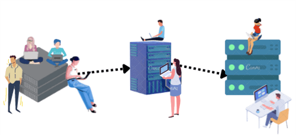
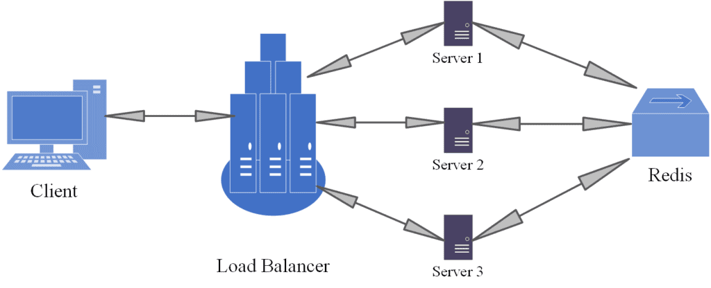

# [横向和纵向缩放的区别](https://www.baeldung.com/cs/scaling-horizontally-vertically)

1. 概述

    每个工程团队都会面临容量规划的问题，以确保有合适的资源来处理预期和意外的流量需求。当需求增长时，是纵向扩展应用程序（或网站）更好，还是横向扩展更好？

    在本教程中，我们将演示如何简单地掌握这一概念。首先，我们将了解可扩展性的含义。然后，我们将解释纵向扩展和横向扩展的区别。最后，我们将用一个例子来说明它们之间的区别。

2. 什么是可扩展性？

    在讨论垂直和水平扩展之前，理解什么是可[扩展性](https://www.baeldung.com/cs/scalability-vs-elasticity)至关重要。应用程序可同时管理的客户端请求数量是衡量其可扩展性的标准。而 "可扩展性极限" 一词指的是硬件资源耗尽、无法再为请求提供服务的时间点。

    数据库的可扩展性是指数据库通过添加和删除数据来处理不断变化的需求的能力。当达到资源容量时，程序就无法再处理新的请求。这时，管理员可以通过增加内存、CPU、存储和网络设备等更多资源来扩展基础架构，以有效处理额外的需求。

3. 纵向和横向扩展

    纵向扩展和横向扩展之间的常见争论一直让人难以接受。虽然这两种方法各有利弊，但关键是要了解我们的业务需求，并根据需求匹配最佳扩展选项，从而为客户提供高可用的 DevOps 解决方案。让我们深入了解这些方法。

    1. 水平扩展

        什么是水平扩展？这是我们脑海中浮现的第一个问题。根据定义，水平扩展（或扩展）是指在基础设施中增加额外设备，以提高容量并有效管理不断增长的流量需求。事实上，水平扩展，顾名思义，就是通过增加额外的服务器来水平增加容量的过程。然后，[负载平衡器](https://www.nginx.com/resources/glossary/load-balancing/)在系统中的众多服务器之间分配负载和处理能力。

    2. 纵向扩展

        另一方面，垂直扩展是一种可扩展性，即通过增加额外的计算和处理能力来提高机器的性能。此外，垂直扩展（也称扩容）可以帮助我们扩大机器的容量，同时将资源保持在同一逻辑单元内。因此，这种方法可以提高处理、内存、存储和网络能力。下面是一个垂直扩展的例子：

        

    3. 垂直扩展与水平扩展的区别

        让我们来看看[垂直缩放和水平缩放](https://www.baeldung.com/cs/scalability-vs-elasticity#1-vertical-and-horizontal-scaling)的主要区别：

        | 垂直扩展      | 横向扩展             |
        |---------------|--------------------------|
        | 在不改变逻辑单元的情况下增加服务器的硬件配置。 | 可以在不提高硬件要求的情况下扩大实例数量。  |
        | 纵向扩展的逻辑是一样的。相同的代码在处理能力更强的计算机上运行。在设备处理器的多个内核上，使用多线程进行并发编程。 | 顺序逻辑被分割成小块，在多个设备上并发执行。  |
        | 通常会使用亚马逊 RDS 和 MySQL。  | 使用 MapReduce 和 Tuple Spaces 等模式，管理员可在多个联网工作站之间分配工作。这种数据管理方法利用了 MongoDB 和 Cassandra。 |

        一般来说，增加额外的机器被视为水平扩展，而增加功率被视为垂直扩展。

4. 横向和纵向扩展的优缺点

    水平和垂直扩展技术各有利弊。让我们来了解一下垂直和水平扩展的优缺点。

    1. 水平缩放

        以下是水平缩放的一些优点：

        - 易于升级
        - 提供灵活、可扩展的工具
        - 升级水平扩展数据库非常简单（只需在服务器上添加一个节点即可）
        - 实施简单，成本较低
        - 可无限扩展，无限增加服务器实例

        以下是水平扩展的一些缺点：

        - 由于需要电力、增加空间和冷却，数据中心的成本将大幅增加
        - 对代码中的任何错误进行复杂的调试
        - 许可证费用昂贵

    2. 纵向扩展

        以下是垂直扩展的一些优势：

        - 易于使用和实施（我们可以轻松管理软件）
        - 数据中心的电力、空间和冷却成本较低
        - 这是一种具有成本效益的软件
        - 这种方法的资源非常灵活

        以下是垂直扩展的一些缺点：

        - 升级数量有限
        - 硬件成本较高，因为需要高端服务器
        - 受限于单一数据库供应商，迁移具有挑战性（我们可能需要重新开始）
        - 成本可能较低，但每次升级都需要支付许可证费用

        让我们总结一下这两种方法的优缺点：

        | | 垂直扩展 | 横向扩展         |
        |--|----|--------------|
        | 数据   | 数据在单个节点上执行   | 数据被分割并在多个节点上执行  |
        | 数据管理 | 易于管理（共享数据参考） | 任务复杂，因为没有共享地址空间 |
        | 停机时间 | 升级机器时停机      | 无停机时间           |
        | 上限   | 受机器规格限制      | 不受机器规格限制        |
        | 成本   | 许可费用较低       | 许可费用较高          |

        一个应用程序可以同时使用纵向和横向扩展方法，程序中的某些元素可以向上扩展，而其他元素则向下扩展。

5. 举例说明： 网络应用程序

    在本节中，我们将给出一个非常简单的网络应用程序示例。在一个简单的网络应用程序设计中，网络服务器与数据库服务器相连，负责托管应用程序。因此，网络服务器响应客户请求，与数据库服务器通信，发送必要的数据，或根据客户请求执行任务。

    1. 纵向扩展

        在保持当前架构的同时，纵向扩展可升级 CPU、RAM 和存储资源。因此，随着流量的增加，我们可以升级网络服务器的设置。不过，我们只能进行一定数量的升级。事实上，如果网络服务器要独自处理成千上万的客户端请求，性能可能会随着时间的推移而下降。

        这种扩展方法仍然存在[单点故障](https://www.ibm.com/docs/en/zos/2.3.0?topic=data-what-is-single-point-failure)。如果服务器出现问题，我们的应用程序就会崩溃，因为没有冗余或备份选项。

    2. 横向扩展

        另一方面，我们可以通过增加基础设施中的服务器数量来进行横向扩展，以容纳数千个并发请求。因此，流量会被负载平衡器分流到多个服务器上。负载平衡器使用循环罗宾等路由技术，根据客户的 IP 地址将流量导向可用的服务器。

        只有一个负载平衡器会再次带来单点故障问题。为了解决这个问题，我们安装了两到三个负载平衡器，其中一个主动引导流量，其他的作为备份。

    3. 会话存储

        例如，当客户访问网站时，负载平衡器可能会引导客户访问服务器 {1}，然后服务器 {1} 会存储客户的会话。然后，客户可随时通过服务器 {1} 登录。下一次请求时，用户/客户端可能会被转到服务器{2}，在那里再次登录，因为该服务器不包含会话信息。

        为了解决这个问题，可以将会话信息分离并存储在不同的位置，例如内存数据结构存储，如 Redis 服务器。下面是一个例子，其中所有服务器都向 Redis 服务器发送和接收所有会话：

        

        Redis 服务器有可能再次成为单点故障。因此，我们需要为 Redis 服务器提供冗余，以增强服务的稳健性，避免这一潜在问题。

6. 总结

    在本教程中，我们通过一个例子讨论了可扩展性的基本概念，区分了计算系统的纵向和横向扩展。首先，我们探讨了可扩展性及其特点。然后，我们总结回顾并比较了垂直可扩展性和水平可扩展性。最后，我们以一个网络应用程序为例，揭示了其机制。

    我们可以得出结论，纵向扩展和横向扩展对计算系统无疑都是有益的。
