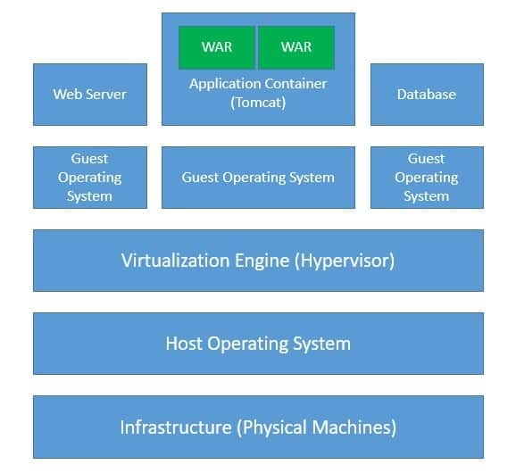
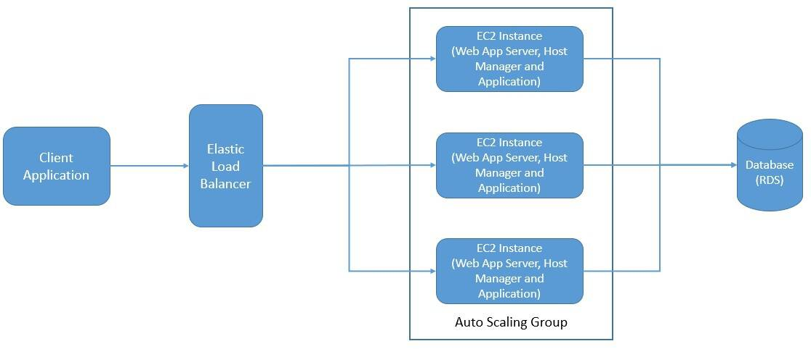
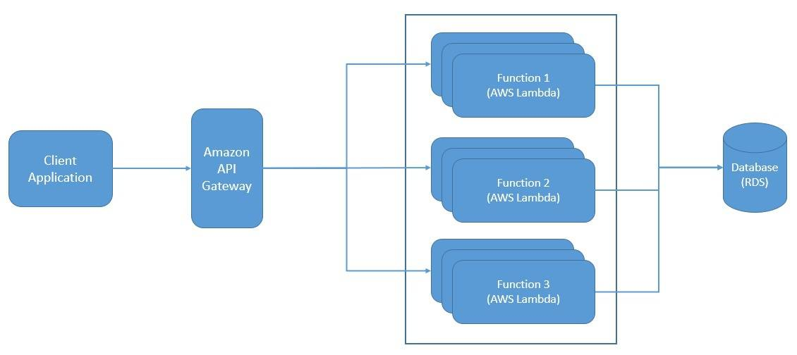
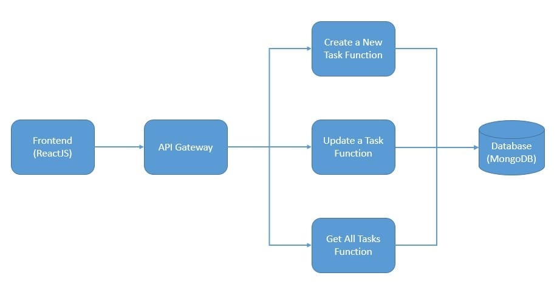

# [无服务器架构简介](https://www.baeldung.com/cs/serverless-architecture)

1. 简介

    在本教程中，我们将了解无服务器架构以及如何从中获益。我们还将探索一些常用的无服务器平台。在此过程中，我们还将了解这种架构风格的一些优点和局限性。

2. 无服务器背景

    与业界许多其他流行语一样，要可靠地追踪无服务器一词的来源相当困难。不过，重要的是要了解它能为我们的应用程序带来哪些好处。无服务器架构一开始可能听起来很奇特，但当我们深入了解后就会明白它的意义所在。

    1. 什么是无服务器？

        通常，当我们开发应用程序时，我们需要服务器来托管和服务它们。例如，当我们开发一个捆绑为 WAR 文件的 Java 应用程序时，我们需要一个像 Tomcat 这样的应用程序容器，以便在可能带有虚拟化功能的 Linux 机器等主机上运行。此外，我们还需要考虑其他因素，例如为基础设施提供高可用性和容错性：

        

        当然，这意味着在我们能够为第一个请求提供服务之前，我们必须进行大量的准备工作。不仅如此，我们还必须对基础设施进行管理，使其保持可用性。如果我们不必为所有这些与应用程序开发无关的任务费心呢？

        这就是无服务器的基本前提。因此，从根本上说，无服务器架构是一种软件设计模式，我们将应用程序托管在第三方服务上。它无需管理所需的硬件和软件层。此外，我们甚至不必担心如何扩展基础设施以匹配负载。

    2. 是 Faas 还是 Paas？

        在业界，无服务器通常也被称为功能即服务（FaaS）。顾名思义，FaaS 是一种云计算服务，它允许我们以功能的形式构建、运行和管理应用程序，而无需管理基础设施。但是，这是否与另一种被称为平台即服务（PaaS）的结构非常相似呢？

        嗯，从根本上说是的，但区别在于应用程序的部署单元。使用 PaaS，我们以传统方式开发应用程序，然后部署完整的应用程序（如 WAR 文件），并扩展整个应用程序：

        

        但在 FaaS 中，我们将应用程序分解为独立自主的功能。因此，我们可以在 FaaS 服务上独立部署每个功能，从而获得更精确的可扩展性：

        

        此外，在使用 PaaS 时，我们仍需管理可扩展性的某些部分，而在使用 FaaS 时，我们可以放弃这些管理。此外，我们希望 FaaS 能在有新请求时调用实例，并在不再需要时将其销毁。而这对于像整个应用程序这样的大型部署单元通常是无效的。因此，FaaS 比 PaaS 更能优化资源利用率。

        由于缺乏对无服务器的准确定义，我们不应该在这个问题上纠结太多。其基本思想是受益于基于云的服务所能提供的成本优化。我们只需按需使用计算资源，而不必担心计算资源的来源！这就要求我们将应用程序重新设计为更小、更短暂的部署单元。

3. 无服务器架构

    虽然无服务器架构的基本前提非常吸引人，但要理解如何实现这一点可能并不十分直观。将应用程序创建为自主功能的组合，说起来容易做起来难！让我们花一些时间来更好地理解无服务器架构，并探讨应用程序究竟如何从中受益。

    在本教程中，我们将选择一个简单的应用程序来帮助我们管理任务。我们可以将这个简单的应用程序想象成三层架构：

    [无 FaaS 的应用程序架构](pic/Application-Architecture-Without-FaaS.jpg)

    我们可以使用 ReactJS（客户端）、SpringBoot（服务器端）和 MongoDB（数据库）等流行框架开发此应用程序。此外，我们还可以在企业内部或云管理基础设施上进行部署。但是，即使有多种自动扩展选项，我们也无法消除计算资源的浪费。

    但是，我们能通过无服务器来减少浪费吗？让我们来看看。首先，我们必须将这个简单的应用程序重新架构为一组独立自主的功能：

    

    在这里，我们将简单的应用程序分解成各个功能来处理任务。虽然功能分解相当直观，但其技术含义如何呢？有几点值得讨论。

    首先，我们必须依赖 FaaS 服务提供商提供的开发 SDK 和 API 进行开发。然后，我们还面临着调试、监控和管理应用程序的传统工具的挑战。但积极的一面是，我们可以依靠 FaaS 服务提供商的原生功能，仅根据需要创建和管理功能实例。

4. 流行的无服务器平台

    正如我们前面所讨论的，无服务器架构的关键优势之一是，我们可以将所有基础设施管理委托给第三方。当然，这意味着我们创建无服务器应用程序的能力在很大程度上取决于我们可用的服务。此外，无服务器不仅是指单一服务，而是指一系列能让我们从无服务器架构中受益的服务。

    如今，有不少云服务供应商都拥有非常成熟的无服务器服务目录。由于我们可以非常灵活地定义无服务器，因此这些供应商提供的服务也各不相同。尽管它们也有某些共同点。我们将探讨几家供应商提供的其中一些服务。

    1. AWS 上的无服务器服务

        AWS 上的无服务器服务目录中最重要的服务是 FaaS 服务 Lambda。AWS Lambda 是一种无服务器计算服务，可让我们在不配置或管理服务器的情况下运行代码。它允许我们用 Node.js、Python、Go 和 Java 等任何流行语言编写 Lambda 函数。我们只需将代码作为 ZIP 文件或容器镜像上传即可。

        因此，我们可以将精确的计算能力用于任何规模的流量。此外，AWS 还为我们的无服务器应用程序提供了大量其他服务。例如，用于构建事件驱动型应用的亚马逊 [EventBridge](https://aws.amazon.com/eventbridge/)。亚马逊 [API 网关](https://aws.amazon.com/api-gateway/)，用于创建、发布、维护、监控和保护我们的 API。亚马逊 [S3](https://aws.amazon.com/s3/) 用于存储任何数量的数据，并具有可扩展性和可用性。

    2. GCP 上的无服务器服务

        同样，在 GCP 的产品中，[Cloud Functions](https://cloud.google.com/functions) 是关键的无服务器产品。Cloud Functions 是一种可扩展的 "即用即付 "FaaS，无需管理服务器即可运行我们的代码。它会根据负载自动扩展我们的应用程序。此外，它还提供集成监控、日志记录和调试功能。此外，它还具有角色和每个功能级别的内置安全性。

        GCP 的另一个重要产品是 PaaS 产品 [App Engine](https://cloud.google.com/appengine)。云函数更适合较简单、独立和事件驱动的功能。但对于我们希望结合多种功能的更复杂应用，App Engine 是更合适的无服务器平台。GCP 还提供了 Cloud Run，用于在类似 GKE 的 Kubernetes 集群上部署打包为容器的无服务器应用程序。

    3. Azure 上的无服务器服务

        与此类似，微软 Azure 提供的 FaaS 服务 [Azure Functions](https://azure.microsoft.com/en-in/services/functions/) 也提供了一个事件驱动的无服务器计算平台。我们还可以使用 Durable Functions 扩展解决复杂的协调问题，例如有状态的协调。我们可以使用触发器和绑定连接到大量其他服务，而无需进行任何硬编码。此外，我们还可以在 Kubernetes 上运行我们的函数。

        和以前一样，Azure 还为更复杂的应用程序提供了应用程序服务。它允许我们在一个完全托管的无服务器平台上构建、部署和扩展网络应用程序。我们可以使用 Node.js、Java 或 Python 等流行语言创建应用程序。此外，我们还可以满足严格的企业级性能、安全性和合规性要求。

5. Kubernetes 上的无服务器

    [Kubernetes](https://kubernetes.io/) 是一个开源的编排系统，用于自动化部署、扩展和管理容器化工作负载。此外，像 Istio 这样的服务网格专用基础设施层可以位于 Kubernetes 集群之上。这可以帮助我们解决很多常见问题，如服务与服务之间的通信。

    自然而然，我们就会想到在 Kubernetes 的基础上结合使用 Istio 来托管和管理无服务器环境。这种部署模式有很多好处。例如，它使我们摆脱了许多特定于供应商的服务。此外，它还能为无服务器应用程序提供一个标准的开发框架。

    1. Knative

        [Knative](https://knative.dev/docs/) 是一个基于 Kubernetes 的平台，用于部署和管理无服务器工作负载。它可以帮助我们轻松建立可扩展、安全和无状态的服务。它提供的 API 为常见的应用用例提供了更高级别的抽象。此外，它还允许我们为日志、监控、网络和服务网格插入自己的组件。

        Knative 从根本上由两个组件组成：服务和事件。服务允许我们在 Kubernetes 上运行无服务器容器，同时它还负责网络、自动扩展和版本跟踪。事件处理为我们提供了订阅、交付和管理事件的基础架构。这样，我们就可以创建具有事件驱动架构的无服务器应用程序。

    2. Kyma

        [Kyma](https://kyma-project.io/) 为我们提供了一个在 Kubernetes 上使用无服务器功能和微服务扩展应用程序的平台。基本上，它汇集了一系列云原生项目，简化了扩展的创建和管理。Kyma 背后的基本理念是通过发送事件和接收回调来扩展现有应用程序。

        Kyma 配备了一个经过适当配置、监控和保护的 Kubernetes 集群。此外，它还为身份验证、日志记录、事件处理、跟踪和其他类似需求提供了开源项目。它由几个关键组件组成，涵盖无服务器计算、事件处理、可观察性、API 暴露、应用连接、服务网格和用户界面。

6. 无服务器架构的局限性

    现在，我们应该清楚，无服务器架构能带来最佳的资源消耗。这必然会降低计算成本。更重要的是，由于无服务器平台的消费者无需担心基础设施问题，因此可以大大降低消费者的运营成本。

    随时可用且高度可扩展的无服务器平台还能进一步加快产品上市速度，并带来更好的用户体验。但是，这种风格的云计算架构可能并不适合所有用例，我们必须谨慎权衡成本和收益。如果我们不了解无服务器的缺点，就不可能完全重视它。

    1. 平台限制

        无服务器架构的主要问题之一是供应商控制。当我们使用无服务器架构设计或重新设计应用程序时，我们会自愿失去对系统许多方面的控制，比如我们可以使用哪些语言，我们必须升级到哪些版本。当然，随着时间的推移，各供应商的支持范围也在进一步扩大。

        无服务器架构的另一个重要问题是厂商锁定。正如我们前面所看到的，一家厂商的无服务器服务可能与其他厂商的服务大相径庭。这可能会使我们在必要时更换无服务器平台的供应商变得困难重重，而且往往成本高昂。这主要是因为我们依赖于供应商提供的多种基础设施服务。

        此外，我们还必须注意安全性等其他一些问题。以传统方式开发应用程序时，我们在安全方面有很大的控制权。但是，当我们开始采用无服务器服务时，我们就会接触到供应商特有的多种安全实现。这就增加了应用程序的复杂性和攻击向量。

    2. 应用限制

        但是，我们在开发应用程序时也会面临一些特定的挑战。例如，由于无服务器工作负载在不使用时会缩减为零，因此可能会出现启动延迟。这个问题通常被称为冷启动，发生的原因有很多。偶尔触发并在 JVM 上运行的应用程序尤其如此。

        另一个需要注意的重要方面是测试。由于无服务器强调较小的自主应用程序，因此单元测试变得相当容易。但集成测试呢？由于整个应用依赖于供应商提供的大量基础架构服务，因此实施集成测试变得非常具有挑战性。

        那么，我们究竟应该在哪里使用无服务器架构呢？对此没有一个好的答案。不过，可以从无服务器架构中获益的应用程序特征包括异步、并发、不频繁、零星需求、不可预测的扩展需求、无状态、短暂和高度动态。

7. 结束语

    在本教程中，我们了解了无服务器架构的基础知识。我们了解了如何将一个常规应用程序转变为无服务器应用程序。此外，我们还探索了一些流行的无服务器平台。最后，我们还讨论了无服务器架构的一些局限性。
