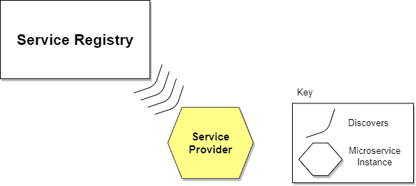

# [微服务中的服务发现](https://www.baeldung.com/cs/service-discovery-microservices)

1. 导言

    在处理[微服务](https://www.baeldung.com/cs/microservices-cross-cutting-concerns)时，需要一种机制来允许一个服务在不知道其确切位置的情况下使用另一个服务。在本教程中，我们将探讨服务发现的概念。

2. 什么是服务发现？

    让我们想象一下，几个微服务或多或少地组成了一个复杂的应用程序。这些微服务将以某种方式相互通信（如 [API Rest](https://www.baeldung.com/rest-with-spring-series)、[gRPC](https://www.baeldung.com/grpc-introduction)）。

    基于[微服务的应用程序](https://www.baeldung.com/spring-microservices-guide)通常在虚拟化或容器化环境中运行。服务实例的数量及其位置会动态变化。我们需要知道这些实例的位置和名称，以便让请求到达目标微服务。这就是服务发现等策略发挥作用的地方。

    服务发现机制可以帮助我们知道每个实例的位置。这样，服务发现组件就充当了跟踪所有实例地址的注册表。实例具有动态分配的网络路径。因此，如果客户端要向服务发出请求，就必须使用服务发现机制。

3. 服务发现的必要性

    微服务需要知道与之通信的每个服务的位置（IP 地址和端口）。如果我们不采用服务发现机制，服务位置就会耦合，导致系统难以维护。在传统应用程序中，我们可以通过线缆连接位置或通过配置注入位置，但在此类基于云的现代应用程序中，我们并不推荐这样做。

    动态确定应用服务的位置并非易事。如果我们考虑到一个不断销毁和分发新服务实例的环境，情况就会变得更加复杂。基于云的应用程序很可能就是这种情况，该应用程序会因水平自动扩展以满足峰值负载或发布新版本而不断变化。因此，我们需要服务发现机制。

4. 服务发现如何工作？

    服务发现分为两个部分。首先，它提供了一种机制，让实例注册并说 "我在这里！"。其次，它提供了一种在实例注册后找到服务的方法。

    让我们举例说明一下我们到目前为止讨论过的概念：服务消费者和服务提供者（提供 [REST API](https://www.baeldung.com/cs/rest-architecture) 的服务）。服务消费者需要服务提供者读写数据。

    下图显示了通信流程：

    

    让我们来描述一下图中的步骤：

    1. 服务提供商的位置被发送到服务注册中心（包含所有可用服务实例位置的数据库）。
    2. 服务消费者向服务发现服务器询问服务提供商的位置。
    3. 服务提供方的位置由服务注册中心在其内部数据库中搜索，并返回给服务消费者。
    4. 服务消费者现在可以直接向服务提供商发出请求。

    有两种主要的服务发现模式：客户端发现和服务器端发现。让我们来说明一下。

5. 服务发现实现

    1. 客户端服务发现

        使用客户端发现时，服务消费者负责确定可用服务实例的网络位置，并在它们之间平衡负载请求。客户机查询服务注册表。然后，客户端使用负载平衡算法从可用服务实例中选择一个，并执行请求。

        下图显示了上述模式：

        

        让客户端负责负载平衡既是一种负担，也是一种优势。说它是优点，是因为它省去了使用专用负载平衡器时所需的额外跳转。缺点是服务消费者必须实现负载平衡逻辑。

        我们还可以指出，服务消费者和服务注册中心之间的耦合度很高。这意味着必须针对服务消费者使用的每种编程语言和框架实施客户端发现逻辑。

        在明确了客户端发现之后，让我们来看看服务器端发现。

    2. 服务器端服务发现

        服务发现的另一种方法是服务器端发现模型，它使用一个充当[负载平衡器](https://www.baeldung.com/zuul-load-balancing)的中介。客户端通过作为协调器的负载平衡器向服务发出请求。负载平衡器会查询服务注册表，并将每个请求路由到可用的服务实例。

        下图显示了通信是如何进行的：

        

        在这种方法中，负载平衡器（Load Balancer）是专门负责负载平衡的角色。这是这种方法的主要优势。事实上，创建这种抽象层次可以减轻服务消费者的负担，因为它不必处理查找过程。事实上，没有必要为服务消费者使用的每种语言和框架分别实现发现逻辑。

        另一方面，我们必须设置和管理负载平衡器，除非部署环境中已经提供了负载平衡器。

        既然我们已经深入探讨了发现机制的不同方法，下面我们就来谈谈注册机制。

6. 什么是服务注册？

    到目前为止，我们假设服务注册中心已经知道了每个微服务的位置。但如何进行注册和注销注册操作呢？

    服务注册中心是服务识别的关键部分。它是一个包含服务实例网络位置的数据库。服务注册表必须高度可用且不断更新。客户机可以缓存从服务注册中心获取的网络路径，但这些信息最终会过时，客户机将无法到达服务实例。因此，服务注册中心由一组服务器组成，这些服务器使用复制协议来保持一致性。

    下面我们将详细介绍两种可能的方法。

7. 服务注册选项

    1. 自我注册

        使用自我注册模式时，服务实例负责在服务注册中心注册和注销。此外，如有必要，服务实例还会发送[心跳](https://martinfowler.com/articles/patterns-of-distributed-systems/heartbeat.html)请求，以保持其注册状态。下图显示了这种模式的结构：

        

        自我注册模式有几个优点和缺点。优点之一是相对简单，不需要其他系统组件作为中介。但是，它的一个显著缺点是将服务实例与服务注册表绑定在一起，这意味着我们必须在使用的每种语言和框架中实现注册代码。

        另一种将服务与服务注册表分离的方法是第三方注册方案。

    2. 第三方注册

        使用第三方注册模式时，服务实例不负责在服务注册中心注册。取而代之的是另一个称为 "服务注册中心" 的系统组件负责注册。服务注册中心通过轮询部署环境或订阅事件来跟踪运行实例的变化。当检测到新的可用服务实例时，它会将其记录到数据库中。服务注册中心还会注销已终止的服务实例。下图对此进行了说明：

        

        与自我注册一样，第三方注册方案也有各种利弊。主要优点之一是服务与服务注册中心脱钩。无需为每种编程语言和框架实现服务注册逻辑。相反，服务实例的注册由专门的服务集中管理。

        这种模式的一个缺点是，除非它被嵌入到部署环境中，否则它就是另一个需要设置和管理的高可用性系统组件。

8. 结论

    本文概述了微服务应用程序如何包含多个服务实例，并以动态变化的方式运行。这些实例具有动态网络位置，需要一种通信或定位方式。因此，客户端需要一种机制（如服务发现）来提出请求。

    服务发现通过提供可用服务实例的数据库来帮助客户发现服务，并根据使用情况进行注册和注销。
