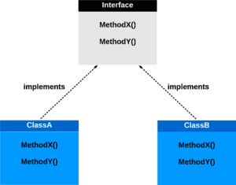
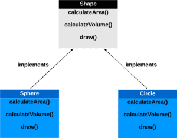
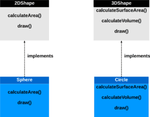

# [系统设计：接口隔离原则](https://www.baeldung.com/cs/systems-design-interface-segregation-principle)

1. 简介

    在本教程中，我们将学习接口隔离原则（ISP）如何极大地改进软件系统的设计和功能。ISP 是面向对象编程中的一个重要概念，侧重于接口的结构和组织。通过遵守这一原则，我们可以创建更加灵活、可维护和高效的代码。

2. 什么是计算机科学中的接口

    在计算机科学中，[接口](https://www.baeldung.com/cs/program-to-interface)是一种编程结构，概述了类应该实现的方法。它作为一种契约，定义了类应表现出的行为。这样，多个类就可以共享一组共同的行为，而不必受制于特定的实现。

    计算机科学中的接口就像合同蓝图，规定了类必须实现的方法。它们就像一份具有约束力的协议，明确定义了类的预期行为。这一巧妙的功能使各种类都能继承一套统一的行为，从而摆脱对任何特定实现的依赖。通过采用接口，我们为模块化、可调整和可扩展的代码铺平了道路：

    

    在 Java 中，接口是一种引用类型，类似于类，能够容纳常量、方法签名、默认方法、静态方法和嵌套类型。这些接口创建了一个模板，为任何类都必须定义的函数设定了标准。这就强化了结构化方法，确保任何遵循接口的类都符合指定的契约。

    接口还能促进[多态性](https://www.baeldung.com/cs/polymorphism)，使对象无论其底层类型如何，都能被统一处理。这不仅简化了代码，还增强了代码的灵活性和可重用性。通过接口，Java 实现了一个动态和多功能的系统，在这个系统中，类可以和谐地合作，每个类在遵守共享协议的同时贡献自己独特的功能。这一概念是[面向对象编程](https://www.baeldung.com/cs/oop-vs-functional)的基础，可实现稳健、模块化和可理解的软件开发。

3. 使用 Java 的接口示例

    这段代码演示了面向对象编程中的一种常见情况。我们有一个接口（形状），它规定了计算面积和体积以及绘制形状的方法。虽然这初看起来合乎逻辑，但对于像圆这样没有体积的二维形状来说，却带来了问题。尽管如此，它们仍被要求实现一个不适用的方法。这就突出了设计接口的重要性，接口应专门满足与每个类相关的行为：

    ```java
    // Example of an Interface not following ISP

    interface Shape {
        double calculateArea(); // Calculate area for all shapes
        double calculateVolume(); // Calculate volume, not applicable for 2D shapes
        void draw(); // Draw the shape
    }

    // Circle class implementing the Shape interface
    class Circle implements Shape {
        @Override
        public double calculateArea() {
            // Area calculation for a circle
        }
        @Override
        public double calculateVolume() {
            // This is not applicable for a circle, but we're forced to implement it.
            // This goes against ISP.
        }
        @Override
        public void draw() {
            // Draw a circle
        }
    }

    // Sphere class implementing the Shape interface
    class Sphere implements Shape {
        @Override
        public double calculateArea() {
            // Area calculation for a sphere
        }
        @Override
        public double calculateVolume() {
            // Area calculation for a sphere
        }
        @Override
        public void draw() {
            // Draw a sphere
        }
    }
    ```

    在上面的示例中，形状接口包含了计算面积和体积的方法。然而，对于像圆这样的二维形状，计算体积是没有意义的。这违反了前面章节中解释的界面隔离原则（ISP）。

4. 接口隔离原则

    接口隔离原则（ISP）是面向对象编程中的一项重要设计原则，它强调了创建精简的特定客户端接口的重要性。它指导我们不要创建包含大量方法的笨重接口，其中有些方法可能与某些类无关或没有必要。当接口变得过于广泛时，它们往往会掩盖其所代表功能的真实性质，从而可能导致代码的臃肿和复杂。

    1. 胖接口和瘦接口

        要掌握 ISP，必须区分胖接口和瘦接口。胖接口的特点是有大量的方法，涵盖广泛的功能：

        

        相反，精益界面则非常精确，只包含与类的预期目的直接相关的方法。精益界面通过消除不必要的杂乱无章，使代码库更简洁、更集中：

        

        接口分离原则（Interface Segregation Principle）主张根据类的特定需求创建相应的界面。开发人员可以避开臃肿的界面，转而使用精简的、针对特定客户的界面，从而使代码库更加集中、易于理解和维护。采用 ISP 不仅能提升软件系统的设计和架构，还能使开发人员灵活、准确地驾驭现代软件开发的复杂性。

    2. 接口功能过多的危害

        在接口中加入过多功能的一个弊端是，它迫使类实现它们可能并不需要的方法。这不仅会导致代码冗余，还会引入潜在的故障点或误用点。通过遵循 ISP，接口可根据类的精确需求量身定制，从而完全避免这一问题。

    3. 接口隐藏功能的危害

        在使用胖接口的情况下，类的真正职责和功能可能会变得模糊不清。这种不透明会严重妨碍对代码库的理解和维护。与此相反，精益接口能清晰简明地说明类的功能，使代码库更易于理解和管理。

    4. ISP 和模块化开发

        ISP 与模块化开发的概念不谋而合，模块化开发主张将系统划分为较小、可管理和独立的模块。精益界面通过确保每个模块只依赖其所需的特定功能来促进这种模块化。这就减少了相互依赖，便于集成、测试和调试各个模块。

5. 设计精益界面

    回到 Java 示例，让我们重新设计界面。我们将使用多个接口（TwoDimensionalShape 和 ThreeDimensionalShape）来取代单一界面（Shape）。这样可以确保类只需要实现与其功能直接相关的方法，从而符合 ISP 的要求。

    ```java
    // Example of well-designed Interfaces following ISP

    interface TwoDimensionalShape {
        double calculateArea(); // Calculate area for 2D shapes
        void draw(); // Draw the shape
    }

    interface ThreeDimensionalShape {
        double calculateSurfaceArea(); // Calculate surface area for 3D shapes
        double calculateVolume(); // Calculate volume for 3D shapes
        void draw(); // Draw the shape
    }

    // Circle class implementing the TwoDimensionalShape interface
    class Circle implements TwoDimensionalShape {
        @Override
        public double calculateArea() {
            // Area calculation for a circle
        }
        @Override
        public void draw() {
            // Draw a circle
        }
    }

    // Sphere class implementing the ThreeDimensionalShape interface
    class Sphere implements ThreeDimensionalShape {
        @Override
        public double calculateSurfaceArea() {
            // Surface area calculation for a sphere
        }
        @Override
        public double calculateVolume() {
            // Area calculation for a sphere
        }
        @Override
        public void draw() {
            // Draw a sphere
        }
    }
    ```

6. 结论

    在本文中，我们了解了接口隔离原则如何通过促进精简接口来增强软件系统的设计。通过避免肥大的接口并根据实现类的特定需求定制接口，我们可以创建更集中、更高效、更易维护的代码。

    遵循 ISP 原则可以使代码库更简洁、更直观，最终有利于软件项目的长期可行性和可扩展性。
