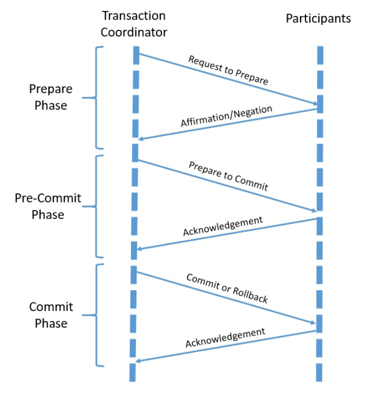

# [事务简介](https://www.baeldung.com/cs/transactions-intro)

1. 简介

    在本教程中，我们将了解事务的概念。

    我们将了解事务的类型及其提供的不同保证。我们还将探讨在异构环境中处理分布式事务的不同协议和算法。

2. 什么是事务？

    在编程中，我们将事务称为需要作为单个操作执行的一组相关操作。换句话说，事务是一个逻辑工作单元，其效果在事务之外可见或完全不可见。我们需要这样来确保应用程序中的数据完整性。

    让我们看一个例子来更好地理解这一点。在基于事件的架构中，一个典型的需求是更新本地数据库并产生一个事件供其他服务使用：

    

    在这里，我们希望这两个操作要么同时进行，要么完全不进行。我们可以将这些操作封装到一个事务中来实现：

    

    我们通常将数据库和消息代理等组件称为事务中的参与资源。

3. 事务简史

    我们通常将事务的概念与关系数据库联系在一起。因此，事务的历史和发展也与关系数据库密切相关。

    我们将[数据关系模型](https://www.seas.upenn.edu/~zives/03f/cis550/codd.pdf)的引入主要归功于埃德加-科德（Edgar F. Codd），他早在 1970 年就发表了有关这一主题的开创性论文。

    1. 早期的事务模型

        关系数据库的易用性和灵活性使其变得普遍。这带来了大型多用户并发访问系统的复杂性。很快，人们意识到有必要强制执行一致性。

        ACID 特性由此诞生。遵循 ACID 属性的事务保证是原子的、可序列化的。事务处理系统负责确保 ACID 属性。这对于执行时间短、并发用户少和单一数据库系统的扁平事务来说非常有效。

        但很快，随着需求开始激增，复杂性也开始增加。应用程序开始需要长寿命和复杂的事务。这就产生了复杂的事务模型，如子事务和事务组。

        这就为故障情况提供了更精确的控制，尤其是在长期事务的情况下。

    2. 高级事务模型

        事务的下一个发展阶段是支持分布式和嵌套事务。应用程序越来越复杂，通常需要对多个数据库系统进行事务访问。分布式事务采用自下而上的方法，而嵌套事务则采用自上而下的方法，将复杂的事务分解为子事务。

        分布式事务为多个资源提供了全局完整性约束。这些资源很快也开始异构化。这催生了 X/Open DTP（分布式事务处理）模型。

        事务的其他重要演变包括链式事务和传奇。虽然嵌套事务在联合数据库系统中运行良好，但仍不适合长期事务。链式事务提出了将此类事务分解为小型、按顺序执行的子事务的想法。

        传奇(Sagas)基于链式事务的概念，并提出了一种补偿机制，用于回滚已完成的子事务。传奇模型是一种重要的事务模型，因为它提出了宽松的一致性。它在当今采用微服务架构开发的应用程序中具有重要意义。

        我们将在本教程稍后部分详细讨论这里介绍的许多术语和概念。

4. 本地事务与分布式事务

    作为事务一部分的操作可以在单个参与资源中执行，也可以跨多个参与资源执行。因此，事务可以是本地事务，也可以是分布式事务。

    在本地事务中，操作在同一资源中执行。而在分布式事务中，操作分布在多个资源中：

    

    到目前为止，我们还没有谈到事务中参与资源的位置。一个事务可能涉及多个独立资源，如数据库、消息队列或网络服务。这些资源可以在同一台虚拟机上执行，也可以在同一台物理机的不同虚拟机上执行，还可以在不同的物理机上执行。

    参与资源的数量和位置是实现具有一定保障的事务的关键因素，我们将在下一节详细阐述。

5. 事务保证

    使用事务处理数据的一个基本原因是确保数据完整性。每个事务都应提供一系列保证，从而很好地定义了数据完整性。

    此外，分布式数据系统带来了新的挑战，可能迫使我们放弃其中的一些保证，转而从数据分区中获得更好的利用。我们将在本节中探讨这些概念。

    1. ACID 属性

        我们经常将事务与一组保证联系在一起，这就是著名的 ACID 缩写。这一概念最初由 [Jim Gray 提出](https://www.scribd.com/document/168336230/author-jim-gray)，后来由 Andreas Reuter 和 Theo Härder 加以扩展。ACID 是原子性、一致性、隔离性和持久性的缩写：

        - 原子性(Atomicity)： 原子性确保我们在事务中对数据所做的所有更改都是作为单一实体和操作进行的。这实际上意味着，我们要么执行所有更改，要么不执行任何更改。
        - 一致性(Consistency)： 一致性确保我们在执行所有数据更改的同时，在事务开始和结束时保持一致的状态。一致的数据状态必须符合我们为数据定义的所有约束条件。
        - 隔离(Isolation)： 隔离可确保其他事务看不到事务的中间状态。这使得并发运行的事务具有序列化的效果。一个事务必须与其他事务隔离的程度由隔离级别定义。
        - 持久性(Durability)： 耐久性可确保在事务完成时，我们会持久保存对数据的更改，而任何其他事务都不会还原这些更改。虽然没有必要，但这也可能要求将数据更改保存在磁盘上。

        这些都是我们应该期望从事务中得到的保证。但是，事务并不需要提供所有这些保证。我们可以在文献中找到许多论点，认为不提供 ACID 保证的事务根本就不是事务。

        然而，随着越来越多的[分布式系统](https://www.baeldung.com/cs/distributed-system-vs-distributed-computing)被采用，而这些系统强调的是可用性，我们经常看到事务一词被更随意地使用。

    2. CAP 定理

        分布式数据系统在提供服务方面通常受到 CAP 定理的限制。Eric Brewer 在 2000 年提出了[最初的猜想](https://www.researchgate.net/publication/221343719_Towards_robust_distributed_systems)，而 Seth Gilbert 和 Nancy Lynch 则在 2002 年给出了[正式证明](https://groups.csail.mit.edu/tds/papers/Gilbert/Brewer2.pdf)。CAP 是一致性、可用性和分区容忍度(Consistency, Availability and Partition)的缩写：

        - 一致性： 一致性是一种保证，即在分布式数据系统中，每个节点都会返回最新且成功写入的值。实际上，每个节点在任何时候对数据都有相同的看法。我们不能将其与 ACID 中的一致性混淆，它们是不同的概念。
        - 可用性： 可用性要求每个非故障节点都能在合理的时间内对读写请求做出无错误响应。
        - 分区容错： 分区容忍度指的是，即使任意数量的信息在节点间丢弃或部署，数据系统仍能继续运行。

        CAP 定理指出，分布式数据系统无法同时提供一致性、可用性和分区容差这三者。从更实际的意义上讲，分布式数据系统只能为可用性或一致性提供强有力的保证。

        这是因为分布式数据系统默认情况下无论如何都不应该损害分区容错性。

    3. 基础系统

        在 CAP 定理的限制下，许多分布式数据系统选择了一致性而非可用性。这就产生了一套新的[分布式系统保证](https://www.researchgate.net/publication/221343719_Towards_robust_distributed_systems)，缩写为 BASE。BASE 是 Basically-available（基本可用）、Soft-state（软状态）和 Eventual consistency（最终一致性）的缩写：

        - Basically-Available（基本可用）： 根据 CAP 定理，该保证更倾向于可用性而非一致性。数据系统将对请求做出响应，即使响应可能是过时的。
        - Soft-state（软状态）： 这是指即使没有收到任何输入，系统的状态也会随着时间的推移而改变。因此，系统始终保持软状态，向最终一致性迈进。
        - Eventual consistency（最终一致性）： 这是一种保证，即一旦停止接收任何输入，系统最终将变得一致。数据变化最终将传播到所有节点，所有节点将拥有相同的数据视图。

        BASE 提出的一致性模型与 ACID 截然相反。ACID 在每个事务结束时强制执行一致性，而 BASE 则接受在事务结束时一致性可能处于变化状态。

        这种对强一致性要求的放宽允许分布式数据系统实现高可用性。

6. 分布式提交协议

    几乎所有流行的关系型数据库都默认支持事务。由于本地事务只涉及一个数据库，因此数据库可以直接管理此类事务。此外，应用程序还可以通过相关 API 控制事务边界。

    但是，当我们谈到分布式事务时，情况就开始变得复杂了。由于这里涉及多个数据库或资源，一个数据库无法单独管理这样的事务。在这里，我们需要的是一个事务协调器和单个资源（如数据库）在事务中进行合作。

    1. 两阶段提交

        要让分布式事务保证 ACID 特性，我们需要一个协调协议。两阶段提交（[Two-phase commit](https://www.cs.princeton.edu/courses/archive/fall16/cos418/docs/L6-2pc.pdf)）是一种广泛使用的分布式算法，可帮助决定提交或回滚分布式事务。

        该协议包括两个阶段：

        

        - 准备阶段： 该阶段由事务协调者要求所有参与者为提交做好准备，各个资源管理器可以做出肯定或否定的回答。
        - 提交阶段： 在这一阶段，事务协调人要求所有参与者根据前一阶段的个人回复进行提交或回滚。

        事务协调者与所有参与者一起推动两阶段提交。参与方必须理解并支持该协议，才能参与两阶段提交。

    2. 三阶段提交

        两阶段提交协议虽然非常有用，但并不像我们想象的那么强大。其中一个关键问题是，在提交阶段，如果协调者和其中一个参与者都失败了，它无法可靠地恢复。

        [三阶段提交](https://link.springer.com/referenceworkentry/10.1007%2F978-0-387-39940-9_714)协议是对两阶段提交协议的改进，它解决了这一问题。它将提交阶段分为预提交阶段和提交阶段，从而引入了第三阶段：

        

        这里的预提交阶段有助于从失败情景中恢复，即在提交阶段有一个参与者失败或协调者和一个参与者都失败。恢复协调器可以利用预提交阶段安全地决定是继续提交还是中止。

        虽然这些提交协议能确保我们在分布式事务中获得 ACID 保证，但也不是没有问题。这些协议的最大挑战在于它们是阻塞协议，正如我们稍后会看到的，这并不总是合适的。

7. 行业规范

    供应商可以独立实现两阶段提交等分布式事务协议。然而，这将给互操作性带来相当大的挑战，尤其是在与多个供应商合作时。当我们开始在事务中包含异构资源（如消息队列）时，复杂性就会进一步增加。

    为了准确解决这个问题，业界已经开展了多项合作，以定义分布式事务的标准规范。

    1. X/Open DTP 模型

        XA 指扩展架构（[eXtended Architecture](https://pubs.opengroup.org/onlinepubs/009680699/toc.pdf)），是分布式事务处理规范。它由 X/Open 联盟于 1991 年首次发布，该联盟后来与 The Open Group 合并。该规范的目标是在涉及异构组件的全局事务中提供原子性。

        XA 规范使用两阶段提交协议提供了数据完整性，并对所涉及的组件和接口进行了标准化：

        

        XA 描述了几个组件，以促进基于两阶段提交的分布式事务：

        - 应用程序：应用程序：应用程序负责定义事务和访问事务边界内的资源。应用程序使用事务管理器定义全局事务的开始和结束。
        - 事务管理器：务管理器负责管理作为分布式事务工作单元的全局事务，协调提交或回滚事务的决策，并协调故障恢复。
        - 资源管理器：资源管理器负责管理共享资源（如数据库）的某一部分。资源管理器与事务管理器协调事务分支，该事务分支是全局事务的一部分。
        XA 还描述了这些组件之间的接口，以方便它们如何相互协作。以上解释只是提到了 XA 规范的重要部分，并不是完整的描述。

    2. OMG OTS 模型

        OTS 是 [Object Transaction Service](https://www.omg.org/spec/TRANS/About-TRANS/) 的缩写，它以面向对象的方式描述了分布式应用程序的通信基础设施。这是对象管理小组（OMG）的对象管理架构（OMA）的一部分。

        OTS 通过定义多个组件及其互通性，使 CORBA 应用程序能够使用分布式两阶段提交事务：

        

        让我们来详细了解一下这些组件：

        - 事务服务器： 它持有一个或多个参与交易的对象
        - 事务客户端： 调用事务对象方法的程序
        - 可恢复服务器： 可恢复服务器： 保存一个或多个可恢复对象，即受事务提交或回滚影响的事务对象。
        - 事务对象： 这是一个 CORBA 对象，其方法可在事务上下文中调用。

        OTS 是 OMG 在 OMA 下提供的若干对象服务之一。OMA 架构的核心是 CORBA 规范中定义的对象请求代理（ORB）。

        此外，OTS 模型基于 X/Open DTP 模型，它用 CORBA IDL 接口取代了 XA 和 TX 接口。对 OTS 的全面分析超出了本教程的范围。

8. 长期事务

    虽然大多数分布式事务协议都侧重于提供 ACID 保证，但它们都存在阻塞问题。虽然它们在执行时间较短的事务中运行良好，但却不适合长期运行的业务事务。

    这会使应用程序极难扩展。使用资源锁定的传统技术与需要在松散耦合、异步环境中进行业务事务处理的现代应用程序（例如，使用微服务架构构建的应用程序中的业务事务处理）并不匹配。

    为了解决长时间运行的事务问题，人们已经尝试定义了一些模式和规范，我们将在本节中讨论其中的一些。

    1. 传奇交互模式

        [传奇交互模式](https://www.baeldung.com/cs/saga-pattern-microservices)试图将一个长期运行的业务流程分解为多个相关的小型业务操作和交互。此外，它还通过基于消息和超时的管理来协调整个流程。早在 1987 年，Hector Garcia-Molina 和 Kenneth Salem 就[首次定义](http://www.cs.cornell.edu/andru/cs711/2002fa/reading/sagas.pdf)了这种模式。

        让我们看看 Saga 是如何分解业务流程的：

        

        与 ACID 事务相反，当 Saga 出现故障时，我们不能回滚。 在这里，我们所做的事情被称为 "反操作"（counteraction）或 "补偿操作"（compensation action）。不过，反操作只是尽力消除原始操作的影响。我们不可能总是完全恢复每个事务的影响。

        此外，Saga 模式要求单个操作及其相应的反操作必须是[幂等](https://www.baeldung.com/cs/idempotent-operations)的，这样才能成功地从故障中恢复。

    2. OASIS WS-BA

        传奇交互模式非常适合基于 SOAP 服务的 SOA 架构。针对 SOAP 定义了几种协议扩展，以满足特定的通信要求。这些协议统称为 WS*，其中包括支持分布式事务的协议。

        网络服务--业务活动（[WS-BA](http://docs.oasis-open.org/ws-tx/wstx-wsba-1.1-spec-os/wstx-wsba-1.1-spec-os.html)）为基于 Saga 的业务流程中的参与服务和协调者定义了有序协议和状态。WS-BA 定义了两个协议：

        - 有协调者完成的业务协议： 这是一种更有序的协议，由协调者决定并通知参与者何时完成。
        - 有参与者完成的业务协议： 这是一种松散耦合的协议，由参与者决定何时必须完成。

        此外，WS-BA 还定义了两种协调类型。第一种是原子结果（Atomic Outcome），即所有参与者都必须关闭或补偿。第二种是混合结果（Mixed Outcome），即协调者以不同方式对待每个参与者。

    3. OASIS BTP

        业务事务处理流程（[BTP](https://www.oasis-open.org/committees/tc_home.php?wg_abbrev=business-transaction)）提供了一种共识，也提供了一种在组织间交流担保和担保限制的方式。这为业务流程部分内容在组织边界外的分配提供了正式规则。

        虽然 BTP 可提供协调并强制一致地终止业务流程，但它依赖于参与组织的本地补偿行动。BTP 提供两种不同的协议：

        - BTP 原子事务： 也称为原子，类似于紧密耦合系统中的事务。在这里，一个原子协调者和零个或多个子协调者协调一个事务，每个子协调者管理一个或多个参与者。原子的结果是原子性的。
        - BTP 内聚事务： 也称为内聚事务，与原子事务不同，内聚事务可能会给参与者带来不同的终止结果。这里的一致性由客户和协调者之间的协议和互动决定。

        因此，BTP 为在异构环境中运行的分布式业务流程提供了一种基于补偿的事务语义。

9. 高级共识协议

    决定是否向数据库提交事务是分布式计算中更广泛问题的一部分，被称为共识问题。该问题的目的是在出现随机故障时实现系统可靠性。共识是指分布式进程就某些状态或决策达成一致的过程。其他此类决策包括领导者选举、状态机复制和时钟同步。

    我们需要一个共识协议来解决共识问题。共识协议必须在分布式进程或节点之间提供最终终止、数据完整性和协议。不同的共识协议可以规定不同级别的完整性。共识协议的重要评估标准包括运行时间和信息复杂性。

    我们目前讨论的分布式提交协议，如两阶段提交和三阶段提交，都属于共识协议的类型。两阶段提交协议的信息复杂度低，总体延迟时间也短，但会因协调器故障而阻塞。三阶段提交协议改善了这一问题，但代价是总体延迟较高。即使是三阶段提交协议，在面对网络分区时也会失效。

    本节我们要讨论的是一些先进的共识协议，它们能解决与故障场景相关的问题。

    1. Paxos

        Paxos 是由 Leslie Lamport 于 [1989 年提出的一系列协议](https://lamport.azurewebsites.net/pubs/lamport-paxos.pdf)。这些协议解决了由不可靠进程组成的异步网络中的共识问题。即使网络中一定数量的副本发生故障，Paxos 也能提供持久性。Paxos 被广泛认为是第一个经过严格证明是正确的共识协议。

        自提出以来，Paxos 协议已经有多个版本。在此，我们将研究最基本的 Paxos 协议。基本的 Paxos 协议提出了多轮，每轮有两个阶段，两个阶段又分为两个子阶段：

        

        - 准备（第 1A 阶段）： 提议者创建一条信息，该信息由一个唯一的数字（n）标识，该数字应是迄今为止使用过的最大数字。
        - 承诺（第 1B 阶段）： 接受者从提议者处接收信息并检查其编号（n），如果该编号是迄今为止收到的最大编号，则接受者向提议者返回 Promise。
        - 接受（阶段 2A）： 提议者可能会从法定接受者那里收到多数承诺，因此必须向法定接受者发送带有所选值的接受信息。
        - 接受（第 2B 阶段）： 接受者收到提议者发出的接受消息后，如果尚未对具有更高标识符的提议做出承诺，则必须接受该提议。

        请注意，Paxos 允许多个提议者发送相互冲突的消息，也允许接受者接受多个提议。在此过程中，回合可能会失败，但 Paxos 会确保接受者最终就单一值达成一致。

    2. Raft

        [Raft](https://raft.github.io/) 是一种共识算法，由 Diego Ongaro 和 John Ousterhout 在他们的开创性论文中提出，后来在博士论文中得到扩展。它代表可靠、复制、冗余和容错。

        Raft 提供了一种在计算节点集群中分布状态机的通用方法。此外，它还能确保集群中的每个节点都同意相同的一系列状态转换。Raft 的工作原理是保存复制日志，只有单个节点（即领导者）可以管理日志。

        Raft 将共识问题分为三个子问题：

        

        - 领导者选举： 每个节点都可以处于三种状态中的任何一种，即领导者、候选者和追随者。在任何时刻都不能有一个以上的领导者。节点总是以跟随者的身份开始，并期待来自领导者的心跳。如果没有收到心跳，它就会过渡到候选状态，并请求投票以过渡到领导者状态。
        - 日志复制： 当领导者收到一个请求时，它会首先将其添加到日志中，然后向每个追随者发送请求，让他们做同样的事情。领导者在得到大多数节点的确认后，就可以提交信息，然后回复客户端。跟随者在收到领导者的下一次心跳后提交信息。
        - 安全性： 重要的是要确保每条日志都被正确复制，命令以相同的顺序执行。为此，Raft 使用了多种安全机制。其中包括日志匹配属性和选举限制。

        请注意，Raft 在容错和性能方面与 Paxos 相当。与 Paxos 一样，Raft 也被正式证明是安全的。但重要的是，与复杂得多的前辈 Paxos 相比，Raft 更容易理解和开发。

10. 总结

    在本教程中，我们了解了事务的含义以及本地事务和分布式事务的区别。

    我们还介绍了处理分布式事务的一些常用协议。此外，我们还讨论了可用的行业规范及其在 Java 中的支持。

    我们还讨论了长期运行的事务，最后介绍了一些复杂的共识算法。
