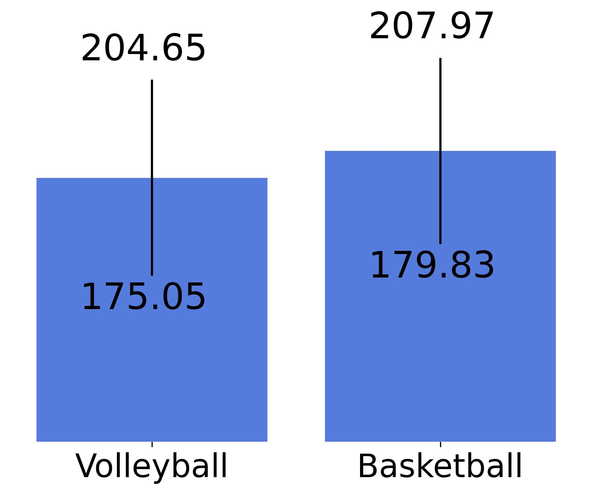

# 置信区间

[Confidence Intervals](https://www.baeldung.com/cs/confidence-intervals-statistics)

1. 导言

    在本教程中，我们将解释置信区间以及如何构建置信区间。

2. 不确定性量化

    让我们通过一个例子来介绍它们。

    比方说，我们想检验是排球还是篮球对人们的身高影响更大。确定答案的唯一方法就是测量全世界所有职业和业余排球和篮球运动员的身高，但这是不可能的。

    相反，我们可以走访当地的体育俱乐部，测量他们球员的身高。这样，我们就能得到两个测量样本。例如（厘米）：

    \[Volleyball = \begin{bmatrix}187 & 190 & 184 & 175 & 200 \\   195 & 191 & 188 & 179 & 185 \\ 199 & 198 & 205 & 188 & 183 \\ 190 & 192 & 193 & 185 & 190 \end{bmatrix} \qquad Basketball = \begin{bmatrix}193 & 195 & 196 & 190 & 185 \\ 188 & 187 & 185 & 189 & 198 \\ 200 & 185 & 194 & 210 & 197 \\ 202 & 199 & 204 & 192 & 189 \end{bmatrix}\]

    在一个虚构的样本中，篮球和排球运动员的平均身高分别是193.9、189.85。

    如果说篮球运动员会比喜欢排球的运动员长得更高，这合理吗？需要注意的是，如果我们的样本不同，我们可能会得到不同的结果。这就是为什么仅仅计算样本平均值和比例是不够的。我们还必须量化它们的不确定性。

    置信区间就是这样做的：它向我们展示了在我们使用（小得多的）样本计算出的数值的情况下，人口参数的可信数值范围。

3. 置信区间

    让我们从一个非正式的定义开始。

    1. 非正式定义

        假设 $\theta$ 是一个数字参数在人群中的未知值。例如，排球和篮球运动员的平均身高或总统候选人的选民在一个国家选民中所占的比例。

        我们只能通过分析样本来估计 $\theta$。所以，让 $S=\{x_1, x_2, \ldots, x_n\}$ 是一个样本，而 $\theta(S)$ 是用 $S$ 计算出来的值。

        给定 $\theta(S)$ 的置信区间是通过预定义覆盖范围（或置信度）的程序得到的数值范围 $[L, U] \ni \theta(S)$。置信度表示区间（由程序产生）包含参数精确值的概率。

        让我们退一步说。为什么我们说置信度是程序的特征，而不是特定区间的特征呢？

    2. 随机样本与特定样本

        这是因为置信区间是频数统计的一种工具。我们在其中区分了随机样本和特定（或实现）样本。

        特定样本包含特定值，例如排球和篮球运动员身高的样本。

        相反，随机样本包含随机变量（用 $X_1, X_2, \ldots, X_n$ 表示）。随机样本中的每个变量都是特定样本可能包含的值的模型。

        因此，具体样本是相应随机样本的实现。

    3. 估计量与样本统计量

        当我们对随机样本 $\{X_1, X_2, \ldots, X_n\}$ 应用 $\theta$ 公式时，我们得到一个随机变量，称为[估计子](https://www.baeldung.com/cs/random-variables)。我们用 $\widehat{\theta}$ 来表示它。对于平均值来说，$\widehat{\theta}$ 是：

        \[\frac{1}{n}\sum_{i=1}^{n} X_i\]

        相反，将 $\theta$ 公式应用于一个已实现的样本 $\{x_1, x_2, \ldots, x_n\}$ 会得到一个特定的样本值，我们将其记为 $\theta^*$。在我们这个有高度的例子中，均值 189.95 和 193.9 是样本值（均值），即估计器的实现值。

    4. 正式定义

        现在，我们可以开始正式定义了。

        对于真值为 $\theta$、估计值为 $\widehat{\theta}$、样本值为 $\theta^*$ 的参数来说，置信水平为 $100\gamma\%$ 的置信区间，其中 $\gamma \in (0, 1)$，是这样的一个值范围 $[L, U]$：

        \[\Pr\left\{ L \leq \theta \leq U \right\} \geq \gamma\]

        其中：

        - L 和 U 取决于 $\theta^*$ 和 $\widehat{\theta}$ 的分布
        - 概率是通过 $\theta^*$ 的分布来计算的

        因此，如果我们将输出 95% CIs 的程序应用于许多不同的样本，大约 95% 的样本将包含相关参数的实际值。

        由于概率仅通过随机样本出现在等式中，我们可以将置信度 $\gamma$ 归因于输出区间的程序，而不是它所产生的任何特定区间。

    5. 例题

        在我们的例子中，$\widehat{\theta}$ 是 n 个[独立](https://www.baeldung.com/cs/statistical-independence)且同分布随机变量的均值。它的标准化形式是

        \[\frac{\widehat{\theta}-\theta}{s_n/\sqrt{n}}\]

        其中 $s_n$ 是样本标准偏差（也是一个估计值），遵循自由度为 n-1 的 [Student's t distribution](https://www.baeldung.com/cs/student-t-distribution)。让 t 成为它的 $\frac{1-\gamma}{2}$ 量化值，即

        \[\Pr \left\{ \frac{\widehat{\theta}-\theta}{s_n/\sqrt{n}} > t\right\} = \frac{1-\gamma}{2}\]

        由于学生分布是对称的，所以我们也有

        \[\Pr \left\{ \frac{\widehat{\theta}-\theta}{s_n/\sqrt{n}} < -t \right\} = \frac{1-\gamma}{2}\]

        所以， $\frac{\widehat{\theta}-\theta}{s_n/\sqrt{n}} $ 落在 -t 和 t 之间的概率是 $1-\frac{1-\gamma}{2}-\frac{1-\gamma}{2}=1-(1-\gamma)=\gamma$：

        \[\Pr \left\{ -t < \frac{\widehat{\theta}-\theta}{s_n/\sqrt{n}} < t \right\} = \gamma\]

        对大括号之间的表达式进行运算，我们可以得到

        \[\Pr \left\{ \widehat{\theta} - \frac{t s_n}{\sqrt{n}} < \theta <\widehat{\theta} + \frac{t s_n}{\sqrt{n}} \right\} = \gamma\]

        这就是我们的100%置信区间。

4. 推论

    我们将重点讨论两种情况：比较两个种群的参数和比较一个种群的参数与一个预定义值。

    1. 比较两个种群

        当我们计算身高均值的 99% 置信区间时，排球的置信区间为 (175.05, 204.65)，篮球的置信区间为 (179.93, 207.97)：

        

        这说明数据并不确定。因此，我们不能仅凭这两个样本就得出哪项运动对成长的影响更大的结论。虽然样本均值不同，但实际均值有可能相同或接近。

        我们可以采取的另一种方法是计算成对差异：

        \[\left\{v - b \colon v \in Volleyball,  b \in Basketball \right\}\]

        并检查平均差异的置信区间是否为零。如果是，我们就不能排除实际平均值（在排球和篮球运动员的整个群体中）是相同的。

        4.2. 只分析一个群体

        这是置信区间的一个日常使用案例。通常，有一个值具有特殊含义。例如，在平衡集中猜测二元标签的[准确率](https://www.baeldung.com/cs/ml-accuracy-vs-auc)为 50%，这相当于随机分类。因此，如果我们分类器准确率的置信区间包含这个值，我们就不能说它毫无疑问比随机分类器好。

5. 讨论

    置信区间量化了抽样程序中固有的不确定性，其置信度保证了抽样程序很少会错过总体值。因此，使用置信区间是合理的，因为它们在大多数情况下都能捕捉到实际值。"大部分时间"和"很少"的确切含义由我们选择的 $\gamma$ 所暗示。

    然而，要理解置信区间是很复杂的。我们不容易理解为什么置信水平指的是构建区间的程序而不是区间本身。此外，在观察特定样本后，考虑未见数据（以随机样本为模型）进行推断是否有意义？

    [贝叶斯](https://www.baeldung.com/cs/bayes-theorem)学派认为这违背直觉，是错误的。贝叶斯学派的替代方法就是我们所说的可信区间。与频繁派不同的是，可信区间包含具有预定概率的实际值。然而，概率的性质是不同的。对于贝叶斯学派来说，概率是一种信念程度。对于频繁论者来说，概率是事件发生的长期频率。

    1. 显著结果

        假设两个区间没有重叠，或者一个区间不包含与无效应状态相对应的值（例如，在比较差异时为零）。在这种情况下，我们就可以说我们得到了具有统计学意义的结果。

        然而，统计意义并不等于毫无疑问的证据。例如，如果身高区间没有重叠，我们就不能百分百确定人群平均身高存在差异。抽样是随机的，所以我们总是要考虑到我们的结论是由随机性造成的可能性。在数学上，这意味着我们的置信度低于 100%。

        要积累足够的证据，就需要重复。如果许多研究对篮球和排球运动员的身高进行了分析，得到的结果是平均相差 2 厘米的非重叠区间，那么我们就有理由得出结论，这两种运动对身高的影响是不同的。

        然而，这并不意味着这一结论具有科学意义或有用。身高相差 2 厘米并不算大。身高 189 厘米的人能做的事情，身高 187 厘米的人几乎没有做不到的。因此，除了统计学意义外，我们还必须考虑效应大小。

6. 结论

    在本文中，我们谈到了置信区间。它们量化了不确定性，但很容易被误解。置信度表示包含实际值的区间的长期频率，而不是我们的特定区间包含实际值的概率。
